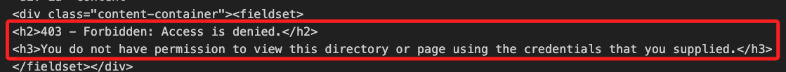
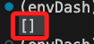
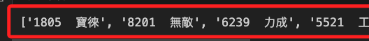

# User-Agent

<br>

## 說明

1. 有些網站會檢查 `request` 的 `User-Agent` 欄位，以防止 `非瀏覽器` 的訪，當然，爬蟲就是其中一種。

2. 在 `request` 中設置一個 `User-Agent` 可模擬瀏覽器的請求來排除這個阻擋。

<br>

## 說明

1. 觀察以下這個腳本

    ```python
    # 導入庫
    import requests
    from bs4 import BeautifulSoup
   
    # 取得reponse
    req = requests.get("https://fubon-ebrokerdj.fbs.com.tw/z/zg/zg_A_0_5.djhtm")
    # 取得網頁原始碼文字
    html = req.text
    # 將網頁原始碼轉為Beautiful Soup
    soup = BeautifulSoup(html, "html.parser")
    print(soup)
    # 取出所有的商品欄位
    product = [i.text.strip() for i in soup.find_all("td", class_="t3t1")]
    # 顯示
    print(product)
    ```

<br>

2. 執行後，打印 `soup` 的部分會出現。

    ```html
    <h2>403 - Forbidden: Access is denied.</h2>
    <h3>You do not have permission to view this directory or page using the credentials that you supplied.</h3>
    ```

    

<br>

3. 最終打印 `product` 結果是空的 `[]`。

    

<br>

## 解決方案

1. 添加 `headers`。

    ```python
    headers = {
        'User-Agent': 'Mozilla/5.0 (Windows NT 10.0; Win64; x64) AppleWebKit/537.36 (KHTML, like Gecko) Chrome/58.0.3029.110 Safari/537.3'
    }
    ```

<br>

2. 完整程式碼。

    ```python
    import requests
    from bs4 import BeautifulSoup

    # 設置 User-Agent
    headers = {
        'User-Agent': 'Mozilla/5.0 (Windows NT 10.0; Win64; x64) AppleWebKit/537.36 (KHTML, like Gecko) Chrome/58.0.3029.110 Safari/537.3'
    }

    # 發送帶有 User-Agent 的請求
    req = requests.get("https://fubon-ebrokerdj.fbs.com.tw/z/zg/zg_A_0_5.djhtm", headers=headers)

    # 檢查是否成功獲得網頁內容
    if req.status_code == 200:
        # 取得網頁原始碼文字
        html = req.text
        # 將網頁原始碼轉為Beautiful Soup
        soup = BeautifulSoup(html, "html.parser")
        # 取出所有的商品欄位
        product = [i.text.strip() for i in soup.find_all("td", class_="t3t1")]
        # 顯示
        print(product)
    else:
        print(f"Error {req.status_code}: Unable to access the website.")
    ```

<br>

3. 會得到以下結果。

    

<br>

---

_END_