# 安裝 Ngrok

<br>

## 步驟說明

1. 登入 [官網](https://ngrok.com/)，接著點擊 `Log in` 或 `Sign up`，這裡省略註冊的說明。

    

<br>

2. 切換到 `Setup & Installation` 頁籤，然後選取對應的系統，這裡使用 `MacOS`。

    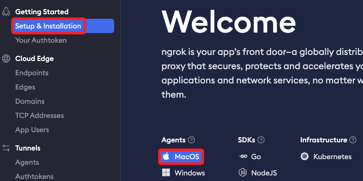

<br>

3. 依照自己的機型選取下載的版本。
   
    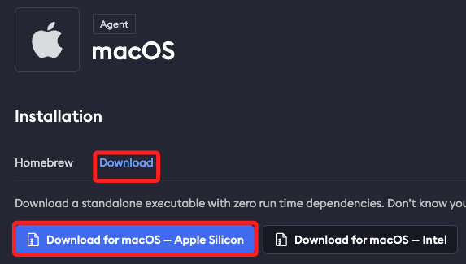

<br>

4. 切換到 `Your Authtoken` 頁籤。

    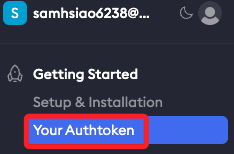

<br>

5. 複製官網提供的指令，特別注意，官網並未提供 `複製` 功能鍵，手動複製時不要複製 `$` 符號。

    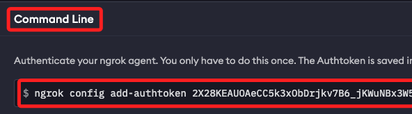

<br>

6. 執行後會提示儲存的路徑，特別注意，因為 `MacOS` 預設的資料夾 `Application Support` 有空格，所以後續若需要切換到這個路徑的時候，路徑務必以引號 `" "` 包覆。

    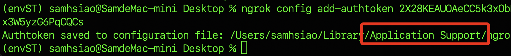

<br>

7. 以下示範透過 `ls` 指令進行查詢，路徑加註了引號 `" "`。

    ```bash
    ls "/Users/samhsiao/Library/Application Support/ngrok/ngrok.yml"
    ```

<br>

8. 回到 `Setup & Installation` 複製語法並啟動服務。

    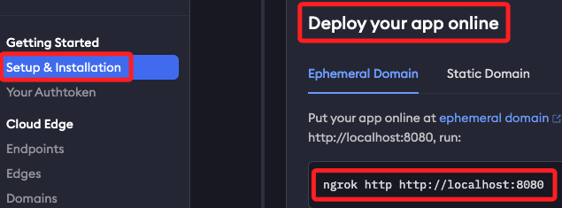

<br>

9. 這裏使用 `8501` 埠。

    ```bash
    ./ngrok http 8501
    ```

<br>

10. 以下連結就是外網透過端口 `8501` 連入本地服務器的網址。

    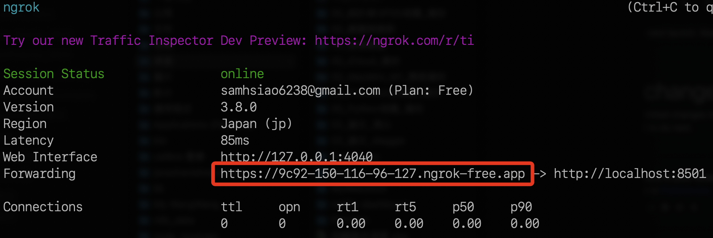

<br>

11. 以使用地震專案為例，透過指令啟動服務，並顯示端口在 `8501`，確認與 `Ngrok` 一致。

    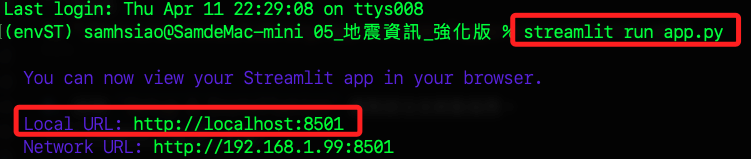

<br>

12. 使用瀏覽器開啟網址。

    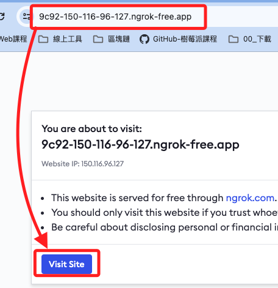

<br>

13. 可透過終端機查看連線訊息， `200 OK` 就代表成功。

    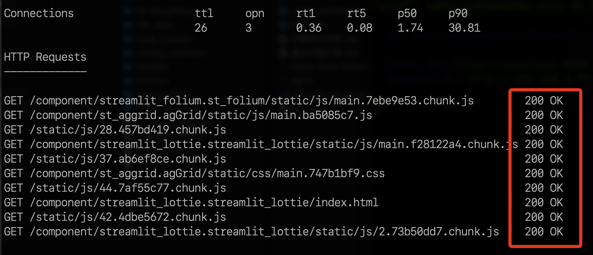

<br>

14. 中斷 `Ngrok` 服務可使用鍵盤的 `control` + `c`，終端機會回到命令行。

    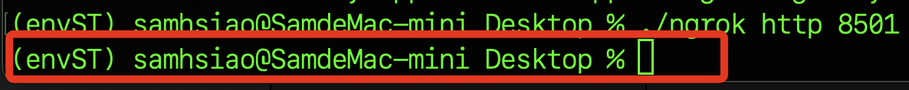

<br>

___

_END_