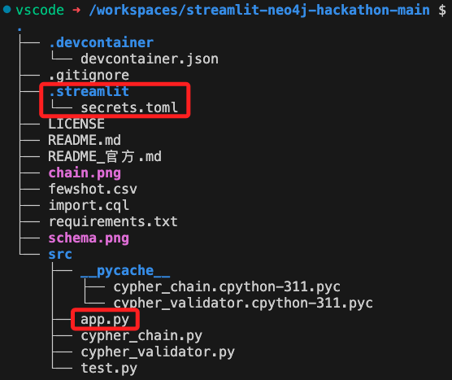
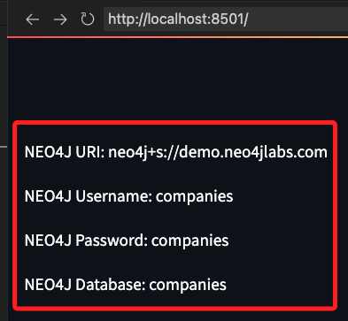
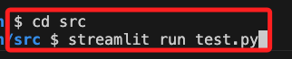
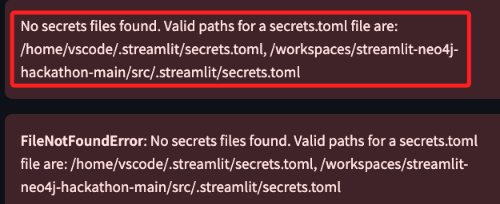

# 敏感資訊

_這裡示範的是 `Streamlit` 的 `st.secrets` 功能，相較於 `.env` 文件，使用，當使用 Streamlit Cloud 的時候， `st.secrets ` 可以保持本地與雲端相同代碼而便於維護。_

<br>

## 說明

1. 在專案根目錄中建立資料夾 `.streamlit`，並且添加一個文件 `secrets.toml` 用來儲存敏感資訊。

    ```bash
    mkdir .streamlit && touch .streamlit/secrets.toml
    ```

<br>

2. 編輯文件，切記在 `.toml` 文件中的字串必須加入引號。

    ```toml
    [database]
    USERNAME = "username"
    PASSWORD = "password"
    ```

<br>

3. 將 `secrets.toml` 加入 `.gitignore` 避免推到遠端版本庫。

    ```bash
    echo "/.streamlit/secrets.toml" >> .gitignore
    ```

<br>

4. 使用 `st.secrets` 提取敏感資訊。

    ```python
    import streamlit as st

    USERNAME = st.secrets["USERNAME"]
    PASSWORD = st.secrets["PASSWORD"]
    ```

<br>

## 腳本的啟動與路徑

1. 特別注意，一般來說 `.streamlit` 資料夾是建立在專案的根目錄中，結構如下，使用 `tree` 指令查詢時，因為有隱藏文件夾，所以要加上參數 `-a`。

    ```bash
    tree -a
    ```

    

<br>

2. 準備一個測試腳本與主腳本 `app.py` 同級資料夾，將在下一個步驟中進行測試。

    ```python
    # 這是測試用的腳本
    import streamlit as st

    # 顯示在 Streamlit 應用
    st.write("NEO4J URI:", st.secrets["NEO4J_URI"])
    st.write("NEO4J Username:", st.secrets["NEO4J_USERNAME"])
    st.write("NEO4J Password:", st.secrets["NEO4J_PASSWORD"])
    st.write("NEO4J Database:", st.secrets["NEO4J_DATABASE"])
    ```

<br>

3. 啟動專案時，無論主腳本相對位置是否是在根目錄，例如這個範例的主腳本就不是在根目錄中，而是在子資料夾 `src` 中，但只要主腳本是從根目錄的相對位置啟動，則主腳本皆可正確存取 `secrets.toml` 文件。

    ```bash
    streamlit run src/test.py
    ```
    

<br>

4. 反之，若是在子資料夾中運行腳本，則會出會找不到檔案。

    

    _報錯_

    

<br>

5. 訊息會提示該文件應該被放置在同級資料夾或是全局環境中；除此之外，就是在啟動的時候加入路徑。

    ```bash
    # 全局
    /home/vscode/.streamlit/secrets.toml
    # 同級
    /workspaces/streamlit-neo4j-hackathon-main/src/.streamlit/secrets.toml
    ```

<br>

6. 若是以容器啟動，在 `devcontainer.json` 會設定如下。

    ```json
        // 容器啟動後要運行的指令 
        "postAttachCommand": {
            "server": "streamlit run src/app.py --server.enableCORS false --server.enableXsrfProtection false"
        },
    ```

<br>

7. 了解以上特性，可依據實際邏輯需求進行相關設置避免出錯。

<br>

___

_END_
