# 在 Vercel 部署 LineBot

_實作：這部分主要是在介紹 Vercel 與 GitHub 整合，並以建立 Line Bot 為例。_

</br>

## MacOS

1. 建立並進入專案目錄，這裡使用 `01_基礎`）。

    ```bash
    mkdir <專案資料夾名稱> && cd <專案資料夾名稱>
    ```

</br>

2. 在專案資料夾內開啟新的工作區。

    ```bash
    code .
    ```

</br>

3. 若要部署在 `Vercel`，要建立如下的資料結構。

    

    _指令_

    ```bash
    mkdir api && touch api/index.py
    touch requirements.txt
    touch vercel.json
    ```

</br>

4. 在 VSCode 中編輯 `index.py`。

    ```python
    # 導入 Flask 相關模組
    from flask import Flask, request, abort

    # 導入 LineBot 相關模組
    from linebot import LineBotApi, WebhookHandler

    # 導入 LineBot 的例外處理
    from linebot.exceptions import InvalidSignatureError

    # 導入 LineBot 的模型
    from linebot.models import MessageEvent, TextMessage, TextSendMessage

    import os  # 導入 os 模組

    # 從環境變數中獲取 LineBot 的設置
    line_bot_api = LineBotApi(os.getenv("LINE_CHANNEL_ACCESS_TOKEN"))
    line_handler = WebhookHandler(os.getenv("LINE_CHANNEL_SECRET"))
    # 創建 Flask 應用
    app = Flask(__name__)


    # 定義根路由
    @app.route("/")
    def home():
        # 返回簡單的文字訊息
        return "=== 這是預設的首頁 ==="


    # 定義 webhook 路由
    @app.route("/webhook", methods=["POST"])
    def callback():
        # 獲取 X-Line-Signature 標頭值
        signature = request.headers["X-Line-Signature"]
        # 獲取請求主體
        body = request.get_data(as_text=True)
        # 記錄請求主體
        app.logger.info("Request body: " + body)
        try:
            # 處理 webhook 主體
            line_handler.handle(body, signature)
        # 捕捉無效簽名的錯誤
        except InvalidSignatureError:
            # 返回 400 錯誤
            abort(400)
        # 返回正確的響應
        return "OK"


    # 處理 Line 的訊息事件
    @line_handler.add(MessageEvent, message=TextMessage)
    def handle_message(event):

        if event.message.type != "text":
            line_bot_api.reply_message(
                event.reply_token, TextSendMessage(text="我目前僅可以讀取文字訊息")
            )
            return
        if event.message.text == "說話":

            line_bot_api.reply_message(
                event.reply_token, TextSendMessage(text="我可以說話囉，歡迎來跟我互動 ^_^ ")
            )
            return
        else:
            line_bot_api.reply_message(
                event.reply_token, TextSendMessage(text="我目前還未擁有對應的功能")
            )
            return


    if __name__ == "__main__":
        # 運行 Flask 應用
        app.run()

    ```

</br>

5. 編輯套件管理檔案 `requirements.txt` ，套件有版本相容問題，所以要加上版本號。

    ```txt
    Flask==2.2.2
    line-bot-sdk
    Werkzeug==2.3.7
    ```

</br>

6. 建立 Vercel 設定檔案 `vercel.json`。

    ```json
    {
        "builds": [
        {
            "src": "api/index.py",
            "use": "@vercel/python"
        }
        ],
        "routes": [
        {
            "src": "/(.*)",
            "dest": "api/index.py"
        }
        ]
    }
    ```

</br>

7. 完成後可透過 Vercel CLI 進行部署。

    ```bash
    sudo vercel
    ```

</br>

8. 在設定的步驟。
	1. 同意設定且部署目前所在的資料夾（Y）
	2. 選擇專案的擁有者，唯一選擇，所以等於沒選（ENTER）
	3. 是否連結現有專案（N）
	4. 專案名稱，使用預設即可（ENTER）
	5. 在哪個目錄（ENTER）

    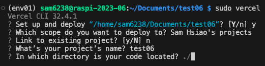

</br>

9. 開始部署。

    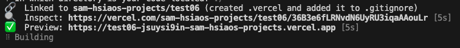

</br>

10. 完成時會顯示連結，可以不用急著複製，等一下在專案控制台去複製。

    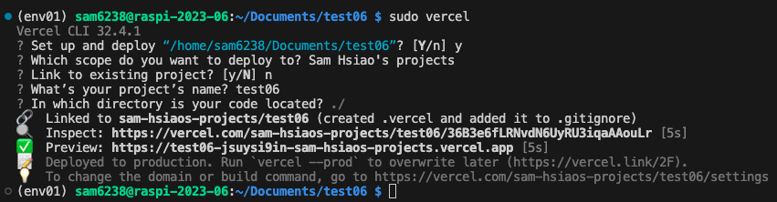

</br>

## B. 前往 Line Developers

1. 開啟 [Line Developers](https://developers.line.biz/zh-hant/)。

    

</br>

_省略一部分的說明，這裡的操作很簡單，有必要再補充_

</br>

2. 建立新的 channel。

    

</br>

3. 選擇 Messaging API。

    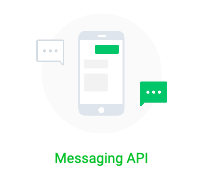

</br>

4. 這部分選取地區，其他預設。

    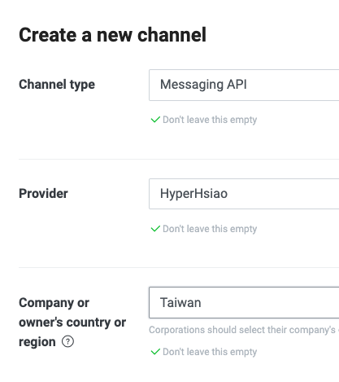    

</br>

5. 給個圖片漂亮一點。

    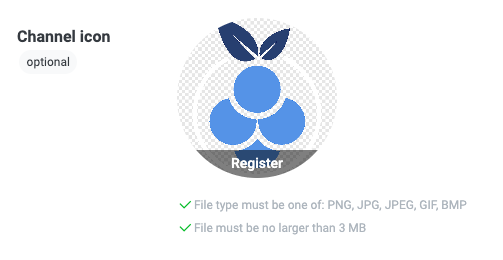

</br>

6. 隨意設定一下。

    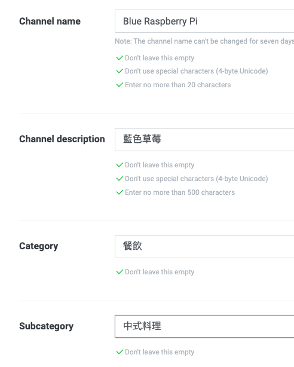

</br>

7. 滑動到最下面，勾選之後建立。

    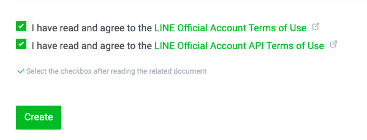

</br>

8. OK。

    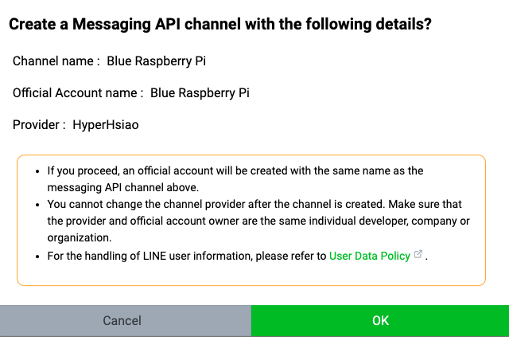

</br>

9. Agree。

    

</br>

10. 在這個頁面先複製 `Channel secret` 準備起來。

    

</br>

11. 切換到。

    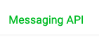

</br>

12. Issue。

    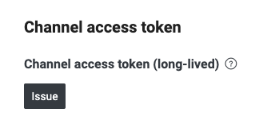

</br>

13. 複製。

    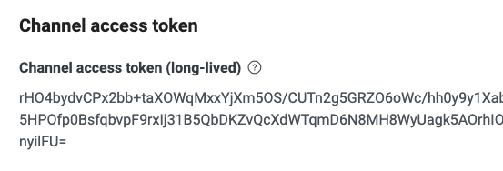

</br>

14. 接下來很重要一件事是設定 `Webhook`。

    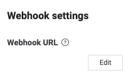

</br>

## C. 前往 Vercel 主控台

1. 到 Vercel 主控台，點擊剛剛上傳的專案，這裡示範是 `test06`。

   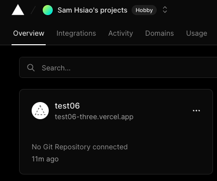

</br>

2. 先複製 Domain。
   - 這個時候網頁是錯誤的，不用理會

    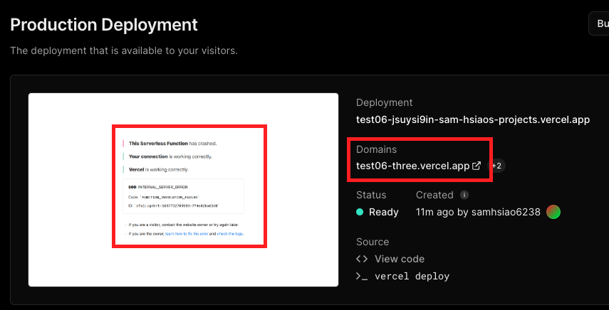   

</br>

## D. 前往 Line Developers

1. 回到 Line Developers，編輯 Webhook。

   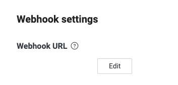

</br>

2. 貼上網址，加上「/webhook」，然後 Update。

    

</br>

3. 特別說明這裡的 `webhook` 尾綴是定義在 `index.py` 中的路由。

   

</br>

4. 開啟 `Use webhook`。

   

</br>

5. 這時還沒完成設定，點擊驗證會是錯的。

    

</br>

6. 繼續進行設定，點擊 Edit。

    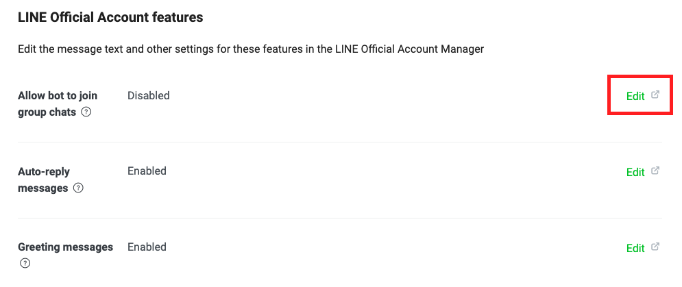

</br>

7. 選擇接受邀請。

    

</br>

8. 總的來說是這樣。

    

</br>

_🔺 以上完成第一階段的 Line Developers 設定_

</br>

## E. 進入 Vercel

1. 接著進入 Vercel 的設定。

   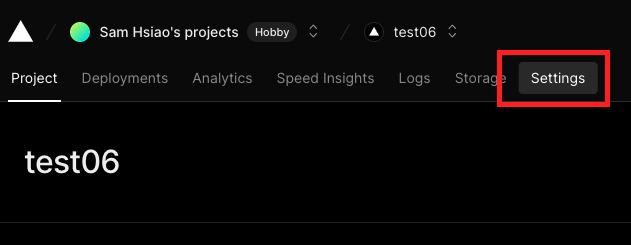

</br>

2. 點擊左側環境變數。
   
   

</br>

3. 複製程式碼中的兩個環境變數名稱作為 Key。
   
   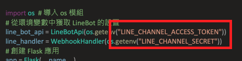

</br>

4. 先貼上 Key，再貼上 Line Develop 所提供對應的 `Token` 與 `Secret` 的值。
   
   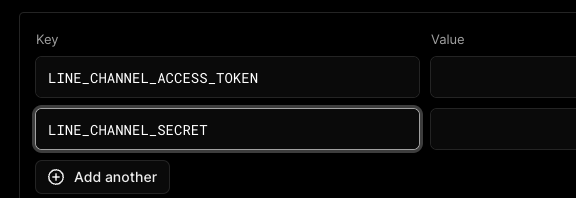

</br>

5. 務必記得儲存。
   
   

</br>

## F. 進入 VSCode

1. 將專案發佈到新的儲存庫中。

   

</br>

2. 選公開。

   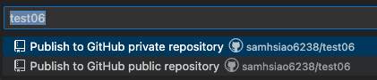

</br>

## G. 再回到 Vercel 中

1. 點擊連結到專案。

   

</br>

2. 選取 GitHub。

   

</br>

3. 連結。
   
   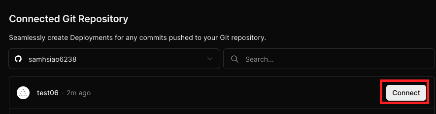

</br>

4. 這裡可以查看 `Source code` 確認是否為更新的內容。

   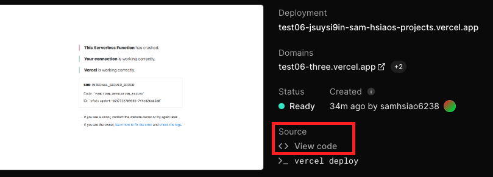

</br>

## H. 驗證結果

1. Vercel 的部署有時會有延遲狀況，可以透過去修改一下 `index.py` 來同步並觀察一下部署狀況。

   

</br>

2. 直到畫面正常顯示就表示部署完成。

   

</br>

3. 也可以透過驗證 Webhook 確認是否完成部署。

   

</br>

## I. 其他補充

    _介紹完伺服器後，再使用 `Ngrok` 將 LineBot 部署在樹莓派上_

</br>

---

_END:這裡僅是確認部署，至於腳本內容並無太多功能_