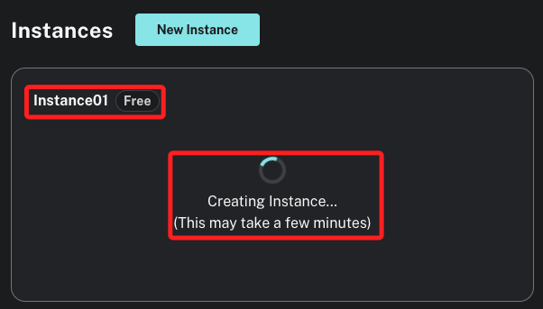
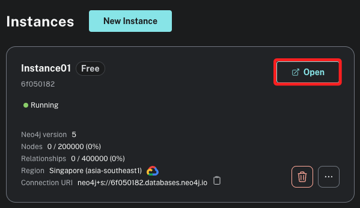
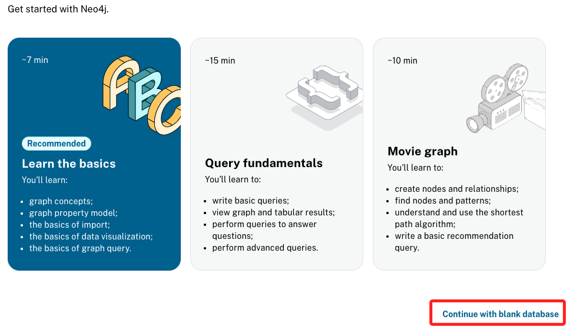
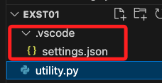
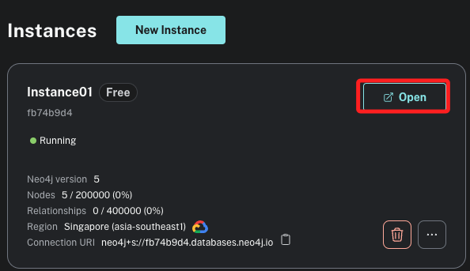
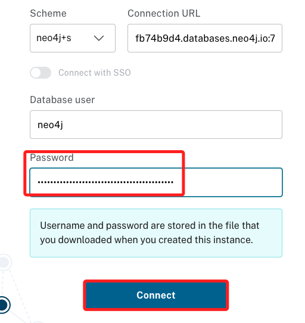
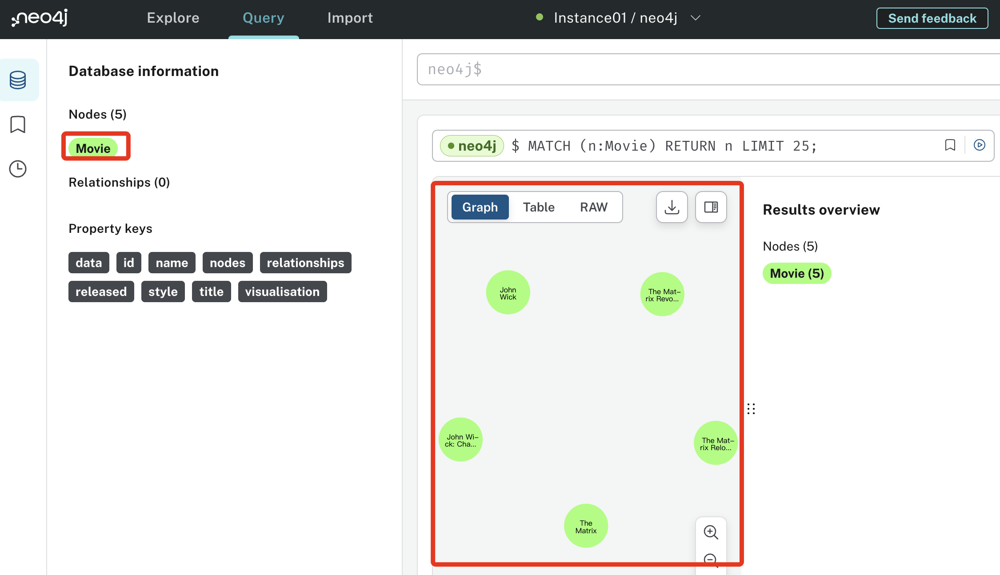
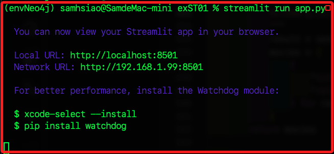

# Neo4j


<br>

## 說明

1. 在 Streamlit 部落格中的 [文章](https://blog.streamlit.io/building-a-streamlit-and-scikit-learn-app-with-chatgpt/) 介紹了豐富的應用，並引導如何兼容使用 `Streamlit`、`scikit-learn` 與 `ChatGPT` 。

    

<br>

2. 這篇筆記會示範如何建立一個簡單的 `Streamlit` 應用，並訪問 `Neo4j` 資料庫進行讀寫。

<br>

3. 若要建立結合了 `Streamlit`、`neo4j` 與 `OpenAI` 的範例，也可參考 [簡易範例](https://github.com/neo4j-graph-examples/movies?tab=readme-ov-file)，或參考 [完整範例](https://github.com/tomasonjo/streamlit-neo4j-hackathon) 獲取相關說明。

<br>

4. 關於資料庫的部分，可先從 [Neo4j 官網首頁](https://neo4j.com/) 點擊 `Aura Login` 進行登入。

    

<br>

5. 關於 Neo4j 資料庫的連線測試可使用 [ Neo4j官方資系統](https://demo.neo4jlabs.com:7473/browser/) 進行。

<br>

## 步驟

_以下介紹詳細的操作步驟_

<br>

1. 進入 [官網](https://neo4j.com/cloud/platform/aura-graph-database/?ref=blog.streamlit.io) 並點擊 `Start Free`。

    

<br>

2. 使用 Google 建立帳號即可。

    

<br>

3. 同意隱私條款 `I agree`。

    

<br>

4. 點擊 `New Instance` 再次建立新的實體。

    

<br>

5. 點擊建立免費的實體 `Create Free instance`。

    

<br>

6. 下載憑證檔案到本地電腦上 `Download and continue`，每次建立新的實體都會有新的憑證。

    

<br>

7. 內容如下，之後在腳本或是連線時都會需要用到。

    

<br>

8. 選擇身份，這裡示範是 `新手菜鳥`。

    

<br>

9. 建立的過程需要等候一小時間，切勿關閉視窗。

    

<br>

10. 完成時點擊 `Open`。

    

<br>

11. 點擊 `Accept`。

    

<br>

12. 在前面 `下載憑證` 的步驟時有取得 `USERNAME` 以及 `PASSWORD`，在欄位中填入其中的 `PASSWORD`，然後點擊 `Connect`。

    

<br>

13. 接下來是引導教學 `Guides`，點擊右下角的 `Continue with blank database` 跳過這個步驟。

    

<br>

14. 完成以上步驟會見到以下的資料庫畫面。

    

_以上完成註冊與建立實體的基本程序_

<br>

## 本機操作

_從零開始建立一個專案_

<br>

1. 建立新的虛擬環境：建議在指定資料夾籌管理全部的虛擬環境，這裡示範的是在 `~/Documents/PythonVenv`，所以會先進入該資料夾。

    ```bash
    cd ~/Documents/PythonVenv && python -m venv envNeo4j
    ```

<br>

2. 編輯環境參數：請自行查詢前項虛擬環境路徑。

    ```bash
    sudo nano ~/.zshrc
    ```

    

<br>

3. 完成編輯後即刻啟動。

    ```bash
    source ~/.zshrc
    ```

<br>

4. 建立並進入專案資料夾，這裡示範建立在桌面。

    ```bash
    cd ~/Desktop && mkdir exST01 && cd exST01
    ```

<br>

5. 安裝相關庫。

    ```bash
    pip install neo4j streamlit
    ```

<br>
   
6. 若要批次安裝，可使用以下指令將 `requirements.txt` 文件內的套件一次安裝。

    ```bash
    pip install -r requirements.txt
    ```
    
    _文件內容_
    
    ```bash
    # 後補
    ...
    ```

<br>

7. 安裝完成會顯示版本 `5.20.0`。

    

<br>
   
8. 或透過指令查詢安裝版本。

    ```bash
    pip show neo4j
    ```

    

<br>

9. 在專案資料夾中啟動 VSCode。

    ```bash
    code .
    ```

<br>

10. 建立一個腳本 `utility.py`，並編輯代碼如下。

    ```bash
    touch utility.py
    ```

    _腳本內容_
    ```python
    from neo4j import GraphDatabase


    # 連接到 Neo4j 資料庫
    def get_neo4j_session(uri, user, password):
        driver = GraphDatabase.driver(uri, auth=(user, password))
        return driver.session()


    # 載入電影數據
    def load_movie_data(session):
        query = "MATCH (m:Movie) RETURN m.title AS title, m.released AS released LIMIT 10"
        result = session.run(query)
        movies = [
            {
                "title": record["title"],
                "released": record["released"]
            } for record in result
        ]
        return movies

    ```

<br>
 
11. 建立主腳本 `app.py`，其中 URI、USER、PASSWORD 需要使用 `自己憑證內` 的資訊，特別注意其中的 `<`與`>` 僅是說明使用，實際填寫時不用加入；另外，關於這些敏感資訊將在下一個步驟說明建立方式。

    
    
    _腳本內容_
    ```python
    import streamlit as st
    from utility import get_neo4j_session, load_movie_data

    # 資料庫連接資訊
    URI = "neo4j+s://<替換為自己的資料庫 ID>.databases.neo4j.io"
    USER = "neo4j"
    PASSWORD = "<替換為自己的資料庫密碼>"


    # Streamlit 主函數
    def main():
        st.title("Neo4j Movie Data")

        # 連接到資料庫
        session = get_neo4j_session(URI, USER, PASSWORD)

        # 載入數據
        movies = load_movie_data(session)

        # 顯示數據
        if movies:
            for movie in movies:
                st.write(f"Title: {movie['title']}, Released: {movie['released']}")
        else:
            st.write("No data found.")

        # 關閉資料庫對話
        session.close()


    if __name__ == "__main__":
        main()

    ```

<br>

## VSCode 工作區設定

1. 假如有在 VSCode 中使用 `Flake 8` 之類的 Python 語言風格管理插件，由於有單行字數限制，但因為專案涉及的資料庫語言通常很長，這裡示範建立工作區的設定文件來取消這個警告。

    

<br>

2. 在專案之下建立一個隱藏資料夾 `.vscode`，然後在路徑內添加一個文件 `settings.json`。

    

<br>

3. 寫入以下內容即可，這是針對工作區範圍的設置，若要擴大範圍或是全局設定，則在相對的路徑中進行即可。

    ```json
    {
        // flake8 長度
        "flake8.args": [
            // 取消長度
            "--max-line-length=200",
            // 取消首行必須是 import 的規定
            "--ignore=E402"
            // 要取消的其他項目代碼，以逗號相隔即可
            // "--ignore=E501, E402"
        ],
    }
    ```

<br>

## 處理敏感資訊

_緊接著上一個步驟來處理_

<br>

1. 安裝 `python-dotenv`。

    ```bash
    pip install python-dotenv
    ```

<br>

2. 在專案資料夾內建立一個 `.env` 文件。

    ```bash
    touch .env
    ```

<br>

3. 依據下載的憑證，填寫 `.env` 文件； _特別注意_ ，`.env` 僅是一般文件並非 Python 腳本，所以 `等號兩側的空白` 及 `字串的引號` 都不是強制性的，但為了區隔腳本與一般文件的不同，可考慮在一般文件中使用通用文字寫法即可，便於直觀地與腳本風格做出區隔。

    ```json
    NEO4J_URI=neo4j+s://<db_id>.databases.neo4j.io
    NEO4J_USERNAME=neo4j
    NEO4J_PASSWORD=your_password
    ```
    
    _如下_
    
    

<br>

4. 修改主腳本 `app.py` 載入 `.env` 文件。

    ```python
    import streamlit as st
    from utility import get_neo4j_session, load_movie_data
    # 載入 dotenv
    from dotenv import load_dotenv
    import os

    # 載入環境變數
    load_dotenv()

    # 資料庫連接資訊
    URI = os.getenv("NEO4J_URI")
    USER = os.getenv("NEO4J_USERNAME")
    PASSWORD = os.getenv("NEO4J_PASSWORD")


    # Streamlit 主函數
    def main():
        st.title("Neo4j Movie Data")

        # 連接到資料庫
        session = get_neo4j_session(URI, USER, PASSWORD)

        # 載入數據
        movies = load_movie_data(session)

        # 顯示數據
        if movies:
            for movie in movies:
                st.write(f"Title: {movie['title']}, Released: {movie['released']}")
        else:
            st.write("No data found.")

        # 關閉資料庫對話
        session.close()


    if __name__ == "__main__":
        main()

    ```

<br>

5. 特別補充，假如修改了 `.env` 文件，就像修改了環境參數，所以在使用 `.ipynb` 進行測試時，務必要點擊筆記本上方的 `重新啟動` 讓設定生效。

    

<br>

## 模擬數據

1. 目前資料庫中是沒有資料的，所以先建立一個腳本 `simulate_data.ipynb` 來生成模擬的數據，同時將數據寫入資料庫，這個腳本使用 `.ipynb` 格式即可，名稱亦可自訂。

    ```python
    '''模擬數據'''
    from neo4j import GraphDatabase
    import os
    from dotenv import load_dotenv

    # 載入環境變數
    load_dotenv()

    # 取得環境變數
    URI = os.getenv("NEO4J_URI")
    USER = os.getenv("NEO4J_USERNAME")
    PASSWORD = os.getenv("NEO4J_PASSWORD")

    # 連接到 Neo4j 資料庫
    driver = GraphDatabase.driver(URI, auth=(USER, PASSWORD))


    def create_movies(session):
        # 建立電影數據
        create_query = """
        CREATE (a:Movie {title: 'The Matrix', released: 1999}),
            (b:Movie {title: 'The Matrix Reloaded', released: 2003}),
            (c:Movie {title: 'The Matrix Revolutions', released: 2003}),
            (d:Movie {title: 'John Wick', released: 2014}),
            (e:Movie {title: 'John Wick: Chapter 2', released: 2017})
        """
        session.run(create_query)
        print("Movies created in the database.")


    # 執行建立電影資料庫的操作
    with driver.session() as session:
        create_movies(session)

    # 關閉資料庫連接
    driver.close()
    ```

<br>

2. 運行腳本後可寫入模擬數據。

    

<br>

3. 開啟自己在 Neo4j 上的實體。

    

<br>

4. 輸入密碼後連線 `Connect`。

    

<br>

5. 進入後便可以查看資料庫的各項內容。

    

<br>

## 運行主腳本

1. 在 `app.py` 中載入模組 `utility.py`：在前面的步驟已經建立了功能模組 `utility.py`，其中封裝了建立連線任務 `get_neo4j_session` 與載入數據 `load_movie_data` 兩個函數，這部分腳本與之前相同。

    ```python
    # app.py
    import streamlit as st
    from utility import get_neo4j_session, load_movie_data
    from dotenv import load_dotenv
    import os

    # 載入環境變數
    load_dotenv()

    # 資料庫連接資訊
    URI = os.getenv("NEO4J_URI")
    USER = os.getenv("NEO4J_USERNAME")
    PASSWORD = os.getenv("NEO4J_PASSWORD")


    # Streamlit 主函數
    def main():
        st.title("Neo4j Movie Data")

        # 連接到資料庫
        session = get_neo4j_session(URI, USER, PASSWORD)

        # 載入數據
        movies = load_movie_data(session)

        # 顯示數據
        if movies:
            for movie in movies:
                st.write(f"Title: {movie['title']}, Released: {movie['released']}")
        else:
            st.write("No data found.")

        # 關閉資料庫對話
        session.close()

    if __name__ == "__main__":
        main()

    ```

<br>

2. 運行主腳本。

    ```bash
    streamlit run app.py
    ```

<br>

3. 會自動開啟瀏覽器。

    _特別注意，這時終端機會出現錯誤提示，但網頁是正常顯示的，這部分在下一個步驟處理 。_

    

<br>

## 補充

_透過上下文管理進行資源的正確釋放_

<br>

1. 運行後會出現如下的訊息。

    

<br>

2. 參考 [官網說明](https://neo4j.com/docs/python-manual/current/)，因為使用 `Neo4j` 數據庫連線時，會建立一個驅動器實例 `driver` 與一個或多個任務實例 `session`，這些實例會在背景中維持連線，所以官方建議用戶要正確管理資源，確保在使用完連接和任務 `session` 後要執行 `session.close()` 及 `driver.close()` 來關閉，這可避免資源外洩和確保應用程式的效能。

    

<br>

3. 為了有效達成這個目的，可搭配 Python 的 `上下文管理器 with` 語句來自動調用內建的資源初始化與清理方法，一但使用了 `with`，會在進入區塊時自動調用魔法方法 `__enter__`，離開區塊時自動調用魔法方法 `__exit__`，而因應邏輯設計， `driver` 是在 `main` 函數中的 `finally` 區塊中以手動進行關閉。

<br>

4. 改寫 `utility.py`：傳出整個 `driver`，而不是 `driver.session()`，如此便可透過上下文管理來釋放驅動器。

    ```python
    from neo4j import GraphDatabase


    # 創建 Neo4j 資料庫驅動實例
    def get_neo4j_driver(uri, user, password):
        driver = GraphDatabase.driver(uri, auth=(user, password))
        return driver


    # 進行資料查詢
    def load_movie_data(driver):
        with driver.session() as session:
            query = """
            MATCH (m:Movie)
            RETURN m.title AS title, m.released AS released LIMIT 10
            """
            result = session.run(query)
            movies = [
                {
                    "title": record["title"],
                    "released": record["released"]
                } for record in result
            ]
        return movies

    ```

<br>

4. 改寫 `app.py`。

    ```python
    import streamlit as st
    from utility import get_neo4j_driver, load_movie_data
    from dotenv import load_dotenv
    import os

    # 載入環境變數
    load_dotenv()

    # 資料庫連接資訊
    URI = os.getenv("NEO4J_URI")
    USER = os.getenv("NEO4J_USERNAME")
    PASSWORD = os.getenv("NEO4J_PASSWORD")


    # Streamlit 主函數
    def main():
        st.title("Neo4j Movie Data")

        # 創建驅動實例
        driver = get_neo4j_driver(URI, USER, PASSWORD)

        try:
            # 載入數據
            movies = load_movie_data(driver)

            # 顯示數據
            if movies:
                for movie in movies:
                    st.write(
                        f"Title: {movie['title']}, Released: {movie['released']}"
                    )
            else:
                st.write("No data found.")
        finally:
            # 確保無論如何都會關閉驅動器
            driver.close()


    if __name__ == "__main__":
        main()

    ```

<br>

5. 再次運行，不會出現錯誤。

    

<br>


## 關於 Session

_常見翻譯有 `會議`、`事務`、`對話` 等，這是個有點抽象的觀念，描述了提供狀態管理和數據一致性的解決方案，在開發具有多步操作和需要狀態持久性的應用時尤其重要，補充說明一下 。_

<br>

1. 在 Python 或其他的編程中，`Session`通常是描述在特定時間內持續互動的一個狀態，也可說是客戶端與服務器互動的過程，保持這樣的狀態就是一種 `Session`。

<br>

2. 在 Web 開發中，`Session` 用於記錄客戶端用戶的狀態信息，當用戶與 Web 應用互動時，如登入帳戶，服務器會創建一個 `Session`，並通過 `Session ID` 來唯一標識這次 `Session`， `ID` 會通過 `cookies` 儲存在用戶的瀏覽器並用於後續請求，以便服務器可以檢索和維持用戶的狀態如登入狀態、購物車內容等。

<br>

３．在使用數據庫的應用中，如使用 Python 的 ORM 框架 `SQLAlchemy` 時，`Session` 代表一次數據庫的互動，它允許開發者在一個互動中執行多個操作，並且可以對這些操作進行提交，這種 `Session` 在保證數據一致性和回溯操作上非常有用。

<br>

4. 在機器學習框架中，如 `TensorFlow` 或 `PyTorch`，`Session` 指的是一個執行環境，在這個環境中會進行模型被加載、運行和調試，在 `TensorFlow` 中，一個 `Session` 對象封裝了環境的狀態，使得能夠執行定義好的運算。

<br>

___

_END_