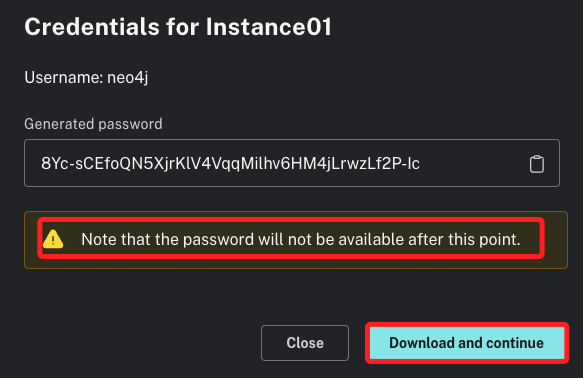
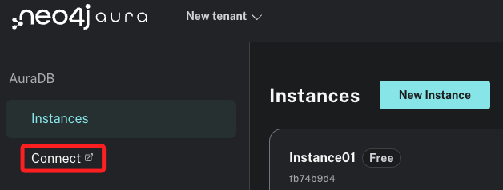
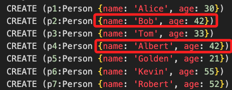
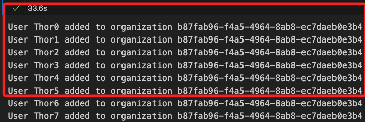

# 官方的持久化資料庫

_這是實體持久化的資料庫，與沙箱略有不同_

<br>

1. 除了 `沙箱`，也可以參考 [官網](https://neo4j.com/) 的範例，進入官網後點擊 `Aura Login`。

    

<br>

2. 先建立一個實體 `Instances`。

    

<br>

3. 建立免費的實體即可。

    

<br>

4. 點擊 `Download and continue` 下載憑證 `Credentials`，_特別注意_，之後只能從本地憑證檔案中讀取相關訊息，文件無法重新下載。

    

    ⏰ _這個步驟有時候會耗時幾分鐘_

<br>

5. 完成後，在實體的左側點擊 `Connect` 會進入官方的指引文件。

    

<br>

6. 點擊進入 Python 的指引 [Guide](https://neo4j.com/docs/python-manual/current/)。

    

<br>

## 操作

1. 首先，將下載的憑證文件開啟備用。

    

<br>

2. 依據官方指引安裝套件，這跟沙箱中使用的不同。

    ```bash
    pip install neo4j
    ```

<br>

3. 官方腳本：連線資料庫，替換其中的 `URI`、`Username`、`Password`，_特別注意_，其中的箭頭括號 `<>` 只是示意區塊，複製後無需貼上。

    ```python
    from neo4j import GraphDatabase

    # URI examples: "neo4j://localhost", "neo4j+s://xxx.databases.neo4j.io"
    URI = "<URI for Neo4j database>"
    AUTH = ("<Username>", "<Password>")

    with GraphDatabase.driver(URI, auth=AUTH) as driver:
        driver.verify_connectivity()
    ```

<br>

4. 官方腳本：向資料庫發出請求。

    ```python
    # Get the name of all 42 year-olds
    records, summary, keys = driver.execute_query(
        "MATCH (p:Person {age: $age}) RETURN p.name AS name",
        age=42,
        database_="neo4j",
    )

    # Loop through results and do something with them
    for person in records:
        print(person)

    # Summary information
    print("The query `{query}` returned {records_count} records in {time} ms.".format(
        query=summary.query, records_count=len(records),
        time=summary.result_available_after,
    ))
    ```

    _並無吻合的資料，這是因為這個範例應該是要搭配官網的資料庫，而不是自行建立的資料庫，但這裡先不切換到官網的資料庫。_

    

<br>

5. 自行修改腳本：取得第一個節點的資訊。

    ```python
    from neo4j import GraphDatabase

    # 設定Neo4j的URI和認證資訊
    URI = "neo4j+s://bfc46ed1.databases.neo4j.io"
    AUTH = ("neo4j", "8Yc-sCEfoQN5XjrKlV4VqqMilhv6HM4jLrwzLf2P-Ic")

    # 連接到Neo4j資料庫
    driver = GraphDatabase.driver(URI, auth=AUTH)

    # 執行查詢，獲取第一條 Person 節點的完整內容
    def get_first_person():
        with driver.session(database="neo4j") as session:
            result = session.run("MATCH (p:Person) RETURN p LIMIT 1")
            record = result.single()
            if record:
                person_node = record["p"]
                return person_node
            else:
                return None

    # 獲取第一條 Person 節點的內容並輸出
    first_person = get_first_person()
    if first_person:
        print("First person node data:", first_person)
    else:
        print("No person nodes found.")

    driver.close()
    ```
    _查詢結果並無 `Person` 這個節點_

    

<br>

6. 自訂腳本：嘗試取回第一個節點，觀察看看節點究竟是怎樣的格式。

    ```python
    from neo4j import GraphDatabase

    # 設定Neo4j的URI和認證資訊
    URI = "neo4j+s://bfc46ed1.databases.neo4j.io"
    AUTH = ("neo4j", "8Yc-sCEfoQN5XjrKlV4VqqMilhv6HM4jLrwzLf2P-Ic")

    # 連接到Neo4j資料庫
    driver = GraphDatabase.driver(URI, auth=AUTH)

    # 執行查詢，獲取資料庫中的第一個節點的完整內容
    def get_first_node():
        with driver.session(database="neo4j") as session:
            result = session.run("MATCH (n) RETURN n LIMIT 1")
            record = result.single()
            if record:
                node = record["n"]
                return node
            else:
                return None

    # 獲取第一個節點的內容並輸出
    first_node = get_first_node()
    if first_node:
        print("第一個節點：", first_node)
    else:
        print("資料庫中沒有找到任何節點。")

    driver.close()
    ```

    _原來是沒有任何節點_

    

<br>

7. 自訂腳本：插入自定義的資料，並觀察取得的第一個節點資料。

    ```python
    def insert_test_data():
        cypher_query = """
        CREATE (p1:Person {name: 'Alice', age: 30})
        CREATE (p2:Person {name: 'Bob', age: 42})
        CREATE (p3:Person {name: 'Tom', age: 33})
        CREATE (p4:Person {name: 'Albert', age: 42})
        CREATE (p5:Person {name: 'Golden', age: 21})
        CREATE (p6:Person {name: 'Kevin', age: 55})
        CREATE (p7:Person {name: 'Robert', age: 52})
        """
        with driver.session(database="neo4j") as session:
            session.run(cypher_query)
            print("插入測試資料.")

    # 插入測試資料
    insert_test_data()

    # 再次獲取第一個節點的內容並輸出
    first_node = get_first_node()
    if first_node:
        print("第一個節點資料: ", first_node)
    else:
        print("資料庫中.")

    driver.close()
    ```

    _輸出結果_

    

    _確認是自己寫入的節點_

    

<br>

8. 再次執行腳本進行篩選。

    

    _以寫入的資料觀察是正確的_

    

<br>

## Transaction

1. 官方腳本：核心功能是管理 `Person` 和 `Organization` 節點，以及它們間的 `WORKS_FOR` 關係，可視為描述了組織與員工的資料架構；該腳本確保每個 Person 都被分配到一個組織，並且如果需要，會創建新的 Organization 來容納新員工。

<br>

2. 在流程上，首先會建立 `Person` 節點，新增節點時會先確認節點是否已經存在，不存在才會新增的；接著檢查組織節點，計算組織中已有的員工數，如果新建立的組織員工數不足預設閾值，則將新增的員工添加到新的組織中，如果已經達到閾值，則添加新的組織；如果新建的組織沒有員工，則 `回滾交易`，也就是不建立任何新的節點。這個腳本通過動態分配員工到組織，確保每個組織的員工數量不會超過預設的閾值，並且在需要時創建新的組織以容納更多的員工。

<br>

3. 程式碼：因 `Person` 與前面的腳本格式不同，運行之前可清空資料庫。

    ```python
    from neo4j import GraphDatabase

    # 設定 Neo4j 資料庫的 URI 和認證資訊
    URI = "neo4j+s://bfc46ed1.databases.neo4j.io"
    AUTH = ("neo4j", "8Yc-sCEfoQN5XjrKlV4VqqMilhv6HM4jLrwzLf2P-Ic")
    # 設定每個組織的員工人數上限
    employee_threshold = 10

    def main():
        # 上下文管理：使用 GraphDatabase 連接到 Neo4j 資料庫
        with GraphDatabase.driver(URI, auth=AUTH) as driver:
            # 創建會話
            with driver.session(database="neo4j") as session:
                # 重複 100 次，也就是添加 100 個員工
                for i in range(100):
                    # 生成員工名稱，這裡以 `Thor` 最為前綴、序號作為後綴
                    name = f"Thor{i}"
                    # 執行寫入交易，添加員工並獲取組織 ID
                    org_id = session.execute_write(employ_person_tx, name)
                    # 輸出結果
                    print(f"將員工 {name} 加入組織 {org_id}")


    # 創建具有給定名稱的新 Person 節點
    def employ_person_tx(tx, name):
        # 使用 `MERGE` 達成如果已存在則不重複創建
        result = tx.run("""
            MERGE (p:Person {name: $name})
            RETURN p.name AS name
            """, name=name
        )

        # 獲取最近創建的組織 ID 及其相關聯的員工數量
        result = tx.run("""
            MATCH (o:Organization)
            RETURN o.id AS id, COUNT{(p:Person)-[r:WORKS_FOR]->(o)} AS employees_n
            ORDER BY o.created_date DESC
            LIMIT 1
        """)
        org = result.single()

        # 如果最近的組織沒有員工，則拋出異常
        if org is not None and org["employees_n"] == 0:
            raise Exception("最新建立的組織是空的。")
            # 交易將回滾 -> 連 Person 都不會創建!

        # 如果組織員工數未達上限，將該員工添加到該組織
        if org is not None and org.get("employees_n") < employee_threshold:
            result = tx.run("""
                MATCH (o:Organization {id: $org_id})
                MATCH (p:Person {name: $name})
                MERGE (p)-[r:WORKS_FOR]->(o)
                RETURN $org_id AS id
                """, org_id=org["id"], name=name
            )
        # 如果組織員工數已達上限，創建一個新的組織並將該員工添加到新組織
        else:
            result = tx.run("""
                MATCH (p:Person {name: $name})
                CREATE (o:Organization {id: randomuuid(), created_date: datetime()})
                MERGE (p)-[r:WORKS_FOR]->(o)
                RETURN o.id AS id
                """, name=name
            )

        # 傳出：新員工所屬的組織 ID
        return result.single()["id"]


    if __name__ == "__main__":
        main()

    ```

    _添加了 100 筆資料_

    

<br>

4. `回滾交易（Rollback Transaction）` 是指在資料庫管理系統中，當一個 `交易（Transaction）` 在執行過程中遇到錯誤、失敗或被用戶取消時，系統會將所有在此交易中所做的修改撤銷，使資料庫返回到交易開始之前的狀態。回滾交易保證了資料庫的一致性和完整性，即使在發生故障的情況下，也能確保資料不會處於不一致的狀態，以下是程式碼作簡單說明。
```python
def employ_person_tx(tx, name):
    result = tx.run("""
        MERGE (p:Person {name: $name})
        RETURN p.name AS name
        """, name=name
    )

    result = tx.run("""
        MATCH (o:Organization)
        RETURN o.id AS id, COUNT{(p:Person)-[r:WORKS_FOR]->(o)} AS employees_n
        ORDER BY o.created_date DESC
        LIMIT 1
    """)
    org = result.single()

    if org is not None and org["employees_n"] == 0:
        raise Exception("Most recent organization is empty.")
        # 交易回滾，Person 節點不會被創建
```

<br>

___

_END