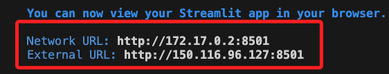
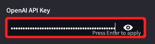
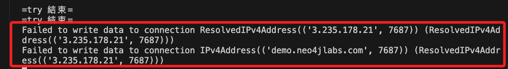
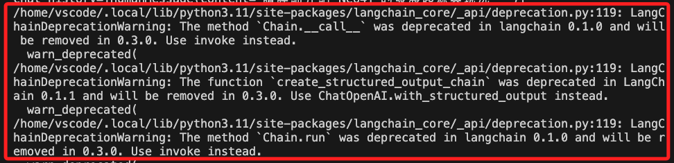
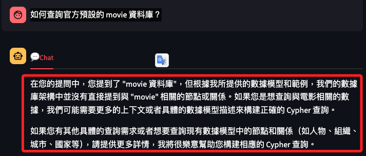
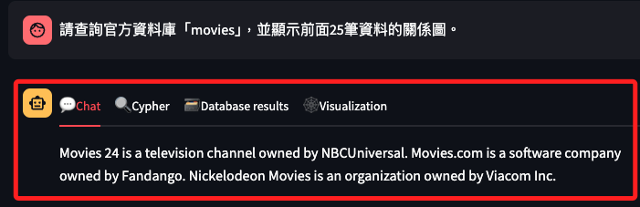
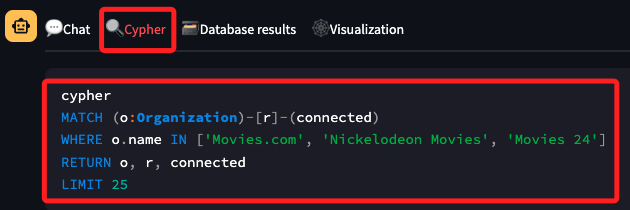
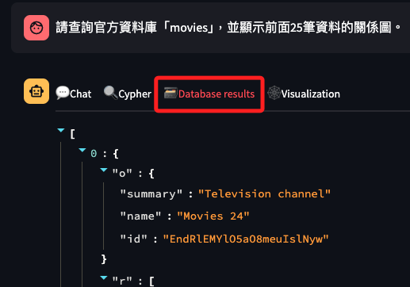
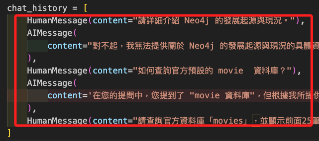

# 說明

_03_st-neo4j-bot_

<br>

1. 這個專案主要包含了三個腳本：`app.py`、`cypher_chain.py`、`cypher_validator.py`。

2. 以下將分別解說這三個腳本。

<br>

## 運行紀錄

1. 容器啟動後可正常運行。

    

<br>

2. 輸入 API Key 之後按下 `ENTER`。

    

<br>

3. 這時會出現 `Failed to write data to connection ResolvedIPv4Address ...` 的錯誤，但運行沒問題，目前尚無法排除這個狀況。

    

<br>

4. 查詢問題 `如何查詢官方預設的 movie 資料庫？` 時出現一些 `棄用` 的通知，但這些並非使用者可以調用的函數，暫時不予理會。

    

<br>

5. 同時得到這並非這個應用所提供的服務。

    

<br>

6. 針對提示查詢以下問題 `請查詢官方資料庫「movies」，並顯示前面25筆資料的關係圖。`，得到相對滿意的答覆，並包含了 `Chat`、`Cypher`、`Database results`、`Visualization` 等四個完整的頁籤。

    

<br>

7. 比如說切換到 `Cypher` 頁籤便會顯示語法。

    

<br>

8. `Database` 則會顯示資料內容，其餘省略說明。

    

<br>

9. 觀察終端機中的訊息，其中 `chat_history` 是一個包含了 `HumanMessage` 與 `AIMessage` 物件的列表。

    

<br>

10. 另外還會輸出。

    ```json
    name=['movies']
    NER found: ['movies']
    Relevant entities are: {'movies': ['Movies.com', 'Nickelodeon Movies', 'Movies 24']}
    ```

<br>

## `app.py`

_後補_

<br>

## `cypher_chain.py`

1. 充分利用 `langchain` 庫來整合文字處理和圖資料庫查詢的流程，透過自訂的鍊式操作處理使用者輸入，產生回應的 Cypher 查詢，並與 Neo4j 資料庫互動。

2. 模組的設計旨在透過自然語言處理增強資料庫查詢的生成和執行過程，實現了從問題解析到資料庫查詢的自動化。

<br>

### 導入庫

1. **導入必要的庫**：

    - `os`：用於作業系統功能，如讀取環境變數。

    - `typing`：提供類型支援。

    - `langchain`：一個函式庫，用於鍊式處理語言相關的任務，包括產生Cypher查詢。

    - `pydantic`：用於資料驗證和設定管理。

<br>

2. **條件導入**：
    - 嘗試從 `pydantic.v1.main` 匯入 `BaseModel` 和 `Field`，如果失敗則從 `pydantic.main` 匯入，這是向後相容的處理方式。

<br>

### 自訂函數 `remove_entities`

- **目的**：將文字中的命名實體替換為它們對應的實體標籤。

- **實作方式**：

    - 遍歷文件的實體（`doc.ents`），以實體的標籤（`ent.label_`）取代實體文字。

    - 在實體前後加入非實體文字。

    - 返回修改後的文字。

<br>

### 預設的關係和Cypher模板

- **定義實體間的可能關係**：列舉了可用於建構查詢的實體間關係，例如人與人之間的親子關係、組織與組織之間的供應關係等。

- **Cypher系統模板**：定義了一個模板字串，描述了使用者角色，將使用者問題轉換為準確的Cypher查詢。

<br>

### `CustomCypherChain` 類

- **實現詳細功能**：

    - **處理實體**：從文字中擷取組織和人員實體。

    - **產生視覺化資料**：建構與實體相關的查詢，產生視覺化資料。

    - **尋找實體符合**：在資料庫中尋找符合的實體。

    - **產生系統訊息**：根據相關實體和範例產生系統訊息，指導產生Cypher查詢。

    - **取得範例查詢**：使用向量搜尋取得與問題相關的Cypher查詢範例。

<br>

- **主呼叫方法 `_call`**：

    - 從輸入中提取問題和聊天歷史。

    - 處理文字中的實體，符合資料庫中的實體。

    - 取得幾個範例查詢，產生系統訊息。

    - 使用鍊式模型產生Cypher查詢。

    - 執行查詢，處理結果並建立最終輸出。

<br>


## cypher_validator.py

1. 定義了一個 `CypherQueryCorrector` 的類，主要功能是校正產生的 Cypher 查詢語句，確保它們符合預先定義的圖資料庫模式和關聯方向。

2. `CypherQueryCorrector` 類中透過一系列的正規比對和邏輯判斷，對產生的 Cypher 查詢進行檢查和修改，以確保查詢符合特定的圖資料庫模式和關係方向，這對於使用 AI 模型自動產生資料庫查詢語句的應用尤其重要，因為模型產生的內容可能不完全符合資料庫的實際結構和約束。

<br>

### 導入

- **匯入必要的模組**：

    - 導入 `re` 用於正規表示式操作。

    - `collections.namedtuple` 用於建立命名元組。

    - `typing` 提供類型註解。

<br>

- **定義`Schema`**：

    - 使用 `namedtuple` 建立一個名為`Schema` 的資料結構，包含`left_node`、`relation`、`right_node` 三個欄位，用於描述資料庫中的實體（節點）和它們之間的關係。

<br>

### 類別定義：`CypherQueryCorrector`

- **類別說明**：
   - 此類別用於校正 AI 模型產生的 Cypher 查詢，主要是關係方向的校正。

<br>

- **正規表示式模式**：

   - `property_pattern`：符合節點或關係的屬性。

   - `node_pattern`：符合節點定義。

   - `path_pattern`：符合包含節點和關係的完整路徑。

   - `node_relation_node_pattern`：更詳細地符合形式為 (節點)-[關係]->(節點) 的路徑。

   - `relation_type_pattern`：符合關係型別及其屬性。

<br>

- **初始化方法 (`__init__`)**：

   - 接收一個 `schemas` 參數，清單中包含多個 `Schema` 實例，定義了資料庫中允許的節點和關係模式。

<br>

### 功能性方法

- **`clean_node`**：清理節點字串，去除括號和屬性，只留下節點的基本表示。

- **`detect_node_variables`**：從查詢中提取所有節點，並將它們的變數名稱和類型標籤整理成字典。

- **`extract_paths`**：從查詢中提取所有包含節點和關係的完整路徑。

- **`judge_direction`**：判斷關係的方向（入射、出射或雙向）。

- **`extract_node_variable`**：從節點描述中提取變數名。

- **`detect_labels`**：根據節點變數字典，從節點描述中提取標籤。

- **`verify_schema`**：驗證給定的節點標籤和關係類型是否符合預先定義的 `schemas`。

- **`detect_relation_types`**：從關係描述中提取關係類型和方向。

- **`correct_query`**：校正查詢語句中的關係方向，確保它們符合 `schemas` 定義的正確方向和類型。

<br>

### 呼叫方法 (`__call__`)

- **使類別實例可以像函數一樣被呼叫**：接收一個 Cypher 查詢，呼叫 `correct_query` 方法進行校正，傳回校正後的查詢。

<br>


## 關於容器設定

1. 當使用 VSCode 的 Remote Containers 外掛程式或 GitHub Codespaces 運行容器化的開發環境時，VSCode 預設會嘗試使用 `gio` 命令開啟一個外部瀏覽器視窗以存取 Streamlit 應用程式，但在不支援 GUI 或 `gio` 指令的環境中會遇到問題，而 `容器環境` 就是其一。

    ```bash
    # 會顯示警告
    gio: http://localhost:8502: Operation not supported
    ```

<br>

2. 可透過修改 `devcontainer.json` 文件中的服務啟動指令，加入 `無頭模式` 設定，也就是不會嘗試自動開啟瀏覽器視窗。

    ```json
    "postAttachCommand": "streamlit run src/app.py --server.enableCORS false --server.enableXsrfProtection false --server.headless true"
    ```

<br>

3. 補充說明這個命令的伺服器選項：

    - `--server.enableCORS false`：停用跨來源資源共享（CORS）。在開發環境中，如果前端和後端在同一台主機上，可能不需要 CORS 支援。

    - `--server.enableXsrfProtection false`：停用跨站請求偽造（XSRF）保護。通常在處理特定類型的跨站請求時可以關閉，但這可能會降低安全性。

    - `--server.headless true`：確保 Streamlit 在無頭模式下運行，不嘗試開啟瀏覽器視窗。

<br>


## 資料庫

1. 透過 [官網](https://demo.neo4jlabs.com:7473/browser/) 訪問資料庫以確認 URL、帳號、密碼都正確。

<br>

___

_END_