# Neo4j 知識圖

_以中文重新整理官方說明_

<br>

## 環境設置

_先完成以下的套件安裝及環境設置_

<br>

1. Docker + Docker Compose。

2. Neo4j 數據庫應用如 Neo4j Desktop 或雲端實例。

3. 在稍後的操作中將示範使用 `VSCode` 內建的 `venv` 虛擬環境管理。

<br>

## 開始操作

1. 使用 Docker 啟動 Neo4j 數據庫：進入 `docker-compose.yml` 文件所在路徑，接著在終端機使用 Docker Compose 指令來啟動容器中的 Neo4j 數據庫。

   ```bash
   docker-compose up -d
   ```
   
   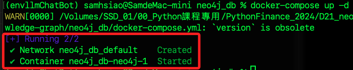

<br>

2. 可透過 Docker desktop 觀察到建立了一個容器。

   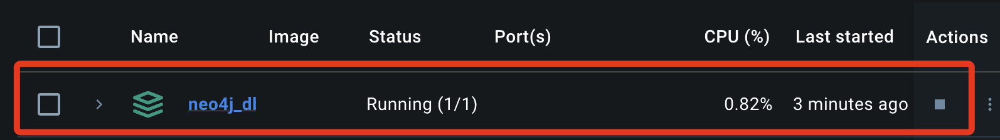

<br>

3. 透過以下網址訪問 Neo4j 的 Web UI，預設的用戶名和密碼都是 `neo4j`。

   [http://localhost:7474/browser/](http://localhost:7474/browser/)

   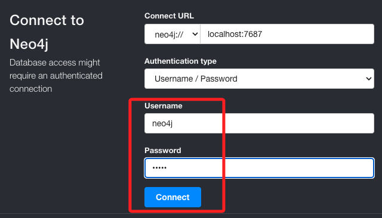

<br>

4. 按照指示設置新密碼。

   

<br>

5. 另外，也可使用 Neo4j Desktop 進行連線。

   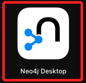

<br>

6. 點擊右上角 `Add`，然後點擊 `Remote connection`。

   

<br>

7. 使用預設的 `URL`，點擊 `Next`。

   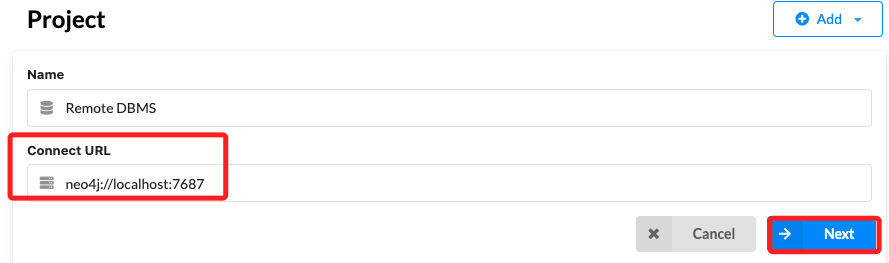

<br>

8. 輸入 `Username` 及 `Password` 之後點擊 `Save`，`Username` 是預設的 `neo4j`，密碼則是前面步驟重設的。

   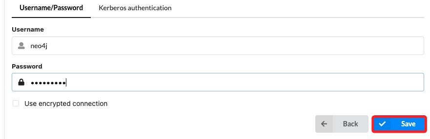

<br>

9. 點擊 `Connect`。

   

<br>

10. 接著 `Open`。

      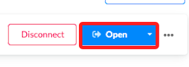

<br>

11. 點擊左上角的資料庫圖標展開，目前尚無任何資料，只會看到相同的資料庫名稱。

      

<br>

## 模擬寫入與讀取數據

1. 首先，在專案的根目錄中建立一個 `test.ipynb` 檔案；接著在編輯模擬數據的腳本之前，要先建立運行這個專案的虛擬環境，這裡將示範在 `.ipynb` 檔案環境中建立虛擬環境，當然，使用 `.py` 檔也可以，只是開始的方式略有不同，但在開始之前有一件事非常重要，就是要將 `工作區` 切換到專案的根目錄中，_切記要切換到專案的根目錄中_ ，非常重要，所以先在腳本點擊右鍵，然後點擊 `開啟終端機`，下圖是因為設定關係所以會開啟外部終端機。

   

<br>

2. 接著在終端機中執行以下指令開啟 VSCode。

   

<br>

3. 在腳本中先點擊右上角。

   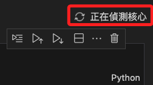

<br>

4. 選取 `Python 環境`。

   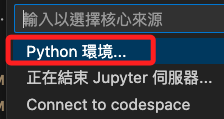

<br>

5. 假如已經有核心，則點擊 `選取其他核心`。

   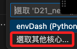

<br>

6. 建立 Python 環境。

   

<br>

7. 選取 `在目前的工作區中建立 Venv 虛擬環境`，這就是為何要切換工作區的原因，VSCode 預設會將虛擬環境建立在當前的工作區中。

   

<br>

8. 使用 `Python 3.10.11`。

   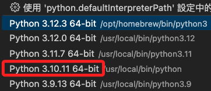

<br>

9. 雖然此處已有一個 `requirements.txt`，可以不用選取，之後另行安裝即可，點擊 `確認` 繼續。

   

<br>

10. 完成時可見右上角已經是核心的名稱與版本號。

   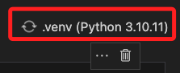

<br>

11. 在專案根目錄中也會顯示虛擬環境安裝的資料夾。

   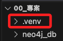

<br>

12. 特別強調，同步之前務必確認編輯了 `.gitignore` 文件。

   ```json
   # Python
   venv
   **/__pycache__

   # App Specific
   .env

   # IDE
   .vscode

   # Neo4j local DB
   data
   neo4j_db/data
   neo4j_db/plugins
   ```

<br>

## 配置環境變量

_回到專案中_

<br>

1. 在專案根目錄創建一個 `.env` 檔案，並填入必要的環境變量，包括 Neo4j 的連接配置和 OpenAI API 密鑰。

   ```json
   OPENAI_API_KEY=<輸入 API KEY>
   CHATGPT_MODEL=gpt-4-turbo
   NEO4J_DB_URI=neo4j://localhost:7687
   NEO4J_DB_NAME=neo4j
   NEO4J_DB_USER=neo4j
   NEO4J_DB_PASS=neo4j
   NEO4J_ENTITY_NAME_FULLTEXT_INDEX_NAME=idx_node_entity_name_fulltext
   ```

<br>

2. 建立並啟動虛擬環境。

   ```bash
   # 在當前路徑中建立虛擬環境
   python -m venv ./venv
   
   # 激活虛擬環境，在 Windows 下
   .\venv\Scripts\activate
   
   # 或在 Unix 或 MacOS 下
   source ./venv/bin/activate
   ```

3. 安裝所需的 Python 依賴。

   ```bash
   pip install -r requirement.txt
   ```

<br>

## 初始化 Neo4j 數據庫

1. 在專案根目錄下運行初始化腳本以創建 `所需的索引`，這對於在 Neo4j 知識圖中進行全文檢索是必要的

   ```bash
   python ./scripts/add_index_for_neo4j_db.py
   ```

<br>

2. 運行應用：確保所有設定正確無誤後，在根目錄運行主應用程序，切記要在根目錄運行才能正確載入環境參數。

   ```bash
   python ./src/main.py
   ```

<br>

## 觀察和交互

1. 運行應用後，你可以進行交互並觀察輸出，若需要查看知識圖的所有節點和邊，可以在 Neo4j 的 Web UI 中運行，注意，如果節點數量很多，這個查詢可能會很慢。

   ```cypher
   MATCH (n) RETURN n
   ```

<br>

___