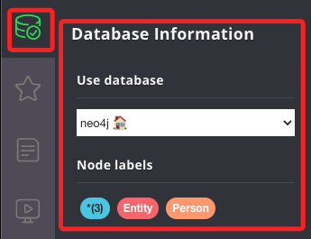

_以中文重新整理_

# 可按照以下步驟逐一進行

_依據這些步驟開始使用 Neo4j 知識圖。_

<br>

## 基本步驟

1. 先完成以下的套件安裝及環境設置。

   - **Docker + Docker Compose** 。

   - **Neo4j 數據庫應用** 如 Neo4j Desktop 或雲端實例。

   - 將示範使用 **VSCode** 內建的 **venv** 虛擬環境管理。

<br>

2. 使用 Docker 啟動 Neo4j 數據庫：進入 `docker-compose.yml` 文件所在路徑，透過在終端機使用 Docker Compose 指令來啟動容器中的 Neo4j 數據庫。

   ```bash
   docker-compose up -d
   ```
   
   

<br>

3. 透過網址 `http://localhost:7474/browser/` 以訪問 Neo4j 的 Web UI，預設的用戶名和密碼都是 `neo4j`，然後按照指示設置新密碼。

<br>

4. 另外，也可使用 Neo4j Desktop 進行連線，以確保數據庫的運行與連接：點擊右上角 `Add`，然後點擊 `Remote connection`。

   

<br>

5. 使用預設的 `URL`，點擊 `Next`。

   

<br>

6. 輸入 `Username` 及 `Password` 之後點擊 `Save`。

   

<br>

7. 點擊 `Connect`。

   

<br>

8. 接著 `Open`。

   

<br>

9. 點擊左上角的資料庫圖標展開，就會看到一樣的內容了。

   

<br>

## 配置環境變量

1. 在專案根目錄創建一個 `.env` 檔案，並填入必要的環境變量，包括 Neo4j 的連接配置和 OpenAI API 密鑰，可參考範例中的 `.env.example` 檔案。

   ```json
   OPENAI_API_KEY=<輸入 API KEY>
   CHATGPT_MODEL=gpt-4-turbo
   NEO4J_DB_URI=neo4j://localhost:7687
   NEO4J_DB_NAME=neo4j
   NEO4J_DB_USER=neo4j
   NEO4J_DB_PASS=neo4j
   NEO4J_ENTITY_NAME_FULLTEXT_INDEX_NAME=idx_node_entity_name_fulltext
   ```

<br>

2. 安裝 Python 依賴：初次啟用可在專案根目錄創建並啟動虛擬環境。

   ```bash
   python -m venv ./venv
   # 激活虛擬環境，在 Windows 下
   .\venv\Scripts\activate
   # 或在 Unix 或 MacOS 下
   source ./venv/bin/activate
   ```

3. 安裝所需的 Python 依賴。

   ```bash
   pip install -r ./requirement.txt
   ```

<br>

## 初始化 Neo4j 數據庫

1. 在專案根目錄下運行初始化腳本以創建 `所需的索引`，這對於在 Neo4j 知識圖中進行全文檢索是必要的

   ```bash
   python ./scripts/add_index_for_neo4j_db.py
   ```

<br>

2. 運行應用：確保所有設定正確無誤後，在根目錄運行主應用程序，切記要在根目錄運行才能正確載入環境參數。

   ```bash
   python ./src/main.py
   ```

<br>

## 觀察和交互

1. 運行應用後，你可以進行交互並觀察輸出，若需要查看知識圖的所有節點和邊，可以在 Neo4j 的 Web UI 中運行，注意，如果節點數量很多，這個查詢可能會很慢。

   ```cypher
   MATCH (n) RETURN n
   ```

<br>

___

_以下為原文_

# Langchain Neo4j Knowledge Graph Demo

This project aims to demonstrate the potential use of Neo4j graph database as memory of Langchain agent, which contains

1. An implementation of entity graph similar to `NetworkxEntityGraph`, with Neo4j as storage
2. An implementation of `BaseChatMemory` which make use Neo4j knowledge graph, extending existing `ConversationKGMemory` which uses `NetworkxEntityGraph` (in memory entity graph implemented with NetworkX)

# Prerequisite

1. Docker + Docker Compose, or a Neo4j database instance
2. Python
3. (Optional) venv

# Setup

1. Start the Neo4j database container with docker-compose, or prepare a Neo4j database instance (e.g. Neo4j Desktop, cloud instance etc.).
2. Access your Neo4j database with browser with `http://localhost:7474/browser/` (assuming that Neo4j database is hosted locally) and follow instructions in web UI to reset password. (Hint: initial username and password are both `neo4j`)
3. Copy .env.example to .env and fill in the variables, namely Neo4j database connection config, and OpenAI API secret key.
4. Initiate virtual environment and install dependencies (or manage dependencies in other way)

```powershell
python -m venv ./venv
pip install -r ./requirement.txt
```

5. Make sure that environment variable for Neo4j connection is configured properly, and Neo4j database is started without error, run the script `{PROJECT_ROOT}/scripts/add_index_for_neo4j_db.py` to create index needed for performing full-text search in Neo4j knowledge graph

```powershell
# In project root
python ./scripts/add_index_for_neo4j_db.py
```

6. Run the app with `python ./src/main.py` in project root.


# Notes

1. As the graph is stored in Neo4j database, it is persisted even after the bot is shutted down
2. To see the most updated knowledge graph, run `MATCH (n) RETURN n` query in web UI of Neo4j to dump all nodes and edges. Beware that this query is slow if you have many nodes