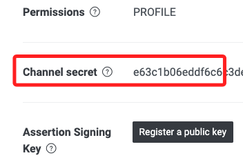
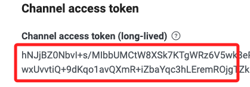
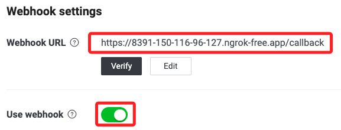
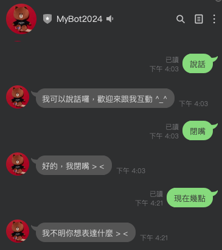

# 基礎專案

_示範使用 [官網範例](https://github.com/line/line-bot-sdk-python) 進行修改。_

<br>

## 步驟

1. 建立並進入專案資料夾，這裡示範使用的名稱為 `myBot01`。

    ```bash
    mkdir myBot01 && cd myBot01
    ```

<br>

2. 安裝套件。

    ```bash
    python -m pip install line-bot-sdk
    ```

<br>

3. 在根目錄中建立一個專案檔案 `app.py` 並在 VSCode 中開啟專案資料夾。

    ```bash
    touch app.py && code .
    ```

<br>

4. 複製官方寫在 `README` 的範例後貼在 `app.py` 中，以下保持原本範例的完整代碼，僅添加部分中文註解與必要折行。

    ```python
    from flask import Flask, request, abort

    from linebot.v3 import (
        WebhookHandler
    )
    from linebot.v3.exceptions import (
        InvalidSignatureError
    )
    from linebot.v3.messaging import (
        Configuration,
        ApiClient,
        MessagingApi,
        ReplyMessageRequest,
        TextMessage
    )
    from linebot.v3.webhooks import (
        MessageEvent,
        TextMessageContent
    )

    app = Flask(__name__)

    configuration = Configuration(access_token='YOUR_CHANNEL_ACCESS_TOKEN')
    handler = WebhookHandler('YOUR_CHANNEL_SECRET')


    @app.route("/callback", methods=['POST'])
    def callback():
        # get X-Line-Signature header value
        signature = request.headers['X-Line-Signature']

        # get request body as text
        body = request.get_data(as_text=True)
        app.logger.info("Request body: " + body)

        # handle webhook body
        try:
            handler.handle(body, signature)
        except InvalidSignatureError:
            app.logger.info(
                "Invalid signature."
                " Please check your channel access token/channel secret."
            )
            abort(400)

        return 'OK'


    @handler.add(MessageEvent, message=TextMessageContent)
    def handle_message(event):
        # 創建了一個 API client 實例，使用在 configuration 中定義的配置。
        # with 語句確保在該代碼區塊執行結束後可釋放資源。
        with ApiClient(configuration) as api_client:
            # 使用客戶端實例初始化一個 MessagingApi 物件，用於後續的消息操作。
            line_bot_api = MessagingApi(api_client)
            # 使用這個實例調用回覆訊息的函數
            line_bot_api.reply_message_with_http_info(
                # 回應訊息
                ReplyMessageRequest(
                    # 透過 event 取的回應的 token，這是用以確認回應對象的
                    reply_token=event.reply_token,
                    # 這是具體回應的內容
                    messages=[
                        TextMessage(text=event.message.text)
                    ]
                )
            )


    if __name__ == "__main__":
        app.run()

    ```

<br>

4. 加入 `python-dotenv` 來遮蔽敏感資訊，首先參考 [pypi 說明](https://pypi.org/project/python-dotenv/) 進行套件安裝。

    ```bash
    python -m pip install python-dotenv
    ```

<br>

5. 在 pypi 的說明中，並未明確舉例使用方式，僅以註解說明在 `Getting Started` 的部分，如下。

    ```python
    from dotenv import load_dotenv

    load_dotenv()  # take environment variables from .env.

    # Code of your application, which uses environment variables (e.g. from `os.environ` or
    # `os.getenv`) as if they came from the actual environment.
    ```

<br>

6. 回到專案中，在根目錄內建立一個 `.env` 檔案用來儲存敏感資訊，如此便可透過 `os.getenv()` 函數來讀取 `.env` 檔案中的敏感資訊。

    ```bash
    touch .env
    ```

<br>

7. 之後會在 `.env` 檔案中將 LineBot 的 Token 及 Secret 寫入，這裡暫定變數名稱如下，值 `value` 先不寫入，之後完成 LineBot 設置後自然會取得。

    ```json
    CHANNEL_ACCESS_TOKEN=<填入自己的 Token>
    CHANNEL_SECRET=<填入自己的 Secret>
    ```

<br>

8. 特別注意，一但建立了 `.env` 來處理敏感資訊，無論是否已經建立原始檔控制，都建議先行建立 `.gitignore` 文件，並寫入 `.env`，如此便可避免將 `.env` 進行同步。

    ```bash
    touch .gitignore &&  echo ".env" >> .gitignore
    ```

<br>

9.  在 `app.py` 中導入 `load_dotenv`，並讀取 `.env` 文件中值，改寫並添加以下代碼。

    ```python
    from linebot.v3.webhooks import (
    MessageEvent,
    TextMessageContent
    )
    '''以上代碼相同'''

    # 導入所需的函式庫並調用函數讀取 .env 的值
    import os
    from dotenv import load_dotenv
    load_dotenv()

    CHANNEL_ACCESS_TOKEN = os.getenv('CHANNEL_ACCESS_TOKEN')
    CHANNEL_SECRET = os.getenv('CHANNEL_SECRET')
    app = Flask(__name__)
    # 改寫
    configuration = Configuration(access_token=CHANNEL_ACCESS_TOKEN)
    handler = WebhookHandler(CHANNEL_SECRET)
    
    '''以下代碼相同'''
    @app.route("/callback", methods=['POST'])

    ```

<br>

9. 官方範例並未對首頁建立路由，所以添加以下代碼做為首頁的路由 `route`。

    ```python
    @app.route("/")
    def home():
        return "<h1>歡迎光臨我的首頁</h1>"
    ```

<br>

10. 另外，修改 `@handler.add` 這個路由，添加簡單條件判斷來對訊息做出回應。

    ```python
    @handler.add(MessageEvent, message=TextMessageContent)
    def handle_message(event):

        '''添加以下代碼'''
        _text = ""
        if event.message.type != "text":
            _text = "我只能接收文字訊息 > <"
        elif event.message.text == "說話":
            _text = "我可以說話囉，歡迎來跟我互動 ^_^ "
        elif event.message.text == "閉嘴":
            _text = "好的，我閉嘴 > <"
        else:
            _text = "我不明你想表達什麼 > <"

        # 創建了一個 API client 實例，使用在 configuration 中定義的配置。
        # with 語句確保在該代碼區塊執行結束後可釋放資源。
        with ApiClient(configuration) as api_client:
            # 使用客戶端實例初始化一個 MessagingApi 物件，用於後續的消息操作。
            line_bot_api = MessagingApi(api_client)
            # 使用這個實例調用回覆訊息的函數
            line_bot_api.reply_message_with_http_info(
                # 回應訊息
                ReplyMessageRequest(
                    # 透過 event 取的回應的 token，這是用以確認回應對象的
                    reply_token=event.reply_token,
                    # 這是具體回應的內容
                    messages=[
                        # 將回應訊息改為 _text
                        TextMessage(text=_text)
                    ]
                )
            )

        '''以下代碼不變'''

    ```

<br>

11. 因為在 MacOS 中，端口 `5000` 可能會被預設佔用，所以修改代碼來使用其他端口如 `5001`。

    ```python
    if __name__ == "__main__":
        app.run('0.0.0.0', port=5001)

    ```

<br>

12. 截至目前的完整代碼。

    ```python
    from flask import Flask, request, abort

    from linebot.v3 import (
        WebhookHandler
    )
    from linebot.v3.exceptions import (
        InvalidSignatureError
    )
    from linebot.v3.messaging import (
        Configuration,
        ApiClient,
        MessagingApi,
        ReplyMessageRequest,
        TextMessage
    )
    from linebot.v3.webhooks import (
        MessageEvent,
        TextMessageContent
    )

    # 導入所需的函式庫並調用函數讀取 .env 的值
    import os
    from dotenv import load_dotenv
    load_dotenv()

    CHANNEL_ACCESS_TOKEN = os.getenv('CHANNEL_ACCESS_TOKEN')
    CHANNEL_SECRET = os.getenv('CHANNEL_SECRET')
    app = Flask(__name__)
    # 改寫
    configuration = Configuration(access_token=CHANNEL_ACCESS_TOKEN)
    handler = WebhookHandler(CHANNEL_SECRET)


    @app.route("/")
    def home():
        return "<h1>歡迎光臨我的首頁</h1>"


    @app.route("/callback", methods=['POST'])
    def callback():
        # get X-Line-Signature header value
        signature = request.headers['X-Line-Signature']

        # get request body as text
        body = request.get_data(as_text=True)
        app.logger.info("Request body: " + body)

        # handle webhook body
        try:
            handler.handle(body, signature)
        except InvalidSignatureError:
            app.logger.info(
                "Invalid signature."
                " Please check your channel access token/channel secret."
            )
            abort(400)

        return 'OK'


    @handler.add(MessageEvent, message=TextMessageContent)
    def handle_message(event):

        '''添加以下代碼'''
        _text = ""
        if event.message.type != "text":
            _text = "我只能接收文字訊息 > <"
        elif event.message.text == "說話":
            _text = "我可以說話囉，歡迎來跟我互動 ^_^ "
        elif event.message.text == "閉嘴":
            _text = "好的，我閉嘴 > <"
        else:
            _text = "我不明你想表達什麼 > <"

        # 創建了一個 API client 實例，使用在 configuration 中定義的配置。
        # with 語句確保在該代碼區塊執行結束後可釋放資源。
        with ApiClient(configuration) as api_client:
            # 使用客戶端實例初始化一個 MessagingApi 物件，用於後續的消息操作。
            line_bot_api = MessagingApi(api_client)
            # 使用這個實例調用回覆訊息的函數
            line_bot_api.reply_message_with_http_info(
                # 回應訊息
                ReplyMessageRequest(
                    # 透過 event 取的回應的 token，這是用以確認回應對象的
                    reply_token=event.reply_token,
                    # 這是具體回應的內容
                    messages=[
                        # 將回應訊息改為 _text
                        TextMessage(text=_text)
                    ]
                )
            )


    if __name__ == "__main__":
        app.run('0.0.0.0', port=5001)

    ```

<br>

## 進入 Line Developer

_這裡參考 LineBot+Vercel 的建置過程，僅說明 token 及 secret 的複製過程。_

<br>

1. 在 `Basic settings` 頁籤複製 `secret`。

    

<br>

2. 在 `Messaging API` 頁籤複製 `token`。

    

<br>

3. 回到專案的 `.env` 文件，分別貼上 `secret`、`token`。
   
    

<br>

## 運行機器人

1. 開啟終端機運行腳本。

    ```bash
    python app.py
    ```

<br>

2. 顯示在 `5001` 端口啟動。

    

<br>

3. 在 `ngrok` 所在路徑啟動服務並指定端口為 `5001`。

    ```bash
    ngrok http 5001
    ```

<br>

4. 複製指派的公共網址。

    

<br>

5. 確認要給 LineBot 使用的路由名稱，這裡是 `callback`。

    

<br>

6. 回到 Line Developers 介面的 `Messaging API`，編輯 `Webhook URL`。

    

<br>

7. 緊接著點擊 `Verify` 進行驗證，顯示 `Success` 就表示設定完成。
    
    

<br>

8. 進行對話，完成。

    

<br>

## 輸出開發環境

1. 將當前環境中的套件輸出。

    ```bash
    pip freeze > requirements.txt
    ```

<br>

2. 要重置環境時，透過以下指令進行套件安裝。

    ```bash
    pip install -r requirements.txt
    ```

<br>

_以上是一個簡易的 LineBot，並透過 Ngrok 提供服務。_