# Zeabur

_這部分將示範使用 [Zeabur]((https://zeabur.com/)) 服務來進行 LineBot 部署。_

<br>

## 開始之前

_需要先修改並將專案部署到 Github，並關閉執行中的 Python 腳本與 Ngrok。_

<br>

1. 將 `dotenv` 庫進行註解，因為部署之後將不再使用本地的文件。

    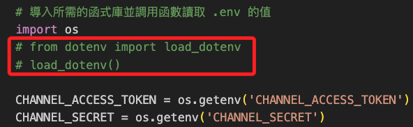

<br>

2. 在前一個小節中，若有完成輸出套件到 `requirements.txt` 文件中，這裡直接對該文件進行修改，保留必要的庫即可，這是會在雲端進行部署的項目，版本號使用個人輸出時的版本無需修改。

    ```txt
    Flask==3.0.3
    line-bot-sdk==3.10.1
    Werkzeug==3.0.2
    ```

<br>

3. 修改腳本中 `app.run()` 的部分，無需配置端口。

    ```python
    if __name__ == "__main__":
        # app.run('0.0.0.0', port=5001)
        app.run()
    ```

<br>

4. 將專案部署到 Github，詳細步驟不做贅述。

    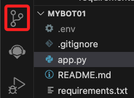

<br>

## 步驟

1. 進入 [官網](https://zeabur.com/)，點擊 `Get Started`。

    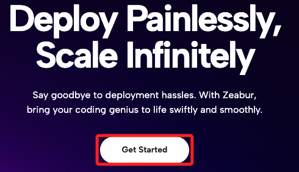

<br>

2. 建立新專案。

    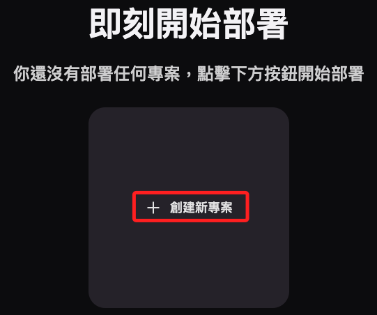

<br>

3. 選擇主機的區域。

    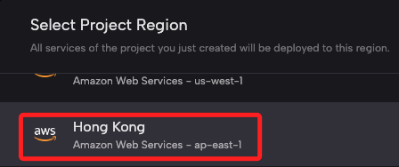

<br>

4. 點擊畫面中央部署新的服務。

    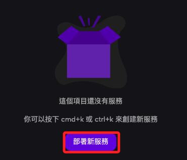

<br>

5. 選擇從 Github 部署。

    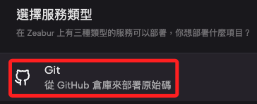

<br>

6. 選擇專案。

    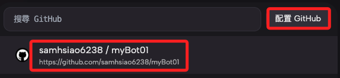

<br>

7. 展開環境變數，分別輸入 Token 及 Secret。

    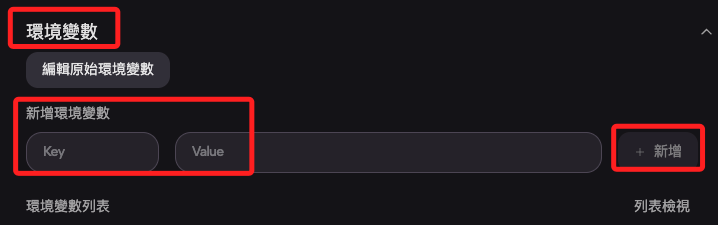

<br>

8. 完成時會看到兩個新的環境參數。

    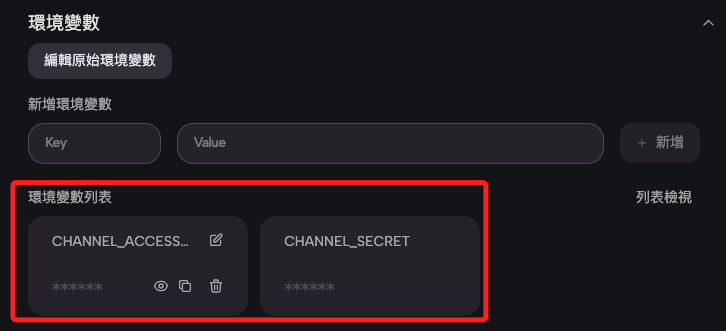

<br>

9. 展開 `網路` 生成新的域名。

    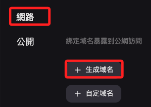

<br>

10. 輸入自訂的域名，注意下方是否顯示 `Domain is available`，然後點擊建立 `Create Domain`。

    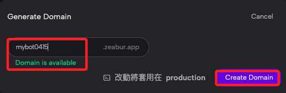

<br>

11. 上方顯示在重啟服務之前是暫停的，緊接著點擊重啟服務 `Restart Service`。

    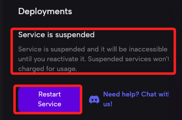

<br>

12. 這時會出現警告，無需理會。

    

<br>

13. 點擊重新部署 `Redeploy`。

    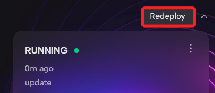

<br>

14. 左邊會顯示當前狀態。

    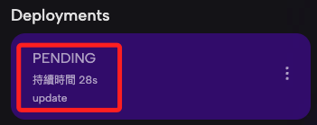

<br>

15. 可展開右邊三個小點顯示更多，並點擊 `Logs` 查看狀態。

    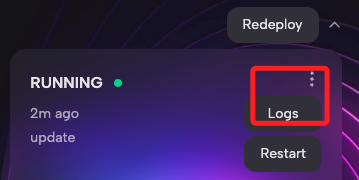

<br>

16. 上方可切換不同日誌進行查看。

    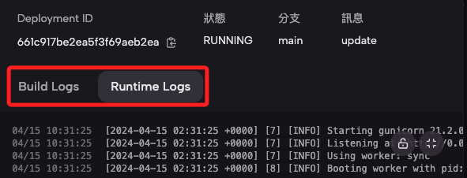

<br>

17. 完成時可點擊自訂網域名稱確認是否可以看到自訂的首頁。

    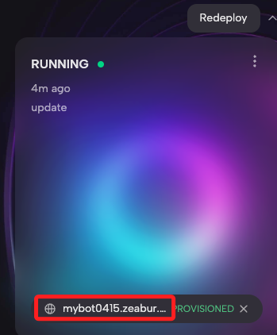

<br>

18. 看到自訂的首頁內容便表示服務已經部署完成，緊接著回到 Line 進行設置 `Webhook`。

    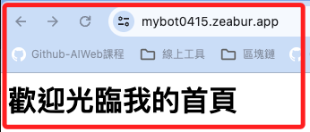

<br>

19. 展開 `網路` 進行網域複製。

    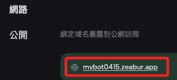

<br>

20. 在 Line 設置頁面中編輯 `Webhook`。

    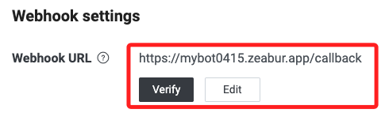

<br>

21. 點擊驗證 `Verify` 出現 `Success` 就表示完成。

    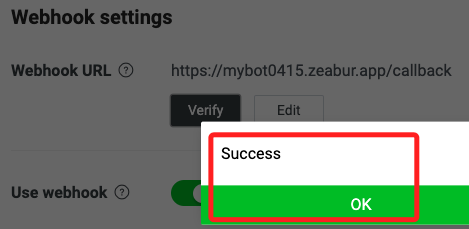

<br>

22. 分別測試寫在腳本中的判斷式。

    

<br>

___

_以上完成部署_