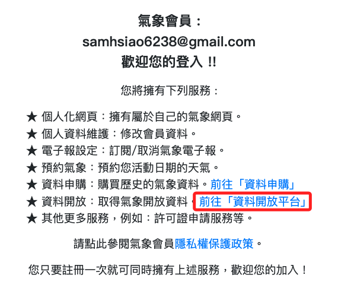
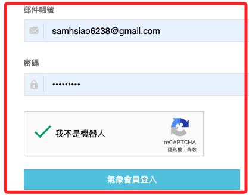
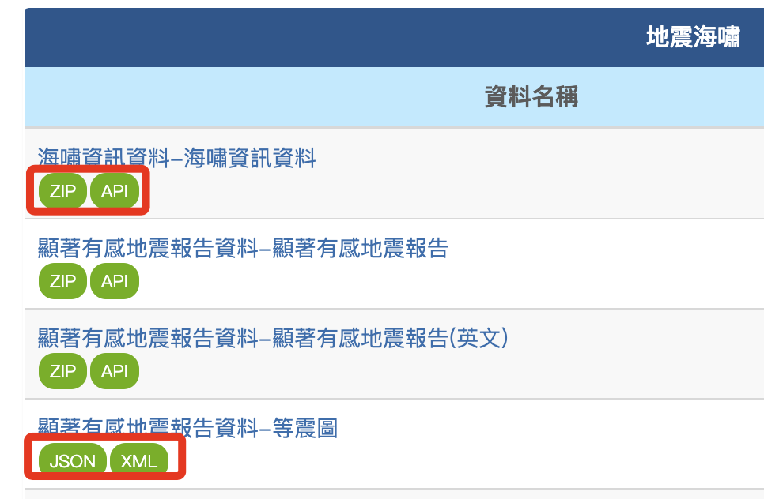
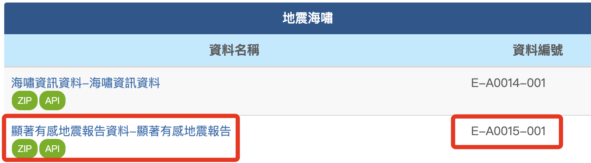
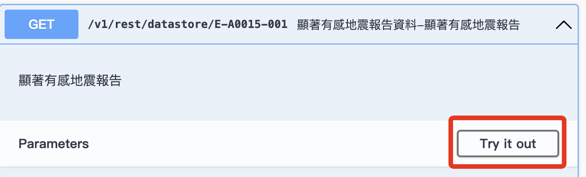
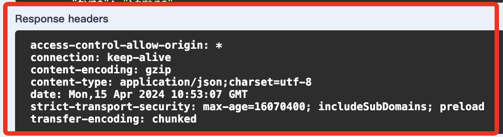

# 中央氣象署

_氣象資訊開放平台_

 

##

1. 開啟 [官網登入網址](https://opendata.cwa.gov.tw/userLogin)。

 

2. 第一次使用點擊 `加入會員`。

    

 

3. 點擊 `同意`。
    
    

 

4. 自訂密碼。

    

 

5. 通過郵件驗證之後成為正式會員。

    

 

6. 前往平台。

    

 

7. 進行登入。

    

 

8. 取得授權碼並儲存。

    

 

9. 選取主題，如 `地震海嘯`。

    

 

10. 可看出提過的資料有四種型態：`ZIP`、`API`、`JSON`、`XML`。

    

 

## API

1. 假如想查詢 `E-A0015-001`。

   
2. 展開 _開發指南_ 並點擊 _資料擷取 API 線上說明文件_。

    

 

3. 搜尋關鍵字並點擊展開。

    

 

4. 點擊 `Try it out`。

    

 

5. 填入個人的 `授權碼`。

    

 

6. 全部使用預設值，點擊下方的執行 `Execute`。

    

 

7. 接著會提供兩行語法，分用兩種模式開啟網址瀏覽。

    

 

8. 透過服務器的回應可以觀察所取得的資訊內容。

    

 

9. 下方也提供了 _Response header_ 的內容。

    

 

10. 將上面的網址用瀏覽器開啟，並點擊 `美化排版`。

    

 

___

 

_以上確認 API 可以取得資訊。_