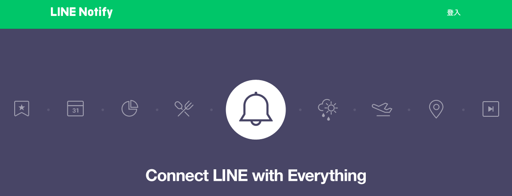
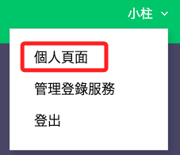
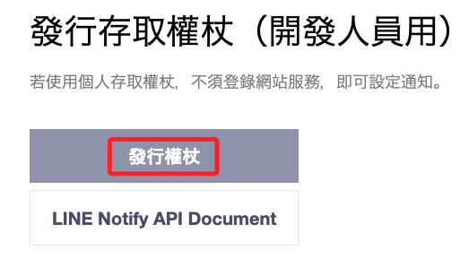
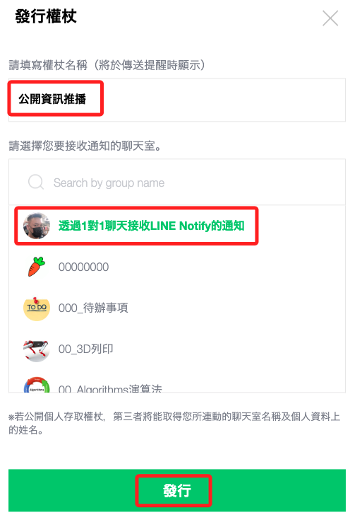
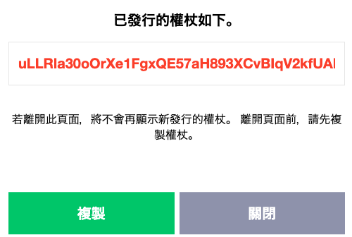
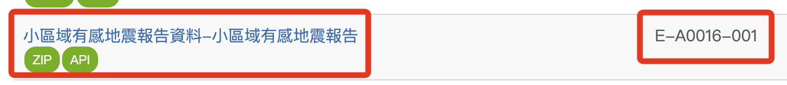
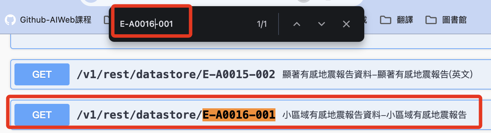
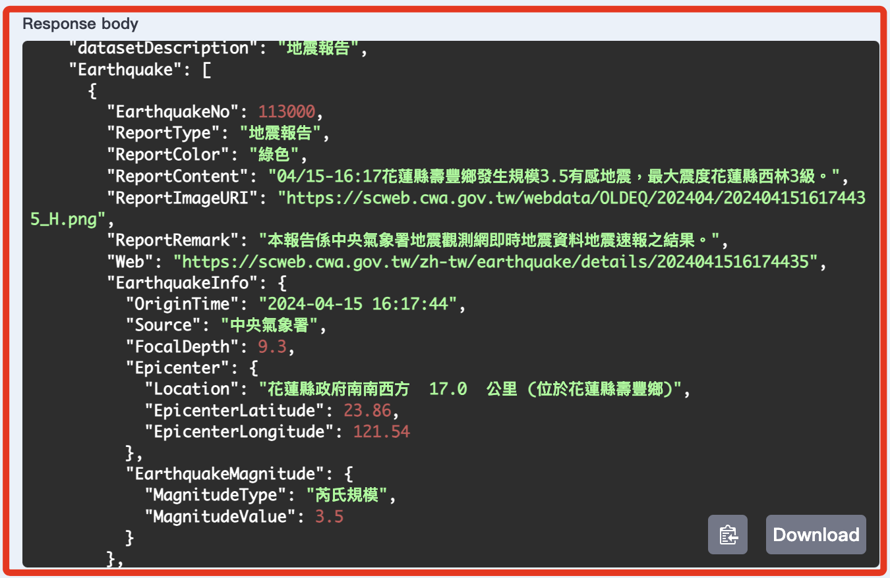
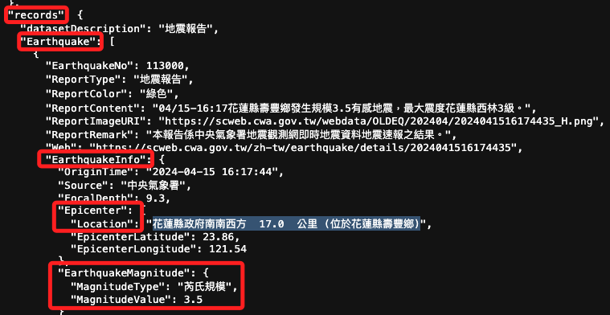
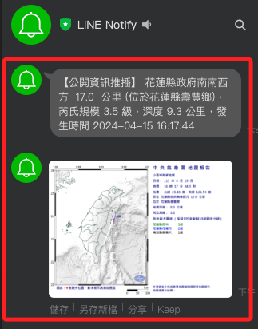

# Line 通知

_解析 API 的資訊並推播給指定使用者。_

<br>

## 說明

1. 進入 [Line 通知官網](https://notify-bot.line.me/zh_TW/)。
   
    

<br>

2. 點擊 _登入_ 並使用個人的 Line 帳號進行完成登入。

   

<br>

3. 進入個人頁面。

   

<br>

4. 滾動到下方，點擊 `發行權杖` 。

   

<br>

5. 自訂一個權杖名稱，這裡示範的是 `公開資訊推播`，並選擇要推播的對象，接著點擊 _發行_。

   

<br>

6. 複製並保存權杖，特別注意， _這個權杖之後是無法查詢的_。

    

<br>

## 建立腳本

1. 這次使用 _地震海嘯_ 中的 _小區域有感地震資訊_，資料編號是 `E-A0016-001` 。

    

<br>

2. 同樣搜尋後展開。

    

<br>

3. 點擊 `Try it out` 後輸入授權碼，並點擊 `Execute` 查看結果。

    

<br>

4. 紀錄所提供的 Request URL 網址。

    ```python
    url = 'https://opendata.cwa.gov.tw/api/v1/rest/datastore/E-A0016-001?Authorization=<這會是個人的授權碼>'
    ```

<br>

1. 透網瀏覽器觀察 JSON 內容，確認腳本中該透過哪些 _key_ 來取得所對應的資料，假設想取得 _位置、強度、深度與時間_，並將 _圖片_ 傳給指定用戶。

    

<br>

6. 完整腳本。

    ```python
    # 導入庫
    import requests
    # 使用 dotenv 處理敏感資訊
    import os
    from dotenv import load_dotenv
    load_dotenv()

    # API 及 LineNotify Token
    WEATHER_API_TOKEN = os.getenv('WEATHER_API_TOKEN')
    LINE_NOTIFY_TOKEN = os.getenv('LINE_NOTIFY_TOKEN')


    # 使用 API endpoint 以及授權
    url = f"https://opendata.cwa.gov.tw/api/v1/rest/datastore/E-A0016-001?Authorization={WEATHER_API_TOKEN}"

    # 從 API 取得資料
    response = requests.get(url)
    data_json = response.json()

    # 取出資料
    earthquakes = data_json["records"]["Earthquake"]

    # Process only the first earthquake data
    if earthquakes:
        # 使用最近一筆資料（第一筆）
        earthquake = earthquakes[0]
        # 位置
        loc = earthquake["EarthquakeInfo"]["Epicenter"]["Location"]
        # 強度
        val = earthquake["EarthquakeInfo"]["EarthquakeMagnitude"]["MagnitudeValue"]
        # 深度
        dep = earthquake["EarthquakeInfo"]["FocalDepth"]
        # 時間
        eq_time = earthquake["EarthquakeInfo"]["OriginTime"]
        # 圖片
        img = earthquake["ReportImageURI"]
        # 組合以上資訊作為訊息
        msg = f"{loc}，芮氏規模 {val} 級，深度 {dep} 公里，發生時間 {eq_time}"

        # LINE Notify token
        token = LINE_NOTIFY_TOKEN
        # LINE Notify Authorization header
        headers = {"Authorization": "Bearer " + token}
        payload = {
            # 訊息內容
            "message": msg,
            # 縮圖
            "imageThumbnail": img,
            # 完整圖片
            "imageFullsize": img,
        }

        # 發送通知
        notify_response = requests.post(
            "https://notify-api.line.me/api/notify", headers=headers, data=payload
        )

        # 輸出 code 及內容供查看
        print(
            notify_response.status_code,
            notify_response.text
        )

    else:
        # 假如沒有資料
        print("沒有取得地震資訊")
    ```

<br>

7. 運行腳本後，指定用戶將收到推播。

    

<br>

___

_以上完成 Line 通知。_