# 政府資訊開放平台

<br>

## 說明

1. 開啟 [官方首頁](https://data.gov.tw/)。

<br>

2. 點擊右上角 `會員登入`。

    

<br>

3. 使用 `Google` 。

    

<br>

4. 登入會顯示 `無此頁面`。

    

<br>

5. 所以要使用 `我的 E 政府`。

    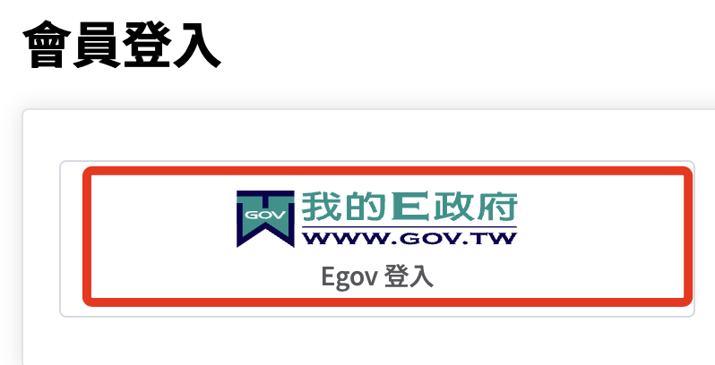

<br>

6. 進入後一樣使用 `Google`。

    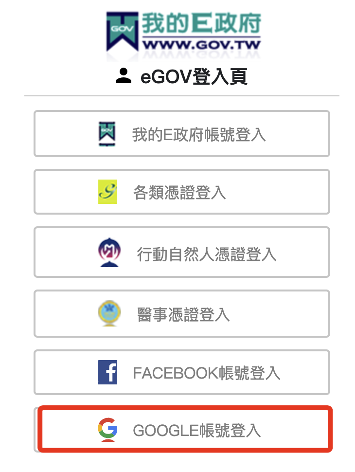

<br>

7. 假如是第一次使用，點擊 `加入會員`。
    
    

<br>

8. 填妥相關欄位之後點擊 `建立我的帳戶`。

    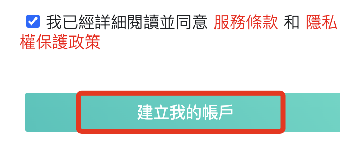

<br>

9. 輸入前面步驟建立的帳號密碼，然後再次進行登入即可，這裡省略詳細說明。

    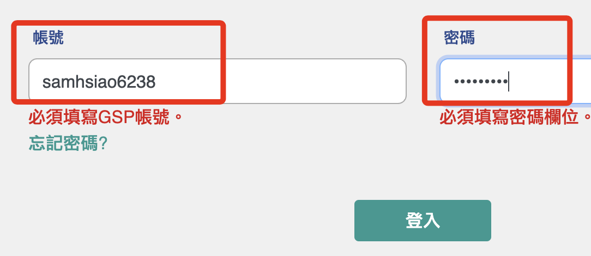

<br>

## 空氣品質 AQI

1. 關鍵字搜尋。

    

<br>

2. 使用每小時的空氣品質數據。

    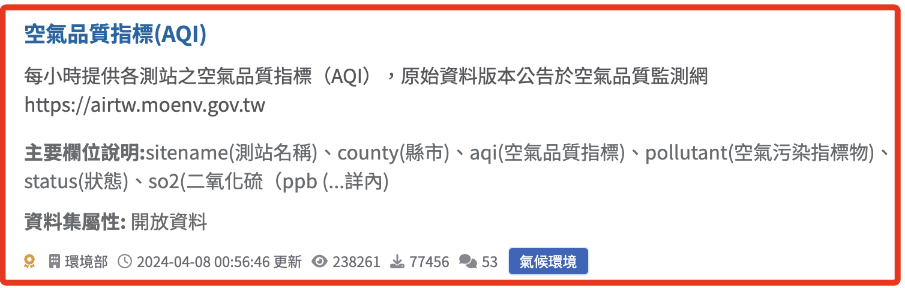

<br>

3. 查看。

    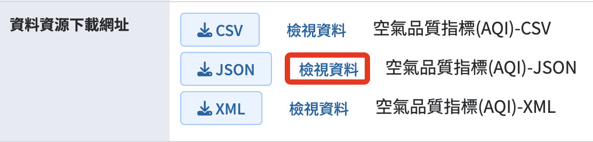

<br>

4. 可觀察 _欄位_ 以及 _網址_。

    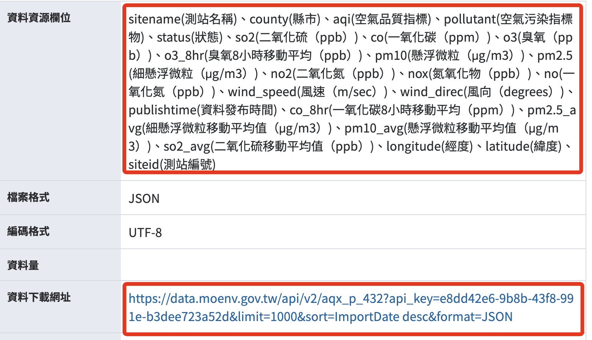

<br>

5. 其中包含了 `API Key`，但這是每個人都共用的，並非敏感資訊，無需遮蔽。

    ```python
    https://data.moenv.gov.tw/api/v2/aqx_p_432?api_key=e8dd42e6-9b8b-43f8-991e-b3dee723a52d&limit=1000&sort=ImportDate desc&format=JSON
    ```

<br>

6. 點擊 `JSON` 查看資料格式。

    

<br>

7. 可看出資料是在 `records` 之內。

    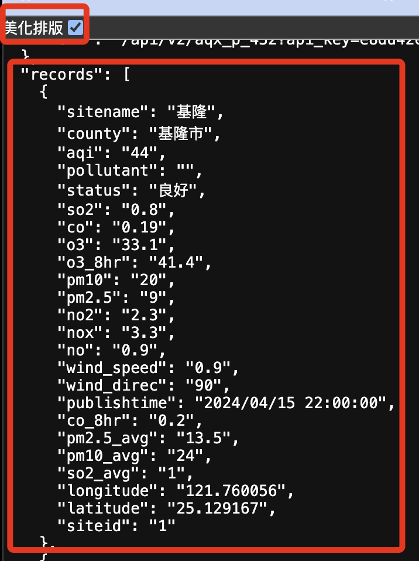 

<br>

8. 使用腳本將資料讀取並存入 Excel。

    ```python
    import requests
    import pandas as pd

    # API 網址
    url = 'https://data.moenv.gov.tw/api/v2/aqx_p_432?api_key=e8dd42e6-9b8b-43f8-991e-b3dee723a52d&limit=1000&sort=ImportDate desc&format=JSON'

    # 使用 requests 從 API 獲取數據
    response = requests.get(url)
    data = response.json()

    # 提取數據欄位並轉換成 pandas DataFrame
    # 數據在 data['records'] 中
    df = pd.DataFrame(data['records'])

    # 定義 Excel 文件名稱
    excel_filename = 'AQI.xlsx'

    # 將 DataFrame 儲存為 Excel 文件
    df.to_excel(excel_filename, index=False)
    print(f'數據已儲存為 {excel_filename}')

    # 輸出
    print(df)

    ```

<br>

## 地圖

_使用 folium 庫顯示數據在地圖上_

<br>

1. 完整腳本。

    ```python
    import requests
    import pandas as pd
    import folium

    # API 網址
    url = 'https://data.moenv.gov.tw/api/v2/aqx_p_432?api_key=e8dd42e6-9b8b-43f8-991e-b3dee723a52d&limit=1000&sort=ImportDate desc&format=JSON'

    # 使用 requests 從 API 獲取數據
    response = requests.get(url)
    data = response.json()

    # 提取數據欄位並轉換成 pandas DataFrame
    df = pd.DataFrame(data['records'])

    # 將 AQI 從 string 轉換為數字 (因為 API 可能返回字符串)
    df['aqi'] = pd.to_numeric(df['aqi'], errors='coerce')

    # 建立一個地圖對象，並以台灣的大概中心點作為中心
    m = folium.Map(location=[23.5, 121], zoom_start=7)

    # 為每個站點添加標記
    for index, row in df.iterrows():
        # 根據 AQI 值選擇顏色
        if row['aqi'] <= 50:
            color = 'green'
        elif row['aqi'] <= 100:
            color = 'yellow'
        elif row['aqi'] <= 150:
            color = 'orange'
        elif row['aqi'] <= 200:
            color = 'red'
        else:
            color = 'purple'

        # 確保經度和緯度是有效的
        if pd.notnull(row['latitude']) and pd.notnull(row['longitude']):
            folium.CircleMarker(
                location=[row['latitude'], row['longitude']],
                radius=5,
                color=color,
                fill=True,
                fill_color=color,
                fill_opacity=0.6,
                popup=f"{row['sitename']}: AQI={row['aqi']}"
            ).add_to(m)

    # 保存地圖為 HTML 文件
    m.save('AirQualityMap.html')
    print("地圖已生成並保存為 AirQualityMap.html")

    ```

<br>

2. 在 VSCode 中透過 Live Server 觀察。

    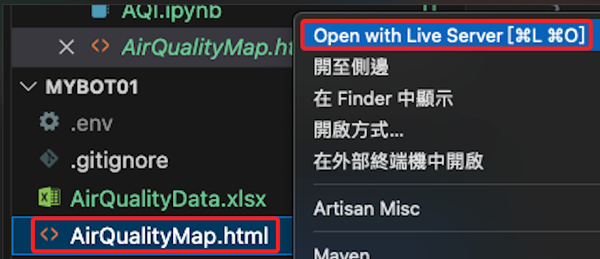

<br>

3. 成果圖。

    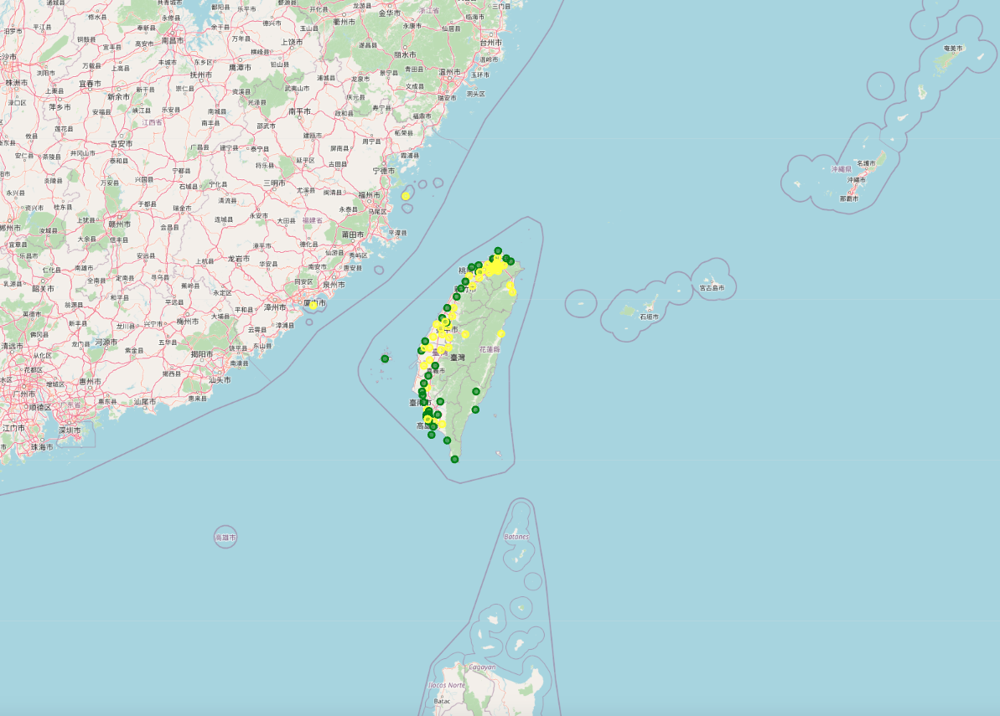

<br>

## 將地圖展示為圖片

1. 完整腳本。

    ```python
    import requests
    import pandas as pd
    import folium
    from selenium import webdriver
    from time import sleep
    # 以下用以處理圖片
    import os
    from selenium import webdriver
    from selenium.webdriver.chrome.options import Options
    from time import sleep

    # API 網址
    url = 'https://data.moenv.gov.tw/api/v2/aqx_p_432?api_key=e8dd42e6-9b8b-43f8-991e-b3dee723a52d&limit=1000&sort=ImportDate desc&format=JSON'

    # 使用 requests 從 API 獲取數據
    response = requests.get(url)
    data = response.json()

    # 提取數據欄位並轉換成 pandas DataFrame
    df = pd.DataFrame(data['records'])

    # 將 AQI 從 string 轉換為數字
    df['aqi'] = pd.to_numeric(df['aqi'], errors='coerce')

    # 建立一個地圖對象
    m = folium.Map(location=[23.5, 121], zoom_start=7)  # 台灣的大概中心點

    # 為每個站點添加標記
    for index, row in df.iterrows():
        if row['aqi'] <= 50:
            color = 'green'
        elif row['aqi'] <= 100:
            color = 'yellow'
        elif row['aqi'] <= 150:
            color = 'orange'
        elif row['aqi'] <= 200:
            color = 'red'
        else:
            color = 'purple'
        
        if pd.notnull(row['latitude']) and pd.notnull(row['longitude']):
            folium.CircleMarker(
                location=[row['latitude'], row['longitude']],
                radius=5,
                color=color,
                fill=True,
                fill_color=color,
                fill_opacity=0.6,
                popup=f"{row['sitename']}: AQI={row['aqi']}"
            ).add_to(m)

    # 保存地圖為 HTML 文件
    m.save('AirQualityMap.html')

    '''儲存為圖片'''
    # 獲取當前工作目錄
    current_path = os.getcwd()
    # HTML 文件的絕對路徑
    html_file_path = 'file://' + os.path.join(current_path, 'AirQualityMap.html')

    # 建立瀏覽選項
    options = Options()
    # 無頭模式
    options.add_argument('--headless')
    # 禁用通知
    options.add_argument("--disable-notifications")

    # 建立 Chrome WebDriver 實例
    driver = webdriver.Chrome(options=options)

    try:
        # 載入本地 HTML 文件
        driver.get(html_file_path)
        # 等待一點時間讓文件載入
        sleep(3)

        # 螢幕截圖
        driver.save_screenshot('AirQualityMap.png')
        print("螢幕截圖已保存圖片 AirQualityMap.png")
    finally:
        # 關閉瀏覽器
        driver.quit()

    ```

<br>

2. 會輸出一張圖片。

    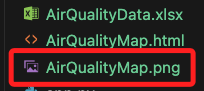

<br>

3. 圖片展示。

    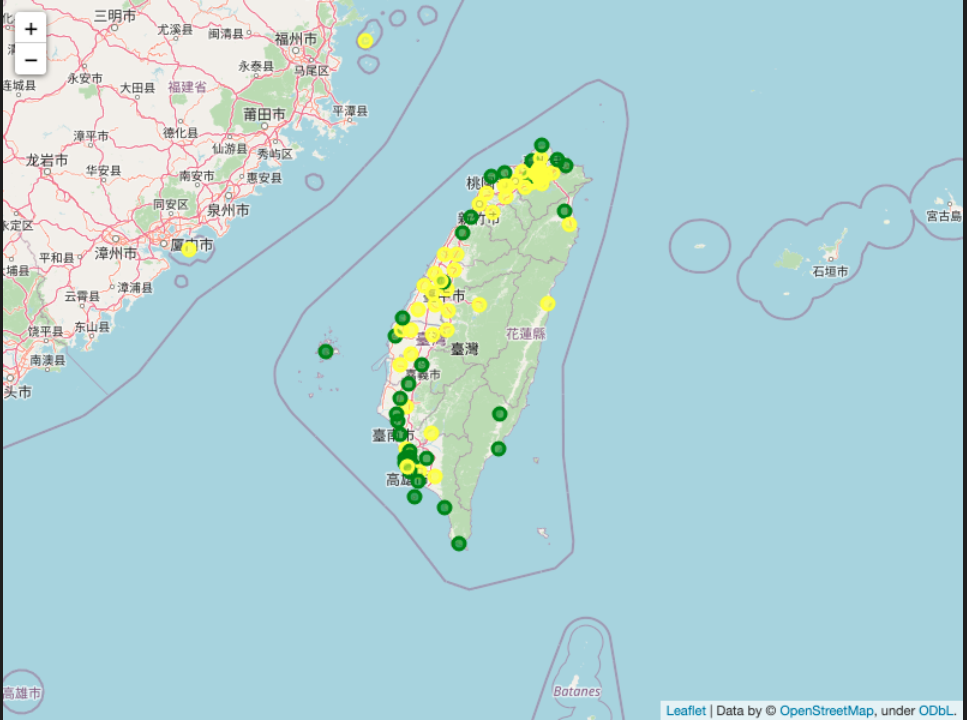

<br>

___

<br>

_END_