# 起手式

1. _Ollama_ 是一個開源軟體，可以在自己的硬體上運行的大型語言模型（`LLM`）服務。

2. 支援多種作業系統，也提供了 Docker 運行。

3. `Ollama` 將 `模型權重`、`配置` 和 `數據` 打包成一個由 `Modelfile` 定義的單一包，優化了設置和配置細節，包括 GPU 的使用。

<br>

## 參考資料

1. [官網](https://ollama.com/)。 

    

<br>

2. 建立帳號。 

    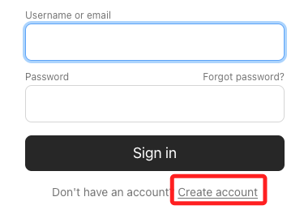

<br>

3. 參考 `LangChain` 的 [官網說明](https://python.langchain.com/v0.1/docs/integrations/llms/ollama/)。

    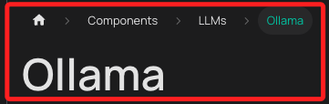

<br>

4. [下載](https://ollama.com/download/mac)

    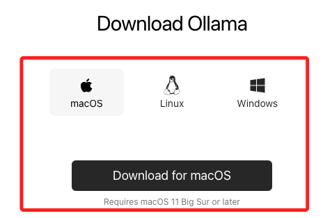

<br>

## 設置

_以下步驟設置並運行本地的 Ollama 實例_

<br>

1. [下載](https://ollama.com/download/mac) 並安裝 Ollama 到支持的平台。

<br>

2. 解壓縮。

    

<br>

3. 開啟應用。

    

<br>

4. 安裝。

    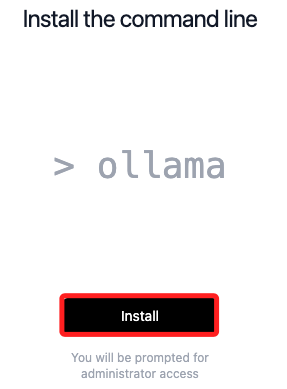

<br>

5. 完成。

    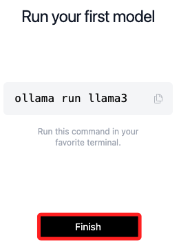

<br>

6. 運行。

    ```bash
    ollama run llama3
    ```

<br>

7. 會開始進行下載。

    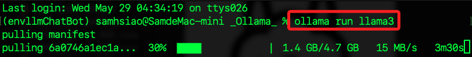

<br>

8. 完成後會顯示。

    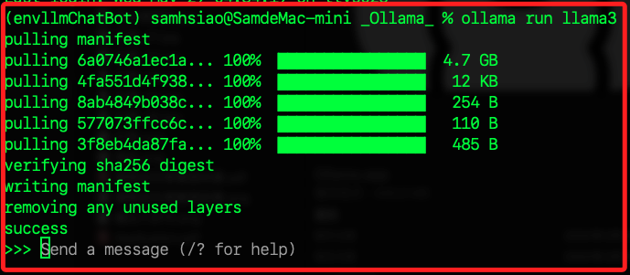

<br>

9. 可直接在終端機進行互動。

    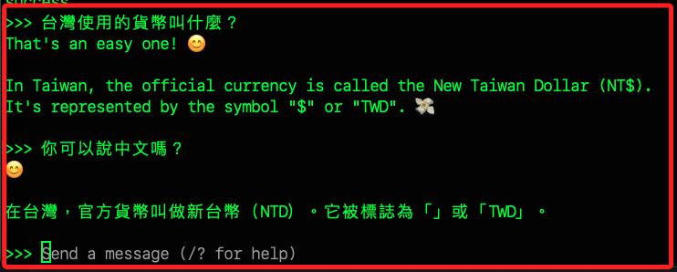

<br>

## 終端機操作

1. 運行模型，如果模型尚未下載，會自動先進行下載，然後再運行；透過這個指令運行會先進行 `pulling manifest`，`manifest` 是模型的描述文件，包含模型的版本、依賴關係、大小等信息，這需要花一點時間。

    ```bash
    ollama run llama3
    ```

<br>

2. 下載 LLM 模型，執行指令後會將模型文件被保存在系統中，使其可以隨時被調用和使用；另外，`llama3` 屬於 `LLaMA` 聊天模型，啟動後可以使用 `ChatOllama` 界面，這包括系統消息和用戶輸入的特殊標記。

    ```bash
    ollama pull llama3
    ```

    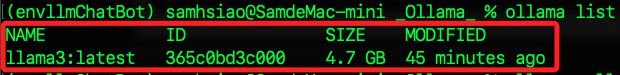

<br>

3. 假如要下載完整的 40GB 模型，可加入參數 `70b`。

    ```bash
    ollama pull llama3:70b
    ```

    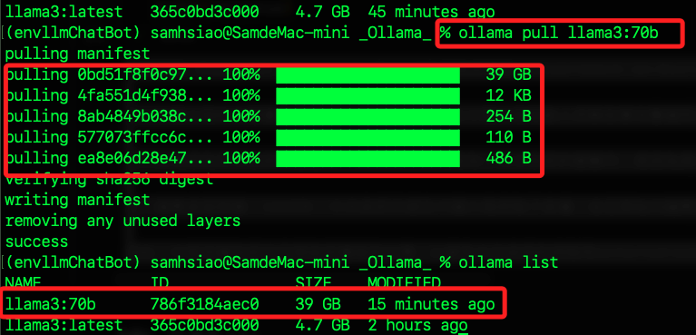

<br>

4. 列出本地下載的模型列表。

    ```bash
    ollama list
    ```

<br>

5. 運行中的模型。

    ```bash
    ollama ps
    ```

<br>

6. 停止並刪除運行中的模型，特別注意，這個指令不僅僅是關閉模型，還會徹底將模型從本地刪除。

    ```bash
    ollama rm <模型名稱>
    ```

<br>

7. 查詢下載路徑，模型預設會下載標記為 `最新` 和 `最小` 參數大小的版本，在 Mac 上，模型將下載到 `~/.ollama/models`。

    ```bash
    ls ~/.ollama/models
    ```

<br>

## 模型互動方式

1. 終端機：所有本地模型會自動在端口 `localhost:11434` 啟動服務，透過終端機指令 `ollama run <模型名稱>` 可進行互動。

    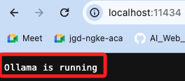

<br>

2. 使用 API：可透過如下指令向 Ollama 的 API 端點發送 `application/json` 請求。
    ```bash
    curl http://localhost:11434/api/generate -d '{
    "model": "llama3",
    "prompt":"Why is the sky blue?"
    }'
    ```

<br>

3. 通過 LangChain：可在 Python 專案中結合 LangChain 使用 Ollama 聊天模型。

    ```python
    from langchain_community.llms import Ollama

    llm = Ollama(model="llama3")
    llm.invoke("Tell me a joke")
    ```

<br>

4. 流式輸出：在專案中使用 `.stream(...)` 方法。

    ```python
    query = "Tell me a joke"
    for chunks in llm.stream(query):
        print(chunks)
    ```

<br>

5. 多模態支持：`Ollama` 支持多模態 `LLMs`，如 `Bakllava` 和 `Llava`。

    ```python
    from langchain_community.llms import Ollama

    bakllava = Ollama(model="bakllava")
    ```

<br>

## 開發指引

_通過以下步驟來集成 Ollama 和 LangChain_

<br>

1. 設置環境：下載並配置需要的模型。

<br>

2. 整合模型到 LangChain，使用 LangChain 提供的 API 方法與模型進行互動，如 `invoke` 和 `stream`。

<br>

3. 程式碼

    ```python
    from langchain_community.llms import Ollama

    # 初始化模型
    llm = Ollama(model="llama3")

    # 直接調用模型
    response = llm.invoke("請說明中華民國為何退居台灣？請以繁體中文回答。")
    print(response)

    # 流式輸出
    query = "Tell me a joke"
    for chunk in llm.stream(query):
        print(chunk)
    ```

<br>

4. 結果。

    ```bash
    中華民國（Republic of China）於1949年將政府遷座（Government-in-Exile）到台灣，是因為以下幾個原因：

    一、中國大陸的共產黨政府建立：1949年，中共在中國大陸發動人民解放軍攻擊國民黨政權，導致國民黨政府敗退。這時候，中華民國政府認為自己已經失去大陸政權的控制權，因此決定將政府遷座到台灣。

    二、台灣成為民主政府的避難所：1949年，台灣成為了民主政府的避難所，是因為美國和其他西方國家認為台灣是自由世界的最後堡壘。這些國家希望中華民國政府能夠在台灣繼續存在，以抗衡共產黨中國大陸的影響。

    三、國際承認問題：1949年，中共政府已經在中國大陸控制了政權，並且開始向國際社會展開外交活動。這時候，中華民國政府感到自己的國際地位受到威脅，因為許多國家開始承認中共政府，而不是中華民國政府。

    因此，中華民國政府決定將政府遷座到台灣，以避免中共政府的控制和international recognition問題。這個決定的結果就是中華民國政府在1949年將政府遷座到台灣，並且繼續存在為一個國際社會承認的政府。
    ```

<br>

## 流式輸出

1. 將大型數據集或訊息分批處理和傳送，而不是一次性傳輸全部數據，這在處理大規模數據或需要實時輸出的情況下非常有用，因為它可以減少延遲並提高性能。

<br>

2. 在以上的腳本中使用 `llm.stream(query)` 代表從一個大型語言模型（如 `llm`）進行查詢，並以 `流` 的形式 `逐塊接收回應`，也就是切割為小塊逐個傳輸和處理數據，而不是一次性接收整個回應，如此可在傳輸的同時繼續處理數據，從而減少等待時間。

<br>

3. 範例程式碼。

    ```python
    # 流式輸出
    query = "請以繁體中文說明當前國際金融局勢。"

    # 向語言模型發送查詢，並請求以流的形式返回結果
    for chunk in llm.stream(query):
        print(chunk)
    ```

<br>

4. 輸出。

    ```bash
    **
    202
    3
    年
    的
    國際
    金融
    局
    勢
    **


    在
    
    202
    2
    年
    末
    ，
    全球
    經
    濟
    面
    臨
    著
    # 以下省略 ...
    ```

<br>

___

_END_