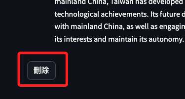

# 簡易專案

<br>

## 說明

1. 先直接上程式碼。

    ```python
    import streamlit as st
    from langchain_community.llms import Ollama

    # 初始化 Ollama 模型
    ollama_model = Ollama(model="llama3")

    # Streamlit 應用配置
    st.title("Ollama 聊天機器人")
    st.write("這是一個使用 Streamlit 和 Ollama 的聊天機器人應用。")

    # 聊天輸入框
    user_input = st.text_input("你：", "")

    # 聊天歷史記錄
    # 初次使用會建立狀態鍵
    if "chat_history" not in st.session_state:
        st.session_state["chat_history"] = []

    # 當用戶輸入消息後，進行處理
    if user_input:
        with st.spinner("Ollama 正在生成回應..."):
            response = ""
            # 建立一個站位符
            response_container = st.empty()
            # 加上以繁體中文回答的前綴，僅作為提問但不要紀錄
            _q = f'請以繁體中文回答 {user_input}'
            for chunk in ollama_model.stream(_q):
                response += chunk
                # 逐行打印
                response_container.write(
                    f"**Ollama**: {response}"
                )
            # 添加紀錄
            st.session_state["chat_history"].append((user_input, response))
            # 重置輸入框
            user_input = ""

    # 在下方顯示聊天歷史記錄，不用包含最後一次對話
    # 因為最後一次對話會顯示在流式對話中
    for user_msg, bot_msg in st.session_state["chat_history"]:
        st.write(f"**你**: {user_msg}")
        st.write(f"**Ollama**: {bot_msg}")

    # 清除聊天歷史記錄的按鈕
    if st.button("清除聊天歷史記錄"):
        st.session_state["chat_history"] = []

    # 添加在終端打印的代碼
    print(f"用戶輸入: {user_input}")
    ```

<br>

2. 這個腳本存在諸多邏輯錯誤，這裡不列舉，以下是添加側邊欄位，並添加一個刪除本次對話的按鈕。

    ```python
    import streamlit as st
    from langchain_community.llms import Ollama

    # 初始化 Ollama 模型
    ollama_model = Ollama(model="llama3")

    # Streamlit 應用配置
    st.title("Ollama 聊天機器人")
    st.write("這是一個使用 Streamlit 和 Ollama 的聊天機器人應用。")

    # 初始化状态
    if "show_history" not in st.session_state:
        st.session_state["show_history"] = False

    # 側邊欄
    with st.sidebar:
        button_text = "關閉歷史對話" if st.session_state["show_history"] else "顯示歷史對話"
        if st.button(
            button_text,
            on_click=lambda: st.session_state.update(
                show_history=not st.session_state["show_history"], user_input=""
            ),
        ):
            pass
    # 聊天歷史記錄
    if "chat_history" not in st.session_state:
        st.session_state["chat_history"] = []

    # 當用戶點擊顯示歷史對話按鈕時，僅顯示歷史對話
    if st.session_state["show_history"]:
        st.write("歷史對話：")
        for user_msg, bot_msg in st.session_state["chat_history"]:
            st.write(f"**你**: {user_msg}")
            st.write(f"**Ollama**: {bot_msg}")
    else:
        # 聊天輸入框
        last_user_input = (
            st.session_state["chat_history"][-1][0]
            if st.session_state["chat_history"]
            else ""
        )
        last_response = (
            st.session_state["chat_history"][-1][1]
            if st.session_state["chat_history"]
            else ""
        )

        # 添加一個 key
        # user_input = st.text_input("你：", value=last_user_input, key="user_input")
        user_input = st.text_input("你：", key="user_input")

        # 當用戶輸入消息後，進行處理
        if user_input and (
            not st.session_state["chat_history"] or user_input != last_user_input
        ):
            with st.spinner("Ollama 正在生成回應..."):
                response = ""
                response_container = st.empty()
                _q = f"請以繁體中文回答 {user_input}"
                for chunk in ollama_model.stream(_q):
                    response += chunk
                    response_container.write(f"**Ollama**: {response}")
                # 添加紀錄
                st.session_state["chat_history"].append((user_input, response))

        # 在下方顯示聊天歷史記錄，不包含最後一次對話
        if st.session_state["chat_history"]:
            print("顯示聊天歷史記錄，不包含最後一次對話")
            # 排除最後一次對話
            for user_msg, bot_msg in reversed(st.session_state["chat_history"][:-1]):
                st.write(f"**你**: {user_msg}")
                st.write(f"**Ollama**: {bot_msg}")

        # 清除本次對話的按鈕，在流式輸出完成後顯示
        if st.session_state["chat_history"] and user_input == last_user_input:
            if st.button("清除本次對話", key="clear_last"):
                if st.session_state["chat_history"]:
                    st.session_state["chat_history"].pop()
                    st.experimental_rerun()

    # 添加在終端打印的代碼
    print(f"用戶輸入: {st.session_state.get('user_input', '')}")
    ```

<br>

3. 使用 `with st.chat_message("角色")`。

    ```python
    import streamlit as st
    from langchain_community.llms import Ollama

    # 初始化 Ollama 模型
    ollama_model = Ollama(model="llama3")

    # Streamlit 應用配置
    st.title("Ollama 聊天機器人")
    st.write("這是一個使用 Streamlit 和 Ollama 的聊天機器人應用。")

    # 初始化状态
    if "show_history" not in st.session_state:
        st.session_state["show_history"] = False

    # 側邊欄
    with st.sidebar:
        button_text = "關閉歷史對話" if st.session_state["show_history"] else "顯示歷史對話"
        if st.button(
            button_text,
            on_click=lambda: st.session_state.update(
                show_history=not st.session_state["show_history"], user_input=""
            ),
        ):
            if not st.session_state["show_history"]:
                st.session_state["chat_history_display"] = []
    # 聊天歷史記錄
    if "chat_history" not in st.session_state:
        st.session_state["chat_history"] = []

    # 當用戶點擊顯示歷史對話按鈕時，僅顯示歷史對話
    if st.session_state["show_history"]:
        # 高亮
        st.markdown("## 歷史對話")
        for user_msg, bot_msg in st.session_state["chat_history"]:
            # 添加
            with st.chat_message("user"):
                st.write(f"{user_msg}")
            with st.chat_message("assistant"):
                st.write(f"{bot_msg}")
    else:
        # 聊天輸入框
        last_user_input = (
            st.session_state["chat_history"][-1][0]
            if st.session_state["chat_history"]
            else ""
        )
        last_response = (
            st.session_state["chat_history"][-1][1]
            if st.session_state["chat_history"]
            else ""
        )

        # 添加一個 key
        with st.chat_message("user"):
            input_placeholder = st.empty()
            user_input = st.text_input(
                "用戶提問輸入",
                key="user_input",
                placeholder="請輸入問題 ...",
                # 為了標籤不要佔位，直接把標收收起來
                label_visibility="collapsed",
            )

        # 當用戶輸入消息後，進行處理
        if user_input and (
            not st.session_state["chat_history"] or user_input != last_user_input
        ):
            with st.spinner("Ollama 正在生成回應..."):
                with st.chat_message("assistant"):
                    response = ""
                    response_container = st.empty()
                    _q = f"請以繁體中文回答 {user_input}"
                    for chunk in ollama_model.stream(_q):
                        response += chunk
                        response_container.write(f"{response}")
                # 添加紀錄
                st.session_state["chat_history"].append((user_input, response))
                # 只有在這裡顯示清除按鈕，確保輸出完成後顯示
                if st.button(
                    "清除本次對話",
                    key="clear_last",
                    on_click=lambda: st.session_state.update(
                        chat_history=st.session_state["chat_history"][:-1], user_input=""
                    ),
                ):
                    pass

    ```

<br>

4. 當前在歷史訊息的部分，由上而下是舊到新，應該要轉過來。

    ```python
        # 透過 `reversed` 由新到舊排序
        for user_msg, bot_msg in reversed(st.session_state["chat_history"]):
            # 添加
            with st.chat_message("user"):
                st.write(f"{user_msg}")
            with st.chat_message("assistant"):
                st.write(f"{bot_msg}")
    ```

<br>

5. 當前完整腳本。

    ```python
    import streamlit as st
    from langchain_community.llms import Ollama

    # 初始化 Ollama 模型
    ollama_model = Ollama(model="llama3")

    # Streamlit 應用配置
    st.title("Ollama 聊天機器人")
    st.write("這是一個使用 Streamlit 和 Ollama 的聊天機器人應用。")

    # 初始化状态
    if "show_history" not in st.session_state:
        st.session_state["show_history"] = False

    # 側邊欄
    with st.sidebar:
        button_text = "關閉歷史對話" if st.session_state["show_history"] else "顯示歷史對話"
        if st.button(
            button_text,
            on_click=lambda: st.session_state.update(
                show_history=not st.session_state["show_history"], user_input=""
            ),
        ):
            if not st.session_state["show_history"]:
                st.session_state["chat_history_display"] = []
    # 聊天歷史記錄
    if "chat_history" not in st.session_state:
        st.session_state["chat_history"] = []

    # 當用戶點擊顯示歷史對話按鈕時，僅顯示歷史對話
    if st.session_state["show_history"]:
        # 高亮
        st.markdown("## 歷史對話")
        # 透過 `reversed` 由新到舊排序
        for user_msg, bot_msg in reversed(st.session_state["chat_history"]):
            # 添加
            with st.chat_message("user"):
                st.write(f"{user_msg}")
            with st.chat_message("assistant"):
                st.write(f"{bot_msg}")
    else:
        # 聊天輸入框
        last_user_input = (
            st.session_state["chat_history"][-1][0]
            if st.session_state["chat_history"]
            else ""
        )
        last_response = (
            st.session_state["chat_history"][-1][1]
            if st.session_state["chat_history"]
            else ""
        )

        # 添加一個 key
        with st.chat_message("user"):
            input_placeholder = st.empty()
            user_input = st.text_input(
                "用戶提問輸入",
                key="user_input",
                placeholder="請輸入問題 ...",
                # 為了標籤不要佔位，直接把標收收起來
                label_visibility="collapsed",
            )

        # 當用戶輸入消息後，進行處理
        if user_input and (
            not st.session_state["chat_history"] or user_input != last_user_input
        ):
            with st.spinner("Ollama 正在生成回應..."):
                with st.chat_message("assistant"):
                    response = ""
                    response_container = st.empty()
                    _q = f"請以繁體中文回答 {user_input}"
                    for chunk in ollama_model.stream(_q):
                        response += chunk
                        response_container.write(f"{response}")
                # 添加紀錄
                st.session_state["chat_history"].append((user_input, response))
                # 只有在這裡顯示清除按鈕，確保輸出完成後顯示
                if st.button(
                    "清除本次對話",
                    key="clear_last",
                    on_click=lambda: st.session_state.update(
                        chat_history=st.session_state["chat_history"][:-1], user_input=""
                    ),
                ):
                    pass
    ```

<br>

## 刪除對話

1. 在 `每一組問答` 中添加一個刪除鍵。

    ```python
    import streamlit as st
    from langchain_community.llms import Ollama

    # 初始化 Ollama 模型
    ollama_model = Ollama(model="llama3")

    # Streamlit 應用配置
    st.title("Ollama 聊天機器人")
    st.write("這是一個使用 Streamlit 和 Ollama 的聊天機器人應用。")

    # 初始化状态
    if "show_history" not in st.session_state:
        st.session_state["show_history"] = False

    # 側邊欄
    with st.sidebar:
        button_text = "關閉歷史對話" if st.session_state["show_history"] else "顯示歷史對話"
        if st.button(
            button_text,
            on_click=lambda: st.session_state.update(
                show_history=not st.session_state["show_history"], user_input=""
            ),
        ):
            if not st.session_state["show_history"]:
                st.session_state["chat_history_display"] = []
    # 聊天歷史記錄
    if "chat_history" not in st.session_state:
        st.session_state["chat_history"] = []

    # 當用戶點擊顯示歷史對話按鈕時，僅顯示歷史對話
    if st.session_state["show_history"]:
        # 高亮
        st.markdown("## 歷史對話")
        # 透過 `reversed` 由新到舊排序
        for index, (user_msg, bot_msg) in enumerate(
            reversed(st.session_state["chat_history"])
        ):
            # 計算實際的索引
            actual_index = len(st.session_state["chat_history"]) - 1 - index
            with st.chat_message("user"):
                st.write(f"{user_msg}")
            with st.chat_message("assistant"):
                st.write(f"{bot_msg}")
            # 添加删除按钮
            if st.button(
                "刪除",
                key=f"delete_{actual_index}",
                on_click=lambda i=actual_index: st.session_state["chat_history"].pop(i),
            ):
                st.experimental_rerun()
    else:
        # 聊天輸入框
        last_user_input = (
            st.session_state["chat_history"][-1][0]
            if st.session_state["chat_history"]
            else ""
        )
        last_response = (
            st.session_state["chat_history"][-1][1]
            if st.session_state["chat_history"]
            else ""
        )

        # 添加一個 key
        with st.chat_message("user"):
            input_placeholder = st.empty()
            user_input = st.text_input(
                "用戶提問輸入",
                key="user_input",
                placeholder="請輸入問題 ...",
                # 為了標籤不要佔位，直接把標收收起來
                label_visibility="collapsed",
            )

        # 當用戶輸入消息後，進行處理
        if user_input and (
            not st.session_state["chat_history"] or user_input != last_user_input
        ):
            with st.spinner("Ollama 正在生成回應..."):
                with st.chat_message("assistant"):
                    response = ""
                    response_container = st.empty()
                    _q = f"請以繁體中文回答 {user_input}"
                    for chunk in ollama_model.stream(_q):
                        response += chunk
                        response_container.write(f"{response}")
                # 添加紀錄
                st.session_state["chat_history"].append((user_input, response))
                # 只有在這裡顯示清除按鈕，確保輸出完成後顯示
                if st.button(
                    "清除本次對話",
                    key="clear_last",
                    on_click=lambda: st.session_state.update(
                        chat_history=st.session_state["chat_history"][:-1], user_input=""
                    ),
                ):
                    pass
    ```

<br>

2. 在對話的左下角有一個 `刪除` 按鈕。

    

<br>

___

_END_