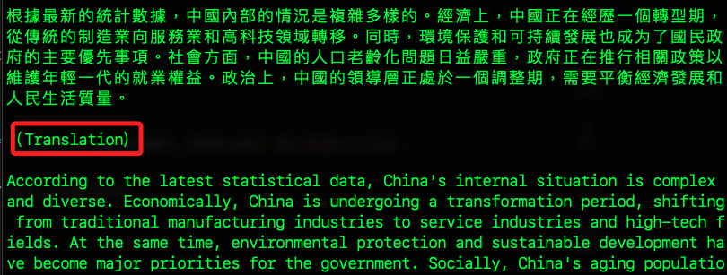

# 範例 01

_參考 [原著倉庫](https://github.com/hsleonis/llama3_qa_chatbot_mongodb)_

<br>

## 主要腳本

1. `app.py`：主程序入口，負責整合各個模組，實現聊天機器人的主邏輯。

2. `llm_strings.py`：定義了所有的 `靜態文本`，確保應用中使用的字串統一管理。

3. `mongodb.py`：封裝了 `MongoDB` 的操作，提供了資料庫互動的方法。

4. `utils.py`：提供了輔助功能，如 `消息建立`、`模型輸出生成` 和 `回應模擬` 等。

<br>

## 關於 `中文回答`

1. 為了力求機器人能以繁體中文回答，修改 `utils.py` 的 `output_text` 函數，在回答的 `prompt_template` 添加 `請以繁體中文回答：`。

    ```python
    def output_text(llm_model: Ollama, text: str) -> str:
        """
        Generates output from the LLM model.

        :param llm_model: LLM Model.
        :type llm_model: langchain.llms.Ollama
        :param text: Input text prompt.
        :type text: str

        :return: LLM output - the generated text.
        :rtype: str
        """

        prompt_template = f"{LLMStrings.PROMPT_TEMPLATE} 請以繁體中文回答： {text}"
        return llm_model(prompt_template)
    ```

<br>

2. 運行後會出現自動翻譯。

    

<br>

3. 修改前面步驟的 `prompt_template` 為

    ```python
    prompt_template = f"{LLMStrings.PROMPT_TEMPLATE} 請只以繁體中文回答： {text}"
    ```

<br>

## 關於警告 `LangChainDeprecationWarning`

1. 這個警告表明從 `langchain` 導入 `LLMs` 的方式已經過時，建議從 `langchain-community` 導入。

    ```bash
    /Users/samhsiao/Documents/PythonVenv/envllmChatBot/lib/python3.11/site-packages/langchain/llms/__init__.py:548: LangChainDeprecationWarning: Importing LLMs from langchain is deprecated. Importing from langchain will no longer be supported as of langchain==0.2.0. Please import from langchain-community instead:
    ```

<br>

2. 先安裝新模組所需套件。

    ```bash
    pip install -U langchain-community
    ```

<br>

3. 改寫程式碼導入新模組。

    ```python
    # 棄用
    # from langchain.llms import Ollama
    # 改用
    from langchain_community.llms import Ollama
    ```

<br>

## 關於警告 `BaseLLM.call` 方法已棄用

1. `BaseLLM.__call__` 方法已被棄用，建議使用 `invoke` 方法。

    ```bash
    /Users/samhsiao/Documents/PythonVenv/envllmChatBot/lib/python3.11/site-packages/langchain_core/_api/deprecation.py:119: LangChainDeprecationWarning: The method `BaseLLM.__call__` was deprecated in langchain-core 0.1.7 and will be removed in 0.3.0. Use invoke instead.
    ```

<br>

2. 修改 `output_text` 函數使用 `invoke` 方法。

    ```python
    def output_text(llm_model: Ollama, text: str) -> str:
        prompt_template = f"{LLMStrings.PROMPT_TEMPLATE} 請務必只以繁體中文回答，在你的回答中不用進行翻譯：{text}"
        return llm_model.invoke(prompt_template)
    ```

<br>

## 關於以下的警告 `UserWarning`

_UserWarning: Importing verbose from langchain root module is no longer supported. Please use langchain.globals.set_verbose() / langchain.globals.get_verbose() instead._

<br>

1. 但經查詢專案中並未導入 `verbose` 相關套件，暫時予以忽略。

<br>

___

_END_