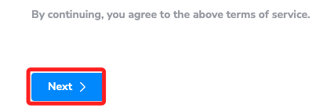
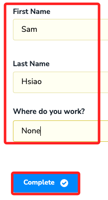
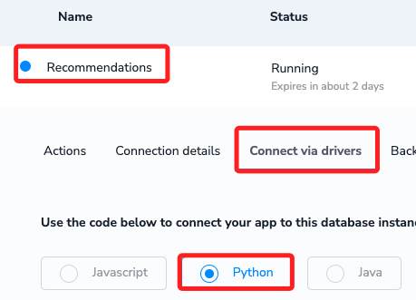
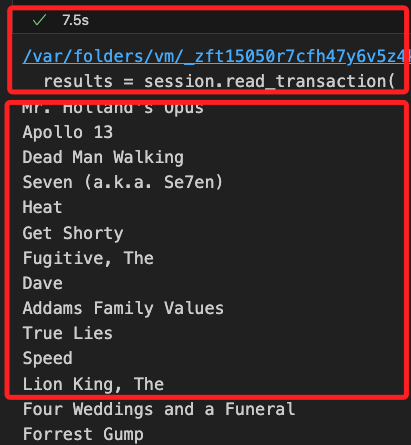

# 沙箱 Sandbox

<br>

## 說明

1. Neo4j 的 Sandbox 是一個線上平台，提供用戶一個臨時的、配置完善的 Neo4j 環境，讓用戶可以試用和學習 Neo4j 的圖形資料庫技術，而不需要在自己的機器上安裝任何軟體，很適合用於快速進行原型開發的情境。

<br>

## Sandbox

1. 登入 [平台網址](https://sandbox.neo4j.com/onboarding) 開始使用。

    

<br>

2. 任意輸入，按下 `Complete`。

    

<br>

3. 依序點擊名稱 `Recommendations`、`Connect via drivers`、`Python`。

    

<br>

## 建立虛擬環境

1. 建立並啟動虛擬環境。

    ```bash
    python -m venv neo4j0514
    ```

<br>

2. 安裝套件。

    ```bash
    pip install neo4j-driver
    ```

<br>

3. 複製下方的腳本：這個腳本是由 [Sandbox](https://sandbox.neo4j.com/) 所提供的範例。

    ```python
    # 導入庫
    from neo4j import GraphDatabase, basic_auth
    # 建立驅動器：URL、帳號、密碼
    driver = GraphDatabase.driver(
        "neo4j://3.89.23.242:7687",
        auth=basic_auth("neo4j", "stencil-interface-buckets")
    )
    # 定義 Cypher 查詢
    cypher_query = """
    MATCH (m:Movie {title:$movie})<-[:RATED]-(u:User)-[:RATED]->(rec:Movie)
    RETURN distinct rec.title AS recommendation LIMIT 20
    """
    # 上下文管理
    with driver.session(database="neo4j") as session:
        # 
        results = session.read_transaction(
            # 匿名函數接收 read_transaction 所傳遞的 session 對象
            # 並透過 tx 調用 run() 來執行 Cypher 語法
            lambda tx: tx.run(cypher_query, movie="Crimson Tide").data()
        )
        for record in results:
            print(record["recommendation"])

    driver.close()
    ```

    

<br>

___

_END_