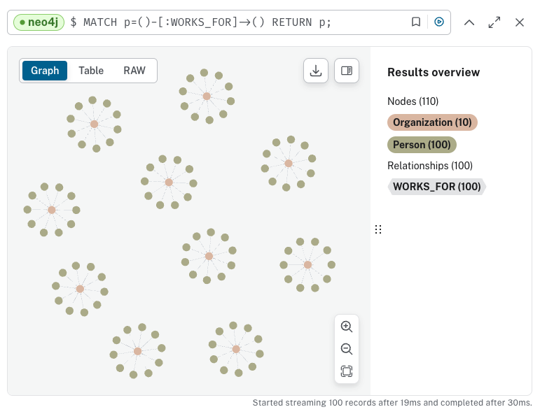
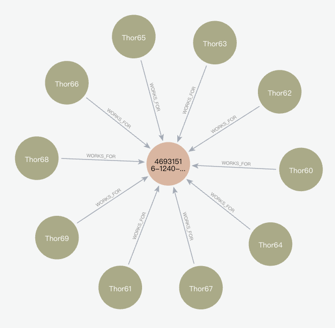

# 查詢資料庫訊息

<br>

## 說明

1. 程式碼。

    ```python
    from neo4j import GraphDatabase

    # 設定 Neo4j 資料庫的 URI 和認證資訊
    URI = "neo4j+s://bfc46ed1.databases.neo4j.io"
    AUTH = ("neo4j", "8Yc-sCEfoQN5XjrKlV4VqqMilhv6HM4jLrwzLf2P-Ic")
    # 設定每個組織的員工人數上限
    employee_threshold = 10

    def main():
        # 上下文管理：使用 GraphDatabase 連接到 Neo4j 資料庫
        with GraphDatabase.driver(URI, auth=AUTH) as driver:
            # 建立會話
            with driver.session(database="neo4j") as session:
                # 重複 100 次，也就是添加 100 個員工
                for i in range(100):
                    # 生成員工名稱，這裡以 `Thor` 最為前綴、序號作為後綴
                    name = f"Thor{i}"
                    # 執行寫入交易，添加員工並取得組織 ID
                    org_id = session.execute_write(employ_person_tx, name)
                    # 輸出結果
                    print(f"將員工 {name} 加入組織 {org_id}")

                # 統計並顯示資料庫中的資訊
                display_database_statistics(session)

    def employ_person_tx(tx, name):
        # 使用 `MERGE` 達成如果已存在則不重複建立
        result = tx.run("""
            MERGE (p:Person {name: $name})
            RETURN p.name AS name
            """, name=name
        )

        # 取得最近建立的組織 ID 及其相關聯的員工數量
        result = tx.run("""
            MATCH (o:Organization)
            RETURN o.id AS id, COUNT{(p:Person)-[r:WORKS_FOR]->(o)} AS employees_n
            ORDER BY o.created_date DESC
            LIMIT 1
        """)
        org = result.single()

        # 如果最近的組織沒有員工，則拋出異常
        if org is not None and org["employees_n"] == 0:
            raise Exception("最新建立的組織是空的。")
            # 交易將回滾 -> 連 Person 都不會建立!

        # 如果組織員工數未達上限，將該員工添加到該組織
        if org is not None and org.get("employees_n") < employee_threshold:
            result = tx.run("""
                MATCH (o:Organization {id: $org_id})
                MATCH (p:Person {name: $name})
                MERGE (p)-[r:WORKS_FOR]->(o)
                RETURN $org_id AS id
                """, org_id=org["id"], name=name
            )
        # 如果組織員工數已達上限，建立一個新的組織並將該員工添加到新組織
        else:
            result = tx.run("""
                MATCH (p:Person {name: $name})
                CREATE (o:Organization {id: randomuuid(), created_date: datetime()})
                MERGE (p)-[r:WORKS_FOR]->(o)
                RETURN o.id AS id
                """, name=name
            )

        # 傳出：新員工所屬的組織 ID
        return result.single()["id"]

    def display_database_statistics(session):
        """統計並顯示資料庫中的資訊"""
        # 查詢總節點數量
        node_count_result = session.run("MATCH (n) RETURN COUNT(n) AS node_count")
        node_count = node_count_result.single()["node_count"]
        
        # 查詢總關係數量
        relationship_count_result = session.run("MATCH ()-[r]->() RETURN COUNT(r) AS relationship_count")
        relationship_count = relationship_count_result.single()["relationship_count"]
        
        # 查詢各類型節點數量
        node_labels_result = session.run("MATCH (n) RETURN DISTINCT labels(n) AS labels, COUNT(n) AS count")
        node_labels = node_labels_result.data()
        
        # 查詢各類型關係數量
        relationship_types_result = session.run("MATCH ()-[r]->() RETURN TYPE(r) AS type, COUNT(r) AS count")
        relationship_types = relationship_types_result.data()

        # 顯示結果
        print(f"總節點數量: {node_count}")
        print(f"總關係數量: {relationship_count}")
        print("各類型節點數量:")
        for record in node_labels:
            print(f"{record['labels']}: {record['count']}")
        print("各類型關係數量:")
        for record in relationship_types:
            print(f"{record['type']}: {record['count']}")

    if __name__ == "__main__":
        main()
    ```

<br>

2. 結果：當重複運行時，發現員工會被重複分配。

    _邏輯錯誤，一個員工被分配到兩個組織中_

    ```json
    總節點數量: 120
    總關係數量: 200
    各類型節點數量:
    ['Person']: 100
    ['Organization']: 20
    各類型關係數量:
    WORKS_FOR: 200
    ```

<br>

3. 修正腳本，確保每個員工只會被分配到一個組織，清空資料庫重複運行兩次進行觀察。

    ```python
    from neo4j import GraphDatabase

    # 設定 Neo4j 資料庫的 URI 和認證資訊
    URI = "neo4j+s://bfc46ed1.databases.neo4j.io"
    AUTH = ("neo4j", "8Yc-sCEfoQN5XjrKlV4VqqMilhv6HM4jLrwzLf2P-Ic")
    # 設定每個組織的員工人數上限
    employee_threshold = 10

    def main():
        # 上下文管理：使用 GraphDatabase 連接到 Neo4j 資料庫
        with GraphDatabase.driver(URI, auth=AUTH) as driver:
            # 建立會話
            with driver.session(database="neo4j") as session:
                # 重複 100 次，也就是添加 100 個員工
                for i in range(100):
                    # 生成員工名稱，這裡以 `Thor` 最為前綴、序號作為後綴
                    name = f"Thor{i}"
                    # 執行寫入交易，添加員工並取得組織 ID
                    org_id = session.execute_write(employ_person_tx, name)
                    # 輸出結果
                    print(f"將員工 {name} 加入組織 {org_id}")

                # 統計並顯示資料庫中的資訊
                display_database_statistics(session)

    def employ_person_tx(tx, name):
        # 使用 `MERGE` 達成如果已存在則不重複建立
        result = tx.run("""
            MERGE (p:Person {name: $name})
            RETURN p.name AS name
            """, name=name
        )

        # 確保每個人只有一個 `WORKS_FOR` 關係
        result = tx.run("""
            MATCH (p:Person {name: $name})-[:WORKS_FOR]->(o:Organization)
            RETURN o.id AS id, COUNT{(p)-[r:WORKS_FOR]->(o)} AS employees_n
            LIMIT 1
        """, name=name)
        
        org = result.single()

        if org is None:
            # 取得最近建立的組織 ID 及其相關聯的員工數量
            result = tx.run("""
                MATCH (o:Organization)
                RETURN o.id AS id, COUNT{(p:Person)-[r:WORKS_FOR]->(o)} AS employees_n
                ORDER BY o.created_date DESC
                LIMIT 1
            """)
            org = result.single()

            # 如果最近的組織沒有員工，則拋出異常
            if org is not None and org["employees_n"] == 0:
                raise Exception("最新建立的組織是空的。")
                # 交易將回滾 -> 連 Person 都不會建立!

            # 如果組織員工數未達上限，將該員工添加到該組織
            if org is not None and org.get("employees_n") < employee_threshold:
                result = tx.run("""
                    MATCH (o:Organization {id: $org_id})
                    MATCH (p:Person {name: $name})
                    MERGE (p)-[r:WORKS_FOR]->(o)
                    RETURN $org_id AS id
                    """, org_id=org["id"], name=name
                )
            # 如果組織員工數已達上限，建立一個新的組織並將該員工添加到新組織
            else:
                result = tx.run("""
                    MATCH (p:Person {name: $name})
                    CREATE (o:Organization {id: randomuuid(), created_date: datetime()})
                    MERGE (p)-[r:WORKS_FOR]->(o)
                    RETURN o.id AS id
                    """, name=name
                )

            # 傳出：新員工所屬的組織 ID
            return result.single()["id"]
        else:
            # 如果該員工已經有一個 `WORKS_FOR` 關係，直接返回組織 ID
            return org["id"]

    def display_database_statistics(session):
        """統計並顯示資料庫中的資訊"""
        # 查詢總節點數量
        node_count_result = session.run("MATCH (n) RETURN COUNT(n) AS node_count")
        node_count = node_count_result.single()["node_count"]
        
        # 查詢總關係數量
        relationship_count_result = session.run("MATCH ()-[r]->() RETURN COUNT(r) AS relationship_count")
        relationship_count = relationship_count_result.single()["relationship_count"]
        
        # 查詢各類型節點數量
        node_labels_result = session.run("MATCH (n) RETURN DISTINCT labels(n) AS labels, COUNT(n) AS count")
        node_labels = node_labels_result.data()
        
        # 查詢各類型關係數量
        relationship_types_result = session.run("MATCH ()-[r]->() RETURN TYPE(r) AS type, COUNT(r) AS count")
        relationship_types = relationship_types_result.data()

        # 顯示結果
        print(f"總節點數量: {node_count}")
        print(f"總關係數量: {relationship_count}")
        print("各類型節點數量:")
        for record in node_labels:
            print(f"{record['labels']}: {record['count']}")
        print("各類型關係數量:")
        for record in relationship_types:
            print(f"{record['type']}: {record['count']}")

    if __name__ == "__main__":
        main()

    ```

<br>

4. 結果：不會被重複分配，首先增加 `WHERE (o)<-[:WORKS_FOR]-(:Person)` 篩選條件，確保只選擇有員工的組織；確保每個員工只有一個 WORKS_FOR 關係，並且不會重複添加現有的節點和關係；執行顯示資料庫統計資訊的函數 `display_database_statistics`。

    _多次運行_

    ```json
    總節點數量: 110
    總關係數量: 100
    各類型節點數量:
    ['Person']: 100
    ['Organization']: 10
    各類型關係數量:
    WORKS_FOR: 100
    ```

<br>

# 進入資料庫查看

1. 全部的節點。

    

<br>

2. 局部放大，可以看到哪些員工在哪個組織個關係分佈圖。

    

<br>

___

_END_