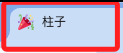
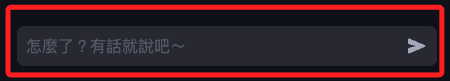
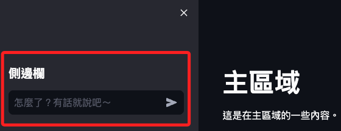
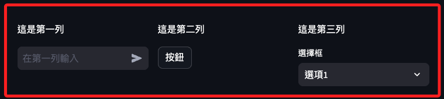
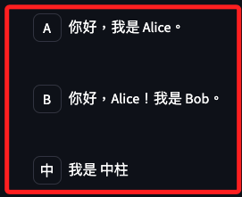

# 起手式

_紀錄從零開始建立專案的過程，並說明每一個函數的使用。_

<br>

## 編輯主腳本

1. 建立專案：在桌面建立專案資料夾。

    ```bash
    cd ~/Desktop/_MyBot0521_ && cd _MyBot0521_ && code .
    ```

<br>

2. 建立主腳本 `bot.py`：從第一個腳本開始，然後再逐步封裝功能及模組。

    ```bash
    touch bot.py
    ```

<br>

3. 這個專案是一個 Streamlit 應用，所以先導入 streamlit。

    ```python 
    import streamlit as st
    ```

<br>

## 編輯網頁頁籤與圖標 `set_page_config`

1. 程式碼。

    ```python
    st.set_page_config(
        # 頁籤描述
        page_title="柱子",
        # 圖標
        page_icon=":tada:",
        # 佈局方式
        layout="wide"
    )
    ```

    

<br>

2. 官方說明 `set_page_config`。

    ```python
    st.set_page_config(
        # 設定瀏覽器標籤頁的標題
        page_title=None,
        # 設定瀏覽器標籤頁的圖標，可以是 URL、路徑或 Emoji
        page_icon=None,
        # 設定應用的佈局，可選值有 `centered` 和 `wide`
        layout="centered",
        # 設定側邊欄的 `初始狀態`
        # 可選值有 `auto`、`開 expanded` 和 `合 collapsed`
        initial_sidebar_state="auto",
        # 自訂 Streamlit 應用右上角的菜單項目
        menu_items=None
    )
    ```

<br>

3. 關於 `menu_items`，目前僅支援以下三個鍵值。

    ```python
    import streamlit as st

    # 設置頁面配置
    st.set_page_config(
        page_title="我的 Streamlit 應用",
        page_icon=":rocket:",
        layout="wide",
        initial_sidebar_state="expanded",
        menu_items={
            'Get Help': 'https://example.com/help',
            'Report a bug': 'https://example.com/bug',
            'About': '這是一個用於演示的 Streamlit 應用'
        }
    )

    # 應用內容
    st.title("歡迎來到我的 Streamlit 應用")
    st.sidebar.markdown("這是側邊欄")
    st.write("這是主頁面內容")
    ```

<br>

## 建立聊天輸入框 `chat_input`

1. 程式碼：會在底部建立一個對話輸入框。

    ```python
    st.chat_input("怎麼了？有話就說吧～")
    ```

    

<br>

2. 官方說明 `chat_input`。

    ```python
    st.chat_input(
        # 輸入框內顯示的提示文字
        placeholder="你好，請輸入你的問題。",
        # 這是特殊語法，並非實質參數，用於表示其後的參數只能作為關鍵字參數傳遞
        # 關鍵字參數必須明確指定參數名稱
        *,
        # 用於識別這個輸入框的唯一鍵，如 `chat_input_1`
        key=None,
        # 限制輸入框內可輸入的最大字元數，如 `100`
        max_chars=None,
        # 輸入框是否為禁用狀態，禁用則不可輸入，如 `True` 或 `False`
        disabled=False,
        # 回調函數，當使用者提交輸入內容時要執行的回調函數
        on_submit=None,
        # 用於傳遞給 on_submit 回調函數的額外參數，必須為元組形式
        args=None,
        # 傳遞給 on_submit 回調函數的其他命名參數，必須為字典形式
        kwargs=None
    )
    ```

<br>

3. 參數 `args` 範例。

    ```python
    def handle_somthing(arg1, arg2):
        st.write(f"提交的參數: {arg1}, {arg2}")

    st.chat_input(
        placeholder="您的訊息",
        on_submit=handle_somthing,
        args=("參數1", "參數2")
    )
    ```

<br>

4. 參數 `kwargs` 範例。

    ```python
    def handle_somthing(**kwargs):
        st.write(f"提交的參數: {kwargs}")

    st.chat_input(
        placeholder="您的訊息",
        on_submit=handle_somthing,
        kwargs={"param1": "值1", "param2": "值2"}
    )
    ```

<br>

5. 使用 `海象運算子 :=` 搭配 `chat_input`，接收了使用者輸入的同時，一方面取得輸入的內容，並透過條件判斷來確認這個輸入的動作。`海象運算子` 也稱為 `賦值表達式`，可達成這個在控制流表達式中同時進行變數賦值和運算的需求。

    ```python
    # 假如用戶輸入了訊息
    if prompt := st.chat_input("怎麼了？有話就說吧～"):
        # 將用戶訊息輸出，確認可在這個區塊取得訊息
        print(prompt)
    ```

<br>

6. 特別注意，使用 `海象運算子` 並非絕對必要，也可以先取值再進行判斷。

    ```python
    # 用戶輸入了訊息
    prompt = st.chat_input("怎麼了？有話就說吧～")
    # 判斷用戶是否輸入了訊息，也就是判斷是否為 None
    if prompt:
        # 將用戶訊息輸出，確認可在這個區塊取得訊息
        print(prompt)
    ```

<br>

7. 對話輸入框無法透過參數指定位置，但可以搭配其他元件來決定其在佈局中的相對位置。

    ```python
    import streamlit as st

    st.title("主區域")
    st.write("這是在主區域的一些內容。")

    with st.sidebar:
        st.header("側邊欄")
        st.chat_input("怎麼了？有話就說吧～")
    ```

    

<br>

8. 搭配列佈局 `st.columns`。

    ```python
    import streamlit as st

    # 建立三列佈局
    col1, col2, col3 = st.columns(3)

    with col1:
        st.write("這是第一列")
        st.chat_input("在第一列輸入")

    with col2:
        st.write("這是第二列")
        st.button("按鈕")

    with col3:
        st.write("這是第三列")
        st.selectbox("選擇框", ["選項1", "選項2"])
    ```

    

<br>

## 旋轉器 st.spinner

_加載指示器_

<br>

1. 這是一個網頁的效果，也稱為 `Loading Indicator` 或 `Progress Indicator`。

<br>

2. 使用 `st.spinner` 可指定程序在特定程式碼區塊運行時行時顯示一個 `加載指示器`，`spinner` 是一個實現 `上下文管理協議` 的對象，所以有 `__enter__` 和 `__exit__` 這兩個方法，實作這個協議的方法在使用上是可單獨存在，但對於 `st.spinner` 來說，其 `__enter__` 和 `__exit__` 決定了加載器的顯示與消失，所以必須搭配 `with` 語句來佈局一個上下文管理的程式碼區塊才能達成其預期效果。

<br>

3. `上下文管理` 可確保在進入和退出 `某個程式碼塊` 時自動執行一些內定的設置和清理操作，而 `with` 語句就是用來管理這些上下文管理器的 `語法糖`。

<br>

4. 範例。

    ```python
    if prompt := st.chat_input("怎麼了？有話就說吧～"):
        # 改寫這個區塊
        # 使用上下文管理讓程序進行處理 `prompt`
        with st.spinner('讓我思考一下...'):
            print(prompt)
    ```

<br>

## 對話顯示框 `st.chat_message`

1. 用於模擬指定角色的對話訊息，以這個專案來說，包含了用戶的輸入或助理的回覆，函數中定義了角色的名稱與頭像顯示，內容則需在 `上下文管理` 的程式碼區塊使用 `st.write` 或 `st.markdown` 來顯示。

<br>

2. 函數定義。

    ```python
    st.chat_message(
        # 用於指定發送消息的人的名稱或標識
        name,
        *,
        # 用於指定發送者的頭像，可用圖片的 URL 或本地文件路徑。
        # 如果不提供，則不顯示頭像。
        avatar=None
    )
    ```

<br>

3. 範例程式碼。

    ```python
    import streamlit as st

    # 顯示 Alice 的消息
    with st.chat_message("Alice"):
        st.write("你好，我是 Alice。")

    # 顯示 Bob 的消息
    with st.chat_message("Bob"):
        st.write("你好，Alice！我是 Bob。")

    # 顯示用戶輸入
    user_input = st.chat_input("換你說話，你是誰呢？")
    if user_input:
        with st.chat_message(user_input):
            st.write(f'我是 {user_input}')
    ```

    _在輸入框鍵入 `中柱` 之後會顯示如下_

    

<br>

4. 如之前的說明，此處亦可將判斷式改為 `海象運算`。

    ```python
    # 顯示用戶輸入
    if if user_input:= st.chat_input("換你說話，你是誰呢？")
        with st.chat_message(user_input):
            st.write(f'我是 {user_input}')
    ```

<br>

## `st.write`

1. 函數定義。

    ```python
    # 自動識別並渲染多種格式的內容
    st.write(
        # 接受多個任意類型的參數
        *args,
        # 指定是否允許渲染 HTML，預設為 False。
        unsafe_allow_html=False,
        # 接受其他關鍵字參數，可以用於擴展或兼容性目的
        **kwargs
    )
    ```

<br>

## `st.markdown`

1. 函數定義。

    ```python
    # 渲染 Markdown 格式的文本
    st.markdown(
        # Markdown 的文本
        body,
        unsafe_allow_html=False,
        *,
        # 當用戶將鼠標懸停在相關 UI 元素上時顯示的提示。
        help=None
    )
    ```

<br>

<br>

## 小結

1. 截至目前的程式碼。

    ```python
    import streamlit as st

    # 編輯網頁頁籤與圖標
    st.set_page_config(
        page_title="柱子",
        page_icon=":tada:",
        layout="wide"
    )

    if prompt := st.chat_input("怎麼了？有話就說吧～"):
        # 接下來要另外製作一個處理 `prompt` 的函數
        with st.spinner('讓我思考一下...'):
            # 輸出傳遞來的使用者輸入訊息
            # 要另外寫入程序來處理的個訊息
            # prompt 是用戶輸入的對話
            with st.chat_message("user"):
                # 用 markdown 會顯示比較明顯
                st.markdown(prompt)
                # st.write(prompt)
                # 接下來
    ```

<br>

___

_END_
