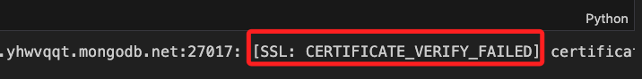
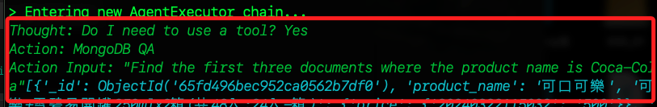
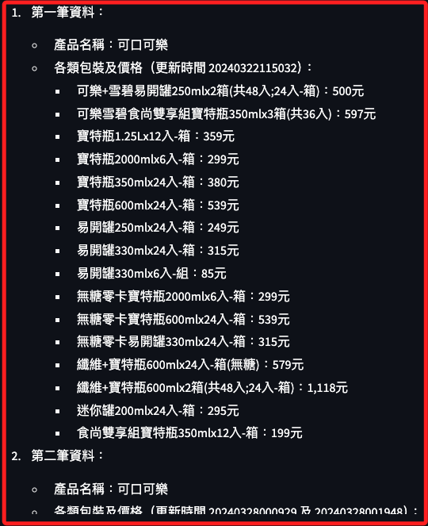
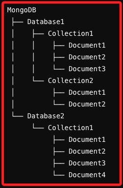
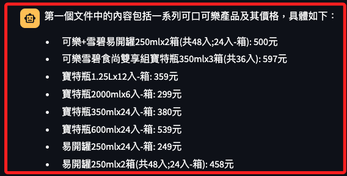

# 簡易版本 Tool


## 說明

1. 在原本的專案中已有三個 Tool，這裡示範查詢 MongoDB。

2. 基於模式匹配的簡單方法，檢查自然語言查詢中的特定關鍵字來生成 MongoDB 查詢語句。

<br>

## 測試 MongoDB

1. 安裝 `pymongo` 庫。

    ```bash
    pip install pymongo
    ```

<br>

2. 連線測試：使用官方測試腳本。

    ```python
    from pymongo.mongo_client import MongoClient

    # 資料庫 URI，記得更換自己的密碼
    uri = "mongodb+srv://sam6238:<更換自己的密碼>@cluster0.yhwvqqt.mongodb.net/?retryWrites=true&w=majority&appName=Cluster0"

    # 建立連線
    client = MongoClient(uri)

    # 測試連線
    try:
        client.admin.command('ping')
        print("Pinged your deployment. You successfully connected to MongoDB!")
    except Exception as e:
        print(e)
    ```

<br>

3. _可能會_ 出現 SSL 問題。 

    ```json
    ac-8uuuote-shard-00-02.yhwvqqt.mongodb.net:27017: [SSL: CERTIFICATE_VERIFY_FAILED] certificate verify failed: unable to get local issuer certificate (_ssl.c:1006) ... 以下省略
    ```

    

<br>

4. 添加兩個參數 `tls=True` 和 `tlsAllowInvalidCertificates=True` 可以避免 SSL 驗證問題，這是因為這些參數告訴 MongoClient 在建立 SSL/TLS 連接時忽略證書驗證錯誤。

    ```python
    from pymongo.mongo_client import MongoClient

    uri = "mongodb+srv://sam6238:<更換自己的密碼>@cluster0.yhwvqqt.mongodb.net/?retryWrites=true&w=majority&appName=Cluster0"

    # 建立連線
    client = MongoClient(
        uri,
        tls=True,
        tlsAllowInvalidCertificates=True
    )

    # 檢查連線
    try:
        client.admin.command('ping')
        print("連線成功。")
    except Exception as e:
        print(e)

    ```

    _結果_
    ```bash
    連線成功。
    ```

<br>

5. 也可以使用 `certifi`。

    ```python
    from pymongo.mongo_client import MongoClient
    import certifi

    uri = "mongodb+srv://sam6238:<更換自己的密碼>@cluster0.yhwvqqt.mongodb.net/?retryWrites=true&w=majority&appName=Cluster0"

    # 建立連線
    client = MongoClient(uri, tlsCAFile=certifi.where())

    # 測試連線
    try:
        client.admin.command('ping')
        print("連線成功。")
    except Exception as e:
        print(e)
    ```

<br>

## 修改專案腳本

1. 在 `tools` 資料夾中建立一個新的腳本 `generate_mongo.py` 用來處理 `MongoDB`。

    ```python
    import re
    from pymongo import MongoClient
    from typing import Any, Dict, List
    import certifi


    # 這是一個簡單的解析器，可以根據具體需求進行擴展
    def parse_natural_language_query(nl_query: str) -> Dict[str, Any]:
        query = {}
        if "product_name" in nl_query:
            match = re.search(r"product_name is (\w+)", nl_query)
            if match:
                query["product_name"] = match.group(1)
        return query


    # 執行請求
    def execute_mongodb_query(
        query: Dict[str, Any], database_name: str, collection_name: str
    ) -> List[Dict[str, Any]]:
        # MongoDB 連接設定
        URL = "mongodb+srv://sam6238:<更換自己的密碼>@cluster0.yhwvqqt.mongodb.net/?retryWrites=true&w=majority&appName=Cluster0"

        # 連接到 MongoDB
        client = MongoClient(URL, tlsCAFile=certifi.where())

        # 選擇資料庫和集合
        db = client[database_name]
        collection = db[collection_name]

        # 執行查詢
        result = collection.find(query)

        # 將結果轉換為列表
        return list(result)


    # 解析自然語言查詢並生成 MongoDB 查詢語法
    def mongodb_qa(nl_query: str) -> List[Dict[str, Any]]:
        query = parse_natural_language_query(nl_query)

        # 執行 MongoDB 查詢
        results = execute_mongodb_query(
            query,
            "MyDatabase2024",
            "MyCollection2024"
        )

        return results
    ```

<br>

2. 修改代理腳本 `agent.py`，從 `generate_mongo.py` 導入 `mongodb_qa` 並提供給工具列表作為解析。

    ```python
    from langchain.tools import Tool
    from langchain.agents import AgentExecutor, create_react_agent
    from langchain import hub
    from langchain.chains.conversation.memory import ConversationBufferWindowMemory
    from solutions.llm import llm
    # 在 agent.py 中註冊 Retrieval Chain 作為工具，先導入 kg_qa
    from solutions.tools.vector import kg_qa
    from solutions.tools.finetuned import cypher_qa
    # 導入 MongoDM 拓展模組
    from solutions.tools.generate_mongo import mongodb_qa

    # 在工具陣列中添加 kg_qa
    tools = [
        # 處理一般聊天對話，涵蓋所有其他工具未涵蓋的問題和請求。
        Tool.from_function(
            name="General Chat",
            description="處理一般聊天對話，涵蓋所有其他工具未涵蓋的問題和請求。",
            func=llm.invoke,
            # 不要直接輸出
            return_direct=False,
        ),
        # 用於基於向量搜索的電影情節信息檢索。
        # 如果問題涉及搜尋與特定電影情節相似的電影，並且需要使用向量搜索技術，會使用此工具。
        Tool.from_function(
            name="Vector Search Index",
            description="用於基於向量搜索的電影情節信息檢索。",
            func=kg_qa,
            # 不要直接輸出
            return_direct=False,
        ),
        # 用於使用 Cypher 查詢語句來回答有關電影的具體問題。
        # 如果問題需要從 Neo4j 資料庫中檢索電影信息，並涉及生成和執行 Cypher 查詢。
        # 注意這裡會調用 cypher_qa
        Tool.from_function(
            # 這名稱會在終端機中顯示為 `Action：Cypher QA`
            name="Cypher QA",
            description="用於使用 Cypher 查詢語句來回答有關電影的具體問題。",
            # 調用 finetuned.py 中自訂的函數 cypher_qa
            func=cypher_qa,
            # 不可以直接回應，否則會出現解析錯誤
            return_direct=False,
        ),
        # 添加 MongoDB 查詢
        Tool.from_function(
            name="MongoDB QA",
            description="用於生成 MongoDB 查詢語法來回答問題。",
            func=mongodb_qa,
            return_direct=False
        )
    ]

    # 調用 langchain 函數 ConversationBufferWindowMemory
    memory = ConversationBufferWindowMemory(
        memory_key="chat_history",
        k=5,
        return_messages=True,
    )

    # 調用 langchain 函數 hub.pull() 生成
    agent_prompt = hub.pull("hwchase17/react-chat")
    # 調用 langchain 函數 create_react_agent
    # 傳入 `llm`、`tools`、`Agent 的回應`
    agent = create_react_agent(llm, tools, agent_prompt)
    # 透過 AgentExecutor 類建立代理執行物件
    agent_executor = AgentExecutor(
        agent=agent,
        tools=tools,
        memory=memory,
        verbose=True
    )


    # 修正的腳本二版
    def generate_response(prompt):
        print(f'=> generate_response 函數輸出 prompt -> {prompt}')
        try:
            print('=> generate_response 函數進入 try')
            # 回應
            response = agent_executor.invoke({"input": prompt})
            print(f'=> response -> {response}')
            # 取得回應中的 'output' 欄位，如果不存在則為 None
            output = response.get('output', None)
            if output is None:
                return "=> 回應 `response` 中沒有結果 `output`。"

            if isinstance(output, dict):
                print('=> agent.py -> 備註：回應是一個 dict=')
                # 將 dict 的項轉換為字串並連接
                response_output = ', '.join([f"{key}: {value}" for key, value in output.items()])
            elif isinstance(output, str):
                response_output = output
            else:
                raise ValueError(f"=> 非預期的結果型態 `output type` -> {type(output)}")

            # 確保 response_output 是字串或列表
            if not isinstance(response_output, str):
                raise ValueError(f"=> 無效的回應結果型態 `response output type` -> {type(response_output)}")

            return response_output
        except Exception as e:
            print('=> generate_response 無法解析 -> 回應發生錯誤=')
            return f"=> 錯誤的 response -> {str(e)}"
        finally:
            pass
    ```

<br>

3. 在代理腳本 `agent.py` 最後加入以下測試程式碼。

    ```python
    # 測試程式碼
    print('== 進行測試 ==')
    prompt = "查詢產品名稱為可口可樂的所有文件"
    response = generate_response(prompt)
    print(response)
    ```

<br>

4. 或是運行主腳本 `streamlit run bot.py` 並且詢問問題。

    ```bash
    查詢 MongoDB 資料庫中產品名稱為可口可樂的前三筆資料
    ```

<br>

5. 會生成查詢語句 `Find the first three documents where the product name is Coca-Cola`。

    

<br>

6. 透過 `mongodb_qa` 可將語句轉換 MongoDB 查詢條件。

    ```python
    query = {"product_name": "Coca-Cola"}
    ```

<br>

7. 根據定義的 `execute_mongodb_query` 函數，這個查詢條件會被用來查詢 MongoDB，查詢語句的意思是：在集合 `MyCollection2024` 中搜尋 `product_name` 為 `Coca-Cola` 的 `document`，並透過限制返回結果的前三筆，其中 `collection.find({"product_name": "Coca-Cola"}).limit(3)` 就是查詢語句。

    ```python
    result = collection.find({"product_name": "Coca-Cola"}).limit(3)
    ```

<br>

8. 顯示結果如下。

    

<br>

## LangChain 的工作步驟

_在專案中實際上使用了 LangChain 庫來進行函數的解析和執行。_

<br>

1. 定義 `工具（Tools）`：定義 `mongodb_qa`）封裝了具體的 MongoDB 查詢功能。

    ```python
    Tool.from_function(
        name="MongoDB QA",
        description="用於使用 MongoDB 查詢語法來回答問題。",
        func=mongodb_qa,
        return_direct=False
    )
    ```

<br>

2. 建立 `代理（Agent）`：使用 `LangChain` 的 `create_react_agent` 函數來建立一個代理，並傳入定義好的工具列表，這個代理能夠根據自然語言查詢動態調用適當的工具。

    ```python
    agent = create_react_agent(llm, tools, agent_prompt)
    ```

<br>

3. `代理執行器（AgentExecutor）`：使用 `AgentExecutor` 建立一個代理執行器，這個執行器負責解析自然語言查詢，選擇合適的工具，並執行對應的函數。

    ```python
    agent_executor = AgentExecutor(
        agent=agent,
        tools=tools,
        memory=memory,
        verbose=True
    )
    ```

<br>

## LangChain 的工作原理

1. 接收輸入：接收用戶的自然語言查詢。

    ```python
    prompt = "查詢 MongoDB 資料庫中產品名稱為可口可樂的前三筆資料"
    ```

<br>

2. 解析輸入：使用內部的自然語言處理模型（如 LLM）解析輸入，識別用戶的意圖和查詢條件。

<br>

3. 選擇工具：根據解析結果選擇合適的工具，如 `mongodb_qa`。

    ```python
    Action: MongoDB QA
    Action Input: "Find the first three documents where the product name is Coca-Cola"
    ```

<br>

4. 執行工具：調用選定工具的對應函數，執行查詢並返回結果。

    ```python
    results = mongodb_qa("product_name is Coca-Cola")
    ```

<br>

## 補充 MongoDB 資料結構

1. `MongoDB` 的結構示意如下，也就是 `database -> collection -> document` 的格式。

    

<br>

2. 進行實測。

    ```bash
    請列出MongoDB中第一個 Document 的內容。
    ```

    

<br>

___

_END_