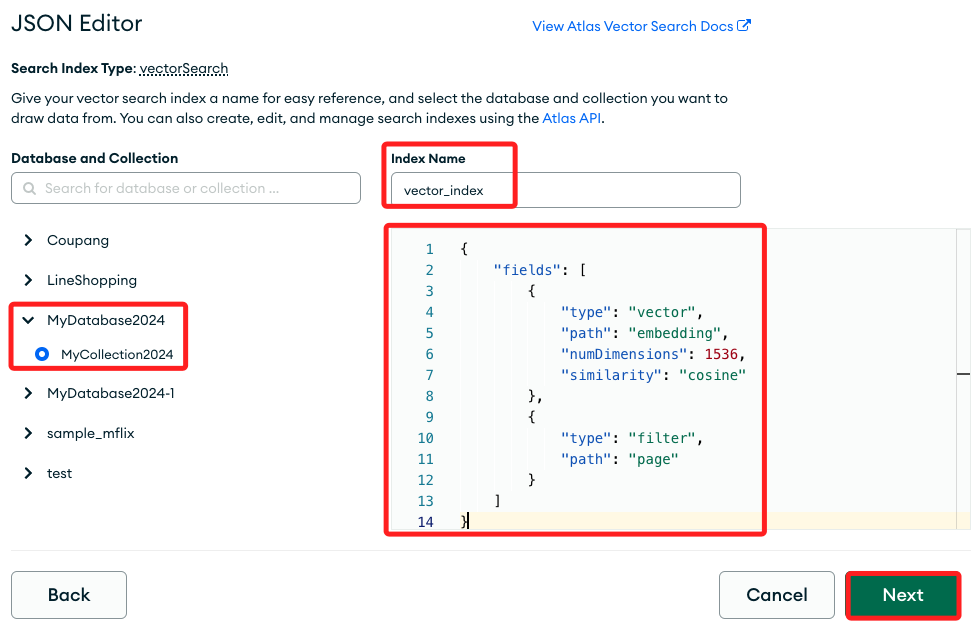
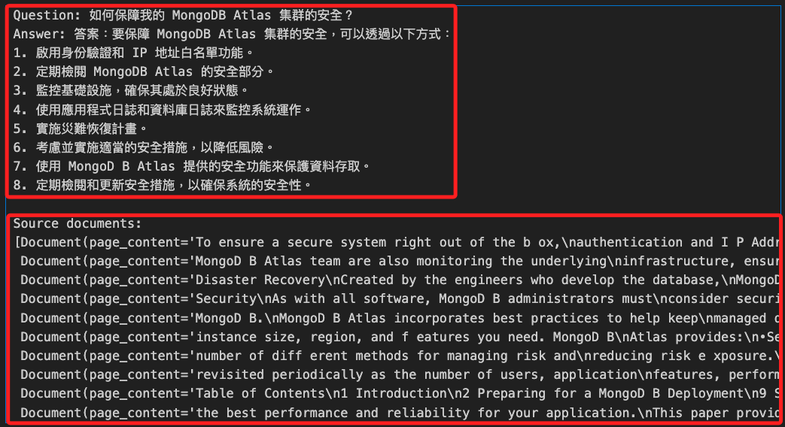

# MongoDB 整合 LangChain

_使用 LangChain 整合 MongoDB Atlas 建立 `向量索引` 並進行 `向量搜索` 。_

<br>

## 說明

1. 本筆記出處 [MongoDB 官方說明](https://www.mongodb.com/docs/atlas/atlas-vector-search/ai-integrations/langchain/)，說明如何使用 `LangChain` 與 `MongoDB Atlas 向量搜索` 來建立 `LLM` 應用程式並實現 `索引增強生成 RAG（Retrieval-Augmented Generation）`。

<br>

2. 通過這個筆記中的實作步驟，可以設置環境、儲存數據、建立向量索引，並運行各種向量搜索查詢，最終實現 `根據語義相似性` 回答問題的功能。

<br>

## 向量索引 `Vector Index`

1. 向量索引是一種數據結構和技術，用於在高維向量空間中高效地儲存和檢索數據點，每個數據點（如文本、圖像或其他多媒體）將以數學上的向量進行表示，而這些向量是通過嵌入技術（例如深度學習模型）從原始數據中生成的。

<br>

2. 在大量數據中，通過建立向量索引可快速地找到與查詢向量相似的數據點，這對於需要實時響應的應用非常重要。

<br>

3. 向量索引使得能夠根據語義相似性而非單純的關鍵字匹配來檢索數據，提高了搜索的準確性和相關性。

<br>

4. 使用專門的索引結構（如 Annoy、FAISS）可以顯著加速向量間的相似性搜索，達到實時檢索的效果。

<br>

## 向量搜索 `Vector Search`

1. 向量搜索是指在向量空間中搜尋與給定查詢 `向量最相似的數據點` 的過程，這通常涉及計算查詢向量與索引中向量之間的距離（例如餘弦相似度、歐氏距離），並返回距離最小的數據點。

<br>

2. 傳統的關鍵字搜索基於 `文本匹配`，可能無法有效捕捉語義上的相似性，向量搜索能夠 `根據語義相關性` 找到更合適的結果。

<br>

3. 在 `檢索增強生成（RAG）` 應用中，向量搜索能夠從資料庫中檢索出與查詢語句語義相似的文件，提供更豐富的上下文給生成模型（如 GPT-4），從而生成更準確和相關的回答。

<br>

4. 向量搜索廣泛應用於推薦系統、相似圖片搜尋、自然語言處理（NLP）中的文件檢索等領域。

<br>

## 向量儲存 `Vector Store`

1. `向量儲存` 指的是將文本數據轉換為 `向量嵌入（Vector Embeddings）`，並將這些向量嵌入儲存在資料庫中，這個過程包含了文本數據轉換、向量儲存兩個步驟，轉換通常由語言模型來完成，向量儲存在這個範例中則是存放在 MongoDB。

<br>

2. 在本範例中的向量儲存如下，`from_documents` 方法接收文本文件（docs）並將其轉換為向量嵌入（embedding），然後將這些向量嵌入儲存在指定的資料庫集合（atlas_collection）中。

    ```python
    # 建立向量儲存
    vector_search = MongoDBAtlasVectorSearch.from_documents(
        documents = docs,
        embedding = OpenAIEmbeddings(disallowed_special=()),
        collection = atlas_collection,
        index_name = vector_search_index
    )
    ```

<br>

## 實作一個範例

_這個範例的功能是使用 Atlas Vector Search 和 LangChain 來實現基於向量搜索的檢索增強生成（RAG）應用，以回答一個有關 MongoDB Atlas 集群安全性問題的例子。_

<br>

1. 實例化檢索器：將 `Atlas Vector Search` 實例化為 `檢索器`，用於根據相似度搜索來搜尋相關文件。

2. 定義提示模板：建立一個提示模板，指導模型如何回答問題。

3. 建立 OpenAI 聊天模型：使用 OpenAI 的 ChatGPT 模型來生成回答。

4. 格式化文件：定義一個函數，用於將文件內容格式化為字串。

5. 建立問答鏈：通過結合檢索器、提示模板和聊天模型，建立一個處理問答的鏈。

6. 提出問題並獲取回答：向這個鏈提出一個問題，並獲取回答。

7. 打印源文件：最後，搜尋並打印與問題相關的源文件。

<br>

## 環境設置

1. 安裝庫。

    ```bash
    pip install --upgrade --quiet langchain langchain-mongodb langchain-openai pymongo pypdf
    ```

<br>

2. 導入所需的庫。

    ```python
    # getpass：安全地提示用戶輸入密碼或其他敏感信息
    import getpass, os, pymongo, pprint
    # PyPDFLoader：加載 PDF 文件並將其內容轉換為可處理的文本或數據結構
    from langchain_community.document_loaders import PyPDFLoader
    # StrOutputParser：將模型生成的輸出解析為字串
    from langchain_core.output_parsers import StrOutputParser
    # RunnablePassthrough：將輸入直接傳遞到下一步而不進行任何處理的可運行單元
    from langchain_core.runnables import RunnablePassthrough
    # 與 MongoDB Atlas Vector Search 集成，以實現向量搜索功能
    from langchain_mongodb import MongoDBAtlasVectorSearch
    # ChatOpenAI 用於與 OpenAI 的聊天模型互動
    # OpenAIEmbeddings 用於生成文本的向量嵌入
    from langchain_openai import ChatOpenAI, OpenAIEmbeddings
    # 定義和管理提示模板，以生成特定的查詢或指令
    from langchain.prompts import PromptTemplate
    # 將長文本拆分為較小的片段，以便於處理和分析。
    from langchain.text_splitter import RecursiveCharacterTextSplitter
    # MongoDB
    from pymongo import MongoClient
    # SSL
    import certifi
    ```

<br>

3. 設置環境變量：執行以下程式碼會提示用戶輸入 OpenAI API Key 和 Atlas 集群的 SRV 超連結。

    ```python
    # 輸入後會保存在環境變數以及變數中
    os.environ["OPENAI_API_KEY"] = getpass.getpass("OpenAI API Key:")
    ATLAS_CONNECTION_STRING = getpass.getpass("MongoDB Atlas SRV Connection String:")
    ```

<br>

4. `SRV 連結字串` 的格式如下，全名是 `Service Resource Locator Connection String`，在建立 MongoDB 資料庫時會提供並提示。

    ```python
    `mongodb+srv://<username>:<password>@<clusterName>.<hostname>.mongodb.net`
    ```

<br>

## 使用 Atlas 作為向量儲存

_將自定義數據加載到 Atlas 並實例化為向量資料庫。_

<br>

1. 連接到自己的 Atlas 集群。

    ```python
    # 建立連線
    client = MongoClient(
        ATLAS_CONNECTION_STRING,
        tlsCAFile=certifi.where()
    )
    # 定義資料庫與集合名稱
    db_name = "MyDatabase2024"
    collection_name = "MyCollection2024"
    atlas_collection = client[db_name][collection_name]
    vector_search_index = "vector_index"
    ```

<br>

2. 加載範例數據：使用以下程式碼從指定的 URL 檢索 PDF 並加載原始文本數據，然後使用文本拆分器將數據拆分為較小的文件。

    ```python
    # 載入 PDF
    loader = PyPDFLoader("https://query.prod.cms.rt.microsoft.com/cms/api/am/binary/RE4HkJP")
    data = loader.load()
    # 文件分割器
    text_splitter = RecursiveCharacterTextSplitter(
        chunk_size=200, chunk_overlap=20
    )
    # 分割文件
    docs = text_splitter.split_documents(data)
    # 可輸出觀察看看
    print(docs[0], '\n')
    ```

<br>

3. 這個文件是由官方提供練習使用的 PDF 檔案，後面內容將詳細說明。

    

<br>

4. 實例化向量儲存：使用以下程式碼從範例文件建立一個名為 `vector_search` 的向量儲存，過程為 `from_documents` 方法 `接收文本文件（docs）` 並將其 `轉換為向量嵌入（embedding）` ，然後將這些向量嵌入`儲存在指定的資料庫集合（atlas_collection）` 中。

    ```python
    # 建立向量儲存
    vector_search = MongoDBAtlasVectorSearch.from_documents(
        documents = docs,
        embedding = OpenAIEmbeddings(disallowed_special=()),
        collection = atlas_collection,
        index_name = vector_search_index
    )
    ```

<br>

## 說明範例數據

1. 這個範例數據由 [官方提供](https://query.prod.cms.rt.microsoft.com/cms/api/am/binary/RE4HkJP)。

    

<br>

2. 說明的大綱如下。

    ```txt
    Table of Contents
    Introduction 1
    Preparing for a MongoDB Deployment 2
    Scaling a MongoDB Atlas Cluster 9
    Continuous Availability & Data Consistency 11
    Managing MongoDB 12
    Security 16
    Business Intelligence with MongoDB Atlas 17
    Considerations for Proofs of Concept 18
    MongoDB Stitch: Serverless Platform from MongoDB 18
    We Can Help 19
    Resources 19
    ```

<br>

3. 內容就是各種說明與簡介。

    

<br>

## 建立 Atlas 向量搜索索引

_在 MongoDB 控制板上操作，以 `MyDatabase2024.MyCollection2024` 為例_

<br>

1. 要在 `向量儲存` 上運行 `向量搜索` 查詢，需要在指定資料庫中的指定集合上建立 Atlas 向量搜索索引，在這個範例中將使用 `MyDatabase2024.MyCollection2024`。

    

<br>

2. 進入 Atlas ，展開 `專案 Projects` 並進入指定專案中的指定 `集群 Cluster`， 接著點擊側邊欄中的 `Atlas Search` 。

    

<br>

3. 在 `Atlas Search` 頁面中選取資料來源 `Select data source`，也就是選取集群，接著點擊 `Go ti Atlas Search`。

    

<br>

4. 定義 Atlas `向量搜索索引`，點擊 `Create Search Index`。

    

<br>

5. 在 `Atlas Vector Search` 下，選擇 `JSON Editor` 然後點擊 `Next`。

    

<br>

6. 在 `Database and Collection` 部分，找到 `MyDatabase2024` 資料庫，並選擇 `MyCollection2024` 集合。

    

<br>

7. 在 `Index Name` 欄位中 _手動輸入_ `vector_index`。

    

<br>

8. 並使用以下自訂的 `索引定義` 替換預設定義。

    ```json
    {
        "fields": [
            {
                "type": "vector",
                "path": "embedding",
                "numDimensions": 1536,
                "similarity": "cosine"
            },
            {
                "type": "filter",
                "path": "page"
            }
        ]
    }
    ```

<br>

9. 然後點擊 `Next`。 

    

<br>

10. 確認自訂的索引定義都正確就可以點擊 `Create Search Index`。

    

<br>

11. 關閉 `You're All Set!` 的窗口，等待索引建立完成。

    

<br>

## 運行向量搜索查詢

_索引建立完成後，返回運行向量搜索查詢_

<br>

1. 語義搜索：使用以下程式碼執行基本的語義搜索。

    ```python
    query = "MongoDB Atlas security"
    results = vector_search.similarity_search(query)
    pprint.pprint(results)
    ```

    

<br>

2. 檢索增強生成（RAG）：使用以下程式碼範例實現 RAG，根據您的數據回答問題。

    ```python
    # 將 Atlas Vector Search 實例化為擷取器
    retriever = vector_search.as_retriever(
        # 指定搜索類型為相似度搜索
        search_type="similarity",
        # 設定查詢時僅返回前 10 個相關性最高的文件，並且只使用分數高於 0.75 的文件
        search_kwargs={"k": 10, "score_threshold": 0.75},
    )
    # 定義提示模板
    # template = """
    # Use the following pieces of context to answer the question at the end.
    # If you don't know the answer, just say that you don't know, don't try to make up an answer.
    # {context}
    # Question: {question}
    # """
    template = """
    使用以下內容來回答最後的問題。
    如果你不知道答案，就說你不知道，不要試圖編造答案。
    {context}
    問題：{question}
    """

    # 根據模板建立一個提示對象
    custom_rag_prompt = PromptTemplate.from_template(template)
    # 建立一個 OpenAI 聊天模型
    llm = ChatOpenAI()


    # 定義格式化文件的函數
    def format_docs(docs):
        return "\n\n".join(doc.page_content for doc in docs)


    # 建立一條鏈來回答有關您的數據的問題
    rag_chain = (
        {"context": retriever | format_docs, "question": RunnablePassthrough()}
        | custom_rag_prompt
        | llm
        | StrOutputParser()
    )
    # 提示這條鏈
    # 問題：如何保障我的 MongoDB Atlas 集群的安全？
    # question = "How can I secure my MongoDB Atlas cluster?"
    question = "如何保障我的 MongoDB Atlas 集群的安全？"

    # 執行查詢，獲取回答
    answer = rag_chain.invoke(question)
    print("Question: " + question)
    print("Answer: " + answer)

    # 返回源文件，獲取與問題相關的文件
    documents = retriever.get_relevant_documents(question)
    print("\nSource documents:")
    pprint.pprint(documents)
    ```

<br>

3. 得到以下回覆。

    

<br>

## 提取向量儲存進行查看

1. 透過以下腳本進行查看。

    ```python
    # 提取儲存在指定集合中的向量
    def retrieve_vectors(collection):
        # 僅提取嵌入向量，過濾掉不包含 'embedding' 鍵的文件
        vectors = collection.find({"embedding": {"$exists": True}}, {"embedding": 1, "_id": 0})
        return list(vectors)

    vectors = retrieve_vectors(atlas_collection)
    pprint.pprint(vectors)
    ```

<br>

2. 輸出結果，

    ```json
    [{'embedding': [-0.0018253393278703542,
                    0.010664365298763957,
                    0.026917761791941067,
                    -0.020397225398459055,
                    -0.006756837632330743,
                    0.017753394082321933,
                    -0.016780793339565524,
                    0.002035955386253036,
                    -0.010321900261614836,
                    -0.017410928113850154,
    // 以下省略 ...
    ```

<br>

## 操作向量索引

1. 安裝套件。

    ```bash
    pip install scikit-learn matplotlib
    ```

<br>

2. 計算向量的相似度：使用 scikit-learn 計算向量間的餘弦相似度。

    ```python
    from sklearn.metrics.pairwise import cosine_similarity
    import numpy as np

    # 計算相似度矩陣
    def calculate_similarity(vectors):
        # 過濾掉沒有 'embedding' 鍵的項
        embeddings = [v['embedding'] for v in vectors if 'embedding' in v]
        embeddings = np.array(embeddings)
        similarity_matrix = cosine_similarity(embeddings)
        return similarity_matrix

    similarity_matrix = calculate_similarity(vectors)
    print(similarity_matrix)
    ```

    

<br>

3. 聚類分析：使用 k-means 聚類來分組相似的向量。

    ```python
    from sklearn.cluster import KMeans

    def perform_clustering(vectors, num_clusters=5):
        embeddings = np.array([v['embedding'] for v in vectors])
        kmeans = KMeans(n_clusters=num_clusters)
        kmeans.fit(embeddings)
        labels = kmeans.labels_
        return labels

    labels = perform_clustering(vectors, num_clusters=5)
    print(labels)
    ```

    

<br>

4. 可視化：使用 `t-SNE` 將高維向量降維並可視化，有助於直觀了解向量的分佈和聚類效果。

    ```python
    from sklearn.manifold import TSNE
    import matplotlib.pyplot as plt

    def visualize_embeddings(vectors):
        embeddings = np.array([v['embedding'] for v in vectors])
        tsne = TSNE(n_components=2, random_state=0)
        reduced_embeddings = tsne.fit_transform(embeddings)
        
        plt.scatter(reduced_embeddings[:, 0], reduced_embeddings[:, 1])
        plt.title('t-SNE visualization of embeddings')
        plt.xlabel('Dimension 1')
        plt.ylabel('Dimension 2')
        plt.show()

    visualize_embeddings(vectors)
    ```

    

<br>

___

_END_
