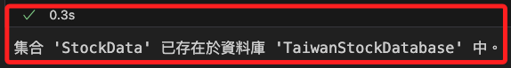
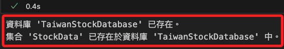
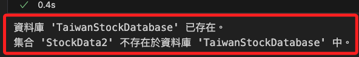
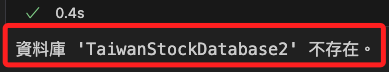

# 集合的查詢與檢查

_以下直接提供各種資料庫中集合的操作功能_

<br>

## 檢查指定集合是否存在

1. 程式碼。

    ```python
    import os
    from pymongo import MongoClient
    import certifi
    import streamlit as st

    # 設置環境變數
    os.environ["OPENAI_API_KEY"] = st.secrets["OPENAI_API_KEY"]
    ATLAS_CONNECTION_STRING = st.secrets["MONGODB_URL"]

    # 連接到 MongoDB Atlas
    client = MongoClient(
        ATLAS_CONNECTION_STRING,
        tlsCAFile=certifi.where()
    )
    db_name = "TaiwanStockDatabase"
    collection_name = "StockData"

    # 連接到指定資料庫
    db = client[db_name]

    # 檢查集合是否存在的函數
    def check_collection_exists(database, collection_name):
        collection_list = database.list_collection_names()
        return collection_name in collection_list

    # 檢查指定的集合是否存在
    if check_collection_exists(db, collection_name):
        print(f"集合 '{collection_name}' 已存在於資料庫 '{db_name}' 中。")
    else:
        print(f"集合 '{collection_name}' 不存在於資料庫 '{db_name}' 中。")
    ```

<br>

2. 若已存在則會出現。

    

<br>

## 先檢查資料庫、再檢查集合

_優化腳本_

<br>

1. 程式碼。

    ```python
    import os
    from pymongo import MongoClient
    import certifi
    import streamlit as st

    # 設置環境變數
    os.environ["OPENAI_API_KEY"] = st.secrets["OPENAI_API_KEY"]
    ATLAS_CONNECTION_STRING = st.secrets["MONGODB_URL"]

    # 連接到 MongoDB Atlas
    client = MongoClient(
        ATLAS_CONNECTION_STRING, tlsCAFile=certifi.where()
    )
    db_name = "TaiwanStockDatabase"
    collection_name = "StockData"

    # 檢查資料庫是否存在的函數
    def check_database_exists(client, db_name):
        database_list = client.list_database_names()
        return db_name in database_list

    # 檢查集合是否存在的函數
    def check_collection_exists(database, collection_name):
        collection_list = database.list_collection_names()
        return collection_name in collection_list

    # 檢查資料庫和集合是否存在
    database_exists = check_database_exists(client, db_name)
    collection_exists = False

    if database_exists:
        db = client[db_name]
        collection_exists = check_collection_exists(db, collection_name)

    # 輸出結果
    if database_exists:
        print(f"資料庫 '{db_name}' 已存在。")
        if collection_exists:
            print(f"集合 '{collection_name}' 已存在於資料庫 '{db_name}' 中。")
        else:
            print(f"集合 '{collection_name}' 不存在於資料庫 '{db_name}' 中。")
    else:
        print(f"資料庫 '{db_name}' 不存在。")

    # 可選的 Streamlit 顯示結果
    st.title("檢查 MongoDB 資料庫和集合")
    if database_exists:
        st.write(f"資料庫 '{db_name}' 已存在。")
        if collection_exists:
            st.write(f"集合 '{collection_name}' 已存在於資料庫 '{db_name}' 中。")
        else:
            st.write(f"集合 '{collection_name}' 不存在於資料庫 '{db_name}' 中。")
    else:
        st.write(f"資料庫 '{db_name}' 不存在。")
    ```

<br>

2. 結果。

    

<br>

3. 查詢集合 `StockData2` 是否存在。

    

<br>

4. 查詢資料庫 `TaiwanStockDatabase2` 是否存在。

    

<br>

## 清空文件 `Documents`

1. 程式碼：刪除指定集合中的文件。

    ```python
    import streamlit as st
    import os
    from pymongo import MongoClient
    import certifi

    # Set environment variables for API keys
    os.environ["OPENAI_API_KEY"] = st.secrets["OPENAI_API_KEY"]
    ATLAS_CONNECTION_STRING = st.secrets["MONGODB_URL"]

    # Connect to MongoDB Atlas
    client = MongoClient(
        ATLAS_CONNECTION_STRING,
        tlsCAFile=certifi.where()
    )
    db_name = "MyDatabase2024"
    collection_name = "MyCollection2024"
    atlas_collection = client[db_name][collection_name]

    # Function to delete all documents in the collection
    def delete_all_documents():
        result = atlas_collection.delete_many({})
        return result.deleted_count

    # Function to check if the collection is empty
    def check_collection_empty():
        count = atlas_collection.count_documents({})
        return count == 0

    # Delete all documents
    deleted_count = delete_all_documents()
    print(f"已刪除 {deleted_count} 筆文件。")

    # Check if the collection is empty
    is_empty = check_collection_empty()
    if is_empty:
        print("文件已清空。")
    else:
        print("文件仍存在於資料庫中。")

    # Display current document count
    current_count = atlas_collection.count_documents({})
    print(f"目前文件數量：{current_count}")
    ```

<br>

___

_END_