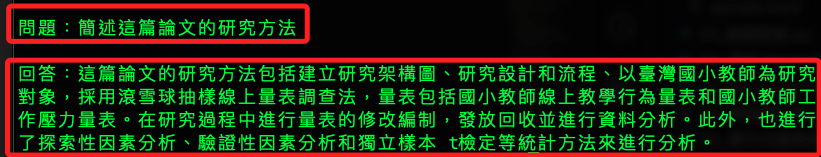
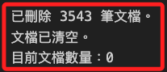

# 實作

_讀取 PDF 並建立向量索引系統_

<br>

## 當前腳本

1. 程式碼：建立為 `app.py`。

    ```python
    # getpass：安全地提示用戶輸入密碼或其他敏感訊息
    import getpass, os, pymongo, pprint
    # PyPDFLoader：載入 PDF 文件並將其內容轉換為可處理的文本或數據結構
    from langchain_community.document_loaders import PyPDFLoader
    # StrOutputParser：將模型生成的輸出解析為字串
    from langchain_core.output_parsers import StrOutputParser
    # RunnablePassthrough：將輸入直接傳遞到下一步而不進行任何處理的可運行單元
    from langchain_core.runnables import RunnablePassthrough
    # 與 MongoDB Atlas Vector Search 集成，以實現向量搜索功能
    from langchain_mongodb import MongoDBAtlasVectorSearch
    # ChatOpenAI 用於與 OpenAI 的聊天模型互動
    # OpenAIEmbeddings 用於生成文本的向量嵌入
    from langchain_openai import ChatOpenAI, OpenAIEmbeddings
    # 定義和管理提示模板，以生成特定的查詢或指令
    from langchain.prompts import PromptTemplate
    # 將長文本拆分為較小的片段，以便於處理和分析。
    from langchain.text_splitter import RecursiveCharacterTextSplitter
    # MongoDB
    from pymongo import MongoClient
    # SSL
    import certifi
    # Streamlit
    import streamlit as st

    os.environ["OPENAI_API_KEY"] = st.secrets["OPENAI_API_KEY"]
    ATLAS_CONNECTION_STRING = st.secrets["MONGODB_URL"]

    # 建立連線
    client = MongoClient(
        ATLAS_CONNECTION_STRING,
        tlsCAFile=certifi.where()
    )
    # 定義資料庫與集合名稱
    db_name = "MyDatabase2024"
    collection_name = "MyCollection2024"
    atlas_collection = client[db_name][collection_name]
    vector_search_index = "vector_index"

    # 載入 PDF
    loader = PyPDFLoader("論文01.pdf")

    data = loader.load()
    # 文件分割器
    text_splitter = RecursiveCharacterTextSplitter(chunk_size=200, chunk_overlap=20)
    # 分割文件
    docs = text_splitter.split_documents(data)
    # 可輸出觀察看看
    print(docs[0], "\n")

    # 建立向量儲存
    vector_search = MongoDBAtlasVectorSearch.from_documents(
        documents=docs,
        embedding=OpenAIEmbeddings(disallowed_special=()),
        collection=atlas_collection,
        index_name=vector_search_index,
    )

    query = "MongoDB Atlas security"
    results = vector_search.similarity_search(query)
    pprint.pprint(results)

    # 將 Atlas Vector Search 實例化為擷取器
    retriever = vector_search.as_retriever(
        # 指定搜索類型為相似度搜索
        search_type="similarity",
        # 設定查詢時僅返回前 10 個相關性最高的文件，並且只使用分數高於 0.75 的文件
        search_kwargs={"k": 10, "score_threshold": 0.75},
    )
    # 定義提示模板
    template = """
    使用以下內容來回答最後的問題。
    如果你不知道答案，就說你不知道，不要試圖編造答案。
    {context}
    問題：{question}
    """

    # 根據模板建立一個提示對象
    custom_rag_prompt = PromptTemplate.from_template(template)
    # 建立一個 OpenAI 聊天模型
    llm = ChatOpenAI()


    # 定義格式化文件的函數
    def format_docs(docs):
        return "\n\n".join(doc.page_content for doc in docs)


    # 建立一條鏈來回答有關自己的數據的問題
    rag_chain = (
        {"context": retriever | format_docs, "question": RunnablePassthrough()}
        | custom_rag_prompt
        | llm
        | StrOutputParser()
    )

    # 問題
    question = "簡述這篇論文的研究方法"

    # 取得與問題相關的文件
    print("\n相關文件：")
    documents = retriever.get_relevant_documents(question)
    # print("\nSource documents:")
    pprint.pprint(documents)


    print("\n問題：" + question)

    # 回答
    answer = rag_chain.invoke(question)
    print("\n回答：" + answer)
    ```

<br>

2. 運行腳本。

    ```bash
    python app.py
    ```

<br>

3. 運行結果。

    

<br>

## 刪除文件

_可參考前面章節的 `刪除指定資料庫對象`_

<br>

1. 依據目前的邏輯，每次執行時都會 `重新載入 PDF 文件` 並 `建立向量儲存`，所以多次執行時，會不斷重複載入文件插到 MongoDB 集合中，並且保留先前的數據，避免重複寫入，可在腳本中增加檢查集合是否已經存在向量嵌入的邏輯，如果集合中已經存在數據，則跳過載入和插入操作，只進行查詢。

<br>

2. 先製作功能來手動刪除當前文件。

    ```python
    import os
    from pymongo import MongoClient
    import certifi

    # Set environment variables for API keys
    os.environ["OPENAI_API_KEY"] = st.secrets["OPENAI_API_KEY"]
    ATLAS_CONNECTION_STRING = st.secrets["MONGODB_URL"]

    # Connect to MongoDB Atlas
    client = MongoClient(
        ATLAS_CONNECTION_STRING,
        tlsCAFile=certifi.where()
    )
    db_name = "MyDatabase2024"
    collection_name = "MyCollection2024"
    atlas_collection = client[db_name][collection_name]

    # Function to delete all documents in the collection
    def delete_all_documents():
        result = atlas_collection.delete_many({})
        return result.deleted_count

    # Function to check if the collection is empty
    def check_collection_empty():
        count = atlas_collection.count_documents({})
        return count == 0

    # Delete all documents
    deleted_count = delete_all_documents()
    print(f"已刪除 {deleted_count} 筆文件。")

    # Check if the collection is empty
    is_empty = check_collection_empty()
    if is_empty:
        print("文件已清空。")
    else:
        print("文件仍存在於資料庫中。")

    # Display current document count
    current_count = atlas_collection.count_documents({})
    print(f"目前文件數量：{current_count}")
    ```

<br>

3. 完成刪除。

    

<br>

## 避免重複建立向量儲存

_優化腳本_

<br>

1. 以下程式碼可在寫入前進行檢查，若已存在向量儲存則直接載入，避免重複寫入，並將腳本改寫為 Streamlit 應用，請以 `streamlit run` 執行以下腳本。

    ```python
    import os
    import pymongo
    import pprint
    import certifi
    import streamlit as st
    from langchain_community.document_loaders import PyPDFLoader
    from langchain_core.output_parsers import StrOutputParser
    from langchain_core.runnables import RunnablePassthrough
    from langchain_mongodb import MongoDBAtlasVectorSearch
    from langchain_openai import ChatOpenAI, OpenAIEmbeddings
    from langchain.prompts import PromptTemplate
    from langchain.text_splitter import RecursiveCharacterTextSplitter
    from pymongo import MongoClient

    # Set environment variables for API keys
    os.environ["OPENAI_API_KEY"] = st.secrets["OPENAI_API_KEY"]
    ATLAS_CONNECTION_STRING = st.secrets["MONGODB_URL"]

    # Connect to MongoDB Atlas
    client = MongoClient(ATLAS_CONNECTION_STRING, tlsCAFile=certifi.where())
    db_name = "MyDatabase2024"
    collection_name = "MyCollection2024"
    atlas_collection = client[db_name][collection_name]
    vector_search_index = "vector_index"

    # Function to load data and create vector store
    def initialize_data():
        # Load PDF
        loader = PyPDFLoader("論文01.pdf")
        data = loader.load()
        # Split documents
        text_splitter = RecursiveCharacterTextSplitter(chunk_size=200, chunk_overlap=20)
        docs = text_splitter.split_documents(data)
        # Create vector store
        vector_search = MongoDBAtlasVectorSearch.from_documents(
            documents=docs,
            embedding=OpenAIEmbeddings(disallowed_special=()),
            collection=atlas_collection,
            index_name=vector_search_index,
        )
        return vector_search

    # Check if the collection is empty and initialize data if necessary
    if atlas_collection.count_documents({}) == 0:
        st.write("初始化資料並建立向量儲存...")
        vector_search = initialize_data()
    else:
        st.write("載入現有向量儲存...")
        vector_search = MongoDBAtlasVectorSearch(
            collection=atlas_collection,
            embedding=OpenAIEmbeddings(disallowed_special=()),
            index_name=vector_search_index
        )

    # Streamlit interface
    st.title("文件問答系統")

    # User input for question
    question = st.text_input("請輸入自己的問題：", "簡述這篇論文的研究方法")

    # Button to trigger query
    if st.button("提交問題"):
        # Initialize retriever and other components
        retriever = vector_search.as_retriever(
            search_type="similarity",
            search_kwargs={"k": 10, "score_threshold": 0.75},
        )
        template = """
        使用以下內容來回答最後的問題。
        如果你不知道答案，就說你不知道，不要試圖編造答案。
        {context}
        問題：{question}
        """
        custom_rag_prompt = PromptTemplate.from_template(template)
        llm = ChatOpenAI()

        def format_docs(docs):
            return "\n\n".join(doc.page_content for doc in docs)

        rag_chain = (
            {"context": retriever | format_docs, "question": RunnablePassthrough()}
            | custom_rag_prompt
            | llm
            | StrOutputParser()
        )

        # Retrieve relevant documents and get the answer
        documents = retriever.get_relevant_documents(question)
        answer = rag_chain.invoke(question)

        # Display results
        st.subheader("相關文件：")
        for doc in documents:
            st.write(doc.page_content)

        st.subheader("回答：")
        st.write(answer)

        # Optionally display source documents
        with st.expander("查看源文件"):
            pprint.pprint(documents)
    ```

<br>

## 添加側邊欄、客製瀏覽器頁籤

_優化腳本_

<br>

1. 添加頁籤。

    ```python
    # 頁籤
    st.set_page_config(
        # 頁籤描述
        page_title="柱子",
        # 圖標
        page_icon=":tada:",
        # 佈局方式
        layout="wide"
    )
    ```

<br>

2. 添加側邊導覽欄。

    ```python
    # 側邊導覽欄
    st.sidebar.title("文件問答系統")
    st.sidebar.write("讀取文件：論文01.pdf")
    ```

<br>

## 處理問答的流程鏈 `Chain`

1. 程式碼。

    ```python
    rag_chain = (
        {
            "context": retriever | format_docs,
            "question": RunnablePassthrough()
        }
        | custom_rag_prompt
        | llm
        | StrOutputParser()
    )
    ```

<br>

2. 這腳本的目的是建立一個 `處理問答的流程鏈`，該鏈條將用於基於語義相似度從文件中檢索相關內容並生成回答。

<br>

3. `retriever | format_docs`

    - `retriever`：這是由 `vector_search.as_retriever()` 建立的檢索器。它負責基於相似度從向量儲存中檢索相關文件。

    - `format_docs`：這是一個函數，用於將檢索到的文件格式化為字串。

    - `retriever | format_docs`：這是管道運算子（`|`），它將 `retriever` 的輸出直接傳遞給 `format_docs` 函數。換句話說，從 `retriever` 檢索到的文件會被傳遞給 `format_docs` 函數進行格式化。

<br>

4. `RunnablePassthrough`

    - `RunnablePassthrough()`：這是一個簡單的運行單元，直接將輸入傳遞到下一步而不進行任何處理。在這裡，它用於處理 "question"（問題）欄位，確保它被正確傳遞到下一步。

<br>

5. `custom_rag_prompt`

    - 這是根據提示模板建立的 `PromptTemplate` 對象，用於指導模型如何回答問題。模板中包含上下文（`context`）和問題（`question`）的占位符。

<br>

6. `llm`

    - `llm` 是一個 OpenAI 聊天模型（例如 ChatGPT），用於生成回答。

<br>

7. `StrOutputParser`

    - `StrOutputParser()`：這是一個輸出解析器，用於將模型的輸出解析為字串格式。

<br>

## 完整範例

1. 程式碼。

    ```python
    # 將讀取的文件名稱顯示在側邊欄，並添加標題與名稱
    import os
    import pymongo
    import pprint
    import certifi
    import streamlit as st
    from langchain_community.document_loaders import PyPDFLoader
    from langchain_core.output_parsers import StrOutputParser
    from langchain_core.runnables import RunnablePassthrough
    from langchain_mongodb import MongoDBAtlasVectorSearch
    from langchain_openai import ChatOpenAI, OpenAIEmbeddings
    from langchain.prompts import PromptTemplate
    from langchain.text_splitter import RecursiveCharacterTextSplitter
    from pymongo import MongoClient

    # 環境變數
    os.environ["OPENAI_API_KEY"] = st.secrets["OPENAI_API_KEY"]
    ATLAS_CONNECTION_STRING = st.secrets["MONGODB_URL"]

    # 連線 MongoDB Atlas
    client = MongoClient(
        ATLAS_CONNECTION_STRING, tlsCAFile=certifi.where()
    )
    db_name = "MyDatabase2024"
    collection_name = "MyCollection2024"
    atlas_collection = client[db_name][collection_name]
    vector_search_index = "vector_index"

    # 頁籤
    st.set_page_config(
        # 頁籤描述
        page_title="柱子",
        # 圖標
        page_icon=":tada:",
        # 佈局方式
        layout="wide"
    )

    # 側邊導覽欄
    st.sidebar.title("文件問答系統")
    st.sidebar.write("讀取文件：論文01.pdf")


    # 載入資料並建立向量儲存 `vector store`
    def initialize_data():
        # 載入 PDF
        loader = PyPDFLoader("論文01.pdf")
        data = loader.load()
        # 文件分割器
        text_splitter = RecursiveCharacterTextSplitter(
            chunk_size=200,
            chunk_overlap=20
        )
        # 分割文件
        docs = text_splitter.split_documents(data)
        # 建立向量儲存
        vector_search = MongoDBAtlasVectorSearch.from_documents(
            documents=docs,
            embedding=OpenAIEmbeddings(disallowed_special=()),
            collection=atlas_collection,
            index_name=vector_search_index,
        )
        return vector_search


    # 檢查向量儲存是否存在
    if atlas_collection.count_documents({}) == 0:
        st.sidebar.write("初始化資料並建立向量儲存...")
        vector_search = initialize_data()
    else:
        st.sidebar.write("已有資料，載入現有向量儲存...")
        vector_search = MongoDBAtlasVectorSearch(
            collection=atlas_collection,
            embedding=OpenAIEmbeddings(disallowed_special=()),
            index_name=vector_search_index,
        )

    # 主標題
    st.title("文件問答系統")

    # 文字輸入框，用於查詢
    question = st.text_input("請輸入自己的問題：", "簡述這篇論文的研究方法")

    # Button to trigger query
    if st.button("提交問題"):
        # Initialize retriever and other components
        retriever = vector_search.as_retriever(
            search_type="similarity",
            search_kwargs={"k": 10, "score_threshold": 0.75},
        )
        template = """
        使用以下內容來回答最後的問題。
        如果你不知道答案，就說你不知道，不要試圖編造答案。
        {context}
        問題：{question}
        """
        custom_rag_prompt = PromptTemplate.from_template(template)
        llm = ChatOpenAI()

        def format_docs(docs):
            return "\n\n".join(doc.page_content for doc in docs)
        # 建立處理問答的 `流程鏈（Chain）`
        rag_chain = (
            {
                "context": retriever | format_docs,
                "question": RunnablePassthrough()
            }
            | custom_rag_prompt
            | llm
            | StrOutputParser()
        )

        # 取得相關文件
        documents = retriever.get_relevant_documents(question)
        # 取得答案
        answer = rag_chain.invoke(question)

        # Display results
        st.subheader("相關文件：")
        for doc in documents:
            st.write(doc.page_content)

        st.subheader("回答：")
        st.write(answer)

        # Optionally display source documents
        with st.expander("查看源文件"):
            pprint.pprint(documents)
    ```


<br>

___

_END_