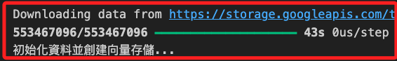
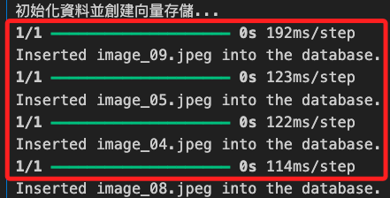
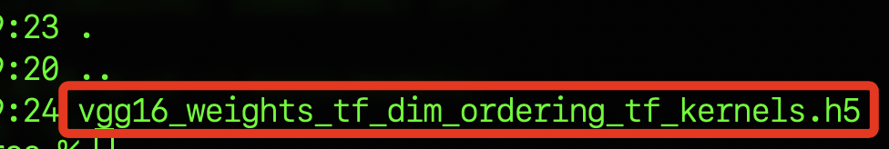
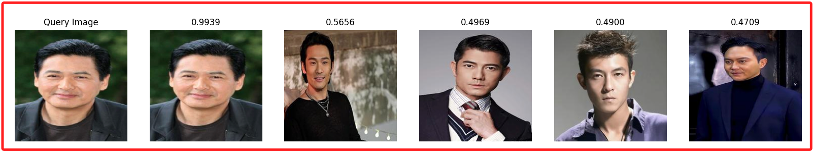
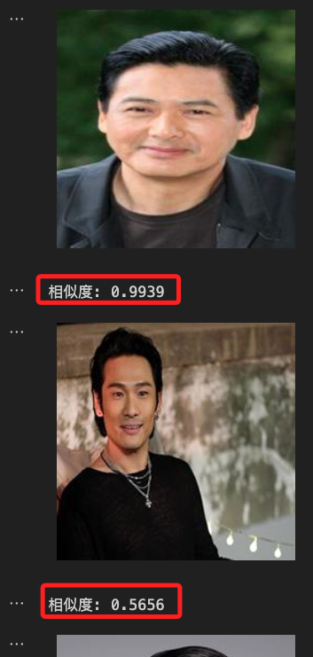
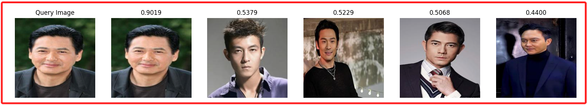
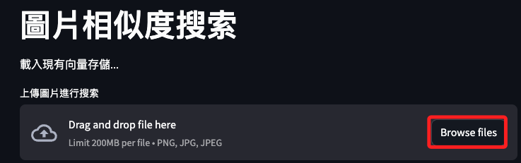
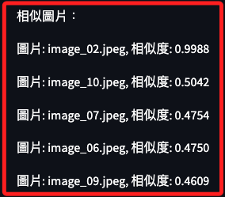

# 向量儲存

_以處理圖片為例_

<br>

## 說明

1. 以下將進行一個典型的計算機視覺任務，處理圖片數據並將其轉換為向量嵌入並儲存在 MongoDB 中，將使用深度學習模型來完成最後的搜尋工作。

<br>

2. 至少需要10張圖片進行嵌入和查詢操作，圖片數量越多，向量儲存和查詢的效果會更好。

<br>

3. 文件採用以下結構進行儲存。

    ```bash
    project_directory/
    ├── image_folder/
    │   ├── image_1.jpg
    │   ├── image_2.jpg
    │   ├── image_3.jpg
    │   ├── ...
    │   └── image_10.jpg
    └── script.py  # 腳本存放於此
    ```

<br>

4. 初始化模型：這裡使用預訓練的 VGG16 模型，並去除最後一層，以取得圖片的特徵嵌入。

<br>

5. 圖片嵌入函數：將圖片轉換為向量嵌入。

<br>

6. 儲存圖片嵌入：將圖片的嵌入儲存在 MongoDB 中。

<br>

7. 查詢圖片：計算查詢圖片與儲存圖片的相似度，並返回最相似的圖片。

<br>

## 轉換相片格式

1. 先遍歷指定資料夾中的所有影像文件，包括 `.jpg`、`.jpeg`、`.png` 都轉換為相同的格式 `.jpg` 並儲存到同一資料夾中。

<br>

2. 安裝了 `Pillow` 庫。

    ```bash
    pip install pillow
    ```

<br>

3. 程式碼。

    ```python
    import os
    from PIL import Image

    def convert_images_to_jpg(source_folder, target_folder, output_format='jpeg', target_size=(224, 224)):
        # 確保輸出格式是小寫
        output_format = output_format.lower()
        
        # 確保目標資料夾存在
        if not os.path.exists(target_folder):
            os.makedirs(target_folder)
        
        # 遍歷來源資料夾中的所有文件
        for filename in os.listdir(source_folder):
            if filename.lower().endswith(('.png', '.jpg', '.jpeg')):
                source_file_path = os.path.join(source_folder, filename)
                img = Image.open(source_file_path)
                # 調整影像大小
                img = img.resize(target_size, Image.Resampling.LANCZOS)
                # 將檔案名稱提取出來
                base = os.path.splitext(filename)[0]
                # 新檔名
                new_filename = f"{base}.{output_format}"
                target_file_path = os.path.join(target_folder, new_filename)
                
                # 儲存為指定格式到目標資料夾
                img.convert('RGB').save(target_file_path, output_format.upper())
                print(f"Converted {filename} to {new_filename} with size {target_size}")

    # 指定來源資料夾和目標資料夾路徑
    source_folder = "./face_detect_source" # 更改為你的來源資料夾路徑
    target_folder = "./face_detect_done" # 更改為你的目標資料夾路徑

    # 轉換所有圖片為 .jpeg 格式，調整解析度並儲存到目標資料夾
    convert_images_to_jpg(source_folder, target_folder, output_format='jpeg', target_size=(224, 224))
    ```

<br>

## 範例

1. 安裝所需的庫：

    - `tensorflow` 或 `torch`：用於載入和處理深度學習模型。
    - `pymongo`：用於連接和操作 MongoDB。
    - `numpy`：用於數據處理。
    - `sklearn.metrics.pairwise`：用於計算向量之間的相似度。

    ```bash
    pip install tensorflow pymongo numpy scikit-learn
    ```

<br>

2. 圖片向量化和儲存的步驟：

    ```python
    import os
    import pandas as pd
    import pymongo
    import pprint
    import certifi
    import json
    from pymongo import MongoClient
    from langchain_openai import ChatOpenAI
    import streamlit as st
    from keras.applications.vgg16 import VGG16
    from keras.models import Model
    from keras.preprocessing import image
    from keras.applications.vgg16 import preprocess_input
    import numpy as np
    import urllib
    import ssl

    # 設置環境變數
    os.environ["OPENAI_API_KEY"] = st.secrets["OPENAI_API_KEY"]
    ATLAS_CONNECTION_STRING = st.secrets["MONGODB_URL"]

    # 連接到 MongoDB Atlas
    client = MongoClient(ATLAS_CONNECTION_STRING, tlsCAFile=certifi.where())
    db_name = "ImageDatabase"
    collection_name = "ImageEmbeddings"
    atlas_collection = client[db_name][collection_name]

    # 忽略SSL证书验证
    ssl._create_default_https_context = ssl._create_unverified_context

    # 初始化模型
    base_model = VGG16(weights='imagenet')
    model = Model(inputs=base_model.input, outputs=base_model.get_layer('fc1').output)

    # 定義圖片嵌入函數
    def get_image_embedding(img_path):
        img = image.load_img(img_path, target_size=(224, 224))
        img_data = image.img_to_array(img)
        img_data = np.expand_dims(img_data, axis=0)
        img_data = preprocess_input(img_data)
        
        vgg16_feature = model.predict(img_data)
        return vgg16_feature.flatten()

    # 刪除現有數據的函數
    def delete_existing_data():
        result = atlas_collection.delete_many({})
        return result.deleted_count

    # 初始化數據
    def initialize_data(image_folder):
        # 刪除現有數據
        delete_existing_data()

        # 遍歷資料夾中的所有圖片文件
        for filename in os.listdir(image_folder):
            if filename.lower().endswith(('.png', '.jpg', '.jpeg')):
                img_path = os.path.join(image_folder, filename)
                embedding = get_image_embedding(img_path)
                atlas_collection.insert_one({"image_name": filename, "embedding": embedding.tolist()})
                print(f"Inserted {filename} into the database.")

    # 搜索相似圖片
    def search_similar_images(query_img_path):
        query_embedding = get_image_embedding(query_img_path)
        
        # 取得所有已儲存的向量
        stored_images = list(atlas_collection.find({}, {"embedding": 1, "image_name": 1, "_id": 0}))
        embeddings = np.array([img["embedding"] for img in stored_images])
        image_names = [img["image_name"] for img in stored_images]
        
        # 計算餘弦相似度
        similarity_scores = cosine_similarity([query_embedding], embeddings).flatten()
        sorted_indices = similarity_scores.argsort()[::-1]  # 按降序排列
        
        # 取得前5個相似的圖片
        top_images = [image_names[i] for i in sorted_indices[:5]]
        return top_images

    # 設置圖片文件夾路徑
    image_folder = "./face_detect_done"

    # 檢查集合是否為空，若為空則初始化資料
    if atlas_collection.count_documents({}) == 0:
        print("初始化資料並建立向量儲存...")
        initialize_data(image_folder)
    else:
        print("載入現有向量儲存...")

    # 搜索相似圖片
    # 更改為所要查詢圖片路徑
    query_img_path = "./face_detect_source/image_01.jpg"
    similar_images = search_similar_images(query_img_path)

    # 顯示結果
    print("相似圖片：")
    for img in similar_images:
        print(img)

    ```

<br>

3. 運行後會先下載模型，然後建立向量儲存。

    

<br>

4. 接著顯示 `Inserted image into the database`。

    

<br>

5. 最後進行比對。

    

<br>

## 說明

1. 一旦模型的 `權重文件` 下載並保存到本地快取目錄後，`Keras` 在後續的使用中會直接從本地載入這些文件，不會再次從網路下載。

<br>

2. 這個文件通常位於 `~/.keras/models/`

    ```bash
    ls ~/.keras/models/
    ```

    

<br>

## 優化當前腳本

_添加評分_

<br>

1. 程式碼。

    ```python
    import os
    import pymongo
    import certifi
    import json
    from pymongo import MongoClient
    from keras.applications.vgg16 import VGG16
    from keras.models import Model
    from keras.preprocessing import image
    from keras.applications.vgg16 import preprocess_input
    from sklearn.metrics.pairwise import cosine_similarity
    import numpy as np
    import ssl

    # 設置環境變數
    os.environ["OPENAI_API_KEY"] = st.secrets["OPENAI_API_KEY"]
    ATLAS_CONNECTION_STRING = st.secrets["MONGODB_URL"]

    # 連接到 MongoDB Atlas
    client = MongoClient(ATLAS_CONNECTION_STRING, tlsCAFile=certifi.where())
    db_name = "ImageDatabase"
    collection_name = "ImageEmbeddings"
    atlas_collection = client[db_name][collection_name]

    # 忽略SSL证书验证
    ssl._create_default_https_context = ssl._create_unverified_context

    # 初始化模型
    base_model = VGG16(weights='imagenet')
    model = Model(inputs=base_model.input, outputs=base_model.get_layer('fc1').output)

    # 定義圖片嵌入函數
    def get_image_embedding(img_path):
        img = image.load_img(img_path, target_size=(224, 224))
        img_data = image.img_to_array(img)
        img_data = np.expand_dims(img_data, axis=0)
        img_data = preprocess_input(img_data)
        
        vgg16_feature = model.predict(img_data)
        return vgg16_feature.flatten()

    # 刪除現有數據的函數
    def delete_existing_data():
        result = atlas_collection.delete_many({})
        return result.deleted_count

    # 初始化數據
    def initialize_data(image_folder):
        # 刪除現有數據
        delete_existing_data()

        # 遍歷資料夾中的所有圖片文件
        for filename in os.listdir(image_folder):
            if filename.lower().endswith(('.png', '.jpg', '.jpeg')):
                img_path = os.path.join(image_folder, filename)
                embedding = get_image_embedding(img_path)
                atlas_collection.insert_one({"image_name": filename, "embedding": embedding.tolist()})
                print(f"Inserted {filename} into the database.")

    # 搜索相似圖片並顯示相似度
    def search_similar_images(query_img_path):
        query_embedding = get_image_embedding(query_img_path)
        
        # 取得所有已儲存的向量
        stored_images = list(atlas_collection.find({}, {"embedding": 1, "image_name": 1, "_id": 0}))
        embeddings = np.array([img["embedding"] for img in stored_images])
        image_names = [img["image_name"] for img in stored_images]
        
        # 計算餘弦相似度
        similarity_scores = cosine_similarity([query_embedding], embeddings).flatten()
        sorted_indices = similarity_scores.argsort()[::-1]  # 按降序排列
        
        # 取得前5個相似的圖片及其相似度
        top_images = [(image_names[i], similarity_scores[i]) for i in sorted_indices[:5]]
        return top_images

    # 設置圖片文件夾路徑
    image_folder = "./face_detect_done"

    # 檢查集合是否為空，若為空則初始化資料
    if atlas_collection.count_documents({}) == 0:
        print("初始化資料並建立向量儲存...")
        initialize_data(image_folder)
    else:
        print("載入現有向量儲存...")

    # 搜索相似圖片
    # 更改為所要查詢圖片路徑
    query_img_path = "./face_detect_source/image_01.jpg"
    similar_images = search_similar_images(query_img_path)

    # 顯示結果
    print("相似圖片：")
    for img, similarity in similar_images:
        print(f"圖片: {img}, 相似度: {similarity:.4f}")
    ```

<br>

2. 運行結果。

    ```bash
    載入現有向量儲存...
    1/1 ━━━━━━━━━━━━━━━━━━━━ 0s 210ms/step
    相似圖片：
    圖片: image_01.jpeg, 相似度: 0.9939
    圖片: image_07.jpeg, 相似度: 0.5656
    圖片: image_09.jpeg, 相似度: 0.4969
    圖片: image_06.jpeg, 相似度: 0.4900
    圖片: image_08.jpeg, 相似度: 0.4709
    ```

<br>

## 再優化

_展示出圖片_

<br>

1. 安裝必要套件。

    ```bash
    pip install matplotlib
    ```

<br>

2. 程式碼：以下腳本將在終端機中以 `python 腳本名稱.py` 運行。

    ```python
    import os
    import pymongo
    import certifi
    import json
    from pymongo import MongoClient
    from keras.applications.vgg16 import VGG16
    from keras.models import Model
    from keras.preprocessing import image
    from keras.applications.vgg16 import preprocess_input
    from sklearn.metrics.pairwise import cosine_similarity
    import numpy as np
    import ssl
    import matplotlib.pyplot as plt
    import streamlit as st

    # 設置環境變數
    os.environ["OPENAI_API_KEY"] = st.secrets["OPENAI_API_KEY"]
    ATLAS_CONNECTION_STRING = st.secrets["MONGODB_URL"]

    # 連接到 MongoDB Atlas
    client = MongoClient(ATLAS_CONNECTION_STRING, tlsCAFile=certifi.where())
    db_name = "ImageDatabase"
    collection_name = "ImageEmbeddings"
    atlas_collection = client[db_name][collection_name]

    # 忽略SSL证书验证
    ssl._create_default_https_context = ssl._create_unverified_context

    # 初始化模型
    base_model = VGG16(weights="imagenet")
    model = Model(inputs=base_model.input, outputs=base_model.get_layer("fc1").output)


    # 定義圖片嵌入函數
    def get_image_embedding(img_path):
        img = image.load_img(img_path, target_size=(224, 224))
        img_data = image.img_to_array(img)
        img_data = np.expand_dims(img_data, axis=0)
        img_data = preprocess_input(img_data)

        vgg16_feature = model.predict(img_data)
        return vgg16_feature.flatten()


    # 刪除現有數據的函數
    def delete_existing_data():
        result = atlas_collection.delete_many({})
        return result.deleted_count


    # 初始化數據
    def initialize_data(image_folder):
        # 刪除現有數據
        delete_existing_data()

        # 遍歷資料夾中的所有圖片文件
        for filename in os.listdir(image_folder):
            if filename.lower().endswith((".png", ".jpg", ".jpeg")):
                img_path = os.path.join(image_folder, filename)
                embedding = get_image_embedding(img_path)
                atlas_collection.insert_one(
                    {"image_name": filename, "embedding": embedding.tolist()}
                )
                print(f"Inserted {filename} into the database.")


    # 搜索相似圖片並顯示相似度
    def search_similar_images(query_img_path):
        query_embedding = get_image_embedding(query_img_path)

        # 取得所有已儲存的向量
        stored_images = list(
            atlas_collection.find({}, {"embedding": 1, "image_name": 1, "_id": 0})
        )
        embeddings = np.array([img["embedding"] for img in stored_images])
        image_names = [img["image_name"] for img in stored_images]

        # 計算餘弦相似度
        similarity_scores = cosine_similarity([query_embedding], embeddings).flatten()
        sorted_indices = similarity_scores.argsort()[::-1]  # 按降序排列

        # 取得前5個相似的圖片及其相似度
        top_images = [(image_names[i], similarity_scores[i]) for i in sorted_indices[:5]]
        return top_images


    # 顯示圖片
    def display_images(query_img_path, similar_images, image_folder):
        fig, axes = plt.subplots(1, 6, figsize=(20, 5))

        # 顯示查詢圖片
        query_img = image.load_img(query_img_path, target_size=(224, 224))
        axes[0].imshow(query_img)
        axes[0].set_title("Query Image")
        axes[0].axis("off")

        # 顯示相似圖片
        for i, (img_name, similarity) in enumerate(similar_images):
            img_path = os.path.join(image_folder, img_name)
            img = image.load_img(img_path, target_size=(224, 224))
            axes[i + 1].imshow(img)
            axes[i + 1].set_title(f"{similarity:.4f}")
            axes[i + 1].axis("off")

        plt.show()


    # 設置圖片文件夾路徑
    image_folder = "./face_detect_done"

    # 檢查集合是否為空，若為空則初始化資料
    if atlas_collection.count_documents({}) == 0:
        print("初始化資料並建立向量儲存...")
        initialize_data(image_folder)
    else:
        print("載入現有向量儲存...")

    # 搜索相似圖片
    # 更改為所要查詢圖片路徑
    query_img_path = "./face_detect_source/image_01.jpg"
    similar_images = search_similar_images(query_img_path)

    # 顯示結果
    print("相似圖片：")
    for img, similarity in similar_images:
        print(f"圖片: {img}, 相似度: {similarity:.4f}")

    # 顯示查詢圖片和相似圖片
    display_images(query_img_path, similar_images, image_folder)

    ```

<br>

3. 結果。

    

<br>

4. 假如在 Jupyter Notebook 中執行此腳本，需導入 `IPython.display` 函式庫，並在原本顯示圖片的函數 `display_images` 添加以下程式碼。

    ```python
    # 新增導入庫
    from IPython.display import display, Image as IPImage

    # 修改函數，添加最下方的程式碼
    def display_images(query_img_path, similar_images, image_folder):

        # 以上程式碼不變 ...    
        plt.show()
        # 添加以下程式碼

        # 在 Jupyter Notebook 中顯示圖片
        display(IPImage(query_img_path))
        for img_name, similarity in similar_images:
            img_path = os.path.join(image_folder, img_name)
            display(IPImage(img_path))
            print(f'相似度: {similarity:.4f}')
    ```

<br>

5. 結果。

    

<br>

## 不要壓縮圖片

1. 當前程式碼使用 `img.resize` 方法來調整圖片大小，預設情況下這會以壓縮或拉伸的方式調整圖片大小，而不是裁剪。

<br>

2. 如果希望在調整影像大小時保持原始比例並進行裁剪，可以使用 Image 庫中的 ImageOps.fit 方法，先調整圖片大小，將 `短邊` 縮至指定大小，然後將長邊置中，接著對相片進行裁剪，以確保圖片在轉換過程中不會被壓縮或放大。

    ```python
    # 定義圖片嵌入函數
    def get_image_embedding(img_path):
        img = Image.open(img_path)
        # 先調整短邊至224
        width, height = img.size
        if width < height:
            new_width = 224
            new_height = int(height * (224 / width))
        else:
            new_height = 224
            new_width = int(width * (224 / height))
        
        img = img.resize((new_width, new_height), Image.LANCZOS)
        # 再進行裁剪
        img = ImageOps.fit(img, (224, 224), Image.LANCZOS)
        img_data = image.img_to_array(img)
        img_data = np.expand_dims(img_data, axis=0)
        img_data = preprocess_input(img_data)

        vgg16_feature = model.predict(img_data)
        return vgg16_feature.flatten()
    ```

<br>

3. 程式碼。

    ```python
    import os
    import pymongo
    import certifi
    import json
    from pymongo import MongoClient
    from keras.applications.vgg16 import VGG16
    from keras.models import Model
    from keras.preprocessing import image
    from keras.applications.vgg16 import preprocess_input
    from sklearn.metrics.pairwise import cosine_similarity
    import numpy as np
    import ssl
    import matplotlib.pyplot as plt
    from IPython.display import display, Image as IPImage
    from PIL import Image, ImageOps
    import streamlit as st

    # 設置環境變數
    os.environ["OPENAI_API_KEY"] = st.secrets["OPENAI_API_KEY"]
    ATLAS_CONNECTION_STRING = st.secrets["MONGODB_URL"]

    # 連接到 MongoDB Atlas
    client = MongoClient(
        ATLAS_CONNECTION_STRING, tlsCAFile=certifi.where()
    )
    # 指定資料庫及集合
    db_name = "ImageDatabase"
    collection_name = "ImageEmbeddings"
    atlas_collection = client[db_name][collection_name]

    # 忽略 SSL 證書驗證
    ssl._create_default_https_context = ssl._create_unverified_context

    # 初始化模型
    base_model = VGG16(weights="imagenet")
    model = Model(inputs=base_model.input, outputs=base_model.get_layer("fc1").output)


    # 定義圖片嵌入函數
    def get_image_embedding(img_path):
        img = Image.open(img_path)
        # 先調整短邊至224
        width, height = img.size
        if width < height:
            new_width = 224
            new_height = int(height * (224 / width))
        else:
            new_height = 224
            new_width = int(width * (224 / height))

        img = img.resize((new_width, new_height), Image.LANCZOS)
        # 再進行裁剪
        img = ImageOps.fit(img, (224, 224), Image.LANCZOS)
        img_data = image.img_to_array(img)
        img_data = np.expand_dims(img_data, axis=0)
        img_data = preprocess_input(img_data)

        vgg16_feature = model.predict(img_data)
        return vgg16_feature.flatten()


    # 刪除現有數據的函數
    def delete_existing_data():
        result = atlas_collection.delete_many({})
        return result.deleted_count


    # 初始化數據
    def initialize_data(image_folder):
        # 刪除現有數據
        delete_existing_data()

        # 遍歷資料夾中的所有圖片文件
        for filename in os.listdir(image_folder):
            if filename.lower().endswith((".png", ".jpg", ".jpeg")):
                img_path = os.path.join(image_folder, filename)
                embedding = get_image_embedding(img_path)
                atlas_collection.insert_one(
                    {"image_name": filename, "embedding": embedding.tolist()}
                )
                print(f"Inserted {filename} into the database.")


    # 搜索相似圖片並顯示相似度
    def search_similar_images(query_img_path):
        query_embedding = get_image_embedding(query_img_path)

        # 取得所有已儲存的向量
        stored_images = list(
            atlas_collection.find({}, {"embedding": 1, "image_name": 1, "_id": 0})
        )
        embeddings = np.array([img["embedding"] for img in stored_images])
        image_names = [img["image_name"] for img in stored_images]

        # 計算餘弦相似度
        similarity_scores = cosine_similarity([query_embedding], embeddings).flatten()
        # 按降序排列
        sorted_indices = similarity_scores.argsort()[::-1]

        # 取得前5個相似的圖片及其相似度
        top_images = [(image_names[i], similarity_scores[i]) for i in sorted_indices[:5]]
        return top_images


    # 顯示圖片
    def display_images(query_img_path, similar_images, image_folder):
        fig, axes = plt.subplots(1, 6, figsize=(20, 5))

        # 顯示查詢圖片
        query_img = image.load_img(
            query_img_path,
            target_size=(224, 224)
        )
        axes[0].imshow(query_img)
        axes[0].set_title("Query Image")
        axes[0].axis("off")

        # 顯示相似圖片
        for i, (img_name, similarity) in enumerate(similar_images):
            img_path = os.path.join(image_folder, img_name)
            img = image.load_img(img_path, target_size=(224, 224))
            axes[i + 1].imshow(img)
            axes[i + 1].set_title(f"{similarity:.4f}")
            axes[i + 1].axis("off")

        plt.show()

        # 在 Jupyter Notebook 中顯示圖片
        display(IPImage(query_img_path))
        for img_name, similarity in similar_images:
            img_path = os.path.join(image_folder, img_name)
            display(IPImage(img_path))
            print(f"相似度: {similarity:.4f}")


    # 設置圖片文件夾路徑
    image_folder = "./face_detect_done"

    # 檢查集合是否為空，若為空則初始化資料
    if atlas_collection.count_documents({}) == 0:
        print("初始化資料並建立向量儲存...")
        initialize_data(image_folder)
    else:
        print("載入現有向量儲存...")

    # 搜索相似圖片
    # 更改為所要查詢圖片路徑
    query_img_path = "./face_detect_source/image_01.jpg"
    similar_images = search_similar_images(query_img_path)

    # 顯示結果
    print("相似圖片：")
    for img, similarity in similar_images:
        print(f"圖片: {img}, 相似度: {similarity:.4f}")

    # 顯示查詢圖片和相似圖片
    display_images(query_img_path, similar_images, image_folder)

    ```

<br>

4. 結果。

    

<br>

## 結合 Streamlit

1. 程式碼。

    ```python
    import os
    import pymongo
    import certifi
    import json
    from pymongo import MongoClient
    from keras.applications.vgg16 import VGG16
    from keras.models import Model
    from keras.preprocessing import image
    from keras.applications.vgg16 import preprocess_input
    from sklearn.metrics.pairwise import cosine_similarity
    import numpy as np
    import ssl
    import streamlit as st
    from PIL import Image, ImageOps

    # 設置環境變數
    os.environ["OPENAI_API_KEY"] = st.secrets["OPENAI_API_KEY"]
    ATLAS_CONNECTION_STRING = st.secrets["MONGODB_URL"]

    # 連接到 MongoDB Atlas
    client = MongoClient(ATLAS_CONNECTION_STRING, tlsCAFile=certifi.where())
    db_name = "ImageDatabase"
    collection_name = "ImageEmbeddings"
    atlas_collection = client[db_name][collection_name]

    # 忽略 SSL 證書驗證
    ssl._create_default_https_context = ssl._create_unverified_context

    # 初始化模型
    base_model = VGG16(weights="imagenet")
    model = Model(inputs=base_model.input, outputs=base_model.get_layer("fc1").output)


    # 定義圖片嵌入函數
    def get_image_embedding(img_path):
        img = Image.open(img_path)
        # 先調整短邊至224
        width, height = img.size
        if width < height:
            new_width = 224
            new_height = int(height * (224 / width))
        else:
            new_height = 224
            new_width = int(width * (224 / height))

        img = img.resize((new_width, new_height), Image.LANCZOS)
        # 再進行裁剪
        img = ImageOps.fit(img, (224, 224), Image.LANCZOS)
        img_data = image.img_to_array(img)
        img_data = np.expand_dims(img_data, axis=0)
        img_data = preprocess_input(img_data)

        vgg16_feature = model.predict(img_data)
        return vgg16_feature.flatten()


    # 刪除現有數據的函數
    def delete_existing_data():
        result = atlas_collection.delete_many({})
        return result.deleted_count


    # 初始化數據
    def initialize_data(image_folder):
        # 刪除現有數據
        delete_existing_data()

        # 遍歷資料夾中的所有圖片文件
        for filename in os.listdir(image_folder):
            if filename.lower().endswith((".png", ".jpg", ".jpeg")):
                img_path = os.path.join(image_folder, filename)
                embedding = get_image_embedding(img_path)
                atlas_collection.insert_one(
                    {"image_name": filename, "embedding": embedding.tolist()}
                )
                print(f"Inserted {filename} into the database.")


    # 搜索相似圖片並顯示相似度
    def search_similar_images(query_img_path):
        query_embedding = get_image_embedding(query_img_path)

        # 取得所有已儲存的向量
        stored_images = list(
            atlas_collection.find({}, {"embedding": 1, "image_name": 1, "_id": 0})
        )
        embeddings = np.array([img["embedding"] for img in stored_images])
        image_names = [img["image_name"] for img in stored_images]

        # 計算餘弦相似度
        similarity_scores = cosine_similarity([query_embedding], embeddings).flatten()
        # 按降序排列
        sorted_indices = similarity_scores.argsort()[::-1]

        # 取得前5個相似的圖片及其相似度
        top_images = [(image_names[i], similarity_scores[i]) for i in sorted_indices[:5]]
        return top_images


    # 顯示圖片
    def display_images(query_img_path, similar_images, image_folder):
        # 在 Streamlit 中顯示查詢圖片
        st.image(query_img_path, caption="Query Image", use_column_width=True)

        # 顯示相似圖片
        for img_name, similarity in similar_images:
            img_path = os.path.join(image_folder, img_name)
            st.image(img_path, caption=f"相似度: {similarity:.4f}", use_column_width=True)


    # Streamlit 應用程序
    st.title("圖片相似度搜索")

    # 設置圖片文件夾路徑
    image_folder = "./face_detect_done"

    # 檢查集合是否為空，若為空則初始化資料
    if atlas_collection.count_documents({}) == 0:
        st.write("初始化資料並建立向量儲存...")
        initialize_data(image_folder)
    else:
        st.write("載入現有向量儲存...")

    # 確保上傳圖片的目錄存在
    upload_folder = "./uploaded_images"
    os.makedirs(upload_folder, exist_ok=True)

    # 上傳圖片
    uploaded_file = st.file_uploader("上傳圖片進行搜索", type=["png", "jpg", "jpeg"])

    if uploaded_file is not None:
        # 保存上傳的圖片
        query_img_path = os.path.join(upload_folder, uploaded_file.name)
        with open(query_img_path, "wb") as f:
            f.write(uploaded_file.getbuffer())

        # 搜索相似圖片
        similar_images = search_similar_images(query_img_path)

        # 顯示結果
        st.write("相似圖片：")
        for img, similarity in similar_images:
            st.write(f"圖片: {img}, 相似度: {similarity:.4f}")

        # 顯示查詢圖片和相似圖片
        display_images(query_img_path, similar_images, image_folder)

    ```

<br>

2. 使用終端機運行。

    ```bash
    streamlit run <腳本名稱>.py
    ```

<br>

3. 點擊上傳一張要比對的相片。

    

<br>

4. 接著會輸出五張相似度由高到低的圖片。

    

<br>

## 取消重置資料庫

1. 重新啟動服務時，不要刪除現有資料，也就是不要調用 `delete_existing_data`，相反地，進行檢查是否存在同名檔案。

    ```python
    # 初始化數據
    def initialize_data(image_folder):
        # 刪除現有數據
        # delete_existing_data()

        # 遍歷資料夾中的所有圖片文件
        for filename in os.listdir(image_folder):
            if filename.lower().endswith((".png", ".jpg", ".jpeg")):
                img_path = os.path.join(image_folder, filename)
                embedding = get_image_embedding(img_path)
                atlas_collection.insert_one(
                    {"image_name": filename, "embedding": embedding.tolist()}
                )
                print(f"Inserted {filename} into the database.")
    ```

<br>

2. 加入 `session_state` 來紀錄 `刪除動作`，避免在 `刪除` 之後立即又匯入資料，所以刪除後會紀錄。

    ```python
    # 修改刪除現有數據的函數
    def delete_existing_data():
        result = atlas_collection.delete_many({})
        # 刪除後變更狀態
        st.session_state["data_deleted"] = True
        return result.deleted_count
    ```

<br>

3. 另外，將原本的 `delete_existing_data` 函數做成獨立的按鍵來選用。

    ```python
    # 在側邊欄添加刪除數據的按鈕
    if st.sidebar.button("刪除所有數據"):
        delete_count = delete_existing_data()
        st.sidebar.write(f"已刪除 {delete_count} 條數據")
        st.experimental_rerun()  # 刪除數據後重新運行應用
    ```

<br>

4. 在刪除按鈕之後要添加檢查 `session_state["data_deleted"]` 狀態的程式碼。

    ```python
    # 檢查 session state 中的刪除狀態
    if "data_deleted" not in st.session_state:
        st.session_state["data_deleted"] = False

    # 只有當數據未被刪除時才初始化數據
    if not st.session_state["data_deleted"]:
        # 檢查集合是否為空，若為空則初始化資料
        if atlas_collection.count_documents({}) == 0:
            st.write("初始化資料並建立向量儲存...")
            initialize_data(image_folder)
        else:
            st.write("載入現有向量儲存...")
    ```

<br>

5. 同樣在側邊欄位中添加一個顯示當前資料筆數的訊息。

    ```python
    # 顯示當前資料庫中的資料筆數
    data_count = atlas_collection.count_documents({})
    st.sidebar.write(f"當前資料庫中的資料筆數: {data_count}")
    ```

<br>

6. 刪除同時也記錄數據狀態。

    ```python
    # 修改刪除現有數據的函數
    def delete_existing_data():
        result = atlas_collection.delete_many({})
        # 刪除後變更狀態
        st.session_state["data_deleted"] = True
        return result.deleted_count
    ```

<br>

7. 修改 `initialize_data`，檢查圖片是否已經存在，完成後標示 `已初始化`。

    ```python
    # 初始化數據
    def initialize_data(image_folder):
        # 遍歷資料夾中的所有圖片文件
        for filename in os.listdir(image_folder):
            if filename.lower().endswith((".png", ".jpg", ".jpeg")):
                img_path = os.path.join(image_folder, filename)
                # 檢查圖片是否已存在
                if atlas_collection.count_documents({"image_name": filename}) == 0:
                    embedding = get_image_embedding(img_path)
                    atlas_collection.insert_one(
                        {"image_name": filename, "embedding": embedding.tolist()}
                    )
                    print(f"Inserted {filename} into the database.")
    ```

<br>

8. 添加了刪除功能後，必須在上傳比對相片後，檢查當前資料庫是否有資料，添加檢查是否為空的邏輯。

    ```python
    # 搜索相似圖片並顯示相似度
    def search_similar_images(query_img_path):
        query_embedding = get_image_embedding(query_img_path)

        # 取得所有已儲存的向量
        stored_images = list(
            atlas_collection.find({}, {"embedding": 1, "image_name": 1, "_id": 0})
        )
        # 添加檢查是否為空的邏輯
        if len(stored_images) == 0:
            st.error("資料庫為空，無法進行相似圖片搜索。請先添加一些圖片到資料庫中。")
            return []

        embeddings = np.array([img["embedding"] for img in stored_images])
        image_names = [img["image_name"] for img in stored_images]

        # 計算餘弦相似度
        similarity_scores = cosine_similarity([query_embedding], embeddings).flatten()
        # 按降序排列
        sorted_indices = similarity_scores.argsort()[::-1]

        # 取得前5個相似的圖片及其相似度
        top_images = [(image_names[i], similarity_scores[i]) for i in sorted_indices[:5]]
        return top_images
    ```

<br>

9. 程式碼：當前腳本。

    ```python
    import os
    import pymongo
    import certifi
    import json
    from pymongo import MongoClient
    from keras.applications.vgg16 import VGG16
    from keras.models import Model
    from keras.preprocessing import image
    from keras.applications.vgg16 import preprocess_input
    from sklearn.metrics.pairwise import cosine_similarity
    import numpy as np
    import ssl
    import streamlit as st
    from PIL import Image, ImageOps

    # 設置環境變數
    os.environ["OPENAI_API_KEY"] = st.secrets["OPENAI_API_KEY"]
    ATLAS_CONNECTION_STRING = st.secrets["MONGODB_URL"]

    # 連接到 MongoDB Atlas
    client = MongoClient(ATLAS_CONNECTION_STRING, tlsCAFile=certifi.where())
    db_name = "ImageDatabase"
    collection_name = "ImageEmbeddings"
    atlas_collection = client[db_name][collection_name]

    # 忽略 SSL 證書驗證
    ssl._create_default_https_context = ssl._create_unverified_context

    # 初始化模型
    base_model = VGG16(weights="imagenet")
    model = Model(inputs=base_model.input, outputs=base_model.get_layer("fc1").output)


    # 定義圖片嵌入函數
    def get_image_embedding(img_path):
        img = Image.open(img_path)
        # 先調整短邊至224
        width, height = img.size
        if width < height:
            new_width = 224
            new_height = int(height * (224 / width))
        else:
            new_height = 224
            new_width = int(width * (224 / height))

        img = img.resize((new_width, new_height), Image.LANCZOS)
        # 再進行裁剪
        img = ImageOps.fit(img, (224, 224), Image.LANCZOS)
        img_data = image.img_to_array(img)
        img_data = np.expand_dims(img_data, axis=0)
        img_data = preprocess_input(img_data)

        vgg16_feature = model.predict(img_data)
        return vgg16_feature.flatten()


    # 刪除現有數據的函數
    def delete_existing_data():
        result = atlas_collection.delete_many({})
        # 刪除後變更狀態
        st.session_state["data_deleted"] = True
        return result.deleted_count


    # 初始化數據
    def initialize_data(image_folder):
        # 刪除現有數據
        # delete_existing_data()

        # 遍歷資料夾中的所有圖片文件
        for filename in os.listdir(image_folder):
            if filename.lower().endswith((".png", ".jpg", ".jpeg")):
                img_path = os.path.join(image_folder, filename)
                # 檢查圖片是否已存在
                if atlas_collection.count_documents({"image_name": filename}) == 0:
                    embedding = get_image_embedding(img_path)
                    atlas_collection.insert_one(
                        {"image_name": filename, "embedding": embedding.tolist()}
                    )
                    print(f"Inserted {filename} into the database.")


    # 搜索相似圖片並顯示相似度
    def search_similar_images(query_img_path):
        query_embedding = get_image_embedding(query_img_path)

        # 取得所有已儲存的向量
        stored_images = list(
            atlas_collection.find({}, {"embedding": 1, "image_name": 1, "_id": 0})
        )
        # 添加檢查是否為空的邏輯
        if len(stored_images) == 0:
            st.error("資料庫為空，無法進行相似圖片搜索。請先添加一些圖片到資料庫中。")
            return []

        embeddings = np.array([img["embedding"] for img in stored_images])
        image_names = [img["image_name"] for img in stored_images]

        # 計算餘弦相似度
        similarity_scores = cosine_similarity([query_embedding], embeddings).flatten()
        # 按降序排列
        sorted_indices = similarity_scores.argsort()[::-1]

        # 取得前5個相似的圖片及其相似度
        top_images = [(image_names[i], similarity_scores[i]) for i in sorted_indices[:5]]
        return top_images


    # 顯示圖片
    def display_images(query_img_path, similar_images, image_folder):
        # 在 Streamlit 中顯示查詢圖片
        st.image(query_img_path, caption="Query Image", use_column_width=True)

        # 顯示相似圖片
        for img_name, similarity in similar_images:
            img_path = os.path.join(image_folder, img_name)
            st.image(img_path, caption=f"相似度: {similarity:.4f}", use_column_width=True)


    # Streamlit 應用程序
    st.title("圖片相似度搜索")

    # 設置圖片文件夾路徑
    image_folder = "./face_detect_done"

    # 檢查集合是否為空，若為空則初始化資料
    if atlas_collection.count_documents({}) == 0:
        st.write("初始化資料並建立向量儲存...")
        initialize_data(image_folder)
    else:
        st.write("載入現有向量儲存...")

    # 確保上傳圖片的目錄存在
    upload_folder = "./uploaded_images"
    os.makedirs(upload_folder, exist_ok=True)

    # 上傳圖片
    uploaded_file = st.file_uploader("上傳圖片進行搜索", type=["png", "jpg", "jpeg"])

    if st.sidebar.button("刪除所有數據"):
        # 調用自訂函數刪除數據
        delete_count = delete_existing_data()
        st.sidebar.write(f"已刪除 {delete_count} 條數據")
        # 刪除數據後重新運行應用
        st.experimental_rerun()

    if "data_deleted" not in st.session_state:
        st.session_state["data_deleted"] = False

    # 只有當數據未被刪除時才初始化數據
    if not st.session_state["data_deleted"]:
        # 檢查集合是否為空，若為空則初始化資料
        if atlas_collection.count_documents({}) == 0:
            st.write("初始化資料並建立向量儲存...")
            initialize_data(image_folder)
        else:
            st.write("載入現有向量儲存...")

    # 顯示當前資料庫中的資料筆數
    data_count = atlas_collection.count_documents({})
    st.sidebar.write(f"當前資料庫中的資料筆數: {data_count}")

    if uploaded_file is not None:
        # 保存上傳的圖片
        query_img_path = os.path.join(upload_folder, uploaded_file.name)
        with open(query_img_path, "wb") as f:
            f.write(uploaded_file.getbuffer())

        # 搜索相似圖片
        similar_images = search_similar_images(query_img_path)

        # 顯示結果
        st.write("相似圖片：")
        for img, similarity in similar_images:
            st.write(f"圖片: {img}, 相似度: {similarity:.4f}")

        # 顯示查詢圖片和相似圖片
        display_images(query_img_path, similar_images, image_folder)

    ```

<br>

## 排除刪除後會恢復初始狀態的問題

1. 當前的邏輯是點擊刪除按鈕之後，程序會回到初始狀態，也就是重新將資料夾中的相片存入資料庫中。

<br>

2. 在頁面重新載入時檢查 data_deleted 狀態，避免重新初始化數據。

    ```python
    # 檢查集合是否為空，若為空且未刪除則初始化資料
    if atlas_collection.count_documents({}) == 0 and not st.session_state.get("data_deleted", False):
        st.write("初始化資料並建立向量儲存...")
        initialize_data(image_folder)
        st.session_state["data_initialized"] = True
    else:
        st.write("載入現有向量儲存...")
    ```

<br>

3. 確保在初始化數據後將 data_deleted 設置為 False。

    ```python
    # 只有當數據未被刪除時才初始化數據
    if not st.session_state["data_deleted"]:
        # 檢查集合是否為空，若為空則初始化資料
        if atlas_collection.count_documents({}) == 0:
            st.write("初始化資料並建立向量儲存...")
            initialize_data(image_folder)
            # 添加狀態的設定
            st.session_state["data_initialized"] = True
        else:
            st.write("載入現有向量儲存...")
    ```

<br>

4. 在導入庫完成之後、設置環境變數之前，添加以下程式碼，避免 `Keras` 模型初始化時的名稱衝突問題。

    ```python
    import tensorflow as tf

    # 避免Keras模型初始化時的名稱衝突問題
    tf.keras.backend.clear_session()
    ```

<br>

## 完整範例

1. 程式碼。

    ```python
    import os
    import pymongo
    import certifi
    import json
    from pymongo import MongoClient
    from keras.applications.vgg16 import VGG16
    from keras.models import Model
    from keras.preprocessing import image
    from keras.applications.vgg16 import preprocess_input
    from sklearn.metrics.pairwise import cosine_similarity
    import numpy as np
    import ssl
    import streamlit as st
    from PIL import Image, ImageOps
    import tensorflow as tf

    # 避免Keras模型初始化時的名稱衝突問題
    tf.keras.backend.clear_session()

    # 設置環境變數
    os.environ["OPENAI_API_KEY"] = st.secrets["OPENAI_API_KEY"]
    ATLAS_CONNECTION_STRING = st.secrets["MONGODB_URL"]

    # 連接到 MongoDB Atlas
    client = MongoClient(ATLAS_CONNECTION_STRING, tlsCAFile=certifi.where())
    db_name = "ImageDatabase"
    collection_name = "ImageEmbeddings"
    atlas_collection = client[db_name][collection_name]

    # 忽略 SSL 證書驗證
    ssl._create_default_https_context = ssl._create_unverified_context

    # 初始化模型
    base_model = VGG16(weights="imagenet")
    model = Model(inputs=base_model.input, outputs=base_model.get_layer("fc1").output)


    # 定義圖片嵌入函數
    def get_image_embedding(img_path):
        img = Image.open(img_path)
        # 先調整短邊至224
        width, height = img.size
        if width < height:
            new_width = 224
            new_height = int(height * (224 / width))
        else:
            new_height = 224
            new_width = int(width * (224 / height))

        img = img.resize((new_width, new_height), Image.LANCZOS)
        # 再進行裁剪
        img = ImageOps.fit(img, (224, 224), Image.LANCZOS)
        img_data = image.img_to_array(img)
        img_data = np.expand_dims(img_data, axis=0)
        img_data = preprocess_input(img_data)

        vgg16_feature = model.predict(img_data)
        return vgg16_feature.flatten()


    # 刪除現有數據的函數
    def delete_existing_data():
        result = atlas_collection.delete_many({})
        # 刪除後變更狀態
        st.session_state["data_deleted"] = True
        return result.deleted_count


    # 初始化數據
    def initialize_data(image_folder):
        # 刪除現有數據
        # delete_existing_data()

        # 遍歷資料夾中的所有圖片文件
        for filename in os.listdir(image_folder):
            if filename.lower().endswith((".png", ".jpg", ".jpeg")):
                img_path = os.path.join(image_folder, filename)
                # 檢查圖片是否已存在
                if atlas_collection.count_documents({"image_name": filename}) == 0:
                    embedding = get_image_embedding(img_path)
                    atlas_collection.insert_one(
                        {"image_name": filename, "embedding": embedding.tolist()}
                    )
                    print(f"Inserted {filename} into the database.")


    # 搜索相似圖片並顯示相似度
    def search_similar_images(query_img_path):
        query_embedding = get_image_embedding(query_img_path)

        # 取得所有已儲存的向量
        stored_images = list(
            atlas_collection.find({}, {"embedding": 1, "image_name": 1, "_id": 0})
        )
        # 添加檢查是否為空的邏輯
        if len(stored_images) == 0:
            st.error("資料庫為空，無法進行相似圖片搜索。請先添加一些圖片到資料庫中。")
            return []

        embeddings = np.array([img["embedding"] for img in stored_images])
        image_names = [img["image_name"] for img in stored_images]

        # 計算餘弦相似度
        similarity_scores = cosine_similarity([query_embedding], embeddings).flatten()
        # 按降序排列
        sorted_indices = similarity_scores.argsort()[::-1]

        # 取得前5個相似的圖片及其相似度
        top_images = [(image_names[i], similarity_scores[i]) for i in sorted_indices[:5]]
        return top_images


    # 顯示圖片
    def display_images(query_img_path, similar_images, image_folder):
        # 在 Streamlit 中顯示查詢圖片
        st.image(query_img_path, caption="Query Image", use_column_width=True)

        # 顯示相似圖片
        for img_name, similarity in similar_images:
            img_path = os.path.join(image_folder, img_name)
            st.image(img_path, caption=f"相似度: {similarity:.4f}", use_column_width=True)


    # Streamlit 應用程序
    st.title("圖片相似度搜索")

    # 設置圖片文件夾路徑
    image_folder = "./face_detect_done"

    # 檢查集合是否為空，若為空且未刪除則初始化資料
    if atlas_collection.count_documents({}) == 0 and not st.session_state.get("data_deleted", False):
        st.write("初始化資料並建立向量儲存...")
        initialize_data(image_folder)
        st.session_state["data_initialized"] = True
    else:
        st.write("載入現有向量儲存...")

    if st.sidebar.button("刪除所有數據"):
        # 調用自訂函數刪除數據
        delete_count = delete_existing_data()
        st.sidebar.write(f"已刪除 {delete_count} 條數據")
        # 刪除數據後重新運行應用
        st.experimental_rerun()

    if "data_deleted" not in st.session_state:
        st.session_state["data_deleted"] = False

    # 只有當數據未被刪除時才初始化數據
    if not st.session_state["data_deleted"]:
        # 檢查集合是否為空，若為空則初始化資料
        if atlas_collection.count_documents({}) == 0:
            st.write("初始化資料並建立向量儲存...")
            initialize_data(image_folder)
            # 添加狀態的設定
            st.session_state["data_initialized"] = True
        else:
            st.write("載入現有向量儲存...")

    # 顯示當前資料庫中的資料筆數
    data_count = atlas_collection.count_documents({})
    st.sidebar.write(f"當前資料庫中的資料筆數: {data_count}")

    # 確保上傳圖片的目錄存在
    upload_folder = "./uploaded_images"
    os.makedirs(upload_folder, exist_ok=True)

    # 上傳圖片
    uploaded_file = st.file_uploader("上傳圖片進行搜索", type=["png", "jpg", "jpeg"])

    # 依據上傳圖片的狀態
    if uploaded_file is not None:
        # 保存上傳的圖片
        query_img_path = os.path.join(upload_folder, uploaded_file.name)
        with open(query_img_path, "wb") as f:
            f.write(uploaded_file.getbuffer())

        # 搜索相似圖片
        similar_images = search_similar_images(query_img_path)

        # 顯示結果
        st.write("相似圖片：")
        for img, similarity in similar_images:
            st.write(f"圖片: {img}, 相似度: {similarity:.4f}")

        # 顯示查詢圖片和相似圖片
        display_images(query_img_path, similar_images, image_folder)
    ```

<br>

___

_END_
