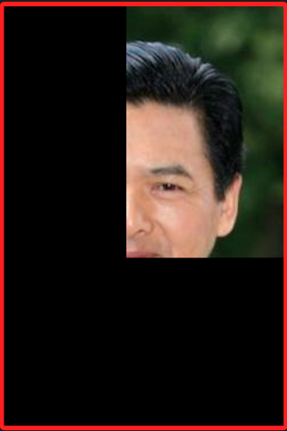
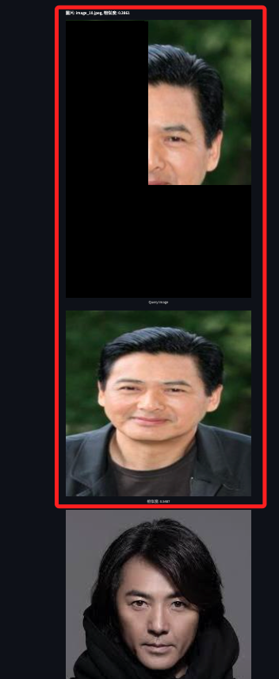
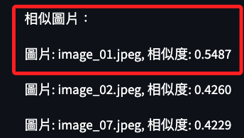

# 部分圖片比對

_進一步觀察 `比對` 與 `辨識` 在應用上的差異_

 

## 說明

1. 當試圖將人臉圖片擷取其中 `1/4` 進行判讀時，傳統的 `人臉辨識` 模型如使用人臉檢測算法 `Haar Cascades`、`Dlib`、`MTCNN` 等，可能會無法準確地辨識這是一張人臉，因為這類辨識通常依賴於完整的面部特徵。

    

 

2. 而使用基於 `向量嵌入` 的 `相似度搜索方法` 如 `VGG16 特徵提取` 和 `向量比對`，只要擷取的部分仍然保留了足夠的特徵，這些方法仍然可以通過 `向量相似度` 來找到與之相似的圖片，這是因為這些方法將圖片轉換為 `高維特徵向量`，即使只是部分圖片，仍然能夠捕捉到一些特徵信息。

 

3. 在前面的範例中，通過將圖片嵌入到向量並儲存到 MongoDB 中，然後使用 `餘弦相似度` 來搜索相似圖片，就能實現對部分圖片的有效比對。

 

## 測試

1. 使用前面提及的 1/4 人臉的圖片。

    

 

2. 運行腳本進行測試，依舊可以正確。

    

 

3. 雖然相似度已經降低，但不會因此無法判讀。

    

 

## 補充說明

1. _`CBIR` 和 `人臉辨識` 都使用 `高維特徵向量` 來進行相似度計算：_ 基於內容的 `圖像檢索 CBIR` 和 `人臉辨識系統` 都依賴於將圖像轉換為 `高維特徵向量`，這些向量代表圖像中的重要特徵，如顏色、形狀、紋理和特定的人臉特徵等，然後這些特徵向量被用於在 `特徵空間` 中進行 `相似度計算`，以找到相似的圖像或識別具體的人臉。

2. _在處理 `部分人臉特徵` 時，基於 `高維特徵向量` 的 `CBIR 相似度比對方法` 可能在某些情況下表現得更好：_ 當只有部分人臉特徵時，如僅有眼睛或鼻子等，傳統的人臉辨識系統可能無法提供準確的識別，因為這些系統通常需要 `整張臉的完整特徵` 來進行精確的比對；然而 `CBIR` 通過提取和比較高維特徵向量，可以靈活地處理這些部分特徵並進行相似度計算，在這些情況下，CBIR 方法能夠有效捕捉部分特徵的信息，並在特徵向量空間中找到與之相似的圖片。

3. _`CBIR` 更適合用於一般的圖像相似度比對，而人臉辨識專門用於識別和驗證人臉：_ `CBIR` 系統廣泛應用於各種圖像相似度比對場景，適用於各種類型的圖像，包括自然景觀、物體、藝術品等，其優勢在於能夠根據圖像的內容特徵進行檢索；而 `人臉辨識系統` 則專門針對人臉進行識別和驗證，通常應用於安防監控、身份驗證、社交媒體等場景，人臉辨識系統需要高精度地識別和比對人臉特徵，因此使用了專門訓練的人臉特徵提取模型來進行識別。

4. _大規模圖像庫檢索：_ 當需要在一個大型圖像庫中找到與特定圖像相似的圖像時，`CBIR` 相對更有效率，因為傳統的圖像識別系統通常需要 `預先定義的分類`，而 `CBIR` 可根據 `內容特徵` 進行 `動態檢索`，適應性更強。

5. _無需標籤的檢索：_ CBIR 系統不依賴於人工標籤的數據集，這在缺乏標籤數據或標籤數據不完整的情況下尤為重要，可以通過圖像的內容特徵進行檢索和匹配；在管理和檢索多媒體資料庫如圖書館的圖像和視頻資料庫時，`CBIR` 系統可以提供基於圖像內容的檢索功能，而不需要對每個圖像進行人工標記和分類。

 

___

_END_