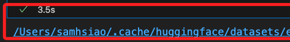
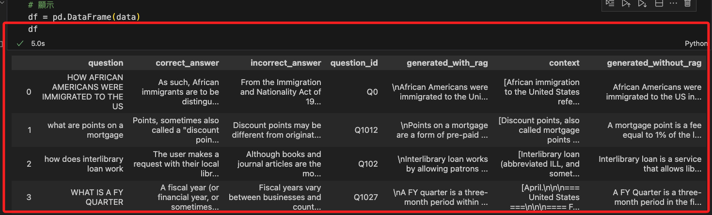
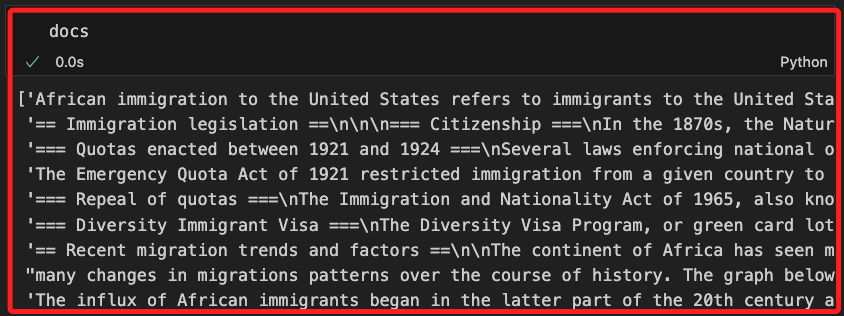
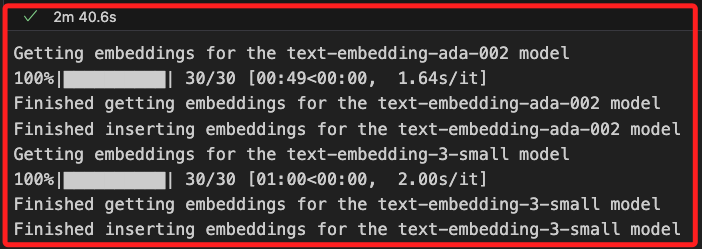

# 官網教學

[Part 1](https://www.mongodb.com/developer/products/atlas/choose-embedding-model-rag/)

[Part 2](https://www.mongodb.com/developer/products/atlas/evaluate-llm-applications-rag/)

_以下官方教程從安裝必要的工具開始，接著設置與連線數據庫、使用 API 密鑰、下載和處理數據集、生成嵌入並存儲到 MongoDB 中，然後使用這些 `嵌入` 來進行 `檢索和生成，最後評估整體系統的性能並追蹤變化。這些步驟確保了我們能夠高效地評估和改進我們的 LLM 應用。_

<br>

## 說明

1. 安裝所需的庫：參數 `-q` 是 `安靜模式`，減少無謂的訊息輸出；參數 `-U` 是自動更新已安裝的套件。

    ```python
    pip install -qU toml datasets ragas langchain langchain-mongodb langchain-openai pymongo pandas tqdm matplotlib seaborn
    ```

   - `datasets`：從 Hugging Face Hub 獲取數據集。

   - `ragas`：RAGAS 框架，用於評估 RAG 應用。

   - `langchain`：用於開發 LLM 應用。

   - `langchain-mongodb`：用於將 MongoDB Atlas 作為向量存儲使用。

   - `langchain-openai`：用於在 LangChain 中使用 OpenAI 模型。

   - `pymongo`：用於與 MongoDB 交互的 Python 驅動。

   - `pandas`：用於數據分析、探索和操作。

   - `tdqm`：顯示進度條。

   - `matplotlib` 和 `seaborn`：用於數據可視化。

<br>

2. 設置先決條件：設置 `MongoDB Atlas` 作為 `向量存儲` ，建立資料庫與集合，並取得連線的 `URI`，記得將主機 IP 加入可訪問列表中。

<br>

## 撰寫代碼

1. 設置敏感資訊處理模式：官網使用 `getpass`，這裡我改用 `toml`，使用語法如下。

    ```python
    # import getpass
    # 改用 toml
    import toml
    
    # 載入 secrets.toml 文件
    secrets = toml.load("secrets.toml")

    # MongoDB URI
    ATLAS_CONNECTION_STRING = secrets["MONGODB_URL"]
    ```

<br>

2. 在腳本同層級目錄新建存放密鑰的敏感茲訓的腳本 `secrets.toml`，_特別注意_，要觀察一下 `.gitignore` 文件中是否已經寫入 `secrets.toml` 或 `**/secrets.toml`，並且記得替換自己的密碼。

    ```bash
    MONGODB_URL = "mongodb+srv://sam6238:<password>@cluster0.yhwvqqt.mongodb.net/?retryWrites=true&w=majority&appName=Cluster0"
    ```

<br>

3. 設定 OpenAI API 密鑰並將其設置為環境變量。

    ```python
    import os
    from openai import OpenAI

    # 設置環境變數
    os.environ["OPENAI_API_KEY"] = secrets["OPENAI_API_KEY"]
    # 初始化 OpenAI 物件
    openai_client = OpenAI()
    ```

<br>

## 下載數據集

_專案部分延續之前的腳本繼續編輯，功能部分新建腳本運行_

<br>

1. 下載評估數據集：使用 `Hugging Face` 的 `datasets` 庫來下載 `評估數據集`，並將其轉換為 `pandas dataframe`，數據集的關鍵列包括 `question`（用戶問題）、`correct_answer`（正確答案）和 `context`（參考文本）。

    ```python
    # 下載數據集
    from datasets import load_dataset
    import pandas as pd

    # 數據
    data = load_dataset(
        "explodinggradients/ragas-wikiqa", split="train"
    )
    # 顯示
    df = pd.DataFrame(data)
    ```

<br>

2. 查詢數據集位置，務必確認下載路徑是否位在本地倉庫中，若是則需評估是否在 `.gitignore` 中設定忽略。

    ```python
    from datasets import load_dataset

    # 加載數據集
    dataset = load_dataset("explodinggradients/ragas-wikiqa", split="train")

    # 獲取數據集的本地路徑
    dataset_path = dataset.cache_files[0]['filename']
    print(dataset_path)
    ```

    

<br>

3. 若要刪除數據集，可刪除上述目錄或是 `整個 Hugging Face`。

    ```bash
    rm -rf ~/.cache/huggingface
    ```

<br>

4. 可使用 `datasets` 庫內建的清除功能。

    ```python
    from datasets import load_dataset, DatasetDict

    # 清理所有數據集缓存
    DatasetDict.cleanup_cache_files()

    # 清理特定數據集缓存
    dataset = load_dataset("explodinggradients/ragas-wikiqa", split="train")
    dataset.cleanup_cache_files()
    ```

<br>

5. 若出現訊息顯示在 Jupyter Notebook 中未找到 `IProgress`，依據提示進行更新。

    ```bash
    pip install --upgrade jupyter ipywidgets
    ```

<br>

6. 完成後可稍做觀察當前數據。

    

<br>

## 繼續編輯

1. 創建參考文檔塊：將長的參考文本拆分成較小的塊以便於檢索，這可使用 `LangChain` 的 `RecursiveCharacterTextSplitter` 來完成的。

    ```python
    # 切割文件
    from langchain.text_splitter import RecursiveCharacterTextSplitter

    # 切割器
    text_splitter = RecursiveCharacterTextSplitter.from_tiktoken_encoder(
        encoding_name="cl100k_base",
        keep_separator=False,
        chunk_size=200,
        chunk_overlap=30
    )


    # 自定義切割函數
    def split_texts(texts):
        chunked_texts = []
        for text in texts:
            chunks = text_splitter.create_documents([text])
            chunked_texts.extend([chunk.page_content for chunk in chunks])
        return chunked_texts


    # 顯示切割後的文件
    df["chunks"] = df["context"].apply(lambda x: split_texts(x))
    all_chunks = df["chunks"].tolist()
    docs = [item for chunk in all_chunks for item in chunk]
    ```

<br>

2. 查看切割結果。

    

<br>

3. 將文本塊轉換為嵌入並將其存儲到 MongoDB 中，這是通過 `OpenAI API` 請求生成 `嵌入向量`，完成後可用於檢索。

    ```python
    from pymongo import MongoClient
    from tqdm.auto import tqdm
    # SSL
    import certifi

    # 連接到 MongoDB
    client = MongoClient(
        ATLAS_CONNECTION_STRING,
        tlsCAFile=certifi.where()
    )
    # 設置資料庫和集合
    DB_NAME = "ragas_evals"
    db = client[DB_NAME]
    batch_size = 128

    # 模型
    EVAL_EMBEDDING_MODELS = [
        "text-embedding-ada-002",
        "text-embedding-3-small"
    ]

    
    # 定義 get_embeddings 函數：
    def get_embeddings(docs, model):
        docs = [doc.replace("\n", " ") for doc in docs]
        response = openai_client.embeddings.create(input=docs, model=model)
        return [r.embedding for r in response.data]


    # 處理每個模型
    # 遍歷文本文檔 (docs) 的批次，生成嵌入向量
    # 並將嵌入向量和文本文檔一起存儲在 MongoDB 中
    for model in EVAL_EMBEDDING_MODELS:
        embedded_docs = []
        print(f"Getting embeddings for the {model} model")
        # tqdm 用於顯示進度條
        # 將嵌入向量和文本文檔存儲在 MongoDB 的集合，集合名稱與模型名稱相同
        for i in tqdm(range(0, len(docs), batch_size)):
            end = min(len(docs), i + batch_size)
            batch = docs[i:end]
            batch_embeddings = get_embeddings(batch, model)
            batch_embedded_docs = [
                {"text": batch[i], "embedding": batch_embeddings[i]}
                for i in range(len(batch))
            ]
            embedded_docs.extend(batch_embedded_docs)
        print(f"Finished getting embeddings for the {model} model")

        collection = db[model]
        collection.delete_many({})
        collection.insert_many(embedded_docs)
        print(f"Finished inserting embeddings for the {model} model")
    ```
    
<br>

4. 完成嵌入，特別注意，這是在線請求模型服務。

    

<br>

## 在 MongoDB Atlas UI 中為每個集合創建向量索引

1. 這段代碼是使用 `LangChain` 與 `OpenAI` 生成 `嵌入向量`，並將這些嵌入向量儲存到 `MongoDB Atlas`，然後進行檢索和評估。具體來說，該代碼定義了一個 `檢索器 (retriever) 函數`，用於根據指定的模型和參數從 MongoDB Atlas 中檢索嵌入向量，並從資料集中提取問題和正確答案，最後使用 `ragas 庫` 評估不同嵌入模型在檢索上的表現。

    ```python
    from langchain_openai import OpenAIEmbeddings
    from langchain_mongodb import MongoDBAtlasVectorSearch
    from langchain_core.vectorstores import VectorStoreRetriever
    from datasets import Dataset
    from ragas import evaluate, RunConfig
    from ragas.metrics import context_precision, context_recall
    import nest_asyncio
    from pymongo import MongoClient
    import certifi

    # 配置 MongoDB 連接
    client = MongoClient(
        # MongoDB Atlas 連接字串
        ATLAS_CONNECTION_STRING,
        # 使用 certifi 提供的 CA 證書
        tlsCAFile=certifi.where()
    )
    # 指定資料庫名稱
    DB_NAME = "ragas_evals"
    db = client[DB_NAME]

    # 定義嵌入模型
    EVAL_EMBEDDING_MODELS = [
        # OpenAI 的 text-embedding-ada-002 模型
        "text-embedding-ada-002",
        # OpenAI 的 text-embedding-3-small 模型
        "text-embedding-3-small"
    ]


    # 定義獲取檢索器的函數
    def get_retriever(model, k):
        # 創建嵌入模型對象
        embeddings = OpenAIEmbeddings(model=model)
        # 創建 MongoDB 向量檢索對象
        vector_store = MongoDBAtlasVectorSearch.from_connection_string(
            connection_string=ATLAS_CONNECTION_STRING,
            # 指定命名空間（資料庫和集合）
            namespace=f"{DB_NAME}.{model}",
            # 指定嵌入模型
            embedding=embeddings,
            # 向量索引名稱
            index_name="vector_index",
            # 文本鍵名
            text_key="text",
        )
        # 返回檢索器對象
        return vector_store.as_retriever(
            # 指定檢索類型為相似度檢索
            search_type="similarity",
            # 指定檢索參數
            search_kwargs={"k": k}
        )


    # 轉換數據框中的列為列表
    # 指定檢索參數
    QUESTIONS = df["question"].to_list()
    # 提取正確答案列表
    GROUND_TRUTH = df["correct_answer"].tolist()

    # 允許嵌套使用 asyncio
    nest_asyncio.apply()
    # 遍歷所有嵌入模型進行評估
    for model in EVAL_EMBEDDING_MODELS:
        # 構建數據字典
        data = {
            # 問題
            "question": [],
            # 正確答案
            "ground_truth": [],
            # 上下文
            "contexts": []
        }
        data["question"] = QUESTIONS
        data["ground_truth"] = GROUND_TRUTH
        # 獲取檢索器
        retriever = get_retriever(model, 2)
        # 遍歷所有問題進行檢索
        for i in tqdm(range(0, len(QUESTIONS))):
            data["contexts"].append(
                [doc.page_content for doc in retriever.get_relevant_documents(QUESTIONS[i])]
            )
        # 將數據字典轉換為 Dataset 對象
        dataset = Dataset.from_dict(data)
        # 配置運行參數
        run_config = RunConfig(max_workers=4, max_wait=180)
        # 使用 ragas 進行評估
        result = evaluate(
            dataset=dataset,
            metrics=[context_precision, context_recall],
            run_config=run_config,
            raise_exceptions=False,
        )
        # 輸出評估結果
        print(f"{model} 模型的結果：{result}")
    ```

<br>

2. 以上代碼是使用 certifi 提供的 CA 證書，倘若仍舊出現錯誤 `ServerSelectionTimeoutError`，可嘗試暫時禁用 SSL 驗證，但要注意這僅適用於測試環境，不建議在生產環境中使用。

    ```python
    client = MongoClient(
        ATLAS_CONNECTION_STRING,
        tls=True,
        tlsAllowInvalidCertificates=True
    )
    ```

<br>

3. 比較生成模型：選擇最佳的檢索嵌入模型後，接著比較生成模型，並使用 RAG 鏈來生成答案。

    ```python
    from langchain_openai import ChatOpenAI
    from langchain_core.prompts import ChatPromptTemplate
    from langchain_core.runnables import RunnablePassthrough
    from langchain_core.runnables.base import RunnableSequence
    from langchain_core.output_parsers import StrOutputParser

    def get_rag_chain(retriever, model):
        retrieve = {
            "context": retriever
            | (lambda docs: "\n\n".join([d.page_content for d in docs])),
            "question": RunnablePassthrough(),
        }
        template = """Answer the question based only on the following context: {context}\n\nQuestion: {question}"""
        prompt = ChatPromptTemplate.from_template(template)
        llm = ChatOpenAI(temperature=0, model=model)
        parse_output = StrOutputParser()
        return retrieve | prompt | llm | parse_output

    from ragas.metrics import faithfulness, answer_relevancy

    for model in ["gpt-3.5-turbo-1106", "gpt-3.5-turbo"]:
        data = {"question": [], "ground_truth": [], "contexts": [], "answer": []}
        data["question"] = QUESTIONS
        data["ground_truth"] = GROUND_TRUTH
        retriever = get_retriever("text-embedding-3-small", 2)
        rag_chain = get_rag_chain(retriever, model)
        for i in tqdm(range(0, len(QUESTIONS))):
            question = QUESTIONS[i]
            data["answer"].append(rag_chain.invoke(question))
            data["contexts"].append(
                [doc.page_content for doc in retriever.get_relevant_documents(question)]
            )
        dataset = Dataset.from_dict(data)
        run_config = RunConfig(max_workers=4, max_wait=180)
        result = evaluate(
            dataset=dataset,
            metrics=[faithfulness, answer_relevancy],
            run_config=run_config,
            raise_ex

    ceptions=False,
        )
        print(f"Result for the {model} model: {result}")
    ```

<br>

3. 測量 RAG 應用的整體性能：使用最佳的檢索和生成模型來評估整體系統的性能。

    ```python
    from ragas.metrics import answer_similarity, answer_correctness

    data = {"question": [], "ground_truth": [], "answer": []}
    data["question"] = QUESTIONS
    data["ground_truth"] = GROUND_TRUTH
    retriever = get_retriever("text-embedding-3-small", 2)
    rag_chain = get_rag_chain(retriever, "gpt-3.5-turbo")
    for question in tqdm(QUESTIONS):
        data["answer"].append(rag_chain.invoke(question))

    dataset = Dataset.from_dict(data)
    run_config = RunConfig(max_workers=4, max_wait=180)
    result = evaluate(
        dataset=dataset,
        metrics=[answer_similarity, answer_correctness],
        run_config=run_config,
        raise_exceptions=False,
    )
    print(f"Overall metrics: {result}")
    ```

<br>

4. 追蹤性能變化：在 MongoDB Atlas 中記錄評估結果，並使用 Atlas Charts 來追蹤和可視化性能，這樣可以在 MongoDB Atlas 中創建儀表板來可視化評估結果。。

    ```python
    from datetime import datetime

    result["timestamp"] = datetime.now()
    collection = db["metrics"]
    collection.insert_one(result)
    ```

<br>

___

_END_