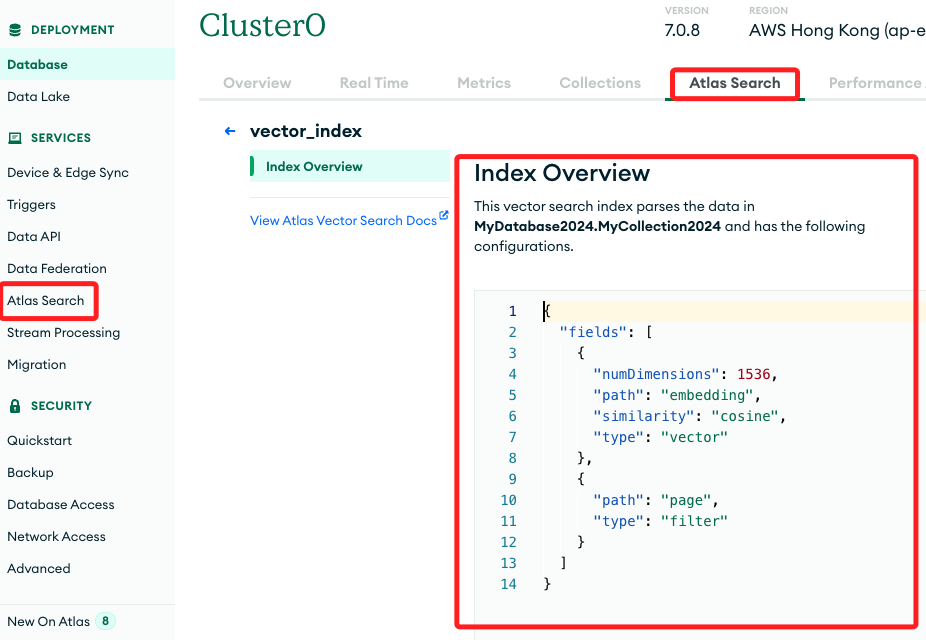

# 向量搜尋 + LangChain

1. 這個範例可參考前面的筆記 `08` 可能還更清楚一些，想說既然做了就把它寫完。

2. 結合 MongoDB Atlas 與 LangChain 進行向量搜索，[官網文章](https://www.mongodb.com/developer/products/atlas/leveraging-mongodb-atlas-vector-search-langchain/)。

<br>

## 簡介

1. 向量搜索引擎，或稱 `向量數據庫`、`語義搜索`、`餘弦搜索`，能找到與指定向量化查詢最接近的條目。

<br>

2. 傳統的搜索方法依賴於 `關鍵字匹配`、`詞頻` 等，而向量搜索引擎則通過在 `嵌入空間` 中的 `距離` 來衡量相似性，這種搜索方法使得搜尋相關數據變得更為有效。

<br>

3. `向量嵌入` 是數據及其上下文的數值表示，通常以高維度的密集向量形式儲存，有多種模型如 `OpenAI` 和 `Hugging Face` 提供的模型可以生成這些嵌入，這些模型經過大量樣本訓練，能提供更為準確和相關的結果。

<br>

4. 在某些情況下，數據本身的數值特徵也可作為嵌入，`MongoDB Atlas` 提供了一個高效的搜索機制來管理這些嵌入。

<br>

## MongoDB Atlas 向量搜索

1. `MongoDB Atlas` 是一個完全托管的雲端數據庫，支持 `AWS`、`Azure` 和 `GCP`。

<br>

2. Atlas 引入了原生的向量搜索功能，可以在 MongoDB 文件數據中進行向量搜索，Atlas 向量搜索利用分層導航小世界（HNSW）算法來執行語義搜索，可以進行類似產品搜索、圖片搜索等。

<br>

## $vectorSearch 運算子

1. Atlas 向量搜索查詢採用 `聚合管道階段（aggregation pipeline stage）` 形式，使用新的 `$vectorSearch` 運算子，該階段在指定欄位上進行向量搜索，該欄位必須用向量類型索引。

<br>

2. `$vectorSearch` 必須是 `管道（pipeline）` 中出現的第一個 `階段（stage）`。

<br>

## LangChain 簡介

1. LangChain 是一個開源框架，旨在幫助開發者透過簡化的 `大型語言模型（LLMs）` 建立應用程序。

<br>

2. LangChain 支持與各種數據源連接，提供更豐富和個性化的體驗。例如，開發者可以使用 LangChain 建立應用程序，通過 LLM 生成查詢的向量表示，並利用 MongoDB Atlas 的向量搜索功能進行搜索，返回相關結果。

<br>

## 環境設置

1. 首先要在 `Atlas UI` 中建立 `向量搜索索引`，這裏將 `嵌入向量欄位` 命名為 `embedding`。

    

    ```json
    {
        "fields": [{
            "type": "vector",
            "path": "embedding",
            "numDimensions": 1536,
            "similarity": "cosine"
        }]
    }
    ```

<br>

2. 安裝相關套件，包含會使用 OpenAI 生成向量嵌入。

    ```bash
    pip3 install pip --upgrade
    pip3 install langchain pymongo openai pypdf tiktoken
    ```

<br>

3. 完整代碼，包含 PDF 文件的處理、向量化以及索引到 MongoDB Atlas。

    ```python
    # getpass：安全地提示用戶輸入密碼或其他敏感信息
    import os, pprint
    # PyPDFLoader：加載 PDF 文件並將其內容轉換為可處理的文本或數據結構
    from langchain_community.document_loaders import PyPDFLoader
    # StrOutputParser：將模型生成的輸出解析為字串
    from langchain_core.output_parsers import StrOutputParser
    # RunnablePassthrough：將輸入直接傳遞到下一步而不進行任何處理的可運行單元
    from langchain_core.runnables import RunnablePassthrough
    # 與 MongoDB Atlas Vector Search 集成，以實現向量搜索功能
    from langchain_mongodb import MongoDBAtlasVectorSearch
    # ChatOpenAI 用於與 OpenAI 的聊天模型互動
    # OpenAIEmbeddings 用於生成文本的向量嵌入
    from langchain_openai import ChatOpenAI, OpenAIEmbeddings
    # 定義和管理提示模板，以生成特定的查詢或指令
    from langchain.prompts import PromptTemplate
    # 將長文本拆分為較小的片段，以便於處理和分析。
    from langchain.text_splitter import RecursiveCharacterTextSplitter
    # MongoDB
    from pymongo import MongoClient
    # SSL
    import certifi
    # Streamlit
    import streamlit as st


    os.environ["OPENAI_API_KEY"] = st.secrets["OPENAI_API_KEY"]
    ATLAS_CONNECTION_STRING = st.secrets["MONGODB_URL"]

    # 建立連線
    client = MongoClient(ATLAS_CONNECTION_STRING, tlsCAFile=certifi.where())
    # 定義資料庫與集合名稱
    db_name = "MyDatabase2024"
    collection_name = "MyCollection2024"
    atlas_collection = client[db_name][collection_name]
    vector_search_index = "vector_index"

    # 載入 PDF
    pdf_url = "https://query.prod.cms.rt.microsoft.com/cms/api/am/binary/RE4HkJP"
    loader = PyPDFLoader(pdf_url)
    # loader = PyPDFLoader("古典測量理論.pdf")
    # loader = PyPDFLoader("證書及作品集_原始.pdf")
    # loader = PyPDFLoader("論文01.pdf")

    data = loader.load()
    # 文件分割器
    text_splitter = RecursiveCharacterTextSplitter(chunk_size=200, chunk_overlap=20)
    # 分割文件
    docs = text_splitter.split_documents(data)
    # 可輸出觀察看看
    print(docs[0], "\n")

    # 建立向量儲存
    vector_search = MongoDBAtlasVectorSearch.from_documents(
        documents=docs,
        embedding=OpenAIEmbeddings(disallowed_special=()),
        collection=atlas_collection,
        index_name=vector_search_index,
    )

    query = "MongoDB Atlas security"
    results = vector_search.similarity_search(query)
    pprint.pprint(results)

    # 將 Atlas Vector Search 實例化為擷取器
    retriever = vector_search.as_retriever(
        # 指定搜索類型為相似度搜索
        search_type="similarity",
        # 設定查詢時僅返回前 10 個相關性最高的文件，並且只使用分數高於 0.75 的文件
        search_kwargs={"k": 10, "score_threshold": 0.75},
    )
    # 定義提示模板
    template = """
    使用以下內容來回答最後的問題。
    如果你不知道答案，就說你不知道，不要試圖編造答案。
    {context}
    問題：{question}
    """

    # 根據模板建立一個提示對象
    custom_rag_prompt = PromptTemplate.from_template(template)
    # 建立一個 OpenAI 聊天模型
    llm = ChatOpenAI()


    # 定義格式化文件的函數
    def format_docs(docs):
        return "\n\n".join(doc.page_content for doc in docs)


    # 建立一條鏈來回答有關您的數據的問題
    rag_chain = (
        {"context": retriever | format_docs, "question": RunnablePassthrough()}
        | custom_rag_prompt
        | llm
        | StrOutputParser()
    )

    # 問題
    # question = "如何使用古典真分數理論？"
    # question = "簡述這篇論文的研究方法"
    question = "MongoDB Atlas auditing"

    # 獲取與問題相關的文件
    print("\n相關文件：")
    documents = retriever.get_relevant_documents(question)
    # print("\nSource documents:")
    pprint.pprint(documents)


    print("\n問題：" + question)

    # 回答
    answer = rag_chain.invoke(question)
    print("\n回答：" + answer)

    ```

<br>

5. 回答。

    ```bash
    問題：MongoDB Atlas auditing

    回答：MongoDB Atlas incorporates auditing configuration that applies to all dedicated clusters within an Atlas project. Audit logs can be downloaded in the UI or retrieved using the MongoDB Atlas API. This feature allows for granular database auditing to ensure security and compliance measures are met.
    ```

<br>

___

_END_