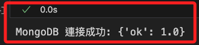

# 連線

_已經在 NAS 上架設好容器_

<br>

## 說明

1. 接下來的操作是透過 Python 腳本連接到 NAS 上的 MongoDB 容器。

<br>

2. 此腳本將使用 `pymongo` 庫。

    ```bash
    pip install pymongo
    ```

<br>

3. 完整範例。

    ```python
    # 導入 MongoClient 類來進行 MongoDB 連接
    from pymongo import MongoClient

    # 設置 MongoDB 連接 URI，包含帳號、密碼和 NAS 的 IP 地址及端口
    MONGODB_URI = "mongodb://192.168.1.240:27017/"

    # 使用 MongoClient 類進行連接
    client = MongoClient(MONGODB_URI)

    # 測試基本連接
    try:
        # 使用 admin 資料庫的命令來測試連接
        db = client.admin.command('ping')
        print("MongoDB 連接成功:", db)
    except Exception as e:
        # 如果連接失敗，捕獲並打印異常信息
        print("MongoDB 連接失敗:", e)
    ```

    

<br>

## 說明

1. 導入 `MongoClient` 類：

    ```python
    from pymongo import MongoClient
    ```

<br>

2. 設置 MongoDB 連接 URI，預設沒帳號密碼，所以也不要使用 `SSL`。

    ```python
    MONGODB_URI = "mongodb://192.168.1.240:5000/"
    ```

<br>

3. 使用 `MongoClient` 進行連接：

    ```python
    # 創建了一個 `MongoClient` 對象
    client = MongoClient(MONGODB_URI)
    ```

<br>

4. 測試基本連接：

    ```python
    try:
        # 使用 `admin` 資料庫的 `ping` 命令來測試連接
        db = client.admin.command('ping')
        print("MongoDB 連接成功:", db)
    except Exception as e:
        print("MongoDB 連接失敗:", e)
    ```

<br>


## 使用終端機指令

_預設沒帳號密碼_

1. 連線：`--authenticationDatabase` 是指定驗證的資料庫，通常是 admin 資料庫。

    ```bash
    mongo --host 192.168.1.240 --port 27017 --authenticationDatabase admin
    ```

<br>

2. 顯示當前資料庫

    ```bash
    db
    ```


3. 列出所有資料庫。

    ```bash
    show dbs
    ```
 
4. 切換到指定資料庫。

    ```bash
    use <資料庫名稱>
    ```


5. 顯示當前資料庫中的集合。

    ```bash
    show collections
    ```


6. 查詢集合中的所有文件。

    ```bash
    # `pretty()` 方法會使輸出更具可讀性
    db.<集合名稱>.find().pretty()
    ```

7. 插入一個新文件到集合。

    ```bash
    db.<集合名稱>.insert({name: "John", age: 30, city: "New York"})
    ```

8. 查詢特定條件的文件。

    ```bash
    db.<集合名稱>.find({name: "John"})
    ```

9. 更新集合中的文件：將 `myCollection` 中 `name` 為 `John` 的文件的 `age` 更新為 `31`。

    ```bash
    db.<collection_name>.update({name: "John"}, {$set: {age: 31}})
    ```

10. 刪除集合中的文件。

    ```bash
    db.<collection_name>.remove({name: "John"})
    ```

11. 顯示資料庫狀態：顯示當前資料庫的狀態信息，包括大小、集合數量等。

    ```bash
    db.stats()
    ```

<br>

___

_END_