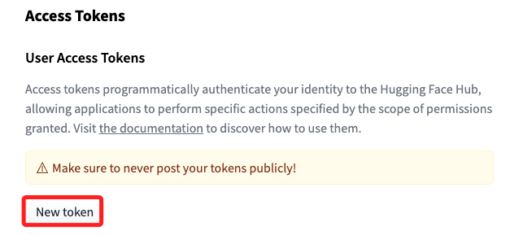
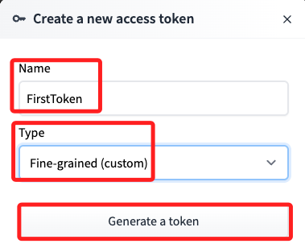
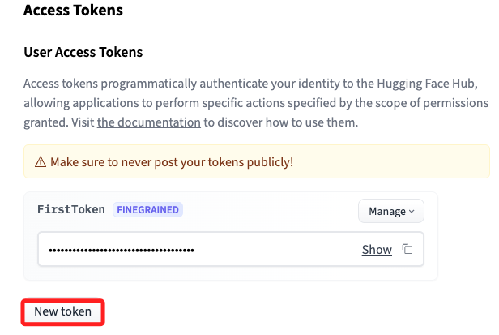

# 簡介

 

_[參考](https://github.com/build-on-aws/llm-rag-vectordb-python/tree/main)_

## Hugging Face

_Hugging Face 是一家專門開發用於構建機器學習應用工具的公司，最主要產品就是為自然語言處理應用構建的 transformers 庫，以及允許使用者共享機器學習模型和資料集的平台，而 Huggingface 幾乎成為 LLM 開發的標準平台，各大公司如果有 open source 的 LLM model 幾乎都會上傳到 HuggingFace 供人下載。_

## 取得 Token

1. [網址](https://huggingface.co/settings/tokens)

2. 命名、選擇類型、生成 Token。

3. 建立。
