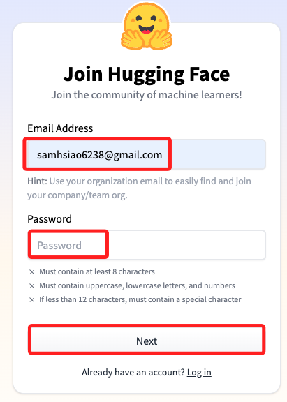
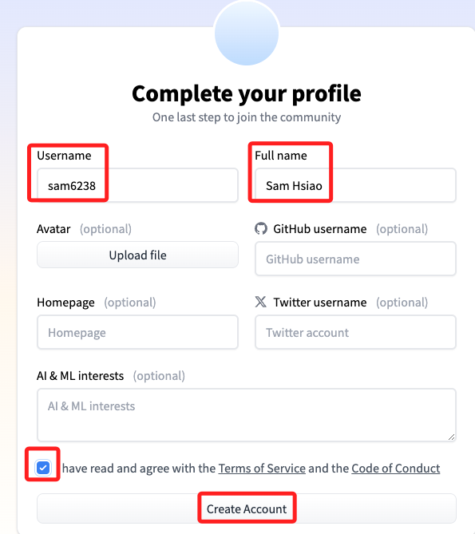
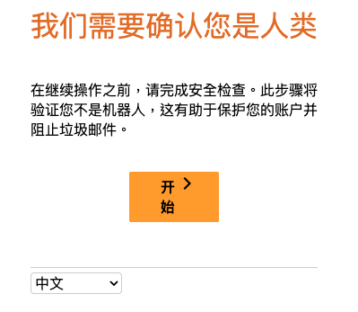
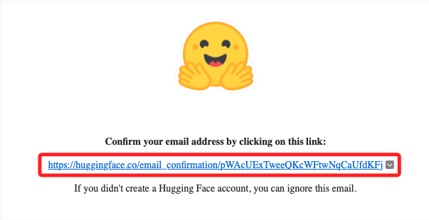
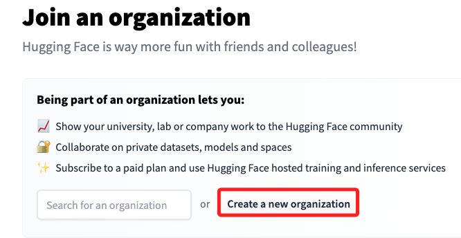
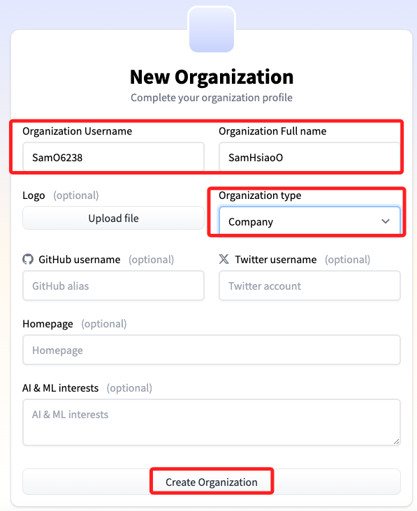

# 範例

_生成食譜_

[範例倉庫](https://github.com/build-on-aws/llm-rag-vectordb-python/tree/main/ingredient-to-recipe)

[Huggine Face](https://huggingface.co/)

<br>

## 步驟說明

1. 註冊。

    

<br>

2. 基本資料。

    

<br>

3. 驗證。

    

<br>

4. 郵件驗證。

    

<br>

5. 建立新組織。

    

<br>

6. 填寫未註明 `Optional` 的部分。

    

<br>

## 官網說明

1. 可使用 git 和 git-lfs 介面從 CLI 建立儲存庫，如果要從網站建立儲存庫，可以跳過這個步驟。

    ```bash
    # 安裝套件
    pip install huggingface_hub

    # 使用 Huggingface.co/settings/tokens 中的令牌登錄
    # 如果需要，從 CLI 建立模型或資料集儲存庫
    huggingface-cli login

    huggingface-cli repo create repo_name --type {model, dataset, space}
    ```

<br>

2. 在本地複製您的模型、資料集或空間

    ```bash
    # 確保你已經安裝了 git-lfs
    # 可參考 https://git-lfs.github.com
    git lfs install
    git clone https://huggingface.co/username/repo_name
    ```

<br>

3. 然後添加、提交和推送您想要的任何文件，包括大型文件

    ```bash
    # 透過 `.save_pretrained()` 儲存檔案或將它們移至此處
    git add .
    git commit -m "commit from $USER"
    git push
    ```

<br>

4. 在大多數情況下，如果使用相容庫之一，則可以透過程式碼透過其識別碼存取儲存庫：<使用者名稱/儲存庫名稱>。

    ```bash
    tokenizer = AutoTokenizer.from_pretrained("username/repo_name")
    model = AutoModel.from_pretrained("username/repo_name")
    ```

<br>

## 透過網頁

1. 建立模型。

    

<br>

2. 完成時顯示。

    

<br>

___

_END_