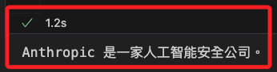

# BaseTransport 錯誤排除

<br>

## 說明

1. 這個錯誤 `ImportError: cannot import name 'BaseTransport' from 'httpx'` 表示 `httpx` 庫中缺少 `BaseTransport` 模組，這可能是由於 `httpx` 版本不兼容造成的。

<br>

## 處理步驟

1. 確保使用最新版本的 `httpx` 庫。

    ```bash
    pip install --upgrade httpx
    ```

<br>

2. 有時候某些庫之間的依賴版本可能不兼容，可透過重新安裝 `httpx` 和 `anthropic` 庫來處理。

    ```bash
    pip uninstall httpx anthropic && pip install httpx anthropic
    ```

<br>

3. 如果更新到最新版本後仍然發生錯誤，可嘗試安裝特定版本的 `httpx` 和 `anthropic`，確保它們之間的依賴兼容。

    ```bash
    pip install httpx==0.21.1
    pip install anthropic==0.2.0
    ```

<br>

4. 重新運行後應可正常顯示。

    

<br>

___

_END_