# Discord 聊天機器人

_關於 Discord [桌面版](https://discord.com/) 的下載及安裝這裡省略，請自行操作。_

 

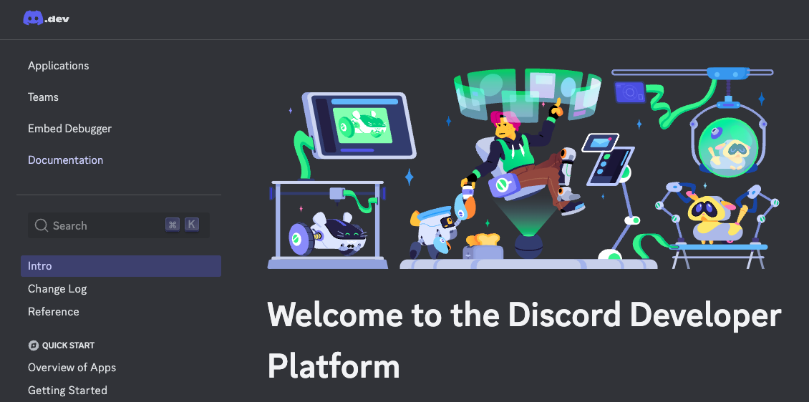

 

## 建立 Discord 機器人

1. 前往 [Discord Developer Portal](https://discord.com/developers/applications) 並登錄 Discord 帳戶。

    

 

2. 點擊 `New Application` 。

    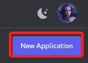

 

3. 命名後勾選同意，接著點擊 `Create`。

    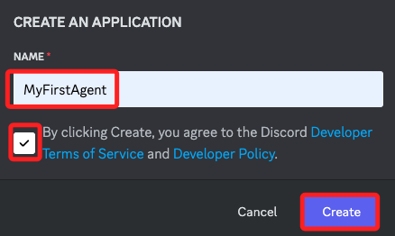

 

4. 切換到 `機器人 Bot` 頁籤。

    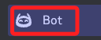

 

5. 第一次建立，先點擊一次 `Reset Token`。

    

 

6. 點擊 `Yes, do it!`。

    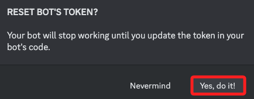

 

7. 若有開啟雙重認證，會要求輸入驗證碼。

    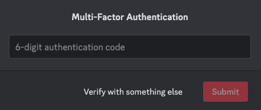

 

8. 滑動到 `Privileged Gateway Intents` ，三個功能都點選 `Save Change`。

    

 

9. 點擊 `Copy` 將 Token 記錄下來，貼到 `.env` 文件中；這是機器人登入 Discord 的密鑰。

    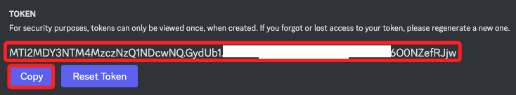

 

10. 點擊螢幕下方彈出視窗中的 `Save Changes`。

    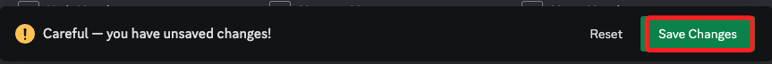

 

## 設置機器人的權限

1. 切換到 `OAuth2` 頁籤，選擇 `URL Generator`。

    

 

2. 勾選 `OAuth2 URL Generator` 欄位區域中的 `bot`。

    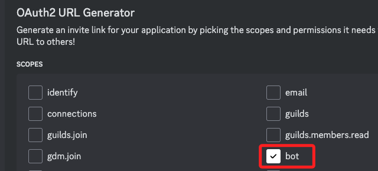

 

3. 在 `Bot Permissions` 勾選 `Administrator`，賦予機器人所有權限。

    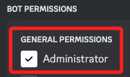

 

4. 複製連結進行訪問，這是邀請機器人到伺服器中的連結。

    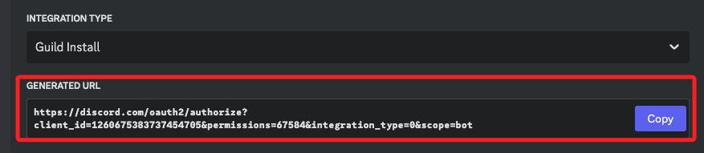

 

5. 生成並打開邀請連結，邀請機器人加入伺服器。

    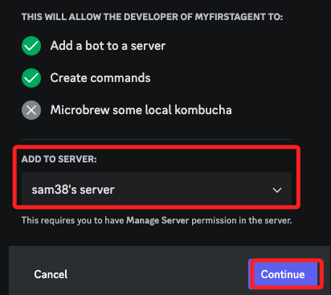

 

6. 會顯示專案名稱以及授權項目，預設已經打勾，點擊 `授權 Authorize`。

    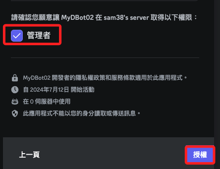

 

7. 成功，前往 sam38's server。

    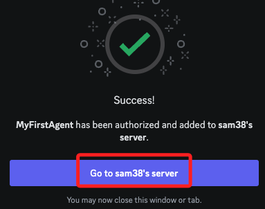

 

8. 點擊右上角人像圖標顯示或隱藏 `Member List`，可看到建立完成的機器人在腳本尚未運行前的狀態是 `Offline`。

    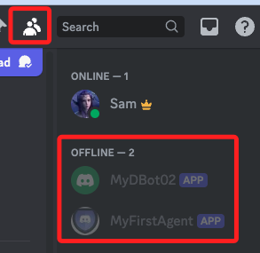

 

9. 在後續的步驟中，一但腳本運行後，狀態就會顯示為 `Online`。

    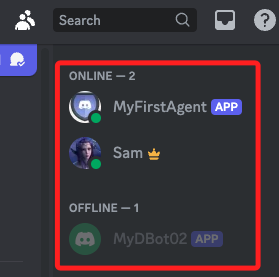

 

___

_END_