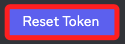
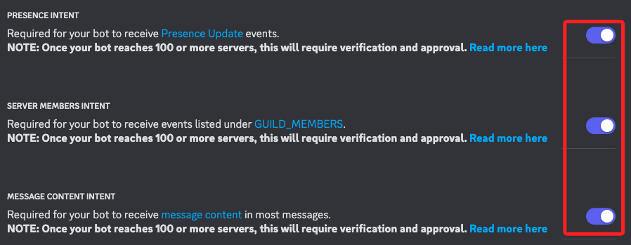
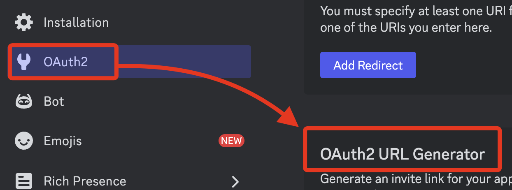

# Discord 聊天機器人

_關於 Discord [桌面版](https://discord.com/) 的下載及安裝這裡省略，請自行操作。_

 

 

## 建立 Discord 機器人

1. 前往 [Discord Developer Portal](https://discord.com/developers/applications) 並登錄 Discord 帳戶；可使用手機 App 掃碼登入。

    

 

2. 登入後，點擊右上角 `New Application` 建立新的應用。

    

 

3. `命名` 並 `勾選同意`，接著點擊 `Create`。

    

 

4. 切換到機器人 `Bot` 頁籤。

    

 

5. 第一次建立，先點擊一次 `Reset Token`。

    

 

6. 在彈出的視窗中點擊 `Yes, do it!`。

    

 

7. 若有開啟雙重認證，會要求輸入驗證碼。

    

 

8. 通過認證後會顯示 `A new token was generated! Be sure to copy it as it will not be shown to you again.`。

    

 

## 設定 Gateway Intents

_決定機器人能接收到哪些事件，也就是設定了機器人的功能與行為範圍；特別注意，當機器人加入的伺服器數量達到 100 或更多時，Intents 需要進行驗證和批准。_

 

1. 向下滑動到 `Privileged Gateway Intents` 區塊，三個功能都點選 `Save Change`。

    

 

2. 有變更時，下方會彈出提醒儲存的視窗，點擊 `Save Changes`。

    

 

## 說明 Gateway Intents

_補充說明前面開啟的三個設定_

 

1. `Presence Intent (存在狀態意圖)` 可允許機器人接收使用者的存在狀態更新事件，例如 `在線`、`離線`、`忙碌`等，適用於需要使用者在線狀態的情境。

 

2. `Server Members Intent (伺服器成員意圖)` 可允許機器人接收與伺服器成員有關的事件，例如成員的加入、離開、更新等，適用於管理伺服器成員、執行歡迎訊息或紀錄成員變動等情境。

 

3. `Message Content Intent (訊息內容意圖)` 可允許機器人接收大部分訊息中的訊息內容，適用於機器人需要回應或分析訊息內容的情境，例如關鍵字觸發功能或聊天機器人功能。

 

## 編輯腳本

1. 點擊 `Copy` 將 Token 記錄下來，貼到 `.env` 文件中；這是機器人登入 Discord 的密鑰。

    

 

2. 點擊螢幕下方彈出視窗中的 `Save Changes`。

    

 

## 設置機器人的權限

1. 切換到 `OAuth2` 頁籤，選擇 `URL Generator`。

    

 

2. 勾選 `OAuth2 URL Generator` 欄位區域中的 `bot`。

    

 

3. 在 `Bot Permissions` 勾選 `Administrator`，賦予機器人所有權限。

    

 

4. 複製連結進行訪問，這是邀請機器人到伺服器中的連結。

    

 

5. 生成並打開邀請連結，邀請機器人加入伺服器。

    

 

6. 會顯示專案名稱以及授權項目，預設已經打勾，點擊 `授權 Authorize`。

    

 

7. 成功，前往 sam38's server。

    

 

8. 點擊右上角人像圖標顯示或隱藏 `Member List`，可看到建立完成的機器人在腳本尚未運行前的狀態是 `Offline`。

    

 

9. 在後續的步驟中，一但腳本運行後，狀態就會顯示為 `Online`。

    

 

___

_END_