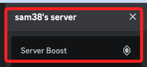

# Discord 聊天機器人

<br>

## 準備工作

1. 建立虛擬環境。

    ```bash
    python -m venv envDiscord
    ```

<br>

2. 更新套件，或提示時再更新。

    ```bash
    pip install --upgrade pip
    ```

<br>

3. 安裝 `discord.py` 庫。

    ```bash
    pip install discord.py python-dotenv
    ```

<br>

4. 建立並進入專案。

    ```bash
    cd ~/Desktop && mkdir _exDiscordBot_ && cd _exDiscordBot_
    ```

<br>

5. 建立必要文件。

    ```bash
    touch app.py .env .gitignore
    ```

<br>

6. 啟動 VSCode。

    ```bash
    code .
    ```

<br>

7. 編輯 `.gitignore` 寫入 `.env`。

    ```json
    .env
    ```

<br>

8. 編輯 `.env`。

    ```json
    DISCORD_BOT_TOKEN=
    ```

<br>

## 建立 Discord 機器人

1. 前往 [Discord Developer Portal](https://discord.com/developers/applications) 並登錄 Discord 帳戶。

<br>

2. 點擊 `New Application` 。

    

<br>

3. 命名後勾選同意，接著點擊 `Create`。

    

<br>

4. 切換到 `機器人 Bot` 頁籤。

    

<br>

5. 第一次建立，先點擊一次 `Reset Token`。

    

<br>

6. 點擊 `Yes, do it!`。

    

<br>

7. 滑到 `Privileged Gateway Intents` ，三個功能都點選 `Save Change`。

    

<br>

8. 點擊 `Copy` 將 Token 記錄下來，貼到 `.env` 文件中；這是機器人登入 Discord 的密鑰。

    

<br>

## 設置機器人的權限

1. 切換到 `OAuth2` 頁籤，選擇 `URL Generator`。

    

<br>

2. 勾選 `bot`。

    

<br>

3. 在 `Bot Permissions` 勾選 `Administrator`，賦予機器人所有權限。

    

<br>

4. 複製連結進行訪問，這是邀請機器人到伺服器中的連結。

    

<br>

5. 生成並打開邀請連結，邀請機器人加入伺服器。

    

<br>

6. 點擊 `授權 Authorize`。

    

<br>

7. 成功，前往 sam38's server。

    

<br>

## 編寫代碼

1. 編輯 `app.py`；啟動機器人並處理簡單的消息事件。

    ```python
    import discord
    import logging
    from logging.handlers import RotatingFileHandler
    import os
    from dotenv import load_dotenv
    load_dotenv()

    DISCORD_BOT_TOKEN = os.getenv('DISCORD_BOT_TOKEN')

    # Set up the Discord client
    intents = discord.Intents.default()
    intents.message_content = True
    discord_client = discord.Client(intents=intents)

    # Set up logging
    logger = logging.getLogger("discordbot")
    logger.setLevel(logging.INFO)
    handler = RotatingFileHandler(
        "discordbot.log", maxBytes=10485760, backupCount=5
    )
    formatter = logging.Formatter(
        "%(asctime)s - %(name)s - %(levelname)s - %(message)s"
    )
    handler.setFormatter(formatter)
    logger.addHandler(handler)


    # Event listener for when the bot is ready
    @discord_client.event
    async def on_ready():
        message = f"Logged in as {discord_client.user.name} "
        f"(ID: {discord_client.user.id})"
        logger.info(message)
        print(message)


    # Event listener for when a message is received
    @discord_client.event
    async def on_message(message):
        # Ignore messages sent by the bot itself
        if message.author == discord_client.user:
            return

        if message.content.startswith("!hello"):
            await message.channel.send(f"Hello {message.author.name}!")


    # Start the bot
    def main():
        try:
            discord_client.run(DISCORD_BOT_TOKEN)
        except discord.errors.LoginFailure as e:
            logger.error(f"Login failed. Please check your bot token. Error: {e}")
        except Exception as e:
            logger.error(f"An error occurred: {e}")


    if __name__ == "__main__":
        main()
    ```

<br>

## 啟動

1. 展開。

    

<br>

## 運行與測試

1. 運行 Python 文件。

    ```bash
    python app.py
    ```

    

<br>

2. 在 Discord 中打開所邀請機器人的伺服器，在任何文字頻道中輸入 `!hello`，機器人應該會回應。

    

<br>

## 擴展功能

1. 添加更多的事件處理器和命令來擴展機器人的功能。例如，處理用戶加入/離開事件、定時消息等。

<br>

2. 使用擴展庫 `discord.ext.commands` 來簡化命令處理。

<br>

3. 完整代碼範例。

    ```python
    """拓展"""

    import discord
    from discord.ext import commands
    import logging
    from logging.handlers import RotatingFileHandler
    import os
    from dotenv import load_dotenv

    load_dotenv()

    DISCORD_BOT_TOKEN = os.getenv("DISCORD_BOT_TOKEN")


    # Set up logging
    logger = logging.getLogger("discordbot")
    logger.setLevel(logging.INFO)
    handler = RotatingFileHandler(
        "discordbot.log", maxBytes=10485760, backupCount=5
    )
    formatter = logging.Formatter(
        "%(asctime)s - %(name)s - %(levelname)s - %(message)s"
    )
    handler.setFormatter(formatter)
    logger.addHandler(handler)

    # Set up the bot
    intents = discord.Intents.default()
    intents.message_content = True
    bot = commands.Bot(command_prefix="!", intents=intents)


    # Event listener for when the bot is ready
    @bot.event
    async def on_ready():
        message = f"Logged in as {bot.user.name} (ID: {bot.user.id})"
        logger.info(message)
        print(message)


    # Command for !hello
    @bot.command(name="hello")
    async def hello(ctx):
        await ctx.send(f"Hello {ctx.author.name}!")


    # Start the bot
    def main():
        try:
            bot.run(DISCORD_BOT_TOKEN)
        except discord.errors.LoginFailure as e:
            logger.error(f"Login failed. Please check your bot token. Error: {e}")
        except Exception as e:
            logger.error(f"An error occurred: {e}")


    if __name__ == "__main__":
        main()
    ```

<br>

___

_END_