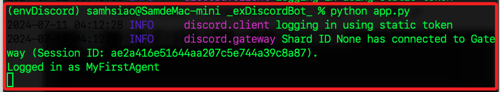
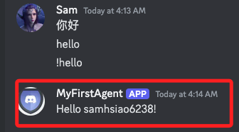

# 基礎專案

_以 Python 編輯簡單的入門專案_

<br>

## 準備工作

1. 建立虛擬環境。

    ```bash
    python -m venv envDiscord
    ```

<br>

2. 更新套件，或提示時再更新。

    ```bash
    pip install --upgrade pip
    ```

<br>

3. 安裝 `discord.py` 庫。

    ```bash
    pip install discord.py python-dotenv
    ```

<br>

4. 建立並進入專案。

    ```bash
    cd ~/Desktop && mkdir _exDiscordBot_ && cd _exDiscordBot_
    ```

<br>

5. 建立必要文件。

    ```bash
    touch app.py .env .gitignore
    ```

<br>

6. 啟動 VSCode。

    ```bash
    code .
    ```

<br>

7. 編輯 `.gitignore` 寫入 `.env`。

    ```json
    .env
    ```

<br>

8. 編輯 `.env`。

    ```json
    DISCORD_BOT_TOKEN=
    ```

<br>

## 基本範例

_參考 [discord.py](https://discordpy.readthedocs.io/en/stable/#) 官方文件說明_

<br>

1. 以下是 [Quickstart](https://discordpy.readthedocs.io/en/stable/quickstart.html) 基礎範例，啟動機器人後可處理簡單的消息事件；編輯 `app.py` 貼上以下代碼即可。

    ```python
    # This example requires the 'message_content' intent.

    import discord

    intents = discord.Intents.default()
    intents.message_content = True

    client = discord.Client(intents=intents)

    @client.event
    async def on_ready():
        print(f'We have logged in as {client.user}')

    @client.event
    async def on_message(message):
        if message.author == client.user:
            return

        if message.content.startswith('$hello'):
            await message.channel.send('Hello!')

    client.run('替換為自己的 TOKEN')
    ```

<br>

## 優化腳本

1. 同樣編輯 `app.py`，在以下的代碼中，加入了日誌記錄功能，並使用 `dotenv` 來載入環境變數，同時也加入錯誤處理的邏輯，另外，進一步取得發送訊息用戶的資訊作為回覆之用。

    ```python
    import discord
    import logging
    from logging.handlers import RotatingFileHandler
    import os
    from dotenv import load_dotenv
    load_dotenv()

    DISCORD_BOT_TOKEN = os.getenv('DISCORD_BOT_TOKEN')

    # 設定 Discord 用戶端
    intents = discord.Intents.default()
    intents.message_content = True
    discord_client = discord.Client(intents=intents)

    # 設定日誌記錄
    logger = logging.getLogger("discordbot")
    logger.setLevel(logging.INFO)
    handler = RotatingFileHandler(
        "discordbot.log", maxBytes=10485760, backupCount=5
    )
    formatter = logging.Formatter(
        "%(asctime)s - %(name)s - %(levelname)s - %(message)s"
    )
    handler.setFormatter(formatter)
    logger.addHandler(handler)


    # 機器人準備就緒時的事件偵聽器
    @discord_client.event
    async def on_ready():
        message = f"Logged in as {discord_client.user.name} "
        f"(ID: {discord_client.user.id})"
        logger.info(message)
        print(message)


    # 收到訊息時的事件偵聽器
    @discord_client.event
    async def on_message(message):
        # 忽略機器人本身發送的訊息
        if message.author == discord_client.user:
            return

        if message.content.startswith("!hello"):
            await message.channel.send(f"Hello {message.author.name}!")


    # 啟動機器人
    def main():
        try:
            discord_client.run(DISCORD_BOT_TOKEN)
        except discord.errors.LoginFailure as e:
            logger.error(f"Login failed. Please check your bot token. Error: {e}")
        except Exception as e:
            logger.error(f"An error occurred: {e}")


    if __name__ == "__main__":
        main()
    ```

<br>

## 運行與測試

1. 運行 Python 文件。

    ```bash
    python app.py
    ```

    

<br>

2. 在 Discord 中打開所邀請機器人的伺服器，在任何文字頻道中輸入 `!hello`，機器人應該會回應 `Hello samhsiao6238!`，其中 `samhsiao6238` 是我的使用者名稱。

    

<br>

___

_END_