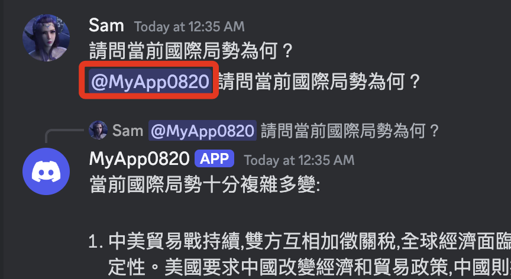

# 進階專案

_操作紀錄_

<br>

## 說明

1. [參考範例來源](https://github.com/shugy0/claudebot/tree/main)。

<br>

2. 關於 [Anthrop 模型列表](https://docs.anthropic.com/en/docs/about-claude/models) 可在官網查詢正確名稱以及當前可用版本資訊，確保代碼運行正確。 

<br>

3. 題問題要使用 `@` 指定提問對象。

    

<br>

## 準備工作

1. 建立管理套件文件、主腳本 `app3.py`。

    ```bash
    touch requirements.txt app3.py
    ```

<br>

2. 編輯 `.env`，加入新的密鑰。

    ```json
    ANTHROPIC_API_KEY=
    ```

<br>

## 編輯專案

1. 套件管理腳本 `requirements.txt`。

    ```json
    discord
    anthropic
    tiktoken
    ```

<br>

2. 安裝套件。

    ```bash
    pip install -r requirements.txt
    ```

<br>

3. 主腳本 `app3.py`。

    ```python
    import discord
    import anthropic
    import traceback
    import tiktoken
    import logging
    import asyncio
    from logging.handlers import RotatingFileHandler
    import os
    from dotenv import load_dotenv

    load_dotenv()

    ANTHROPIC_API_KEY = os.getenv("ANTHROPIC_API_KEY")
    DISCORD_BOT_TOKEN = os.getenv("DISCORD_BOT_TOKEN")

    # 設定 Discord 用戶端
    discord_client = discord.Client(intents=discord.Intents.default())

    # 設定 Anthropic 客戶端
    anthropic_client = anthropic.Anthropic(api_key=ANTHROPIC_API_KEY)

    logger = logging.getLogger("claudbot")
    logger.setLevel(logging.INFO)
    handler = RotatingFileHandler(
        "claudbot.log", maxBytes=10485760, backupCount=5
    )
    formatter = logging.Formatter(
        "%(asctime)s - %(name)s - %(levelname)s - %(message)s"
    )
    handler.setFormatter(formatter)
    logger.addHandler(handler)


    def count_tokens(prompt):
        encoding = tiktoken.get_encoding("cl100k_base")
        return len(encoding.encode(prompt))


    # 機器人準備就緒時的事件偵聽器
    @discord_client.event
    async def on_ready():
        message = f"Logged in as {discord_client.user.name} (ID: {discord_client.user.id})"
        logger.info(message)
        print(message)


    # 發生錯誤時的事件偵聽器
    @discord_client.event
    async def on_error(event, *args, **kwargs):
        error = traceback.format_exc()
        logger.error(f"Error occurred in {event}:")
        logger.error(error)


    # 收到訊息時的事件偵聽器
    @discord_client.event
    async def on_message(message):
        # 忽略機器人本身發送的訊息
        if message.author == discord_client.user:
            return

        if not isinstance(message.channel, discord.TextChannel):
            return

        # 檢查訊息中是否提及機器人
        if discord_client.user.mentioned_in(message):

            # 從訊息內容中刪除機器人提及
            prompt = message.content.replace(f"<@{discord_client.user.id}>", "").strip()

            if not prompt or prompt.isspace():
                await message.reply(
                    f"Please provide a non-empty message.",
                    allowed_mentions=discord.AllowedMentions.none(),
                )
                return

            # 檢查該訊息是否是對另一則訊息的回复
            if message.reference:
                try:
                    replied_message = await message.channel.fetch_message(
                        message.reference.message_id
                    )
                    # 將回覆的訊息和使用者名稱加入提示中
                    prompt = f"<userID>{message.author.id}</userID>\n"
                    "<username>{message.author.name}</username>\n<replied_username>"
                    "{replied_message.author.name}</replied_username>\n"
                    f"<message_user_replied_to>{replied_message.content}"
                    f"</message_user_replied_to>\n{prompt}"
                except discord.NotFound:
                    # 未找到回覆訊息的情況處理
                    prompt = f"Error: Discord couldn't find the replied message.\n"
                    f"<userID>{message.author.id}</userID>\n"
                    f"<username>{message.author.name}</username>\n"
                    f"{prompt}"
            else:
                # 只需將使用者 ID 和使用者名稱新增至提示即可
                prompt = f"<userID>{message.author.id}</userID>\n"
                f"<username>{message.author.name}</username>\n{prompt}"

            # 檢查提示的令牌長度
            token_length = count_tokens(prompt)
            logger.info(f"Token length: {token_length}")
            if token_length > 1000:
                await message.reply(
                    f"Sorry, your message is too long.",
                    allowed_mentions=discord.AllowedMentions.none(),
                )
                return

            logger.info(f"Prompt: {prompt}")

            # 發送初始狀態訊息
            status_message = await message.reply(
                "Got message ✅",
                mention_author=False,
                allowed_mentions=discord.AllowedMentions.none(),
            )

            # 使用 Anthropic API 產生回應
            response = await generate_response(prompt, status_message)
            logger.info(f"Claude reply: {response}")

            # 使用產生的回應編輯狀態訊息
            await asyncio.sleep(0.2)
            await status_message.edit(
                content=response, allowed_mentions=discord.AllowedMentions.none()
            )


    async def generate_response(prompt, status_message):
        try:
            # 更新狀態： 傳送提示
            await asyncio.sleep(0.2)
            await status_message.edit(
                content="Got message ✅ Sending prompt ✅",
                allowed_mentions=discord.AllowedMentions.none(),
            )

            # 將提示傳送到 Anthropic API
            response = anthropic_client.messages.create(
                system="""
                您正在回覆一條discord訊息。 
                userID、使用者名稱和reply_username 用於記錄目的。
                如果有使用者回覆的訊息，它將包含在 message_user_replied_to 中。
                玩得開心，不要太緊張。
                除非特別要求，否則請勿在訊息中使用標籤。
                請以繁體中文回答。
                """,
                messages=[{"role": "user", "content": f"{prompt}"}],
                model="claude-3-opus-20240229",
                max_tokens=1000,
                temperature=1,
            )

            # 更新狀態： 已收到回复
            await asyncio.sleep(0.2)
            await status_message.edit(
                content="Got message ✅ Sending prompt ✅ Got response ✅",
                allowed_mentions=discord.AllowedMentions.none(),
            )

            # 從回應中提取文本
            response_text = response.content[0].text.strip()

            # 更新狀態：正在向 Discord 發送訊息
            await asyncio.sleep(0.2)
            await status_message.edit(
                content="Got message ✅ Sending prompt ✅ Got response ✅ Sending message to Discord ✅",
                allowed_mentions=discord.AllowedMentions.none(),
            )

            # 返回提取的文本
            return response_text
        except anthropic.exceptions.ApiError as e:
            error_code = e.api_error_code
            error_message = e.args[0]
            return f"Error code {error_code}: {error_message}"
        except Exception as e:
            error_message = str(e)
            return f"Error: {error_message}"


    def main():
        try:
            # 啟動 Discord 用戶端
            discord_client.run(DISCORD_BOT_TOKEN)
        except discord.errors.LoginFailure as e:
            logger.error(f"Login failed. Please check your bot token. Error: {e}")
        except Exception as e:
            logger.error(f"An error occurred: {e}")


    if __name__ == "__main__":
        main()

    ```

<br>

___

_END_