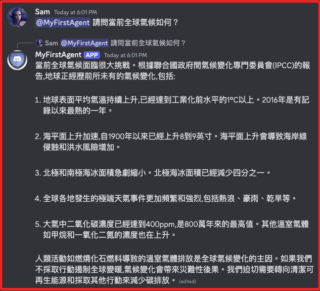
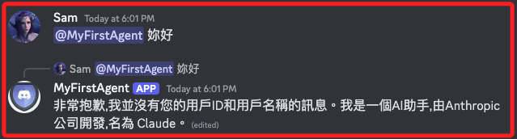

# 優化腳本

_針對 app3.py 進行優化_

<br>

## 說明

1. 前一個原著範例版本存在部分問題，以下是經過修正的版本 `app4.py`。

<br>

2. 在這個版本中，可以問及複雜問題。

    

<br>

3. 但卻無法取得提問者資訊。

    

<br>

## 完整範例

1. 程式碼。

    ```python
    import discord
    import anthropic
    import traceback
    import tiktoken
    import logging
    import asyncio
    from logging.handlers import RotatingFileHandler
    import os
    from dotenv import load_dotenv

    load_dotenv()

    ANTHROPIC_API_KEY = os.getenv("ANTHROPIC_API_KEY")
    DISCORD_BOT_TOKEN = os.getenv("DISCORD_BOT_TOKEN")

    # 設定 Discord 用戶端
    intents = discord.Intents.default()
    intents.message_content = True
    discord_client = discord.Client(intents=intents)

    # 設定 Anthropic 客戶端
    anthropic_client = anthropic.Client(api_key=ANTHROPIC_API_KEY)

    logger = logging.getLogger("claudbot")
    logger.setLevel(logging.INFO)
    handler = RotatingFileHandler(
        "claudbot.log", maxBytes=10485760, backupCount=5
    )
    formatter = logging.Formatter(
        "%(asctime)s - %(name)s - %(levelname)s - %(message)s"
    )
    handler.setFormatter(formatter)
    logger.addHandler(handler)


    # 計算 Token 長度
    def count_tokens(prompt):
        encoding = tiktoken.get_encoding("cl100k_base")
        return len(encoding.encode(prompt))


    # 機器人準備就緒時的事件偵聽器
    @discord_client.event
    async def on_ready():
        message = f"Logged in as {discord_client.user.name} "
        f"(ID: {discord_client.user.id})"
        logger.info(message)
        print(message)


    # 發生錯誤時的事件偵聽器
    @discord_client.event
    async def on_error(event, *args, **kwargs):
        error = traceback.format_exc()
        logger.error(f"Error occurred in {event}:")
        logger.error(error)


    # 註冊監聽事件：用於監聽 Discord 中的新訊息事件
    # 定義一個非同步函數 on_message，用於處理 message 事件
    # 當新的訊息在伺服器中發送時會調用這個函數，而訊息分為用戶訊息與機器人訊息
    @discord_client.event
    async def on_message(message):
        print("調用 on_message：{message}")
        # 假如訊息是機器人本身發送的訊息，返回不處理
        if message.author == discord_client.user:
            return
        # 只處理發佈在文字頻道中的訊息，其他訊息返回不處理
        if not isinstance(message.channel, discord.TextChannel):
            return

        # 檢查訊息是否提及當前機器人用戶 discord_client.user
        if discord_client.user.mentioned_in(message):
            # 從訊息內容中刪除提及機器人的部分 @機器人名稱
            prompt = message.content.replace(
                f"<@{discord_client.user.id}>", ""
            ).strip()
            # 檢查 prompt 是否為空，或僅包含空白字元；特別注意， not 僅使用在前面的表達式中
            # 如果是，則機器人會回覆用戶提示訊息，並防止在回覆中自動提及用戶或角色。
            if not prompt or prompt.isspace():
                await message.reply(
                    "所輸入的訊息是空的或僅有空格。",
                    # 參數將此 AllowedMentions 對象應用於機器人的回覆訊息中
                    # 防止機器人的回覆中自動提及用戶或角色，避免不必要的通知
                    allowed_mentions=discord.AllowedMentions.none()
                )
                # 如果為空或僅有空格，退出函數
                return

            # 檢查該訊息是否是對另一則訊息的回复
            if message.reference:
                print("訊息是另一則訊息的回覆")
                # 以下這段代碼嘗試從訊息所屬的頻道中取得當前訊息所回覆的那條原始訊息
                # 取得成功會將訊息儲存在變數 replied_message 中
                # 如果取得失敗，則會進入 except 處理異常情況
                try:
                    # 嘗試從訊息所屬的頻道中取得被回覆的原始訊息
                    # await 是一個非同步操作，會等待 fetch_message 完成並返回結果
                    replied_message = await message.channel.fetch_message(
                        # 從指定頻道中取得特定 ID 的訊息
                        # message.reference 是當前訊息的引用訊息，即被回覆的原始訊息
                        # message.reference.message_id 是被回覆訊息的 ID
                        message.reference.message_id
                    )
                    print("嘗試加入")
                    # 將回覆的訊息和使用者名稱加入提示中
                    prompt = (
                        f"<userID>{message.author.id}</userID>\n"
                        f"<username>{message.author.name}</username>\n"
                        f"<replied_username>{replied_message.author.name}"
                        "</replied_username>\n<message_user_replied_to>"
                        f"{replied_message.content}</message_user_replied_to>\n"
                        f"{prompt}"
                    )
                    print(f"userID：{message.author.id}")
                    print(f"username：{message.author.name}")
                except discord.NotFound:
                    # 未找到回覆訊息的情況處理
                    prompt = (
                        f"錯誤：無法找到回覆的訊息。\n"
                        f"<userID>{message.author.id}</userID>\n"
                        f"<username>{message.author.name}</username>\n"
                        f"{prompt}"
                    )
                    print("取得訊息出現錯誤")
            else:
                print("訊息不是另一則訊息的回覆")
                # 只需將使用者 ID 和使用者名稱新增至提示即可
                prompt = (
                    f"<userID>{message.author.id}</userID>\n"
                    f"<username>{message.author.name}</username>\n"
                    f"{prompt}"
                )
                print(f"userID：{message.author.id}")
                print(f"username：{message.author.name}")
                print(f"prompt：{prompt}")

            # 使用自訂函數檢查提示的令牌 Token 長度
            token_length = count_tokens(prompt)
            print(f"令牌 Token 長度：{token_length}")
            logger.info(f"令牌 Token 長度：{token_length}")
            # 假如問題太長
            # Anthropic API 語言模型 API 通常對提示的令牌數量有上限
            # 如果超過這個上限，API 請求可能會失敗
            # 所以自行定義機制來避免錯誤
            if token_length > 1000:
                # 參數 allowed_mentions 的作用是控制機器人在回覆訊息時不會觸發任何提及
                # 防止機器人的回覆中自動提及用戶或角色，避免不必要的通知
                await message.reply(
                    "抱歉，你的訊息太長了。",
                    allowed_mentions=discord.AllowedMentions.none(),
                )
                # 超過時結束函數執行
                print("令牌超過上限，停止運行")
                return
            print(f"令牌長度檢查通過，prompt：{prompt}")
            logger.info(f"Prompt: {prompt}")

            # 非同步處理，生成狀態訊息
            # 定義一個變數 status_message 儲存生成回覆的狀態訊息
            # mention_author：回覆時不要提及原訊息的作者
            # allowed_mentions：防止機器人的回覆中自動提及用戶或角色，避免不必要的通知
            print("收到訊息 ✅")
            status_message = await message.reply(
                "收到訊息 ✅",
                mention_author=False,
                allowed_mentions=discord.AllowedMentions.none(),
            )
            print(f"狀態訊息 status_message：{status_message}")

            # 非同步處理，透過 Anthropic API 生成回覆
            # 對狀態訊息 status_message 進行處理生成回覆 response
            response = await generate_response(
                prompt,
                status_message
            )
            # 輸出回覆
            print(f"Claude 回覆：{response}")
            logger.info(f"Claude 回覆：{response}")

            # 使用生成的回覆回頭編輯狀態訊息
            # 如此機器人可向用戶展示處理進度，例如已收到訊息、正在生成回覆等
            await asyncio.sleep(0.2)
            # 非同步處理：編輯狀態訊息，這個訊息會顯示在 discord 的即時對話中
            await status_message.edit(
                content=response,
                allowed_mentions=discord.AllowedMentions.none()
            )


    # 定義非同步函數：處理回覆，傳入 `提示` 及 `狀態訊息`
    # 這個函數會在監聽訊息的函數 on_message 中被調用
    async def generate_response(prompt, status_message):
        try:
            # 更新狀態：傳送提示
            await asyncio.sleep(0.2)
            # 非同步處理：編輯狀態訊息，這個訊息會顯示在 discord 的即時對話中
            print("收到訊息 ✅ 發送提示中 ✅")
            await status_message.edit(
                content="收到訊息 ✅ 發送提示中 ✅",
                allowed_mentions=discord.AllowedMentions.none(),
            )

            # 將提示傳送到 Anthropic API，並生成回覆 response
            response = anthropic_client.completions.create(
                model="claude-v1",
                prompt=f"""
                \n\nHuman:\n{prompt}
                \n\nAssistant:
                """,
                max_tokens_to_sample=1000,
                temperature=0.7,
            )
            print(f"生成 Anthropic API 回覆 response：{response}")

            # 從回覆中提取文本
            response_text = response.completion.strip()
            print(f"收到回覆，提取其中的文本內容：{response_text}")

            # 更新狀態： 已收到回复
            await asyncio.sleep(0.2)
            # 非同步處理：編輯狀態訊息，這個訊息會顯示在 discord 的即時對話中
            await status_message.edit(
                content="收到訊息 ✅ 發送提示中 ✅ 收到回覆 ✅",
                allowed_mentions=discord.AllowedMentions.none(),
            )

            # 更新狀態：正在向 Discord 發送訊息
            await asyncio.sleep(0.2)
            # 非同步處理：編輯狀態訊息，這個訊息會顯示在 discord 的即時對話中
            # 將提取的文本 response_text 顯示在對話中
            await status_message.edit(
                content=response_text,
                allowed_mentions=discord.AllowedMentions.none(),
            )
            # 傳出提取的文本
            return response_text
        # 出現例外
        except anthropic.exceptions.ApiError as e:
            error_code = e.api_error_code
            error_message = e.args[0]
            print(f"錯誤代碼 01 {error_code}: {error_message}")
            return f"錯誤代碼 {error_code}: {error_message}"
        # 出現例外
        except Exception as e:
            error_message = str(e)
            f"錯誤代碼 02 {error_message}"
            return f"錯誤: {error_message}"


    def main():
        try:
            # 啟動 Discord 用戶端
            discord_client.run(DISCORD_BOT_TOKEN)
        # 錯誤
        except discord.errors.LoginFailure as e:
            logger.error(f"發生錯誤 {e}：啟動 Discord 用戶端失敗，請檢查機器人 token。")
        except Exception as e:
            logger.error(f"發生錯誤 {e}：其他啟動客戶端的錯誤。")


    if __name__ == "__main__":
        main()
    ```

<br>

## 補充說明

1. 所謂的 `提及` 就是 `@` 符號。

<br>

___

_END_