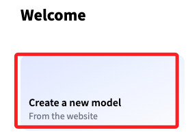
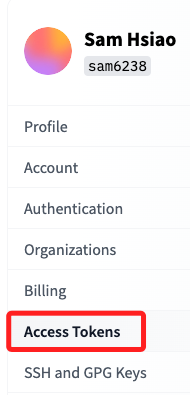

# 簡介

_[參考](https://github.com/build-on-aws/llm-rag-vectordb-python/tree/main)_

 

## 主要服務

1. 自然語言處理應庫 `transformers`。

2. 共享機器學習模型和資料集的平台：Huggingface 幾乎成為 LLM 開發的標準平台，各大公司如果有 open source 的 LLM model 幾乎都會上傳到 HuggingFace 供人下載。

 

## 取得 Token

1. 進入 [官網](https://huggingface.co/)，點擊右上角個人帳號後展開選單，點擊 `Settings`。

    

 

2. 點擊左側的 `Access Tokens` 進入設定 [頁面](https://huggingface.co/settings/tokens)。

    

 

3. 建立新的令牌 `New token`。

    

 

4. 命名、選擇類型，然後點擊生成 Token `Generate a token`。

    

 

5. 點擊 `New token` 完成建立令牌。

    

 

___

_END_