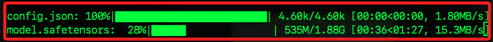

# 編輯腳本

1. 安裝套件。

```bash
pip install boto3 transformers langchain-aws awscli
```

2. 程式碼。

   ```python
   # 操作系統相關的功能
   import os
   # 讀取環境變數
   from dotenv import load_dotenv  
   # 用於生成提示模板和處理大語言模型鏈
   from langchain import PromptTemplate, LLMChain  
   # 用於生成各種自然語言處理管道
   from transformers import pipeline
   import streamlit as st
   # 用於連接 Amazon Bedrock
   from langchain.llms.bedrock import Bedrock

   # 設定 Streamlit 頁面的配置
   PAGE_CONFIG = {
       # 頁面標題
       "page_title": "Image to Recipe",
       # 頁面圖標
       "page_icon": ":chef:",
       # 頁面佈局為居中
       "layout": "centered",
   }
   # 設定頁面配置
   st.set_page_config(PAGE_CONFIG)
   st.markdown(
       """
       <style>
           body {
               /*設定頁面的背景顏色*/
               background-color: #fafafa;
               /*設定頁面的字體顏色*/
               color: #333;
           }
           h1, h2 {
               /*設定標題的字體顏色*/
               color: #ff6347;
           }
           .fileUploader .btn {
               /*設定上傳按鈕的背景顏色*/
               background-color: #ff6347;
               /*設定上傳按鈕的字體顏色*/
               color: white;
           }
       </style>
       """,
       unsafe_allow_html=True,
   )

   # 定義函數以獲取大語言模型
   def get_llm():
       bedrock_llm = Bedrock(
           # 使用 Claude v2 模型
           model_id="anthropic.claude-v2",
           # 設定模型參數
           model_kwargs={
               "temperature": 0.7,
               "max_tokens_to_sample": 4096
           },
       )
       # 返回大語言模型實例
       return bedrock_llm

   # 定義函數將圖像轉換為文字
   def image_to_text(url):
       # 顯示處理中的提示
       with st.spinner("Processing image..."):
           pipe = pipeline(
               "image-to-text",
               model="Salesforce/blip-image-captioning-large",
               max_new_tokens=1000,
           )
           # 獲取圖像生成的文字
           text = pipe(url)[0]["generated_text"]
       # 返回生成的文字
       return text

   # 定義函數生成食譜
   def generate_recipe(ingredients):
       template = """
       You are a extremely knowledgeable nutritionist, bodybuilder and chef who also knows
                   everything one needs to know about the best quick, healthy recipes. 
                   You know all there is to know about healthy foods, healthy recipes that keep 
                   people lean and help them build muscles, and lose stubborn fat.

                   You've also trained many top performers athletes in body building, and in extremely 
                   amazing physique. 

                   You understand how to help people who don't have much time and or 
                   ingredients to make meals fast depending on what they can find in the kitchen. 
                   Your job is to assist users with questions related to finding the best recipes and 
                   cooking instructions depending on the following variables:
                   0/ {ingredients}

                   When finding the best recipes and instructions to cook,
                   you'll answer with confidence and to the point.
                   Keep in mind the time constraint of 5-10 minutes when coming up
                   with recipes and instructions as well as the recipe.

                   If the {ingredients} are less than 3, feel free to add a few more
                   as long as they will compliment the healthy meal.


                   Make sure to format your answer as follows:
                   - The name of the meal as bold title (new line)
                   - Best for recipe category (bold)

                   - Preparation Time (header)

                   - Difficulty (bold):
                       Easy
                   - Ingredients (bold)
                       List all ingredients 
                   - Kitchen tools needed (bold)
                       List kitchen tools needed
                   - Instructions (bold)
                       List all instructions to put the meal together
                   - Macros (bold): 
                       Total calories
                       List each ingredient calories
                       List all macros 

                       Please make sure to be brief and to the point.  
                       Make the instructions easy to follow and step-by-step.
       """

       # 顯示生成食譜中的提示
       with st.spinner("Making the recipe for you..."):
           # 創建提示模板
           prompt = PromptTemplate(template=template, input_variables=["ingredients"])
           # 獲取大語言模型
           llm = get_llm()
           # 創建語言模型鏈
           recipe_chain = LLMChain(
               llm=llm,
               prompt=prompt,
               verbose=True
           )
           # 生成食譜
           recipe = recipe_chain.run(ingredients)
       # 返回生成的食譜
       return recipe

   # 定義主函數
   def main():
       # 顯示頁面標題
       st.markdown(
           "<h1 style='text-align: center; color: red;'>🍲 Recipe Generator 🍲 </h1>",
           unsafe_allow_html=True,
       )
       # 顯示子標題
       st.markdown(
           "<h2 style='text-align: center; font-size: 24px; color: black'>Powered by <span style='color: orange;'>Amazon Bedrock</span></h2>",
           unsafe_allow_html=True,
       )

       st.markdown(
           """
           <div style="display: flex; justify-content: center;">
               <a href="https://d1nd1o4zkls5mq.cloudfront.net/img1.jpeg" target="_blank">
                   <button style="margin-right: 10px; color: white; background-color: #007BFF; border: none; border-radius: 2px; padding: 10px 15px; transition: background-color 0.3s;">
                       Download Sample Image 1
                   </button>
               </a>
               <a href="https://d1nd1o4zkls5mq.cloudfront.net/img2.jpeg" target="_blank">
                   <button style="color: white; background-color: #007BFF; border: none; border-radius: 2px; padding: 10px 15px; transition: background-color 0.3s;">
                       Download Sample Image 2
                   </button>
               </a>
           </div>
           <style>
               button:hover {
                   background-color: #0056b3;
               }
           </style>
       """,
           unsafe_allow_html=True,
       )

       upload_file = st.file_uploader(
           "Choose an image:", type=["jpg", "png"], 
           # 提供圖片上傳功能
           accept_multiple_files=False
       )
       # 如果有文件上傳
       if upload_file is not None:
           # 獲取文件的位元組數據
           file_bytes = upload_file.getvalue()
           with open(upload_file.name, "wb") as file:
               # 將文件保存到本地
               file.write(file_bytes)

           st.image(
               upload_file,caption="The uploaded image", 
               # 顯示上傳的圖片
               use_column_width=True,
               width=250
           )
           # 顯示從圖片中提取的成分
           st.markdown("### 🥗 Ingredients from Image") 
           # 將圖片轉換為文字（成分）
           ingredients = image_to_text(upload_file.name)
           with st.expander("Ingredients 👀"):
               # 顯示提取的成分
               st.write(ingredients.capitalize())
           # 顯示生成的食譜
           st.markdown("### 📋 Recipe")
           # 根據成分生成食譜
           recipe = generate_recipe(ingredients=ingredients)
           with st.expander("Cooking Instructions 👀"):
               # 顯示食譜
               st.write(recipe)
           # 顯示更多資訊的連結
           st.markdown(
               "<h3 style='text-align: center; font-size: 30px;'> To know more about Amazon Bedrock, visit <a href='https://aws.amazon.com/bedrock/' target='_blank'>here</a> </h3>",
               unsafe_allow_html=True,
           )
           # 刪除本地保存的文件
           os.remove(upload_file.name)

   if __name__ == "__main__":
       # 載入 .env 文件中的環境變數
       load_dotenv()
       # 獲取 OpenAI API 金鑰
       OPENAI_API_KEY = os.getenv("OPENAI_API_KEY")
       # 獲取 Hugging Face Hub API 令牌
       HUGGINFACE_HUB_API_TOKEN = os.getenv("HUGGINFACE_HUB_API_TOKEN")
       # 執行主函數
       main()
   ```

## 說明事項

_針對原腳本的修正_


1. PromptTemplate 應從 langchain_core.prompts 引入。

2. LLMChain 應從 langchain.chains 引入。

3. Bedrock 應從 langchain_community.llms 引入。

4. st.set_page_config 需要使用關鍵字參數，而不是將字典直接傳遞給它。

5. 更新 Bedrock 導入，應該從 langchain_aws 模組而不是 langchain_community 模組導入 BedrockLLM。 

## 運行後

1. 會下載模型。

    