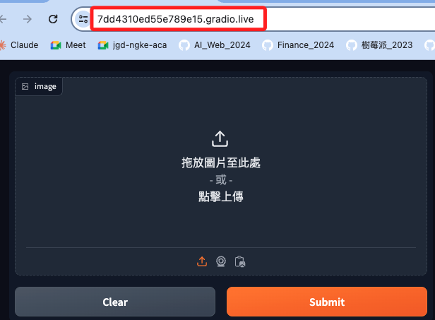

# Gradio 

_可參考 [官方文檔](https://gradio.app/)_

<br>

## 說明

1. `Gradio` 是一個用於構建和分享機器學習應用的 Python 庫，它使開發者能夠輕鬆地將機器學習模型轉化為具有圖形用戶界面的應用程序，並且可以在幾行代碼內完成這一過程。

<br>

2. `Gradio` 的應用程序可以在本地運行，也可以通過網際網路共享，這使得它非常適合於快速原型設計和展示機器學習模型。

<br>

## 主要功能和特點

1. Gradio 的 API 非常簡單，幾乎不需要額外的設置，只需要幾行代碼就可以創建一個互動式界面。

<br>

2. 支持多種 _輸入格式_，如文本、圖像、音頻、視頻等，_輸出_ 可以是文本、圖像等。

<br>

3. 可以在本地測試應用，並且可以生成一個公共鏈接，讓其他人通過網頁瀏覽器來使用這個應用。

<br>

4. 非常適合用於快速原型設計和模型展示，使得研究者和開發者能夠快速測試和分享他們的機器學習模型。

<br>

## 實作

1. 安裝庫。

    ```bash
    pip install gradio transformers
    ```

<br>

2. 簡單圖像分類應用。

    ```python
    import gradio as gr
    from transformers import pipeline
    from PIL import Image

    # 建立影像分類的 pipeline
    classifier = pipeline("image-classification", model="google/vit-base-patch16-224")


    # 定義分類函數，確保影像以PIL格式傳遞
    def classify_image(image):
        # 如果影像不是PIL格式，轉換為PIL格式
        if not isinstance(image, Image.Image):
            image = Image.fromarray(image)
        result = classifier(image)
        return {item["label"]: item["score"] for item in result}


    # 使用 Gradio 建立 Web 介面
    gr.Interface(
        fn=classify_image, inputs=gr.Image(type="numpy"), outputs=gr.Label()
    ).launch()
    ```

<br>

3. 運行後會開啟一個服務，端口是 `7861`，依據終端顯示，可透過在 `launch` 方法中輸入參數 `share=True` 建立公鏈。

    ```bash
    Running on local URL:  http://127.0.0.1:7861

    To create a public link, set `share=True` in `launch()`.
    ```

<br>

4. 上傳相片後，會進行分析，結果還蠻正確。

    

<br>

## 產生公共鏈接

1. 要使外部能夠訪問 Gradio 應用，可以在 `launch()` 方法中設定 `share=True` 參數，這樣 `Gradio` 應用會產生一個臨時的公共鏈接。

    ```python
    import gradio as gr
    from transformers import pipeline
    from PIL import Image

    # 建立影像分類的 pipeline
    classifier = pipeline(
        "image-classification",
        model="google/vit-base-patch16-224"
    )


    # 定義分類函數，確保影像以PIL格式傳遞
    def classify_image(image):
        # 如果影像不是PIL格式，轉換為PIL格式
        if not isinstance(image, Image.Image):
            image = Image.fromarray(image)
        result = classifier(image)
        return {item["label"]: item["score"] for item in result}


    # 使用 Gradio 建立 Web 介面
    gr.Interface(
        fn=classify_image,
        inputs=gr.Image(type="numpy"),
        outputs=gr.Label()
    ).launch(share=True)
    ```

<br>

2. 可透過公網訪問。

    

<br>

3. 這個公鏈有效 72 小時，另外，本地運行的腳本不可觀避。

    ```bash
    This share link expires in 72 hours. For free permanent hosting and GPU upgrades, run `gradio deploy` from Terminal to deploy to Spaces (https://huggingface.co/spaces)
    ```

<br>

___

_END_