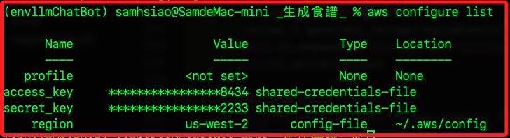

# AWS CLI

1. 運行。

    ```bash
    aws configure
    ```

    

<br>

2. 若因為 `botocore 和 awscli 版本之間的不兼容` 出現錯誤。

    ```bash
    pip install --upgrade botocore awscli
    pip install boto3==1.28.62 botocore==1.31.62
    ```

<br>

3. 查詢。

    ```bash
    aws configure list
    ```

    

    ```bash
        Name                    Value             Type    Location
        ----                    -----             ----    --------
    profile                <not set>             None    None
    access_key     ****************8434 shared-credentials-file    
    secret_key     ****************2233 shared-credentials-file    
        region                us-east-1      config-file    ~/.aws/config
    ```

<br>

___

_END_