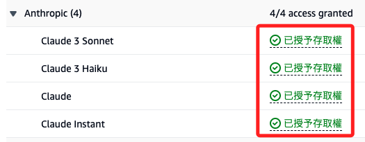
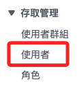
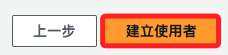
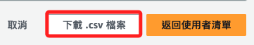
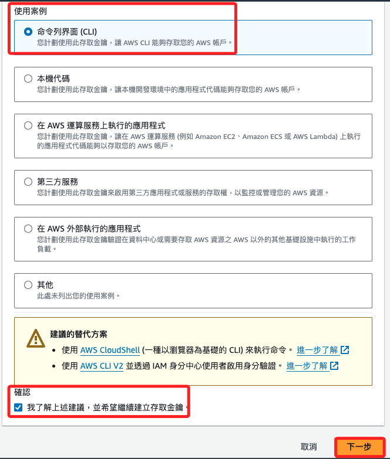
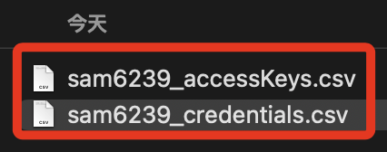
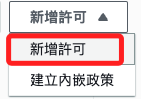

# Bedrock

_添加服務、申請模型訪問權限、建立使用者_

## AWS 服務

1. 搜尋並添加服務。

    

<br>

2. 點擊右上角的開始試用。

    

<br>

3. 管理模型存取權。

    

<br>

4. 在 `Anthropic` 的部分提出請求。

    

<br>

5. 點擊之後會展開另一個視窗。

    

<br>

6. 勾選。

    

<br>

7. 點擊畫面右下角的 `Next`。

    

<br>

8. 任意填寫即可。

    

<br>

9. 提交 `Submit`。

    

<br>

10. 提交完成後會顯示 `In Progress`。

    

<br>

11. 過一小段時間就會通過了（這裡變成）。

    

<br>

## IAM

1. 同樣地，搜尋並添加快捷鍵，接著點擊進入。

    

<br>

2. 點擊左側的使用者。

    

<br>

3. 建立使用者。

    

<br>

4. 自訂使用者名稱，並勾選 `提供使用者對 AWS 管理主控台的存取權` 後勾選 `我想要建立 IAM 使用者`。

    

<br>

5. 使用自訂產生的密碼，另外取消預設的更新密碼選項，接著進入 `下一步`。

    

<br>

6. 這裡無論選哪個項目都無妨，點擊 `下一步`。

    

<br>

7. 點擊右下角的 `建立使用者`。

    

<br>

8. 接著先點擊 `下載 .csv 檔案`，這會將帳號密碼下載到本地，然後再返回使用者清單中。

    

<br>

9. 變化看到添加了一個使用者。

    

<br>

10. 查看這個以使用者名稱前綴的檔案。

    

<br>

11. 內容是使用者名稱、密碼與 URL。

    

<br>

12. 點擊進入使用者後，點擊 `建立存取金鑰`。

    

<br>

13. 選取 `命令列介面` 後勾選下方的 `確認`，緊接著進入 `下一步`。

    

<br>

14. 任意描述。

    

<br>

15. 避免日後遺忘，同樣 `下載 .csv 檔案`，然後 `完成`。

    

<br>

16. 這兩份檔案，前面的是 `credentials`，後面的是 `accessKeys`。

    

<br>

## 建立政策

1. 在 IAM 畫面中，點擊左側的 `政策`。

    

<br>

2. 點擊建立政策。

    

<br>

3. 選取 `JSON`，並將以下內容貼在 `政策編輯器`中。

    

<br>

4. 內容如下。

```json
{
    "Version": "2012-10-17",
    "Statement": [
        {
            "Effect": "Allow",
            "Action": [
                "bedrock:InvokeModel",
                "bedrock:ListFoundationModels",
                "bedrock:GetFoundationModel"
            ],
            "Resource": "*"
        }
    ]
}
```

<br>

5. 點擊 `下一步`。

    

<br>

6. 命名 `BedrockAccessPolicy` 並添加描述 `Policy to allow access to Bedrock services`。

    

<br>

7. 建立政策。

    

<br>

8. 完成後可查看全貌。

    

<br>

## 添加政策

1. 在指定使用者介面內，點擊 `許可` 並 `新增許可`。

    

<br>

2. 點擊 `新增許可` 中的 `新增許可`。

    

<br>

3. 會看到前面建立使用者的步驟中看過的畫面，選取 `直接連接政策`。

    

<br>

4. 搜尋前面自建的政策。

    

<br>

5. 點擊右下角 `新增許可`。

    

<br>

## 設置 .env

1. 編輯 .env 文件，根據 `AccessKeys` 文件的內容填入，區域可填入 `us-east-1`。

    ```json
    AWS_ACCESS_KEY_ID=<依據下載的文件填寫>
    AWS_SECRET_ACCESS_KEY=<依據下載的文件填寫>
    AWS_REGION=us-east-1
    ```

<br>

## 測試腳本

1. 程式碼。

    ```python
    import os
    import boto3
    from botocore.exceptions import ClientError
    from dotenv import load_dotenv
    import json

    # 環境變數
    load_dotenv()

    def check_model_access():
        # 獲取密鑰
        aws_access_key_id = os.getenv("AWS_ACCESS_KEY_ID")
        aws_secret_access_key = os.getenv("AWS_SECRET_ACCESS_KEY")
        region_name = os.getenv("AWS_REGION")

        # 確認取得變數
        if not all([
            aws_access_key_id,
            aws_secret_access_key,
            region_name
        ]):
            print("錯誤：環境變數中並未設置 AWS 憑證或區域。")
            return

        # 建立 AWS Bedrock 客戶端實體
        client = boto3.client(
            "bedrock-runtime",
            aws_access_key_id=aws_access_key_id,
            aws_secret_access_key=aws_secret_access_key,
            region_name=region_name,
        )
        
        # 指定要使用的模型 ID
        model_id = "anthropic.claude-v2"  

        try:
            # 調用模型
            body = json.dumps({
                # 這是對話指定的格式
                "prompt": "\n\nHuman: 請簡短一句話介紹自己。\n\nAssistant:",
                "max_tokens_to_sample": 100
            })
            response = client.invoke_model(
                modelId=model_id,
                body=body.encode('utf-8'),
                contentType='application/json',
                accept='application/json'
            )
            response_body = json.loads(response['body'].read())
            print("成功：存取模型已經被允許。")
            print("響應內容：", response_body.get('completion', 'No completion in response'))
        except ClientError as e:
            if e.response["Error"]["Code"] == "AccessDeniedException":
                print(f"Access Denied: {e.response['Error']['Message']}")
            else:
                print(f"Error: {e.response['Error']['Message']}")
        except Exception as e:
            print(f"Unexpected error: {e}")

    if __name__ == "__main__":
        check_model_access()
    ```

    _結果_

    

<br>

2. 假如對話格式錯誤，會顯示 `Malformed input request`。

    

<br>

3. 可透過指令查詢指定區域內所有可用基礎模型，不限於使用者可用。

    ```bash
    aws bedrock list-foundation-models --region us-east-1
    ```

    

<br>

4. 透過程式碼也可以完成相同任務。

    ```python
    import os
    import boto3
    from botocore.exceptions import ClientError
    from dotenv import load_dotenv

    # 環境變數
    load_dotenv()

    def list_available_models():
        aws_access_key_id = os.getenv("AWS_ACCESS_KEY_ID")
        aws_secret_access_key = os.getenv("AWS_SECRET_ACCESS_KEY")
        region_name = os.getenv("AWS_REGION")

        if not all([aws_access_key_id, aws_secret_access_key, region_name]):
            print("錯誤：環境變量中並未設置 AWS 憑證或是區域。")
            return

        # 建立 AWS Bedrock 客户端物件
        client = boto3.client(
            "bedrock",
            aws_access_key_id=aws_access_key_id,
            aws_secret_access_key=aws_secret_access_key,
            region_name=region_name,
        )

        try:
            # 列出所有基礎模型
            response = client.list_foundation_models()
            models = response.get('modelSummaries', [])
            if models:
                print("Available models:")
                for model in models:
                    print(f"Model ID: {model['modelId']}, Name: {model['modelName']}")
            else:
                print("No models available.")
        except ClientError as e:
            print(f"ClientError: {e.response['Error']['Message']}")
        except Exception as e:
            print(f"Unexpected error: {e}")

    if __name__ == "__main__":
        list_available_models()
    ```

<br>

5. 若查詢進階模型。

    ```python
    import os
    import boto3
    from botocore.exceptions import ClientError
    from dotenv import load_dotenv

    # 加载环境变量
    load_dotenv()

    def list_advanced_models():
        aws_access_key_id = os.getenv("AWS_ACCESS_KEY_ID")
        aws_secret_access_key = os.getenv("AWS_SECRET_ACCESS_KEY")
        region_name = os.getenv("AWS_REGION")

        if not all([aws_access_key_id, aws_secret_access_key, region_name]):
            print("错误：环境变量中未设置 AWS 凭证或区域。")
            return

        # 建立 AWS Bedrock 客户端实例
        client = boto3.client(
            "bedrock",
            aws_access_key_id=aws_access_key_id,
            aws_secret_access_key=aws_secret_access_key,
            region_name=region_name,
        )

        try:
            # 列出所有基础模型
            response = client.list_foundation_models()
            models = response.get('modelSummaries', [])
            if models:
                print("Available advanced models:")
                for model in models:
                    model_id = model['modelId']
                    model_name = model['modelName']
                    provider_name = model['providerName']
                    input_modalities = ", ".join(model.get('inputModalities', []))
                    output_modalities = ", ".join(model.get('outputModalities', []))
                    customizations_supported = ", ".join(model.get('customizationsSupported', []))
                    inference_types_supported = ", ".join(model.get('inferenceTypesSupported', []))
                    response_streaming_supported = model.get('responseStreamingSupported', False)
                    model_lifecycle_status = model['modelLifecycle']['status']

                    print(f"Model ID: {model_id}")
                    print(f"Name: {model_name}")
                    print(f"Provider: {provider_name}")
                    print(f"Input Modalities: {input_modalities}")
                    print(f"Output Modalities: {output_modalities}")
                    print(f"Customizations Supported: {customizations_supported}")
                    print(f"Inference Types Supported: {inference_types_supported}")
                    print(f"Response Streaming Supported: {response_streaming_supported}")
                    print(f"Model Lifecycle Status: {model_lifecycle_status}")
                    print("-" * 60)
            else:
                print("No models available.")
        except ClientError as e:
            print(f"ClientError: {e.response['Error']['Message']}")
        except Exception as e:
            print(f"Unexpected error: {e}")

    if __name__ == "__main__":
        list_advanced_models()
    ```

<br>

6. 檢查使用者對指定模型的訪問權限

    ```bash
    aws bedrock get-foundation-model --model-identifier anthropic.claude-v2 --region us-east-1
    ```

    _結果_

    ```json
    {
        "modelDetails": {
            "modelArn": "arn:aws:bedrock:us-east-1::foundation-model/anthropic.claude-v2",
            "modelId": "anthropic.claude-v2",
            "modelName": "Claude",
            "providerName": "Anthropic",
            "inputModalities": [
                "TEXT"
            ],
            "outputModalities": [
                "TEXT"
            ],
            "responseStreamingSupported": true,
            "customizationsSupported": [],
            "inferenceTypesSupported": [
                "ON_DEMAND"
            ],
            "modelLifecycle": {
                "status": "ACTIVE"
            }
        }
    }
    ```

<br>

## 透個腳本查看可用模型

1. 建立腳本。

    ```bash
    cd ~/Desktop && touch check_accessible_models.sh && echo '#!/bin/bash

    # 取得所有模型
    all_models=$(aws bedrock list-foundation-models --region us-east-1 --query "modelSummaries[].modelId" --output text)

    # 建立文件用來儲存查詢結果
    accessible_models_file="accessible_models.txt"
    > $accessible_models_file

    # 檢查每個模型訪問權限
    echo "Checking accessible models for the current user..."
    for model_id in $all_models; do
        echo "Checking model: $model_id"
        access_check=$(aws bedrock get-foundation-model --model-identifier $model_id --region us-east-1 2>&1)
        if [[ $access_check != *"AccessDenied"* ]]; then
            echo "Accessible model: $model_id"
            echo $model_id >> $accessible_models_file
        else
            echo "Access denied for model: $model_id"
        fi
    done

    echo "Accessible models have been saved to $accessible_models_file"' > check_accessible_models.sh
    ```

<br>

2. 檢查是否確實建立。

    ```bash
    ls check_accessible_models.sh
    ```

<br>

3. 查看內容。

    ```bash
    cat check_accessible_models.sh
    ```

<br>

4. 賦予權限。

    ```bash
    chmod +x check_accessible_models.sh
    ```

<br>

5. 運行。

    ```bash
    ./check_accessible_models.sh
    ```

<br>

6. 查看文件。

    ```bash
    cat accessible_models.txt
    ```

<br>

___

_END_