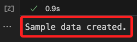
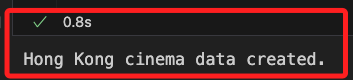
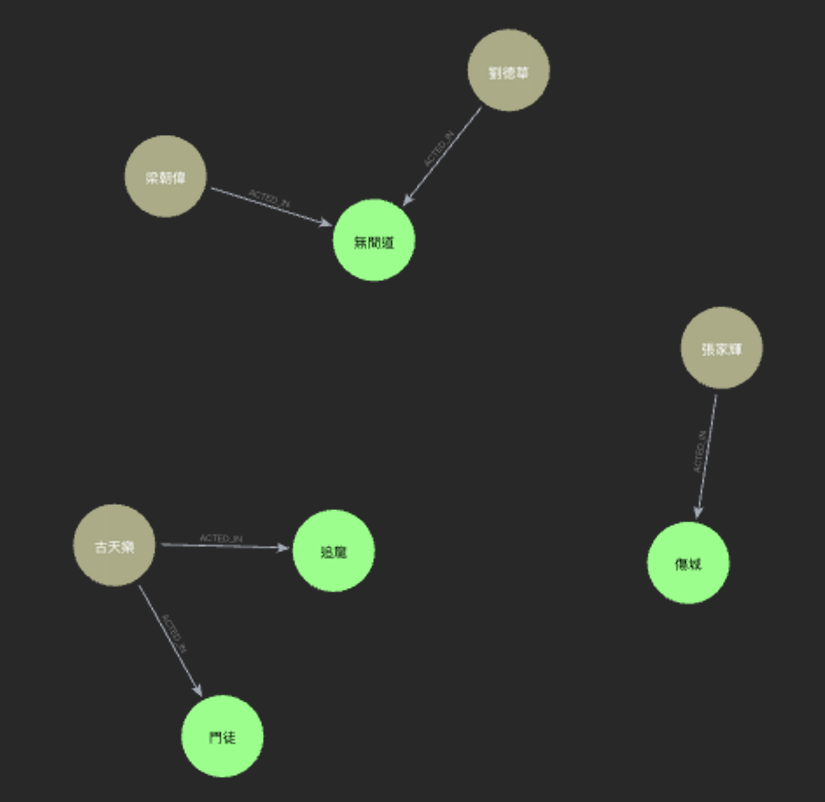
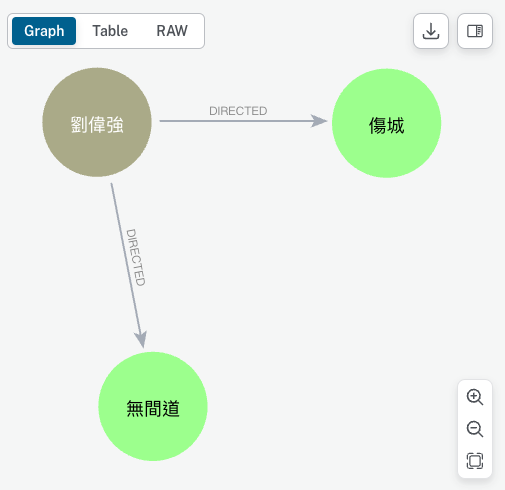
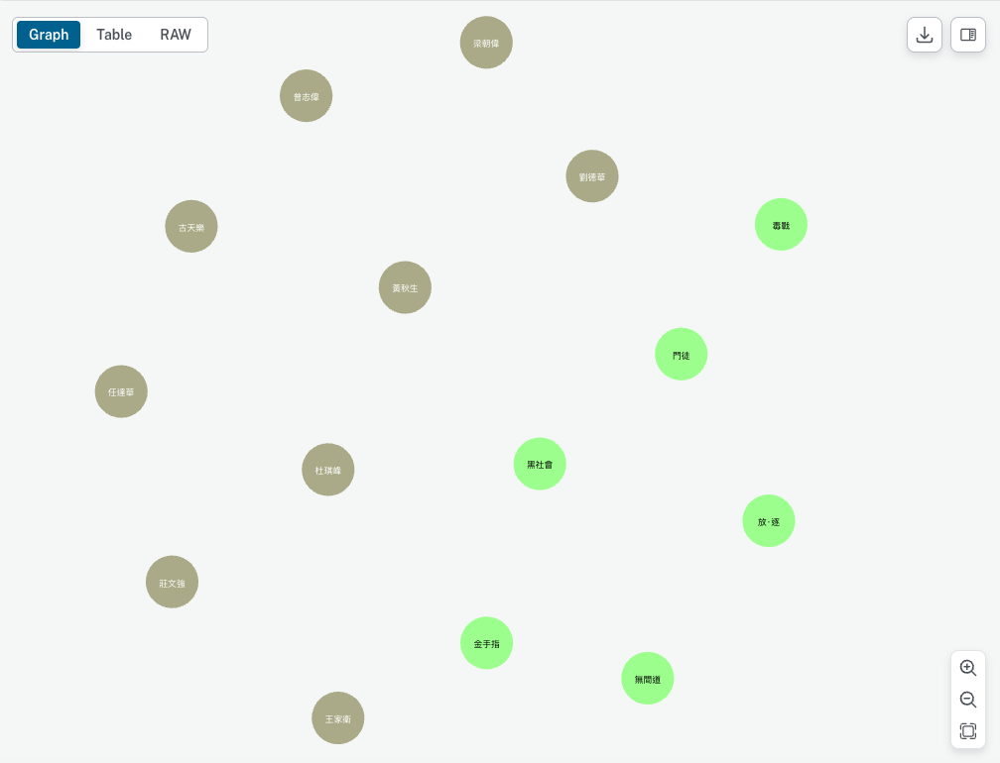
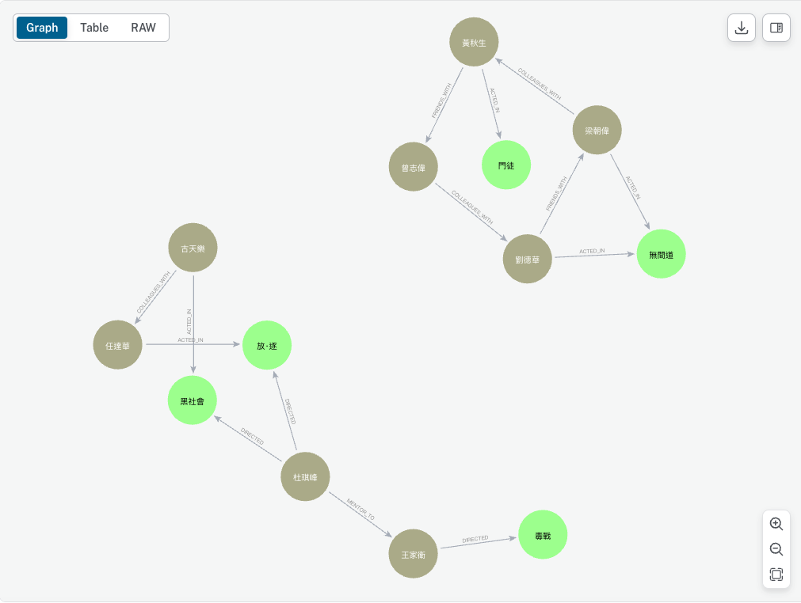
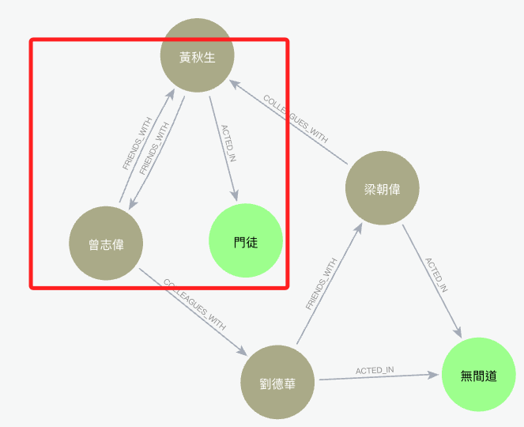
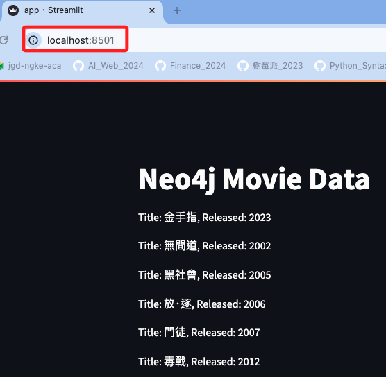

# 建立節點的關係、屬性、標籤

_為了觀察 Neo4j 的特性，以下透過腳本建立一個具有 `關係 relationships`的資料庫來進行演釋。_

<br>

## 範例

1. 建立腳本 `insert_data.ipynb` 用於在資料庫中新增資料，程式碼如下。

    ```python
    # insert_data.ipynb
    from neo4j import GraphDatabase
    import os
    from dotenv import load_dotenv

    # 載入環境變數
    load_dotenv()

    # 取得環境變數
    URI = os.getenv("NEO4J_URI")
    USER = os.getenv("NEO4J_USERNAME")
    PASSWORD = os.getenv("NEO4J_PASSWORD")

    driver = GraphDatabase.driver(URI, auth=(USER, PASSWORD))


    def create_sample_data():
        """向資料庫中插入範例數據，建立電影和演員節點及其關係"""
        cypher_query = """
        CREATE (TheMatrix:Movie {title:"The Matrix", released:1999, tagline:"Welcome to the Real World"})
        CREATE (Keanu:Person {name:"Keanu Reeves", born:1964})
        CREATE (Carrie:Person {name:"Carrie-Anne Moss", born:1967})
        CREATE (Laurence:Person {name:"Laurence Fishburne", born:1961})
        CREATE (Hugo:Person {name:"Hugo Weaving", born:1960})
        CREATE (LillyW:Person {name:"Lilly Wachowski", born:1967})
        CREATE (LanaW:Person {name:"Lana Wachowski", born:1965})
        CREATE (JoelS:Person {name:"Joel Silver", born:1952})
        CREATE (Keanu)-[:ACTED_IN {roles:["Neo"]}]->(TheMatrix)
        CREATE (Carrie)-[:ACTED_IN {roles:["Trinity"]}]->(TheMatrix)
        CREATE (Laurence)-[:ACTED_IN {roles:["Morpheus"]}]->(TheMatrix)
        CREATE (Hugo)-[:ACTED_IN {roles:["Agent Smith"]}]->(TheMatrix)
        CREATE (LillyW)-[:DIRECTED]->(TheMatrix)
        CREATE (LanaW)-[:DIRECTED]->(TheMatrix)
        CREATE (JoelS)-[:PRODUCED]->(TheMatrix)
        """
        with driver.session() as session:
            session.run(cypher_query)
            print("Sample data created.")


    if __name__ == "__main__":
        create_sample_data()
        driver.close()
    ```

<br>

2. 完成。

    

<br>

3. 在 Neo4j資料庫中點擊右下角圖標進行 `刷新`，可觀察節點數量 `13` 與關係數量 `7` 都有增加。

    

<br>

4. 可點擊 `Relationships` 中的標籤進行觀察。

    

<br>

5. 每次操作都會更新上方欄位中顯示的語法。

    

<br>

6. 可複製語法貼在新的欄位中，然後點擊右方的運行，這個語法也可在後續的程式碼中進行執行，或在其他的應用平台中執行。

    

<br>

## 拓展

_開始新的示範之前先刪除資料庫中的資料_

<br>

1. 刪除當前節點中的資料：建立一個腳本 `clear_database.ipynb` 用以刪除當前資料。

    ```python
    from neo4j import GraphDatabase
    import os
    from dotenv import load_dotenv

    # 載入環境變數
    load_dotenv()

    # 取得環境變數
    URI = os.getenv("NEO4J_URI")
    USER = os.getenv("NEO4J_USERNAME")
    PASSWORD = os.getenv("NEO4J_PASSWORD")

    driver = GraphDatabase.driver(URI, auth=(USER, PASSWORD))

    def delete_all_data():
        """刪除資料庫中的所有節點與關係"""
        cypher_query = """
        MATCH (n)
        DETACH DELETE n
        """
        with driver.session() as session:
            session.run(cypher_query)
            print("All data has been deleted.")

    if __name__ == "__main__":
        delete_all_data()
        driver.close()
    ```

<br>

2. 以下的範例使用幾位著名的香港與台灣演員及其參演的經典電影，來建立一個圖形資料庫模型，這會涉及到節點（演員與電影）、關係（演員與電影之間的參演關係）、以及其他輔助關係（如導演與電影的關係）。

    ```python
    # insert_data.ipynb
    from neo4j import GraphDatabase
    import os
    from dotenv import load_dotenv

    # 載入環境變數
    load_dotenv()

    # 取得環境變數
    URI = os.getenv("NEO4J_URI")
    USER = os.getenv("NEO4J_USERNAME")
    PASSWORD = os.getenv("NEO4J_PASSWORD")

    driver = GraphDatabase.driver(URI, auth=(USER, PASSWORD))

    def create_hk_cinema_data():
        """建立香港電影與演員節點，及其關係"""
        cypher_query = """
        CREATE (InfernalAffairs:Movie {title:"無間道", released:2002, tagline:"忠奸難分"})
        CREATE (Protégé:Movie {title:"門徒", released:2007, tagline:"毒品世界的陰謀與背叛"})
        CREATE (CityOfViolence:Movie {title:"傷城", released:2006, tagline:"血雨腥風的復仇之路"})
        CREATE (ChasingDragon:Movie {title:"追龍", released:2017, tagline:"黑白兩道，一觸即發"})
        
        CREATE (AndyLau:Person {name:"劉德華", born:1961})
        CREATE (TonyLeung:Person {name:"梁朝偉", born:1962})
        CREATE (TakeshiKaneshiro:Person {name:"金城武", born:1973})
        CREATE (NickCheung:Person {name:"張家輝", born:1967})
        CREATE (LouisKoo:Person {name:"古天樂", born:1970})
        
        CREATE (AndyLau)-[:ACTED_IN {roles:["劉建明"]}]->(InfernalAffairs)
        CREATE (TonyLeung)-[:ACTED_IN {roles:["陳永仁"]}]->(InfernalAffairs)
        CREATE (NickCheung)-[:ACTED_IN {roles:["Nick"]}]->(CityOfViolence)
        CREATE (LouisKoo)-[:ACTED_IN {roles:["曹元元"]}]->(Protégé)
        CREATE (LouisKoo)-[:ACTED_IN {roles:["張強"]}]->(ChasingDragon)
        CREATE (AndyLau)-[:PRODUCED]->(CityOfViolence)
        
        CREATE (AndrewLau:Person {name:"劉偉強", born:1960})
        CREATE (AndrewLau)-[:DIRECTED]->(InfernalAffairs)
        CREATE (AndrewLau)-[:DIRECTED]->(CityOfViolence)
        """
        with driver.session() as session:
            session.run(cypher_query)
            print("Hong Kong cinema data created.")

    if __name__ == "__main__":
        create_hk_cinema_data()
        driver.close()

    ```

    

<br>

3. 在以上這個腳本中所建立的圖形資料顯示如下。

    

<br>

4. 當點擊 `DIRECTED` 的時候，可以觀察到 `劉偉強` 同時執導的有 `傷城` 與 `無間道`。

    

<br>

5. 進一步拓展資料庫的關係。

    ```python
    from neo4j import GraphDatabase
    import os
    from dotenv import load_dotenv

    # 載入環境變數
    load_dotenv()

    # 取得環境變數
    URI = os.getenv("NEO4J_URI")
    USER = os.getenv("NEO4J_USERNAME")
    PASSWORD = os.getenv("NEO4J_PASSWORD")

    driver = GraphDatabase.driver(URI, auth=(USER, PASSWORD))

    def create_complex_relationships():
        """在資料庫中插入複雜的電影與演員節點及其關係"""
        cypher_query = """
        // 建立電影節點
        CREATE (InfernalAffairs:Movie {title: "無間道", released: 2002})
        CREATE (TheDeparted:Movie {title: "神鬼無間", released: 2006})
        // 建立演員節點
        CREATE (AndyLau:Person {name: "劉德華", born: 1961})
        CREATE (TonyLeung:Person {name: "梁朝偉", born: 1962})
        CREATE (AnthonyWong:Person {name: "黃秋生", born: 1961})
        CREATE (EricTsang:Person {name: "曾志偉", born: 1953})
        CREATE (LeonardoDiCaprio:Person {name: "萊昂納多·迪卡皮歐", born: 1974})
        CREATE (MattDamon:Person {name: "馬特·達蒙", born: 1970})
        // 建立演員和電影之間的關係
        CREATE (AndyLau)-[:ACTED_IN {roles: ["劉健明"]}]->(InfernalAffairs)
        CREATE (TonyLeung)-[:ACTED_IN {roles: ["陳永仁"]}]->(InfernalAffairs)
        CREATE (AnthonyWong)-[:ACTED_IN {roles: ["黃志誠"]}]->(InfernalAffairs)
        CREATE (EricTsang)-[:ACTED_IN {roles: ["韓琛"]}]->(InfernalAffairs)
        CREATE (LeonardoDiCaprio)-[:ACTED_IN {roles: ["Billy"]}]->(TheDeparted)
        CREATE (MattDamon)-[:ACTED_IN {roles: ["Colin"]}]->(TheDeparted)
        // 更多的關係
        CREATE (AndyLau)-[:FRIENDS_WITH]->(TonyLeung)
        CREATE (TonyLeung)-[:COLLEAGUES_WITH]->(AnthonyWong)
        CREATE (AnthonyWong)-[:FRIENDS_WITH]->(EricTsang)
        CREATE (EricTsang)-[:COLLEAGUES_WITH]->(AndyLau)
        """
        with driver.session() as session:
            session.run(cypher_query)
            print("Complex relationships between movies and actors have been created.")

    if __name__ == "__main__":
        create_complex_relationships()
        driver.close()

    ```

<br>

6. 若要避免資料重複，則需使用 `MERGE` 指令替代 `CREATE`，因為 `MERGE` 會檢查節點是否已存在，如果存在就會使用現有的節點，如果不存在則會建立一個新節點，這可確保資料庫中不會因為重複執行而產生重複的節點。

    ```python
    from neo4j import GraphDatabase
    import os
    from dotenv import load_dotenv

    # 載入環境變數
    load_dotenv()

    # 取得環境變數
    URI = os.getenv("NEO4J_URI")
    USER = os.getenv("NEO4J_USERNAME")
    PASSWORD = os.getenv("NEO4J_PASSWORD")

    driver = GraphDatabase.driver(URI, auth=(USER, PASSWORD))

    def create_complex_relationships():
        """在資料庫中插入複雜的電影與演員節點及其關係，確保節點不重複建立"""
        """使用 MERGE 確保電影節點不會重複建立"""
        cypher_query = """
        // 電影
        MERGE (TheGoldfinger:Movie {title: "金手指", released: 2023})
        MERGE (InfernalAffairs:Movie {title: "無間道", released: 2002})
        MERGE (Election:Movie {title: "黑社會", released: 2005})
        MERGE (Exiled:Movie {title: "放‧逐", released: 2006})
        MERGE (MenTuo:Movie {title: "門徒", released: 2007})
        MERGE (DrugWar:Movie {title: "毒戰", released: 2012})
        // 演員
        MERGE (AndyLau:Person {name: "劉德華", born: 1961})
        MERGE (TonyLeung:Person {name: "梁朝偉", born: 1962})
        MERGE (AnthonyWong:Person {name: "黃秋生", born: 1961})
        MERGE (EricTsang:Person {name: "曾志偉", born: 1953})
        MERGE (LouisKoo:Person {name: "古天樂", born: 1970})
        MERGE (SimonYam:Person {name: "任達華", born: 1955})
        // 導演
        MERGE (FelixChong:Person {name: "莊文強", born: 1968})
        MERGE (JohnnieTo:Person {name: "杜琪峰", born: 1955})
        MERGE (WongKarWai:Person {name: "王家衛", born: 1958})
        // 演員與電影中角色的關係：合併處理 `演員與電影的關係`及`角色與電影的關係`
        MERGE (AndyLau)-[:ACTED_IN {roles: ["劉健明"]}]->(InfernalAffairs)
        MERGE (TonyLeung)-[:ACTED_IN {roles: ["陳永仁"]}]->(InfernalAffairs)
        MERGE (LouisKoo)-[:ACTED_IN {roles: ["阿樂"]}]->(Election)
        MERGE (SimonYam)-[:ACTED_IN {roles: ["阿牛"]}]->(Exiled)
        MERGE (AnthonyWong)-[:ACTED_IN {roles: ["Blade"]}]->(MenTuo)
        // 導演與電影之間的關係
        MERGE (JohnnieTo)-[:DIRECTED]->(Election)
        MERGE (JohnnieTo)-[:DIRECTED]->(Exiled)
        MERGE (WongKarWai)-[:DIRECTED]->(DrugWar)
        // 更多的關係
        MERGE (AndyLau)-[:FRIENDS_WITH]->(TonyLeung)
        MERGE (TonyLeung)-[:COLLEAGUES_WITH]->(AnthonyWong)
        MERGE (LouisKoo)-[:COLLEAGUES_WITH]->(SimonYam)
        MERGE (JohnnieTo)-[:MENTOR_TO]->(WongKarWai)
        MERGE (AnthonyWong)-[:FRIENDS_WITH]->(EricTsang)
        MERGE (EricTsang)-[:COLLEAGUES_WITH]->(AndyLau)
        """
        with driver.session() as session:
            session.run(cypher_query)
            print("Complex relationships between movies and actors have been created without duplication.")

    if __name__ == "__main__":
        create_complex_relationships()
        driver.close()
    ```

<br>

## 查詢語法

1. 顯示資料庫中的所有節點與關係。

    ```bash
    MATCH (n)
    RETURN n
    ```

    

<br>

2. 些節點之間的所有關係以及關係的目標節點。

    ```bash
    MATCH (n)-[r]->(m)
    RETURN n, r, m
    ```

    

<br>

## 雙向查詢

1. 延續上點，若資料中具有雙向關係可進行雙向查詢，特別注意，`Neo4j` 中的關係是有方向性的，若要建立雙向關係則需要建立兩次，本範例中建立了 `黃秋生` 跟 `曾志偉` 兩者間的關係 `FRIENDS_WITH`。

    ```python
    def create_complex_relationships():
        """添加雙向關係"""
        cypher_query = """
        // 原本的關係
        MERGE (AnthonyWong)-[:FRIENDS_WITH]->(EricTsang)
        // 添加雙向關係
        MERGE (EricTsang)-[:FRIENDS_WITH]->(AnthonyWong)  
        """
    ```

<br>

2. 查詢雙向關係，在 `黃秋生` 跟 `曾志偉` 間建立了雙向的友誼關係。

    ```bash
    MATCH (n)-[r]-(m)
    RETURN n, r, m
    ```

    

<br>

3. 可再次進行本地瀏覽 [localhost:8501](localhost:8501)。

    

<br>

___

_END_