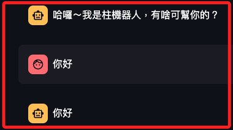

# 開始建立專案


## 說明

_先建立兩個檔案 `app.py` 及 `utils.py`_

1. app.py。
```python
import streamlit as st
from utils import write_message


st.set_page_config("柱子", page_icon=":movie_camera:")

if "messages" not in st.session_state:
    st.session_state.messages = [
        {
            "role": "assistant",
            "content": "哈囉～我是柱機器人，有啥可幫你的？",
        },
    ]


def handle_submit(message):

    with st.spinner("我想一下..."):
        # TODO: 之後要替換這段
        from time import sleep

        sleep(1)
        write_message("assistant", message)


for message in st.session_state.messages:
    write_message(message["role"], message["content"], save=False)

if prompt := st.chat_input("怎麼了？"):

    write_message("user", prompt)
    handle_submit(prompt)
```

3. utils.py。
```python
import streamlit as st


def write_message(role, content, save=True):

    if save:
        st.session_state.messages.append({
            "role": role,
            "content": content
        })
    with st.chat_message(role):
        st.markdown(content)

```

4. 運行，會建立一個同問同答的聊天機器人。



