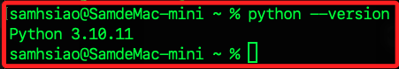

# Stramlit + ChatBot

_這是一個完整的專案，結合 `Streamlit`、`Neo4j`、`LangChain`、`Docker` 等技術，可在本地、Codespace、Streamlit 服務器上運行。_

<br>

## 說明

1. 這個筆記是基於官方的 [GraphAcademy 教程](https://graphacademy.neo4j.com/courses/llm-chatbot-python/1-project-setup/) 所進行的拓展。

    

<br>

2. 官方教程有部分不清楚之處，這個筆記進行了實作並詳細說明。

<br>

3. 範例中的腳本可參考 [GitHub](https://github.com/neo4j-graphacademy/llm-chatbot-python?tab=readme-ov-file)，在操作中也會透過 `Git` 指令克隆這個倉庫。

<br>

4. 相關參考資料眾多，如 [LangChain 官方文件 - Neo4j Vector Index](https://python.langchain.com/v0.1/docs/integrations/vectorstores/neo4jvector/)、 [neo4j 官方文件 － Vector search indexes](https://neo4j.com/docs/cypher-manual/current/indexes/semantic-indexes/vector-indexes/)。

<br>

## 查詢 Python 版本

1. 檢查 Python 版本：因為專案會使用 `Langchain` 模組，但是模組目前不支援 `Python 3.12` 以上版本，所以開始進行前，請確認本機當前 Python 的版本號。

    ```bash
    python --version
    ```

    

<br>

2. 由於教程中使用的是 `3.11`，所以本筆記也將採用相同版本，首先先查詢 `3.11` 所在何處。

    ```bash
    which python3.11
    ```

<br>

3. 結果會顯示位於 `/usr/local/bin/python3.11`，但這存放的 `符號鏈接`，而非真實路徑。

    

<br>

4. 透過 `ls -l` 可查看 `符號鏈接` 的目標位置。

    ```bash
    ls -l /usr/local/bin/python3.11
    ```

    

<br>

5. 透過這個路徑進行版本查詢，確認路徑無誤。

    ```bash
    /Library/Frameworks/Python.framework/Versions/3.11/bin/python3.11 --version
    ```

    

<br>

## 建立虛擬環境

1. 進入自訂用於管理 Python 虛擬環境的資料夾中建立虛擬環境，這裡示範的路徑是 `~/Documents/PythonVenv`。

    ```bash
    cd ~/Documents/PythonVenv && /Library/Frameworks/Python.framework/Versions/3.11/bin/python3.11 -m venv envllmChatBot
    ```

<br>

2. 編輯環境參數。

    ```bash
    nano ~/.zshrc
    ```
    
    _或在 VSCode 中編輯_
    
    ```bash
    code ~/.zshrc
    ```

<br>

3. 在 `.zshrc` 文件中加入以下代碼，通常寫在最下方即可，然後透過組合鍵將文件儲存 `control+o` 並退出 `control+x`。

    ```bash
    source /Users/samhsiao/Documents/PythonVenv/envllmChatBot/bin/activate
    ```

<br>

4. 啟動虛擬環境。

    ```bash
    source ~/.zshrc
    ```

<br>

## 建立專案

1. 進入要存放專案的資料夾中，這裡示範存放在桌面，然後下載 git，並進入下載的資料夾。

    ```bash
    cd ~/Desktop && git clone https://github.com/neo4j-graphacademy/llm-chatbot-python && cd llm-chatbot-python
    ```

<br>

2. 透過指令查看 `requirements.txt` 文件中預設了哪些模組，預設包含了五個模組。

    ```bash
    cat requirements.txt
    ```

    

<br>

3. 接下來透過指令安裝 `requirements.txt` 文件中指定的模組與對應的版本；但文件缺乏了專案所需的兩個套件，這裡示範使用指令 `echo` 來添加套件再安裝。

    ```bash
    echo -e "langchainhub\nlangchain_community" >> requirements.txt && pip install -r requirements.txt
    ```

<br>

4. 出現黃色錯誤訊息，無論是提示更新或警告有更新錯誤，基本上是不會影響套件安裝，但可手動更新。

    

    _更新指令_

    ```bash
    python -m pip --upgrade pip
    ```

<br>

5. 可再次確認 `requirements.txt` 的內容。

    ```bash
    cat requirements.txt
    ```

    _結果如下_

    ```txt
    langchain
    openai
    langchain_openai
    neo4j-driver
    streamlit
    langchainhub
    langchain_community
    ```

<br>

6. _特別說明_，由於後續會建立容器，在這裡先行寫入文件中可免去在建立容器時，還需在 `devcontainer.json` 文件中添加設置指令的麻煩。

<br>

## 啟動專案

1. 嘗試運行主腳本 `bot.py`。

    ```bash
    streamlit run bot.py
    ```

    

<br>

2. 當前的機器人只會回應相同訊息。

    

<br>

3. 先使用組合鍵 `control+c` 退出運行，然後運行以下指令開啟 VSCode 並重新啟動服務；這樣做並無其他目的，只是為了確保是在專案資料夾中開啟 VSCode，是一個開發上的習慣而已。

    ```bash
    code . && streamlit run bot.py
    ```

<br>

4. 開啟主腳本 `bot.py`，可見到代碼中很多標記語法 `# tag::`、`# end::` 或多行註解，這些語法主要用於說明或文檔生成工具、代碼片段提取工具、教程管理系統等，在這裏並無作用，可自行刪除。

    

<br>

5. 若在 VSCode 中有使用 `Flake8` 等優化插件，可透過修改 `settings.json` 文件來設定，在專案根目錄內建立資料夾 `.vscode` 然後新增文件後寫入以下設定值。

    ```json
    {
        // flake8 長度
        "flake8.args": [
            // 取消長度
            "--max-line-length=200",
            // 取消首行必須是 import 的規定
            // 取消長度限制
            "--ignore=E402, E501"
        ],
    }
    ```

<br>

## 設定文件

1. 進入 [OpenAI 官網](platform.openai.com) 取得 API Key，這部分將在其他章節說明。

<br>

2. 在敏感資訊部分，一般情況會使用 `dotenv` 處理，而這個專案因為使用了 `Streamlit` 框架，故可使用框架內建的 `st.secrets[]` 進行設定，因為教程以建立了資料夾 `.streamlit`，所以新增設定文件即可；_補充說明_，資料夾中有一個文件 `.gitkeep`，故名可思議，這是一種在 Git 倉庫中保留空白目錄的常見約定方案，所以建立了 `secrets.toml` 文件之後可予以刪除。

   ```bash
   touch .streamlit/secrets.toml && rm -rf .gitkeep
   ```

<br>

3. 在專案中，後續會使用到 `OpenAI API` 以及 `Neo4J` 兩項服務的密鑰或憑證，這裡先將 `變數` 寫入，`值` 的部分在後續的操作中會再說明；_特別注意_，模組 `OpenAI` 內建會讀取環境參數中的 `OPENAI_API_KEY`，故這裡不要變更這個變數名稱，避免後續發生混淆或衝突。

    ```json
    OPENAI_API_KEY = "sk-"
    OPENAI_MODEL = "gpt-4-turbo"

    NEO4J_URI = "bolt://34.201.131.176:7687"
    NEO4J_USERNAME = "neo4j"
    NEO4J_PASSWORD = "oxides-winch-controls"
    ```

<br>

4. 關於模型介紹可閱讀 [官網](https://platform.openai.com/docs/models/models) 說明，_特別注意_，要填入的 `模型代號` 會在下方的說明中的 `Model`，而不是 `Models overview` 中的 `Model`。

   _這是說明_

   

   _這是代號_

   

<br>

4. 範例中已有 `.gitignore` 文件，並已寫入部分項目如下。

   ```json
   __pycache__
   .streamlit/secrets.toml
   .env
   .DS_Store
   ```

<br>

5. 在這個專案中並未使用 `.env`，這裡僅簡單說明 `.env` 與 `secrets.toml` 的差異，其中 `.env` 屬於一般文件而非腳本，所以字串部分是 _不需要加上引號的，等號兩側也無需間隔_，若是加上間隔或引號亦無妨，這與腳本文件 `secrets.toml` 是不同的格式，要特別注意。

   ```json
   OPENAI_API_KEY=sk-...
   OPENAI_MODEL=gpt-4-turbo
   ```

<br>

6. 若要使用 `dotenv` 則需安裝套件。

   ```bash
   pip install python-dotenv
   ```

<br>

## 腳本改寫

1. 主腳本 `bot.py`：初步修改時，可將瀏覽器頁籤改為自己的名稱如 `柱子`，另外也可把初次啟動的歡迎詞更改為 `哈囉，這是初次啟動，請問需要什麼服務？`。

    ```python
    import streamlit as st
    # 從自訂模組中導入函數
    from utils import write_message
    # 設定瀏覽器頁籤及圖標
    st.set_page_config("柱子", page_icon=":movie_camera:")

    if "messages" not in st.session_state:
        st.session_state.messages = [
            {
                "role": "assistant",
                "content": "哈囉，這是初次啟動，請問需要什麼服務？",
            },
        ]


    def handle_submit(message):
        # 提交時，會先顯示這個字串
        with st.spinner("讓我思考一下..."):
            from time import sleep

            sleep(1)
            write_message("assistant", message)


    for message in st.session_state.messages:
        write_message(message["role"], message["content"], save=False)

    # 假如用戶輸入了訊息
    if prompt := st.chat_input("怎麼了？有話就說吧～"):
        write_message("user", prompt)
        handle_submit(prompt)

    ```

<br>

2. 在主腳本中載入了模組 `utils.py`，所以這裡也可進行查看，這腳本無實質修改，僅刪除無謂的註解與標籤，這裡不再贅述；截至目前，機器人仍只會重複用戶對話。

    ```python
    import streamlit as st


    # 自訂一個寫入訊息的函數，參數有：角色、內容，並預設會儲存
    def write_message(role, content, save=True):
        # 儲存
        if save:
            # 依據傳入的角色將訊息寫入 session_state
            st.session_state.messages.append({
                "role": role, "content": content
            })
        with st.chat_message(role):
            # 依據角色，將對話顯示在客戶端或是服務端
            st.markdown(content)

    ```

<br>

## 建立 LLM 實體

1. `llm.py`：這個腳本主要是讀取了 `OpenAI API` 的相關設定，按範例預設即可。

   ```python
    import streamlit as st
    from langchain_openai import ChatOpenAI

    # 建立 ChatOpenAI 實體
    llm = ChatOpenAI(
        openai_api_key=st.secrets["OPENAI_API_KEY"],
        model=st.secrets["OPENAI_MODEL"],
    )
    from langchain_openai import OpenAIEmbeddings

    # OpenAIEmbeddings 是用來生成和處理嵌入向量（embeddings）
    # 這些嵌入向量是從使用 OpenAI 模型（如 GPT-4）生成的文本中獲取的
    embeddings = OpenAIEmbeddings(
        openai_api_key=st.secrets["OPENAI_API_KEY"]
    )

   ```

<br>

2. 補充說明，在 `llm.py` 中的 `embeddings = OpenAIEmbeddings(openai_api_key=OPENAI_API_KEY)` 代碼設置將用於在 `vector.py` 中導入並設置向量索引。

<br>

3. _特別補充_，教程裡說到要使用 `向量搜尋索引` 還需要建立 `OpenAIEmbeddings` 模型的實例，`Langchain` 將使用它來建立使用者輸入的嵌入，該嵌入將用於使用 Neo4j 的向量索引來尋找類似文件。

    

<br>

## Neo4j Sandbox

_接下來需要使用資料庫來進行示範，所以建立 Neo4j 的沙箱來展示。_

<br>

1. 進入 [Neo4j Sandbox](https://sandbox.neo4j.com/onboarding)，進入後點擊 `Next`。

   

<br>

2. 任意輸入一些基本資訊，然後點擊 `Complete` 完成，即便不是第一次登入也都要重複這個步驟。

   

<br>

3. 點擊名稱 `Recommendations` 可展開，切換到 `Connection details` 頁籤，相關需要寫入 `secrets.toml` 文件的資訊都在這。

    

<br>

4. 若想嘗是透過腳本連線資料庫，可切換到 `Connection via drivers`，然後點擊 `Python`，使用下方腳本中的 `URL`、`username`、`password` 等訊息編寫腳本，或直接複製腳本運行。

   

<br>

5. 點擊 `Open` 預設會開啟 `Neo4j Browser`，另外有可選擇 `Open with Bloom` 或 `Open with NEuler` 等工具。

   

<br>

6. 預設會使用 `neo4j+s` 連線，這與連線沙箱的 `URL` 是不同的。

   

<br>

7. `Connect URL` 使用預設，切換到 `Username / Password`，貼上前面複製的密碼，接著點擊連線 `Connect`。

   

<br>

8. 若連線資訊正確，便會進入連線畫面。

   

<br>

## 編輯腳本

_完成以上步驟後，繼續編輯腳本，特別注意，此時還不要點擊版本控制 。_

<br>

1. 首先確認已完成 `secrets.toml` 文件的編輯。

    

<br>

2. 查看 `graph.py`：這將用於生成 `Neo4jGraph` 對象，保持不變。

    ```python
    import streamlit as st
    from langchain_community.graphs import Neo4jGraph

    graph = Neo4jGraph(
        url=st.secrets["NEO4J_URI"],
        username=st.secrets["NEO4J_USERNAME"],
        password=st.secrets["NEO4J_PASSWORD"],
    )

    ```

<br>

3. `agent.py`：這是一個相對重要的腳本；其中 `generate_response()` 函數用於取得用戶文本後生成回應，基於避免程序崩潰的目的，加入了例外處理與條件判斷的處理，但並未添加新的功能；另外，在腳本最下方加入了測試的代碼，這可在服務啟動時同時在終端中先進行一次測試，免去手動輸入對話的麻煩。

    ```python
    from langchain.tools import Tool
    from langchain.agents import AgentExecutor, create_react_agent
    from langchain import hub
    from langchain.chains.conversation.memory import ConversationBufferWindowMemory
    from solutions.llm import llm
    # 在 agent.py 中註冊 Retrieval Chain 作為工具，先導入 kg_qa
    from solutions.tools.vector import kg_qa
    from solutions.tools.finetuned import cypher_qa

    # 在工具陣列中添加 kg_qa
    tools = [
        # 處理一般聊天對話，涵蓋所有其他工具未涵蓋的問題和請求。
        Tool.from_function(
            name="General Chat",
            description="處理一般聊天對話，涵蓋所有其他工具未涵蓋的問題和請求。",
            func=llm.invoke,
            # 不要直接輸出
            return_direct=False,
        ),
        # 用於基於向量搜索的電影情節信息檢索。
        # 如果問題涉及查找與特定電影情節相似的電影，並且需要使用向量搜索技術，會使用此工具。
        Tool.from_function(
            name="Vector Search Index",
            description="用於基於向量搜索的電影情節信息檢索。",
            func=kg_qa,
            # 不要直接輸出
            return_direct=False,
        ),
        # 用於使用 Cypher 查詢語句來回答有關電影的具體問題。
        # 如果問題需要從 Neo4j 數據庫中檢索電影信息，並涉及生成和執行 Cypher 查詢。
        # 注意這裡會調用 cypher_qa
        Tool.from_function(
            # 這名稱會在終端機中顯示為 `Action：Cypher QA`
            name="Cypher QA",
            description="用於使用 Cypher 查詢語句來回答有關電影的具體問題。",
            # 調用 finetuned.py 中自訂的函數 cypher_qa
            func=cypher_qa,
            # 不可以直接回應，否則會出現解析錯誤
            return_direct=False,
        ),
    ]

    # 調用 langchain 函數 ConversationBufferWindowMemory
    memory = ConversationBufferWindowMemory(
        memory_key="chat_history",
        k=5,
        return_messages=True,
    )

    # 調用 langchain 函數 hub.pull() 生成
    agent_prompt = hub.pull("hwchase17/react-chat")
    # 調用 langchain 函數 create_react_agent
    # 傳入 `llm`、`tools`、`Agent 的回應`
    agent = create_react_agent(llm, tools, agent_prompt)
    # 透過 AgentExecutor 類建立代理執行物件
    agent_executor = AgentExecutor(
        agent=agent,
        tools=tools,
        memory=memory,
        verbose=True
    )


    # 修正的腳本
    def generate_response(prompt):
        print(f'=> generate_response 函數輸出 prompt -> {prompt}')
        try:
            print('=> generate_response 函數進入 try')
            # 回應
            response = agent_executor.invoke({"input": prompt})
            print(f'=> response -> {response}')
            # 獲取回應中的 'output' 字段，如果不存在則為 None
            output = response.get('output', None)
            if output is None:
                return "=> 回應 `response` 中沒有結果 `output`。"

            if isinstance(output, dict):
                print('=> agent.py -> 備註：回應是一個 dict=')
                # 將 dict 的項轉換為字符串並連接
                response_output = ', '.join([f"{key}: {value}" for key, value in output.items()])
            elif isinstance(output, str):
                response_output = output
            else:
                raise ValueError(f"=> 非預期的結果型態 `output type` -> {type(output)}")

            # 確保 response_output 是字符串或列表
            if not isinstance(response_output, str):
                raise ValueError(f"=> 無效的回應結果型態 `response output type` -> {type(response_output)}")

            return response_output
        except Exception as e:
            print('=> generate_response 無法解析 -> 回應發生錯誤=')
            return f"=> 錯誤的 response -> {str(e)}"
        finally:
            pass

    # 保留官方原始代碼作為參考
    # def generate_response(prompt):
    #     response = agent_executor.invoke({"input": prompt})
    #     return response["output"]


    # 加入測試代碼
    print('== 進行測試 ==')
    # prompt = "資料庫中的第一個節點訊息是什麼？"
    prompt = "中華職棒當前有哪些球隊？"
    # 調用 generate_response
    response = generate_response(prompt)
    print(response)

    ```

<br>

4. `vector.py`：這個腳本主要用於生成 `agent.py` 在查詢資料庫時所需的函數 `kg_qa()`，這個函數將傳給 `Tool.from_function()` 作為參數。

    ```python
    import streamlit as st
    from langchain_community.vectorstores.neo4j_vector import Neo4jVector
    # from langchain.chains.qa_with_sources import load_qa_with_sources_chain
    from langchain.chains import RetrievalQA
    from solutions.llm import llm, embeddings

    # 使用 Neo4jVector.from_existing_index 方法創建一個 Neo4jVector
    neo4jvector = Neo4jVector.from_existing_index(
        # 用於嵌入用戶輸入的嵌入對象
        embeddings,
        # Neo4j 實例的 URI、帳號密碼
        url=st.secrets["NEO4J_URI"],
        username=st.secrets["NEO4J_USERNAME"],
        password=st.secrets["NEO4J_PASSWORD"],
        # 索引名稱
        index_name="moviePlots",
        # 用於填充索引的節點標籤
        node_label="Movie",
        # 保存原始純文本值的屬性名稱
        text_node_property="plot",
        # 保存原始文本嵌入的屬性名稱
        embedding_node_property="plotEmbedding",
        #
        retrieval_query="""
            RETURN
                node.plot AS text,
                score,
                {
                    title: node.title,
                    directors: [ (person)-[:DIRECTED]->(node) | person.name ],
                    actors: [ (person)-[r:ACTED_IN]->(node) | [person.name, r.role] ],
                    tmdbId: node.tmdbId,
                    source: 'https://www.themoviedb.org/movie/'+ node.tmdbId
                } AS metadata
        """,
    )
    # 創建 Neo4jVector 的 Retriever
    retriever = neo4jvector.as_retriever()
    # 創建新的 RetrievalQA Chain
    kg_qa = RetrievalQA.from_chain_type(
        # 處理鏈的 LLM
        llm,
        # 直接將文檔插入提示並將提示傳遞給 LLM
        chain_type="stuff",
        # 使用之前創建的 Neo4jVectorRetriever
        retriever=retriever,
    )

    ```

<br>

5. `finetuned.py`：這個腳本主要用於生成 `agent.py` 在查詢資料庫時所需的函數 `cypher_qa()`，這個函數將傳給 `Tool.from_function()` 作為參數，其中模板 `CYPHER_GENERATION_TEMPLATE` 用中文或英文書寫皆可，另外暫時不設定模式 `Schema`，之後優化再做補充。

    ```python
    from langchain.chains import GraphCypherQAChain
    from langchain.prompts.prompt import PromptTemplate
    from solutions.llm import llm
    from solutions.graph import graph

    # 添加定義 `模式 Schema`
    # SCHEMA = """
    # (Movie)-[:DIRECTED_BY]->(Director)
    # """

    # 更新模板以包含模式 Schema
    CYPHER_GENERATION_TEMPLATE = """
    你是一名專業的 Neo4j 開發者，將用戶的問題轉換為 Cypher 語句，以回答有關電影的問題並提供推薦。
    根據模式轉換用戶的問題。

    只使用模式中提供的關係類型和屬性。
    不使用任何未提供的關係類型或屬性。

    Fine Tuning:

    對於以 "The" 開頭的電影標題，將 "The" 移到末尾。例如 "The 39 Steps" 變為 "39 Steps, The" 或 "the matrix" 變為 "Matrix, The"。


    Schema:
    {schema}

    Question:
    {question}

    Cypher Query:
    """

    # 使用模板創建一個 PromptTemplate 對象
    cypher_prompt = PromptTemplate.from_template(CYPHER_GENERATION_TEMPLATE)

    # 創建一個 GraphCypherQAChain 對象，用於執行基於圖數據庫的問答
    # 這個函數會在 `agent.py` 中的 `Tool.from_function` 被調用
    cypher_qa = GraphCypherQAChain.from_llm(
        # 使用的語言模型
        llm,
        # 使用的圖數據庫
        # 官方說明中並未提及這個參數，但因為 `langchain_community.chains.graph_qa.cypher.py`
        # 需要傳遞這個參數
        graph=graph,
        # 啟用詳細日誌，設置為 `True` 的時候會顯示詳細的 Embedding
        verbose=False,
        # 使用的 Cypher 查詢模板
        cypher_prompt=cypher_prompt
    )

    ```

<br>

## 彙整

1. 首先修改主腳本 `bot.py`：導入 `generate_response()` 函數，並用於修改原本的 `handle_submit()` 函數。

    ```python
    import streamlit as st
    # 從自訂模組中導入函數
    from utils import write_message
    # 導入生成回覆的函數
    from solutions.agent import generate_response

    # 設定瀏覽器頁籤及圖標
    st.set_page_config("柱子", page_icon=":movie_camera:")

    # 假如訊息狀態字典 `session_state` 中沒有鍵 `messages`
    if "messages" not in st.session_state:
        # 表示這是初次啟動，所以在鍵 `messages` 儲存第一筆資料
        # 稍後會在其他程序中來遍歷這個字典，用以顯示對話
        st.session_state.messages = [{
            "role": "assistant",
            "content": "哈囉，這是初次啟動，請問需要什麼服務？"
        },]


    # 自訂函數：處理提交，傳入一個參數 `message`，最後會顯示在 `助手` 端
    def handle_submit(message):
        # 提交時，會先顯示這個字串
        with st.spinner('讓我思考一下...'):
            # 調用自訂函數 `generate_response`
            # 同時傳入 `handle_submit` 函數所取得的傳入字串來生成回應
            response = generate_response(message)
            # 調用自訂函數 `write_message` 將 `生成的回應` 傳入
            # 並以 `助手` 身份來寫入這個生成的回應
            write_message('assistant', response)


    # 遍歷訊息狀態中的鍵 `messages` 的值
    for message in st.session_state.messages:
        # 調用寫入訊息的函數
        # 因為參數 `save` 是 `False`，所以不會儲存，直接執行 `顯示`
        write_message(
            message['role'],
            message['content'],
            save=False
        )

    # 假如用戶輸入了訊息
    if prompt := st.chat_input("怎麼了？有話就說吧～"):
        # 調用寫入函數，這時候會執行儲存然後顯示在 `user` 端
        write_message('user', prompt)
        # 提交並顯示在助手端
        handle_submit(prompt)

    ```

<br>

## 刪除不需要的腳本

_有許多腳本並未使用到，若擔心可先進行全文註解。_

<br>

1. cypher.py
2. fewshot.py
3. general.py
4. prompts.py
5. scoped.py

<br>

## 其他無用的文件或腳本

_包含範例、說明、雲端設置及編譯檔案。_

<br>

1. 資料夾 `example`。
2. .gitpod.yml：這是用於配置雲端開發環境的設置文件，在這裡並未用到。
3. README.adoc。

4. 刪除以上文件。

    ```bash
    rm -rf example .gitpod.yml README.adoc
    ```

5. 初次運行也可以刪除資料夾中所有的 `__pycache__`，這是用於儲存已編譯的字碼文件，作用是加速啟動，有時候舊的文件在專案進行修改後會影響運行，可進行清理。

    ```bash
    find . -name "__pycache__" -exec rm -rf {} +
    ```

<br>

## 刪除原本的原始檔控制

1. 這是網路下載的倉庫，內含原倉庫原始檔控制的設定文件 `.git`。

   

<br>

2. 刪除原有的 Git 設定，過一下左側插件圖標上的藍點自然會消失，或是關閉開啟中的專案後消失。

    ```bash
    rm -rf .git
    ```

<br>

## 測試與除錯

_測試三種 `Tool.from_function()` 的功能運作_

<br>

1. 為觀察精準變化，測試時建議使用 `gpt-4-turbo` 觀察。

<br>

2. 在 `agent.py` 的最下方可寫入測試用的 `prompt`，並輸出在終端機中，首先測試一般性查詢。

    ```python
    # 加入測試代碼
    print('== 進行測試 ==')
    # prompt = "資料庫中的第一個節點訊息是什麼？"
    prompt = "韓國職棒當前有哪些球隊？"
    # 調用 generate_response
    response = generate_response(prompt)
    print(response)
    ```

    

<br>

3. 繼續對資料庫進行測試，在對話中查詢 `資料庫中第一個節點為何？`，可看到這時使用的是 `Cypher QA`。

    

<br>

4. 所以會生成 `Cypher` 語句。

    ```bash
    MATCH (n) RETURN n ORDER BY ID(n) ASC LIMIT 1
    ```

<br>

5. 複製語句進入 `Neo4j Browser` 查詢，會得到以向量表示的結果。

    

<br>

6. 對話中完整的對話互動。

    

<br>

7. 在對話中輸入另一個跟資料庫有關的查詢 `列舉三部與電影 Toy Story 有相似情節的電影。`，此時會使用 `Vector Search Index`。

    

<br>

8. 完整對話。

    

<br>

9. 特別說明，當模型設定為 `gpt-3.5-turbo` 的時候，非資料庫相關的問題會觸發 `Action: General Chat`。

    

<br>

10. 延續上一點，同樣的問題當模型設定為 `gpt-4-turb` 的時候，不會觸發 Tool。

    

<br>

11. 這個機制由 `AgentExecutor` 所觸發，而兩種模型可能具有不同的內部邏輯，在 `gpt-4-turb` 可能對此判斷了無需調用工具的程序所以產生這樣的差異。

    ```python
    agent_executor = AgentExecutor(
        agent=agent,
        tools=tools,
        memory=memory,
        verbose=True
    )
    ```

<br>

12. 補充說明，若想對此過程進行更詳細的觀察，可以添加 `logging` 機制，藉此觀察不同模型下工具選擇的過程。

    ```python
    # 導入 logging
    import logging

    # 設置日誌記錄
    logging.basicConfig(
        # 級別
        level=logging.DEBUG,
        # 格式
        format='%(asctime)s - %(name)s - %(levelname)s - %(message)s',
        # 日誌輸出
        handlers=[
            logging.StreamHandler(),          # 輸出到終端
            logging.FileHandler('app.log')    # 輸出到文件
        ]
    )

    tools = [
        Tool.from_function(
            name="General Chat",
            description="處理一般聊天對話，涵蓋所有其他工具未涵蓋的問題和請求。",
            func=llm.invoke,
            return_direct=False,
        ),
        Tool.from_function(
            name="Vector Search Index",
            description="用於基於向量搜索的電影情節信息檢索。",
            func=kg_qa,
            return_direct=False,
        ),
        Tool.from_function(
            name="Cypher QA",
            description="用於使用 Cypher 查詢語句來回答有關電影的具體問題。",
            func=cypher_qa,
            return_direct=False,
        ),
    ]

    #
    agent_executor = AgentExecutor(
        agent=agent,
        tools=tools,
        memory=memory,
        verbose=True,
    )

    def generate_response(prompt):
        # 日誌調試信息
        logging.debug(f'Prompt: {prompt}')
        try:
            response = agent_executor.invoke({"input": prompt})
            # 日誌調試信息
            logging.debug(f'Response: {response}')
            response_output = parse_response(response)
            return response_output
        except Exception as e:
            # 日誌錯誤信息
            logging.error(f'Error processing response: {e}')
            return f"Error processing response: {str(e)}"

    def parse_response(response):
        try:
            if not isinstance(response, dict):
                raise ValueError("response 應該是一個字典")
            result = response.get('result', None)
            if result is None:
                raise ValueError("response 中沒有 'result' 字段")
            if not isinstance(result, str):
                raise ValueError("result 應該是一個字符串")
            return result
        except Exception as e:
            # 日誌錯誤信息
            logging.error(f'Error parsing response: {e}')
            return f"Error parsing response: {str(e)}"
    ```

<br>

___

_專案的基本運行到此告一段落_