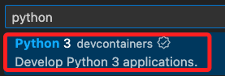
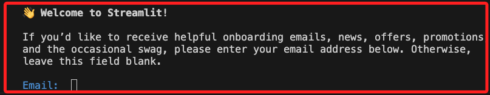
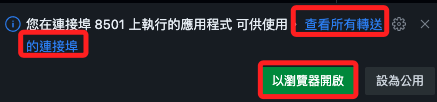

# 打包為容器

_在 VSCode 中操作_

1. 開啟 `命令選擇區`。

   

<br>

2. 點擊 `新增開發人員容器設定檔`。

   

<br>

3. 點擊 `將設定新增到工作區`。

   

<br>

4. 使用 `Python 3 devcontainers`，特別注意不要誤點其他的 Python 3 選項。

   

<br>

5. 使用與本地運行相同的版本，這裡選擇 `3.11 bulleye`。

   

<br>

6. 不用選取任何功能，點擊 `確定` 即可。

   

<br>

7. 點擊右下角 `在容器中重新開啟`。

   

<br>

8. 完成後會添加存放設定的 `資料夾 .devcontainer `與 `文件 devcontainer.json`，但內容僅有命名與原來映像，可手動刪除其他的註解，有需要再進行編輯即可。

   

<br>

9. 編輯 `devcontainer.json`，除了編輯易於辨識的命名，可將版本號改為 `python:3.11-bullseye`，並添加指令使容器在建立後會安裝指定的套件，包含 `requirements.txt`、`streamlit`，其中 `streamlit` 已寫入 `requirements.txt`，但 `python-dotenv` 在部署在雲端時無需安裝，所以要另外以指令進行安裝。

   ```json
   {
       // 命名
       "name": "Python 311",
       // 映像：官方的 Python 3.11 版本鏡像，基於 Debian Bullseye 發行版
       "image": "mcr.microsoft.com/devcontainers/python:3.11-bullseye",
       // 容器啟動後執行指令進行安裝 `requirements.txt`、`streamlit`、`python-dotenv`
       "updateContentCommand": "[ -f requirements.txt ] && pip3 install --user -r requirements.txt; echo '✅ Packages installed and Requirements met'",
       // 運行主腳本：可加入參數
       // --server.enableCORS false：允許應用接受來自不同埠或域的請求
       // --server.enableXsrfProtection false：禁用保護，在開發階段使用以避免遇到與 CSRF 保護相關的問題
       "postAttachCommand": "streamlit run bot.py"
   }

   ```

   _編輯後會出現提示，暫時不予理會，之後手動重建即可。_

   

<br>

10. `"python:1-3.11-bullseye"`: 是一個微軟開發容器鏡像，預先配置了一些開發環境，以簡化開發過程，前綴 `mcr.microsoft.com/devcontainers` 顯示這是微軟容器登錄中的開發者容器映像；另外，`"python:3.11-bullseye"` 是一個官方的 Python 映像，維護在 Docker Hub 上，此鏡像通常只包含 Python 3.11 和基本的系統函式庫，適用於需要純淨 Python 環境的使用者。

<br>

11. 延續上一點，同時將 `devcontainer.json` 文件也修改一下，將 `streamlit` 的安裝指令拿掉。

    ```json
    {
        // 命名
        "name": "Python 3",
        // 映像
        "image": "mcr.microsoft.com/devcontainers/python:3.10-bullseye",
        // 容器啟動後執行指令進行安裝
        "updateContentCommand": "[ -f requirements.txt ] && pip3 install --user -r requirements.txt; pip3 install --user python-dotenv; echo '✅ Packages installed and Requirements met'",
        // 運行主腳本：可使用參數
        // --server.enableCORS false：允許應用接受來自不同埠或域的請求
        // --server.enableXsrfProtection false：禁用保護，在開發階段使用以避免遇到與 CSRF 保護相關的問題
        "postAttachCommand": "streamlit run bot.py"
    }

    ```

<br>

12. 修改了設定文件後要 `重建容器`。

    

<br>

13. VSCode 左下方的連線顯示連入容器就表示完成。

    

<br>

14. 完成時會提示輸入 `Email`，無需輸入直接按下 `ENTER` 即可。

    

<br>

15. 接著點擊 `以瀏覽器開啟` 即可。

   

<br>

16. 此時服務將在本地容器運行，可嘗試進行問答。

    

<br>

17. 假如已經安裝了 Docker Desktop，可點擊查看容器確實已在本機運行。

   

_以上完成容器的建立_

<br>

## 部署到 GitHub

_在 VSCode 中操作_

<br>

1. 點擊 `原始檔控制`。

   

<br>

2. 發佈到 GitHub。

   

<br>

3. 自訂一個名稱，然後點擊以 `公開 public` 方式發布。

   

<br>

4. 在 GitHub 上開啟。

   

<br>

5. 點擊 `Code` 並建立 `Codespace`。

   

<br>

6. 過程中可以點擊 `View logs` 觀察即時訊息，確保沒有錯誤發生。

   

<br>

_顯示完成時先不急著動作，因為還有一些安裝程序是在建立好之後進行的，所以此時會在背景運行。_

<br>

7. 直到 `Streamlit` 服務啟動，可以點擊 `以瀏覽器開啟`，或查看所有的轉接埠。

   

<br>

8. 接著就會看到發生錯誤，因為那些敏感資訊都已經被排除了。

   _使用 secrets.toml_

   

   _使用 dotenv_

   

<br>

9. _特別說明_，當專案部署到 GitHub 後，卻在 Codespace 來運行服務著實不太合理，這是因為既然已經部署在 GitHub，那大可透過 Streamlit 服務來串接 GitHub，並且將原本使用 `secrets.toml` 儲存的敏感資訊寫入 Streamlit 服務器上的環境變數，這相較於讓服務在 Codespace 中運行並讀取 GitHub 上的環境變數來得合理。

<br>

___

_END_