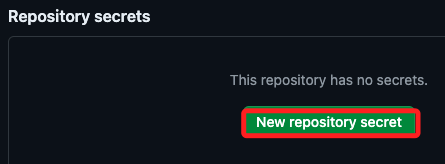
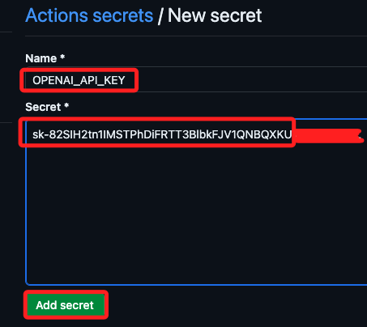
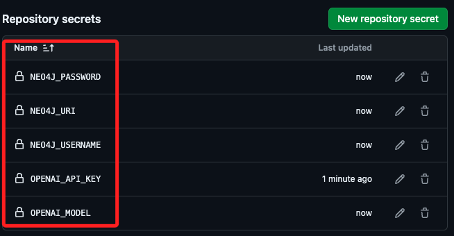

# GitHub Secrets

## 配置 

<br>

1. 在倉庫內點擊 `Settings`，選取 `Secrets and variables` 中的 `Actions`，注意不是點擊 `Codespaces`。

   

<br>

2. 點擊 `New repository secret`。

   

<br>

3. 編輯密鑰 `New secret`。

   

<br>

4. 依序加入原本寫在 `secrets.toml` 的變數。

   

<br>


## 三種訪問方式

1. `GitHub Actions Workflow`。

2. 使用 `export` 命令。

3. 使用 `容器配置文件 (devcontainer.json)`。

## GitHub Actions Workflow

1. 在專案根目錄建立工作流資料夾 `.github/workflows/`，`GitHub Actions` 會根據在 `on` 語法中指定的觸發條件自動運行該工作流文件。


2. 建立工作流文件 `deploy.yml`。

   ```bash
   name: Deploy to Codespace

   on: push

   jobs:
      deploy:
         runs-on: ubuntu-latest

         steps:
            - name: Checkout code
            uses: actions/checkout@v2

            - name: Set up Python
            uses: actions/setup-python@v2
            with:
               python-version: '3.11'

            - name: Install dependencies
               run: |
                  python -m pip install --upgrade pip
                  pip install -r requirements.txt

            - name: Set environment variables
               run: |
                  echo "OPENAI_API_KEY=${{ secrets.OPENAI_API_KEY }}" >> $GITHUB_ENV
                  echo "NEO4J_URI=${{ secrets.NEO4J_URI }}" >> $GITHUB_ENV
                  echo "NEO4J_USERNAME=${{ secrets.NEO4J_USERNAME }}" >> $GITHUB_ENV
                  echo "NEO4J_PASSWORD=${{ secrets.NEO4J_PASSWORD }}" >> $GITHUB_ENV
                  echo "OPENAI_MODEL=${{ secrets.OPENAI_MODEL }}" >> $GITHUB_ENV
   ```

2. 透過腳本訪問。

   ```python
   import os

   openai_api_key = os.getenv('OPENAI_API_KEY')
   neo4j_uri = os.getenv('NEO4J_URI')
   neo4j_username = os.getenv('NEO4J_USERNAME')
   neo4j_password = os.getenv('NEO4J_PASSWORD')
   openai_model = os.getenv('OPENAI_MODEL')

   print(openai_api_key, neo4j_uri, neo4j_username, neo4j_password, openai_model)
   ```

## 使用 `export` 命令

_手動設置環境變數_

```bash
export OPENAI_API_KEY=<your_openai_api_key>
export NEO4J_URI=<your_neo4j_uri>
export NEO4J_USERNAME=<your_neo4j_username>
export NEO4J_PASSWORD=<your_neo4j_password>
export OPENAI_MODEL=<your_openai_model>
```

## 使用 `devcontainer.json`

1. 編輯容器設定文件 `devcontainer.json`，將這些 `Secrets` 作為環境變數傳遞給容器。

   ```json
   {
      "name": "Python 311",
      "image": "mcr.microsoft.com/devcontainers/python:3.11-bullseye",
      "updateContentCommand": "[ -f requirements.txt ] && pip3 install --user -r requirements.txt; echo '✅ Packages installed and Requirements met'",
      "postAttachCommand": "streamlit run bot.py",
      // 加入環境變數
      "remoteEnv": {
         "OPENAI_API_KEY": "${{ secrets.OPENAI_API_KEY }}",
         "NEO4J_URI": "${{ secrets.NEO4J_URI }}",
         "NEO4J_USERNAME": "${{ secrets.NEO4J_USERNAME }}",
         "NEO4J_PASSWORD": "${{ secrets.NEO4J_PASSWORD }}",
         "OPENAI_MODEL": "${{ secrets.OPENAI_MODEL }}"
      }
   }
   ```

<br>

6. 修改腳本，原本使用 `st.secrets[]` 的代碼需改由環境變數中取得 `os.getenv()`。


7. 設定好之後重建容器，已確認是否可在 Codespace 的容器中讀取 Github 上的環境變數。

## 補充說明

1. 在 Codespace 中依舊可以透過 `.env` 與 `secrets.toml` 設置敏感資訊，但是 Codespace 並非持久化的環境，所以這樣的做法僅適用於測試環境。

<br>

2. 由於 Codespace 專案資料夾是與本地同步的，所以 `.gitignore` 文件是有同步的，所以若更新倉庫不會有安全外洩問題。

<br>

