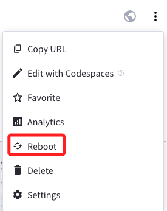

# 部署到 Streamlit 服務器上

_回到本機操作，在 Codespace 也是可以。_

<br>

## 假如原本使用 `.env`

1. 在專案根目錄中建立一個 `.streamlit` 資料夾，並添加一個 `secrets.toml` 文件。

   

<br>

2. 將 `.env` 文件中的內容複製到 `secrets.toml` 文件中，因為在 `.toml` 格式中，等號右側的是 `字串值` ，所以必須加上引號，此時基於 `一致性原則` 可在等號兩側都加上一個空白字元。

   

<br>

3. 同樣要把 `secrets.toml` 文件加入 `.gitignore` 中，這部分預設已經寫入。

   ```bash
   # 敏感資訊
   .streamlit/secrets.toml
   .env
   ```

<br>

## 建立 Streamlit 帳號

1. 進入 Streamlit [官網](https://streamlit.io/) 並點擊 `Sign in`，可使用 Google 或 GitHub 帳號登入。

   

<br>

2. 假如選擇 Google，接下來還是會詢問是否連結 GitHub 帳號。

   

<br>

3. 填寫完畢點擊 `Continue` 完成設定。

   

<br>

## 建立專案

1. New app。

   

<br>

2. 部署：選取倉庫，最重要的是要修改主腳本的名稱，在這個專案中為 `bot.py`，然後可自訂一個公網名稱，尾綴固定是 `streamlit.app`。

   

<br>

3. 接著可點擊 `Advanced settings...`

   

<br>

4. 假如未進行設定就進入下一步，會因為尚未設定敏感資訊而出錯的。

   

<br>

5. 那就必須回到主控台，在專案右側點擊 `...` 顯示更多來展開，並點擊設定 `Settings`。

   

<br>

6. 然後切換到 `Secrets` 進行密鑰等環境參數設定，但特別注意的是，透過這樣的設定步驟將無法選擇 `Python version`，在某些情境下可能會出錯。

   

<br>

7. 回到前面 `Advanced settings...` 的步驟，點擊後進入，首先選擇跟容器相同版本的 `3.10`。

   

<br>

8. 在 `Secrets` 的部分，因為 `secrets.toml` 文件是排除同步的，所以要將 `secrets.toml` 的內容複製貼在 Streamlit 服務器上。

   

<br>

9. 至此，應該要去修改 `graph.py`、`llm.py`、`vector.py` 三個腳本中原本如下圖使用 `os.getenv()` 的部分，因應 `Secrets` 的環境設置而改為 `st.secrets["<鍵>"]`，但這樣的修改模式將使得腳本在不同環境下運作時，又得再次手動修改，相當很麻煩。

   

<br>

10. 延續上一點，為了避免這樣的繁瑣，可在專案中添加一個模組 `secret.py` 來判斷所處在的運作環境為何，這裡示範將這個腳本置於 `tools` 資料夾中，函數名稱為 `get_secret()`。

    ```python
    # secret.py
    # 原本沒有導入 dotenv，這裡要添加
    import os
    from dotenv import load_dotenv
    #
    load_dotenv()

    # 新增判斷函數
    def get_secret(key):
        try:
            # 嘗試從 Streamlit secrets 獲取敏感資訊
            return st.secrets[key]
        except AttributeError:
            # 如果 st.secrets 沒有該鍵或 st.secrets 未被設定，則從環境變量中獲取
            return os.getenv(key)
    ```

<br>

11. 分別在  `graph.py`、`llm.py`、`vector.py` 導入函數，其中  `graph.py` 及 `vector.py` 改寫如下。

    _graph.py_

    ```python
    # graph.py
    from langchain_community.graphs import Neo4jGraph
    # 導入自訂函數
    from solutions.tools.secret import get_secret

    # 讀取環境變數
    NEO4J_URI = get_secret("NEO4J_URI")
    NEO4J_USERNAME = get_secret("NEO4J_USERNAME")
    NEO4J_PASSWORD = get_secret("NEO4J_PASSWORD")

    # Neo4j Graph
    graph = Neo4jGraph(
        url=NEO4J_URI,
        username=NEO4J_USERNAME,
        password=NEO4J_PASSWORD,
    )

    ```

    _vector.py_

    ```python
    # vector.py
    from langchain_community.vectorstores.neo4j_vector import Neo4jVector
    from langchain.chains import RetrievalQA
    from solutions.llm import llm, embeddings
    # 導入自訂函數
    from solutions.tools.secret import get_secret

    # 讀取環境變數
    NEO4J_URI = get_secret("NEO4J_URI")
    NEO4J_USERNAME = get_secret("NEO4J_USERNAME")
    NEO4J_PASSWORD = get_secret("NEO4J_PASSWORD")

    neo4jvector = Neo4jVector.from_existing_index(
        embeddings,                 # <1>
        url=NEO4J_URI,              # <2>
        username=NEO4J_USERNAME,    # <3>
        password=NEO4J_PASSWORD,    # <4>
        index_name="moviePlots",    # <5>
        node_label="Movie",         # <6>
        text_node_property="plot",  # <7>
        embedding_node_property="plotEmbedding",  # <8>
        retrieval_query="""
        RETURN
            node.plot AS text,
            score,
            {
                title: node.title,
                directors: [ (person)-[:DIRECTED]->(node) | person.name ],
                actors: [ (person)-[r:ACTED_IN]->(node) | [person.name, r.role] ],
                tmdbId: node.tmdbId,
                source: 'https://www.themoviedb.org/movie/'+ node.tmdbId
            } AS metadata
        """,
    )

    retriever = neo4jvector.as_retriever()

    kg_qa = RetrievalQA.from_chain_type(
        llm,  # <1>
        chain_type="stuff",  # <2>
        retriever=retriever,  # <3>
    )

    ```

<br>

12. 另外 `llm.py` 需要的是 OpenAPI 的 API Key，所以改寫內容與另外兩個腳本不同。

    ```python
    # llm.py
    from langchain_openai import ChatOpenAI
    from langchain_openai import OpenAIEmbeddings
    # 導入自訂函數
    from solutions.tools.secret import get_secret

    # 改寫
    OPENAI_API_KEY = get_secret("OPENAI_API_KEY")
    OPENAI_MODEL = get_secret("OPENAI_MODEL")

    # 建立 ChatOpenAI 實體
    llm = ChatOpenAI(
        openai_api_key=OPENAI_API_KEY,
        model=OPENAI_MODEL,
    )

    # OpenAIEmbeddings 是用來生成和處理嵌入向量（embeddings）
    # 這些嵌入向量是從使用 OpenAI 模型（如 GPT-4）生成的文本中獲取的
    embeddings = OpenAIEmbeddings(openai_api_key=OPENAI_API_KEY)

    ```

<br>

13. 無論以上程序是在本機修改或在 Codespace 進行編輯，都記得要記得同步。

    

<br>

14. 進入 Streamlit 主控台，因為專案的設定改變了，所以要進行 `Reboot`，假如只是內容改變可以不用重啟。

    

<br>

15. 完成後會出現關於套件 `dotenv` 的錯誤，因為服務器上無法安裝這個套件。

    

<br>

16. 修改 `secret.py` 中的 `get_secret()`，將 `dotenv` 的使用移入所在環境判斷的區塊內，只有確認在本機或容器中運行時才導入使用；特別注意，除了要新增 `import streamlit as st`，還要將 `from dotenv import load_dotenv` 註解或刪除。

    ```python
    # secret.py
    import streamlit as st
    import os
    # from dotenv import load_dotenv

    # 判斷環境取得密鑰
    # def get_secret(key):
    #     try:
    #         # 嘗試從 Streamlit secrets 獲取敏感資訊
    #         return st.secrets[key]
    #     except AttributeError:
    #         # 如果 st.secrets 沒有該鍵或 st.secrets 未被設定，則從環境變量中獲取
    #         return os.getenv(key)

    # 改寫
    def get_secret(key):
        # 檢查是否在 Streamlit 雲端環境中運行，Streamlit 雲端環境會設置特定的環境變量
        if 'STREAMLIT_SHARING_MODE' in os.environ:
            # 在 Streamlit 雲端，使用 st.secrets 讀取配置
            try:
                return st.secrets[key]
            except KeyError:
                print(f"Key {key} not found in Streamlit secrets.")
        else:
            # 在本機環境，嘗試從 .env 文件讀取配置
            from dotenv import load_dotenv
            load_dotenv()  # 讀取 .env 文件中的環境變量
            secret_value = os.getenv(key)
            if secret_value is not None:
                return secret_value
            else:
                print(f"Key {key} not found in environment variables.")
    ```

<br>

17. 然後進入 Streamlit 服務器的 `Secrets` 中加入一個新的變數 `STREAMLIT_SHARING_MODE`，這是設計用來判斷當前環境是否為 Streamlit 服務器的一個機制。

    ```bash
    STREAMLIT_SHARING_MODE = 1
    ```

    

<br>

18. 切記本機或 Codespace 要進行同步，另外 Streamlit 服務器更新設定都要 `Reboot`；至此無論在 `本機虛擬環境中`、`本機的容器中`、 `Codespace 容器中`，或是部署在 `Streamlit 服務器上` 的應用皆可正常運行了。

    

<br>

## 補上四個修改的腳本

1. **secret.py**

   ```python
   # secret.py
   import streamlit as st
   import os


   # 自訂函數
   def get_secret(key):
       # 檢查是否在 Streamlit 雲端環境中運行，Streamlit 雲端環境會設置特定的環境變量
       if "STREAMLIT_SHARING_MODE" in os.environ:
           # 在 Streamlit 雲端，使用 st.secrets 讀取配置
           try:
               return st.secrets[key]
           except KeyError:
               print(f"Key {key} not found in Streamlit secrets.")
       else:
           # 在本機環境，嘗試從 .env 文件讀取配置
           from dotenv import load_dotenv

           load_dotenv()  # 讀取 .env 文件中的環境變量
           secret_value = os.getenv(key)
           if secret_value is not None:
               return secret_value
           else:
               print(f"Key {key} not found in environment variables.")

   ```

<br>

2. **graph.py**

   ```python
   # graph.py
   # 導入自訂函數
   from solutions.tools.secret import get_secret
   from langchain_community.graphs import Neo4jGraph

   # 取得環境變數
   NEO4J_URI = get_secret("NEO4J_URI")
   NEO4J_USERNAME = get_secret("NEO4J_USERNAME")
   NEO4J_PASSWORD = get_secret("NEO4J_PASSWORD")

   # Neo4j Graph
   graph = Neo4jGraph(
       url=NEO4J_URI,
       username=NEO4J_USERNAME,
       password=NEO4J_PASSWORD,
   )

   ```

<br>

3. **llm.py**

   ```python
   # llm.py
   # 導入自訂函數
   from solutions.tools.secret import get_secret
   from langchain_openai import ChatOpenAI
   from langchain_openai import OpenAIEmbeddings

   # 取的環境變數
   OPENAI_API_KEY = get_secret("OPENAI_API_KEY")
   OPENAI_MODEL = get_secret("OPENAI_MODEL")

   # 建立 ChatOpenAI 實體
   llm = ChatOpenAI(
       openai_api_key=OPENAI_API_KEY,
       model=OPENAI_MODEL,
   )

   # OpenAIEmbeddings 是用來生成和處理嵌入向量（embeddings）
   # 這些嵌入向量是從使用 OpenAI 模型（如 GPT-4）生成的文本中獲取的
   embeddings = OpenAIEmbeddings(openai_api_key=OPENAI_API_KEY)

   ```

<br>

4. **vector.py**

   ```python
   # vector.py
   from langchain_community.vectorstores.neo4j_vector import Neo4jVector
   from langchain.chains import RetrievalQA
   from solutions.llm import llm, embeddings
   # 導入自訂函數
   from solutions.tools.secret import get_secret

   # 讀取環境變數
   NEO4J_URI = get_secret("NEO4J_URI")
   NEO4J_USERNAME = get_secret("NEO4J_USERNAME")
   NEO4J_PASSWORD = get_secret("NEO4J_PASSWORD")

   neo4jvector = Neo4jVector.from_existing_index(
       embeddings,                 # <1>
       url=NEO4J_URI,              # <2>
       username=NEO4J_USERNAME,    # <3>
       password=NEO4J_PASSWORD,    # <4>
       index_name="moviePlots",    # <5>
       node_label="Movie",         # <6>
       text_node_property="plot",  # <7>
       embedding_node_property="plotEmbedding",  # <8>
       retrieval_query="""
       RETURN
           node.plot AS text,
           score,
           {
               title: node.title,
               directors: [ (person)-[:DIRECTED]->(node) | person.name ],
               actors: [ (person)-[r:ACTED_IN]->(node) | [person.name, r.role] ],
               tmdbId: node.tmdbId,
               source: 'https://www.themoviedb.org/movie/'+ node.tmdbId
           } AS metadata
       """,
   )

   retriever = neo4jvector.as_retriever()

   kg_qa = RetrievalQA.from_chain_type(
       llm,  # <1>
       chain_type="stuff",  # <2>
       retriever=retriever,  # <3>
   )

   ```

<br>

## 關於 OpenAPI

1. 使用付費服務要特別關注 [使用量](https://platform.openai.com/usage)。

   

<br>

2. 會有詳細的用量與帳單資訊。

   

<br>

---

_END_