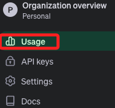

# 部署到 Streamlit 服務器上

_回到本機操作，在 Codespace 也是可以。_

<br>

## 假如原本使用 `.env`

1. 在專案根目錄中建立一個 `.streamlit` 資料夾，並添加一個 `secrets.toml` 文件。

   

<br>

2. 將 `.env` 文件中的內容複製到 `secrets.toml` 文件中，因為在 `.toml` 格式中，等號右側的是 `字串值` ，所以必須加上引號，此時基於 `一致性原則` 可在等號兩側都加上一個空白字元。

   

<br>

3. 同樣要把 `secrets.toml` 文件加入 `.gitignore` 中，這部分預設已經寫入。

   ```bash
   # 敏感資訊
   .streamlit/secrets.toml
   .env
   ```

<br>

## 建立 Streamlit 帳號

1. 進入 Streamlit [官網](https://streamlit.io/) 並點擊 `Sign in`，可使用 Google 或 GitHub 帳號登入。

   

<br>

2. 假如選擇 Google，接下來還是會詢問是否連結 GitHub 帳號。

   

<br>

3. 填寫完畢點擊 `Continue` 完成設定。

   

<br>

## 建立專案

1. New app。

    

<br>

2. 選取倉庫，最重要的是要修改主腳本的名稱，在這個專案中為 `bot.py`，然後可自訂一個公網名稱，尾綴固定是 `streamlit.app`。

    

<br>

3. 接著可點擊 `Advanced settings...`

    

<br>

4. 假如未進行設定就進入下一步，同樣會因為尚未設定敏感資訊而出錯的。

   

<br>

5. 延續上一點，若部署前未進行 `Advanced settings` ，那就必須回到主控台，在專案右側點擊 `...` 顯示更多來展開，並點擊設定 `Settings`。

   

<br>

6. 然後切換到 `Secrets` 進行密鑰等環境參數設定；_特別注意_，若透過這樣的設定步驟將無法選擇 `Python version`，在某些情境下可能會出錯。

   

<br>

_到這為止，與前面點擊 `Advanced settings...` 的步驟同步。_

<br>

7. 若是點擊 `Advanced settings` 進入，可先選擇跟容器相同版本的 `3.10` 或 `3.11`。

   

<br>

8. 在 `Secrets` 的部分，因為 `secrets.toml` 文件是排除同步的，所以要將 `secrets.toml` 的內容複製貼在 Streamlit 服務器上。

   

<br>

9. 在 `.toml` 文件中可使用 `[]` 進行標註，這個標註稱為 `TOML sections`，但 _特別注意_，括號 `[]` 內的字串代表的是一個 `屬性名稱` 所以不可有 `空格`，如 `OpenAI API` 可使用下底線進行串聯為 `OpenAI_API`，標註過屬性的變數在調用時必須將屬性是為鍵值取值或解包屬性，如使 `st.secrets["OpenAI_API"]["OPENAI_API_KEY"]` 或 `st.secrets.OpenAI_API.OPENAI_API_KEY`。

    ```bash
    [OpenAI_API]
    OPENAI_API_KEY = "sk-"
    OPENAI_MODEL = "gpt-4-turbo"

    [Neo4j]
    NEO4J_URI = "bolt://34.201.131.176:7687"
    NEO4J_USERNAME = "neo4j"
    NEO4J_PASSWORD = "oxides-winch-controls"
    ```

<br>

10. _再次提醒_，要記得修改腳本中原使用 `os.getenv()` 的部分，使用方式與在本地腳本中使用 `st.secrets["<鍵>"]` 一樣。

   

<br>

11. 訪問。

    

<br>

## 優化與拓展

1. 若專案因為有不同環境運作必要而需同時存在 `st.secrets[]` 與 `os.getenv()` 兩種方式時，避免每次都得手動修改相當很麻煩，可在專案中添加一個模組 `secret.py` 來判斷所處在的運作環境為何，這裡示範將這個腳本置於 `tools` 資料夾中，函數名稱為 `get_secret()`。

    ```python
    # secret.py
    # 原本沒有導入 dotenv，這裡要添加
    import os
    from dotenv import load_dotenv
    #
    load_dotenv()

    # 新增判斷函數
    def get_secret(key):
        try:
            # 嘗試從 Streamlit secrets 獲取敏感資訊
            return st.secrets[key]
        except AttributeError:
            # 如果 st.secrets 沒有該鍵或 st.secrets 未被設定，則從環境變量中獲取
            return os.getenv(key)
    ```

<br>

2. 然後分別在需要導入環境變數的腳本中導入 `def get_secret()` 函數，以 `vector.py` 示範改寫如下。

    ```python
    # vector.py
    from langchain_community.vectorstores.neo4j_vector import Neo4jVector
    from langchain.chains import RetrievalQA
    from solutions.llm import llm, embeddings
    # 導入自訂函數
    from solutions.tools.secret import get_secret

    # 讀取環境變數
    NEO4J_URI = get_secret("NEO4J_URI")
    NEO4J_USERNAME = get_secret("NEO4J_USERNAME")
    NEO4J_PASSWORD = get_secret("NEO4J_PASSWORD")

    # 其餘不變 ...

    ```

<br>

3. 無論以上程序是在本機修改或在 Codespace 進行編輯，都記得要記得同步。

    

<br>

4. 進入 Streamlit 主控台，因為專案的設定改變了，所以要進行 `Reboot`，假如只是內容改變可以不用重啟。

    

<br>

5. 完成後會出現關於套件 `dotenv` 的錯誤，因為 Streamlit 服務器無法安裝這個套件。

    

<br>

6. 修改 `secret.py` 中的 `get_secret()`，將 `dotenv` 的使用移入所在環境判斷的區塊內，只有確認在本機或容器中運行時才導入使用；特別注意，除了要新增 `import streamlit as st`，還要將 `from dotenv import load_dotenv` 註解或刪除。

    ```python
    # secret.py
    import streamlit as st
    import os

    # 改寫
    def get_secret(key):
        # 檢查是否在 Streamlit 雲端環境中運行，Streamlit 雲端環境會設置特定的環境變量
        if 'STREAMLIT_SHARING_MODE' in os.environ:
            # 在 Streamlit 雲端，使用 st.secrets 讀取配置
            try:
                return st.secrets[key]
            except KeyError:
                print(f"Key {key} not found in Streamlit secrets.")
        else:
            # 在本機環境，嘗試從 .env 文件讀取配置
            from dotenv import load_dotenv
            load_dotenv()  # 讀取 .env 文件中的環境變量
            secret_value = os.getenv(key)
            if secret_value is not None:
                return secret_value
            else:
                print(f"Key {key} not found in environment variables.")
    ```

<br>

7. 然後進入 Streamlit 服務器的 `Secrets` 中加入一個新的變數 `STREAMLIT_SHARING_MODE`，這是設計用來判斷當前環境是否為 Streamlit 服務器的一個機制。

    ```bash
    STREAMLIT_SHARING_MODE = 1
    ```

    

<br>

8. 切記本機或 Codespace 要進行同步，另外 Streamlit 服務器更新設定都要 `Reboot`；至此無論在 `本機虛擬環境中`、`本機的容器中`、 `Codespace 容器中`，或是部署在 `Streamlit 服務器上` 的應用皆可正常運行了。

    

<br>

## 關於 OpenAPI

1. 使用付費服務要特別關注 [使用量](https://platform.openai.com/usage)。

   

<br>

2. 會有詳細的用量與帳單資訊。

   

<br>

3. 不同的模型選擇會有不同的收費。

<br>

---

_以上完成 Streamlit 服務器的部署_